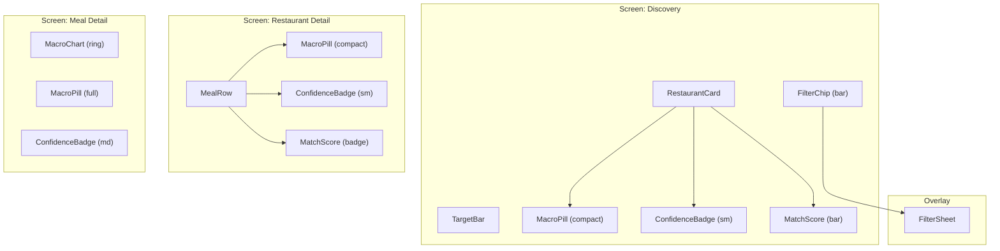

# Fitsy Component Library Spec

> **Status**: Draft
> **Author**: Designer
> **Date**: 2026-03-23

---

## Overview

This spec defines the foundational component set for the Fitsy React Native
(Expo) mobile app. All components are built on React Native primitives (`View`,
`Text`, `Pressable`, `FlatList`, etc.) — no HTML elements, no web CSS.

Components follow a **composition-first** philosophy: small primitives compose
into larger patterns. Every component is designed for all states (loading,
empty, error, populated, disabled).

---

## Design Tokens

### Colors

```typescript
// packages/shared/design/tokens.ts

export const colors = {
  // Brand
  brand: {
    primary: '#2D7D46',    // Forest green — primary actions, match indicators
    primaryLight: '#5BB87A', // Lighter green — backgrounds, hover states
    accent: '#E8622A',     // Warm coral — CTAs, active states, highlights
    accentLight: '#F9A87A', // Light coral — chip backgrounds, tints
  },

  // Macro semantic colors
  macro: {
    protein: '#4A90D9',   // Blue — protein values
    carbs: '#F5A623',     // Amber — carb values
    fat: '#E86B6B',       // Salmon — fat values
    calories: '#8B5CF6',  // Purple — calorie totals
  },

  // Confidence tiers
  confidence: {
    high: '#2D7D46',    // Green — verified data (post-MVP)
    medium: '#F5A623',  // Amber — LLM estimated with photo
    low: '#9CA3AF',     // Gray — LLM estimated without photo
  },

  // Neutrals
  neutral: {
    900: '#111827',  // Near-black — primary text
    700: '#374151',  // Dark gray — secondary text
    500: '#6B7280',  // Mid gray — tertiary text, placeholders
    300: '#D1D5DB',  // Light gray — borders, dividers
    100: '#F3F4F6',  // Off-white — card backgrounds
    0:   '#FFFFFF',  // White
  },

  // Semantic
  semantic: {
    success: '#2D7D46',
    warning: '#F5A623',
    error: '#DC2626',
    info: '#3B82F6',
  },

  // Match quality (gradient from no-match to perfect-match)
  match: {
    perfect: '#2D7D46',  // 0-10% deviation
    good:    '#5BB87A',  // 10-25% deviation
    fair:    '#F5A623',  // 25-50% deviation
    poor:    '#E86B6B',  // >50% deviation
  },
} as const;
```

### Typography

```typescript
export const typography = {
  // Font families
  fontFamily: {
    heading: 'Inter_700Bold',   // Numbers and headings — tabular figures
    body: 'Inter_400Regular',   // Body copy and labels
    bodyMedium: 'Inter_500Medium',
    mono: 'SpaceMono_400Regular', // Macro values when exact precision matters
  },

  // Type scale (1.25 ratio, mobile-optimized)
  fontSize: {
    xs:  11,
    sm:  13,
    base: 15,
    md:  17,
    lg:  20,
    xl:  24,
    '2xl': 30,
    '3xl': 36,
  },

  lineHeight: {
    tight:  1.2,
    normal: 1.5,
    relaxed: 1.75,
  },
} as const;
```

### Spacing

```typescript
export const spacing = {
  // 4px base unit
  0: 0, 1: 4, 2: 8, 3: 12, 4: 16, 5: 20,
  6: 24, 8: 32, 10: 40, 12: 48, 16: 64,
} as const;

export const borderRadius = {
  sm: 4, md: 8, lg: 12, xl: 16, full: 9999,
} as const;
```

---

## Component Specs

### 1. MacroPill

Compact inline display of macronutrient values. Used on restaurant cards,
meal rows, and any surface where a quick macro summary is needed.

**Anatomy:**

```
┌─────────────────────────────────────┐
│  P: 38g  │  C: 42g  │  F: 14g      │
└─────────────────────────────────────┘
```

**Variants:**

| Variant | When to use |
|---------|-------------|
| `full` | Shows P + C + F + Cal. Used on meal detail cards. |
| `compact` | Shows P + C + F only. Default for list items. |
| `single` | Shows one macro (e.g., protein-focused search). |

**States:**

| State | Visual treatment |
|-------|-----------------|
| `loaded` | Values in semantic macro colors |
| `loading` | Skeleton shimmer on value placeholders |
| `unavailable` | Gray text: "No data" |
| `disabled` | All values in `colors.neutral.300`; non-interactive; used when parent item is unavailable or out of stock |
| `error` | Values replaced with `—`; text in `colors.semantic.error`; used when macro fetch fails |

**Props:**
```typescript
interface MacroPillProps {
  protein?: number;        // grams
  carbs?: number;          // grams
  fat?: number;            // grams
  calories?: number;       // kcal
  confidence?: 'high' | 'medium' | 'low';  // drives rounding: low → round to nearest 5g
  variant?: 'full' | 'compact' | 'single';
  loading?: boolean;
  disabled?: boolean;
  size?: 'sm' | 'md';
}
```

**Accessibility:**
- `accessibilityRole="text"` (not interactive on its own)
- `accessibilityLabel` format: `"Macros: {protein}g protein, {carbs}g carbs, {fat}g fat"` (include calories when `variant="full"`: append `, {calories} calories`)
- When `loading`: `accessibilityLabel="Macro data loading"`
- When `unavailable` or `error`: `accessibilityLabel="Macro data unavailable"`

**Usage guidelines:**
- Always use semantic macro colors — never arbitrary colors for P/C/F
- Protein is always first (P · C · F · Cal order)
- Use tabular figures so values align when stacked in lists
- Minimum touch target: not interactive on its own; parent must be touchable
- Pass `confidence` prop so MacroPill can apply 5g rounding for `low` confidence values internally

---

### 2. MacroChart

Expanded macro visualization for the Meal Detail screen. Shows breakdown of
protein, carbs, and fat as a proportion of total calories, and compares against
user's targets.

**Variants:**

| Variant | Description |
|---------|-------------|
| `ring` | Donut ring chart. Primary variant for Meal Detail. |
| `bar` | Horizontal stacked bar. Used in compact detail views. |

**States:**

| State | Visual |
|-------|--------|
| `loaded` | Animated fill on mount |
| `loading` | Skeleton ring or bar |
| `no-target` | Chart without target overlay |
| `with-target` | Chart with target comparison overlay |
| `disabled` | All segments in `colors.neutral.300`; animation suppressed; used when meal is unavailable |
| `error` | Empty ring/bar with `colors.semantic.error` stroke; centered error icon; used when macro data fails to load |

**Ring variant anatomy:**
```
     ╭──────────╮
    ╱  P  │  C  ╲
   │   ──────    │   Center: total cal
    ╲  F  │      ╱   Outer ring: actual macros
     ╰──────────╯   Dashed ring: target macros (if set)
```

**Props:**
```typescript
interface MacroChartProps {
  protein: number;
  carbs: number;
  fat: number;
  calories: number;
  targetProtein?: number;
  targetCarbs?: number;
  targetFat?: number;
  targetCalories?: number;
  variant?: 'ring' | 'bar';
  size?: number;         // diameter in points for ring variant
  animated?: boolean;    // default true; respects ReduceMotion
}
```

**Accessibility:**
- `accessibilityRole="image"` (non-interactive visualization)
- `accessibilityLabel` format: `"Macro breakdown: {protein}g protein ({protein_pct}%), {carbs}g carbs ({carbs_pct}%), {fat}g fat ({fat_pct}%), {calories} calories total"`. When targets set, append: `"Target: {targetCalories} calories."`
- When `loading`: `accessibilityLabel="Macro chart loading"`
- When `error`: `accessibilityLabel="Macro chart unavailable"`
- Respect `AccessibilityInfo.isReduceMotionEnabled()` — provide static version when enabled.

**Do:** Respect `AccessibilityInfo.isReduceMotionEnabled()` — provide static
version when enabled.
**Don't:** Use raw colors; always reference `colors.macro.*` tokens.

---

### 3. ConfidenceBadge

Visual indicator of macro estimate confidence. Always visible — never hidden
or optional. Tappable: shows an explanatory tooltip on press.

**Anatomy:**
```
┌──────────────┐
│ ◉ Medium     │   Icon + label + optional short description
└──────────────┘
```

**Variants:**

| Tier | Icon | Color | Label | Description |
|------|------|-------|-------|-------------|
| `high` | ✓ verified | `colors.confidence.high` | "Verified" | Restaurant-published data |
| `medium` | 📷 camera | `colors.confidence.medium` | "Estimated" | AI estimated with photo |
| `low` | ≈ approx | `colors.confidence.low` | "Estimated" | AI estimated from description |

**States:**

| State | Behavior |
|-------|---------|
| `default` | Badge with icon + label |
| `expanded` | Sheet / tooltip explaining tier + data source |
| `loading` | Skeleton pill |

**Props:**
```typescript
interface ConfidenceBadgeProps {
  tier: 'high' | 'medium' | 'low';
  size?: 'sm' | 'md';
  showLabel?: boolean;        // default true
  expandable?: boolean;       // default true — shows tooltip on tap
}
```

**Design constraint:** Never display `low` confidence values with the same
visual precision as `medium`. For `low`, round displayed macros to nearest 5g.
Badge must be visually distinct from match score indicators.

**Accessibility:** `accessibilityLabel` must include tier and meaning:
`"Confidence: Estimated — macros estimated by AI from menu description"`.

---

### 4. RestaurantCard

Discovery list item representing a restaurant with its best macro match.
The primary content unit on the Search / Discovery screen.

**Anatomy:**
```
┌──────────────────────────────────────────┐
│ [Photo]  Noho Hank's                     │
│          Italian · 0.8 mi                │
│          ★ 4.3   12 matching meals       │
│                                          │
│  Best match: Grilled Salmon Bowl         │
│  P: 38g  C: 42g  F: 14g  · 440 cal      │
│  Match: ████████░░  82%  ◉ Estimated     │
└──────────────────────────────────────────┘
```

**States:**

| State | Treatment |
|-------|-----------|
| `loaded` | Full card with photo and macro data |
| `loading` | Skeleton: photo placeholder + text shimmer |
| `no-menu-data` | Dimmed card; "No macro data available" instead of macros |
| `pressed` | Platform-appropriate press highlight |
| `error` | Card renders with broken-image placeholder (gray rectangle + icon) for photo fail; "Could not load restaurant" message with retry affordance for network fail; card remains tappable to retry |

**Props:**
```typescript
interface RestaurantCardProps {
  id: string;
  name: string;
  cuisine: string;
  distanceMi: number;
  rating?: number;
  matchCount: number;          // # of meals matching user's targets
  bestMatch?: {
    name: string;
    protein: number;
    carbs: number;
    fat: number;
    calories: number;
    confidence: 'high' | 'medium' | 'low';
    matchScore: number;        // 0–100
  };
  photoUrl?: string;
  onPress: (id: string) => void;
}
```

**Accessibility:**
- `accessibilityRole="button"` (card is the primary tap target for navigation)
- `accessibilityLabel` format: `"{name}, {cuisine}, {distanceMi} miles away. {matchCount} matching meals. Best match: {bestMatch.name}, {matchScore}% macro match."`
- When `loading`: `accessibilityLabel="Restaurant loading"`
- When `error`: `accessibilityLabel="Restaurant unavailable. Double tap to retry."`

**Do:** Show `matchCount` prominently — it differentiates Fitsy from generic
restaurant discovery.
**Don't:** Show raw macro values for `low` confidence at full precision (round to 5g).

---

### 5. MealRow

Compact list item for a menu item with inline macro data. Used in the
Restaurant Detail screen's matching meals list.

**Anatomy:**
```
┌───────────────────────────────────────────────┐
│  Grilled Salmon Bowl         P:38 C:42 F:14   │
│  ~440 cal                    ◉ Est · Match 82% │
└───────────────────────────────────────────────┘
```

**Variants:**

| Variant | Description |
|---------|-------------|
| `matching` | Highlighted with green left border; used for meals that fit targets |
| `non-matching` | Standard; used for meals outside targets |
| `collapsed` | Non-matching meals are shown collapsed below the fold |

**States:**

| State | Treatment |
|-------|-----------|
| `loaded` | Full row with macros |
| `loading` | Skeleton shimmer |
| `selected/pressed` | Platform highlight |
| `disabled` | All text in `colors.neutral.500`; background `colors.neutral.100`; non-interactive; used when meal is marked unavailable |
| `error` | Macro values replaced with `—`; subtle `colors.semantic.error` left border; row remains tappable |

**Props:**
```typescript
interface MealRowProps {
  id: string;
  name: string;
  calories?: number;
  protein?: number;
  carbs?: number;
  fat?: number;
  confidence: 'high' | 'medium' | 'low';
  matchScore?: number;         // 0–100; undefined if user has no targets set
  variant?: 'matching' | 'non-matching';
  disabled?: boolean;
  onPress: (id: string) => void;
}
```

**Accessibility:**
- `accessibilityRole="button"`
- `accessibilityLabel` format: `"{name}, {calories} calories. Protein {protein}g, carbs {carbs}g, fat {fat}g."` Append `"Match: {matchScore}%."` when `matchScore` is defined.
- `accessibilityState={{ disabled: true }}` when `disabled`
- When `loading`: `accessibilityLabel="{name}, loading"`

---

### 6. FilterChip / FilterSheet

**FilterChip**: Tappable pill representing an active or inactive filter option.
Used in the horizontally scrollable filter bar.

```
┌──────────────┐   ┌─────────────────┐
│  Italian  ×  │   │  + Add filter   │
└──────────────┘   └─────────────────┘
  Active chip        Add chip
```

**FilterSheet**: Full-screen bottom sheet for complex filter combinations.
Triggered by tapping "More filters" or the filter icon.

**FilterChip props:**
```typescript
interface FilterChipProps {
  label: string;
  active: boolean;
  onPress: () => void;
  onRemove?: () => void;   // shows × when active
  count?: number;          // e.g., "3 cuisines" badge
}
```

**FilterSheet sections:**

| Section | Controls |
|---------|---------|
| Cuisine | Multi-select chips |
| Distance | Segmented control: 1mi, 3mi, 5mi, 10mi |
| Restaurant type | Toggle: All / Chains only / Independent only |
| Confidence | Toggle: All / Estimated + Verified / Verified only |
| Macro range | Sliders per macro (optional — post-MVP) |

**FilterChip states:**

| State | Treatment |
|-------|-----------|
| `inactive` | Unselected; muted/neutral style |
| `active` | Selected; accent color background with × remove button |
| `loading` | Skeleton shimmer pill; used while result count for that filter is being fetched |
| `disabled` | Grayed out (`colors.neutral.300` background, `colors.neutral.500` text); non-interactive; used when no results exist for that filter |

**FilterChip accessibility:**
- `accessibilityRole="button"`
- `accessibilityState={{ selected: active, disabled: disabled }}`
- `accessibilityLabel` format: `"{label}"` when inactive; `"{label}, selected"` when active; `"{label}, remove filter"` for the × remove target
- When `loading`: `accessibilityLabel="{label}, loading"`

**FilterSheet states:**

| State | Treatment |
|-------|-----------|
| `no filters active` | All chips unselected; muted style |
| `filters active` | Active chips in accent color; badge showing count |
| `sheet open` | Bottom sheet modal with `Apply` / `Reset` actions |

---

### 7. TargetBar

Persistent header component showing the user's current macro targets.
Appears at the top of the Search / Discovery screen.

**Anatomy:**
```
┌──────────────────────────────────────────────┐
│  Your targets:  P: 40g  ·  C: 50g  ·  F: 15g │
│                                     [Edit]    │
└──────────────────────────────────────────────┘
```

**States:**

| State | Treatment |
|-------|-----------|
| `targets set` | Shows P/C/F values with semantic colors |
| `no targets` | "Set macro targets to filter results" + CTA |
| `partial targets` | Shows only the fields the user has set |

**Props:**
```typescript
interface TargetBarProps {
  protein?: number;
  carbs?: number;
  fat?: number;
  calories?: number;
  onEditPress: () => void;
}
```

---

### 8. MatchScore

Visual indicator of how closely a meal matches the user's macro targets.
Displayed on `RestaurantCard` and `MealRow`.

**Anatomy:**
```
Match: ████████░░  82%
```

**Variants:**

| Variant | Description |
|---------|-------------|
| `bar` | Horizontal fill bar with percentage. Default. |
| `badge` | Compact percentage circle. Used on `RestaurantCard` at small sizes. |

**States:**

| State | Treatment |
|-------|-----------|
| `loaded` | Bar/badge filled to score value with appropriate match color |
| `loading` | Skeleton shimmer bar or circle |
| `no-target` | Score is meaningless without user targets; display `—` and hide the fill bar |
| `disabled` | Bar/badge in `colors.neutral.300`; percentage hidden; used when parent item is unavailable |
| `error` | Bar/badge empty with `colors.semantic.error` border; display `—` in place of percentage |

**Color mapping:**

| Score | Color | Interpretation |
|-------|-------|----------------|
| 80–100 | `colors.match.perfect` | Within 20% of all targets |
| 60–79 | `colors.match.good` | Within 25–40% of targets |
| 40–59 | `colors.match.fair` | Partial match |
| <40 | `colors.match.poor` | Poor match |

**Props:**
```typescript
interface MatchScoreProps {
  score: number;           // 0–100 (normalized)
  variant?: 'bar' | 'badge';
  size?: 'sm' | 'md';
  showLabel?: boolean;     // "Match: 82%" label
}
```

**Accessibility:** `accessibilityLabel="Match score: 82 out of 100"`.
Never convey score solely through color — always include the percentage value.

---

## Component Diagram



---

## Implementation Notes

- All components live in `apps/mobile/components/`
- Design tokens live in `packages/shared/design/tokens.ts`
- Use `StyleSheet.create()` for all styles — never inline style objects
- Export components from `apps/mobile/components/index.ts`
- Test on both iOS and Android — use `Platform.select` for divergent behavior
- All skeleton states use a shared `Skeleton` primitive (shimmer animation)
- Fonts: load `Inter` and `SpaceMono` via `expo-font` in the app root
- **Dark mode:** The token file above defines light-mode values only. Dark mode support is deferred to a follow-up spec. When implemented, introduce a semantic alias layer (e.g., `colors.text.primary`, `colors.surface.card`) that resolves to different hex values per color scheme via `useColorScheme()`. All components must reference semantic aliases — never raw hex — so the single token swap covers the entire component set. No hardcoded light-mode hex values should appear in component `StyleSheet.create()` calls.
