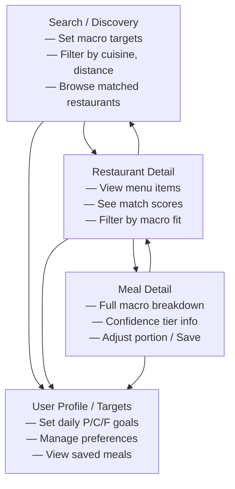
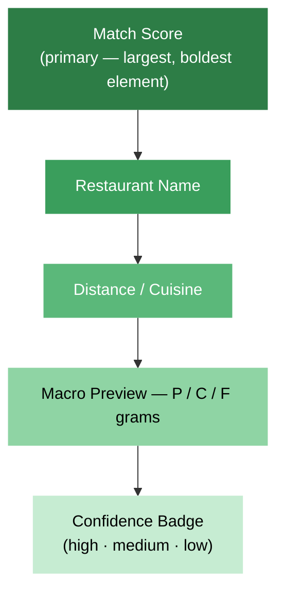

# Fitsy Design Brief — Spec Outline

> **Status**: Draft outline for human review
> **Author**: Designer
> **Date**: 2026-03-22

---

## 1. Brand Identity

- **Name rationale**: "Fitsy" — approachable contraction of "fitness," conveys health-awareness without clinical overtones; easy to say, spell, and search
- **Brand personality**: Knowledgeable but not preachy; encouraging, not judgmental; practical over aspirational
- **Tone of voice**: Conversational, concise, confident — "your macro-savvy friend who knows every menu in town"
- **Positioning statement**: Fitsy sits between calorie-counter apps (too clinical) and restaurant discovery apps (nutrition-blind) — it owns the intersection

## 2. Color Palette and Typography Direction

- **Primary palette**: Fresh, energetic — lean toward greens and teals that signal health without looking medicinal
- **Accent colors**: Warm accent (coral or amber) for CTAs, highlights, and macro-hit indicators
- **Semantic colors**: Define a clear mapping for confidence tiers (high/medium/low) and macro categories (protein, carbs, fat)
- **Dark mode**: Plan for dark mode from the start; palette must work in both contexts
- **Typography direction**: Sans-serif family; one typeface for headings (bold, modern), one for body (high readability at small sizes on mobile); numeric-friendly for macro values (tabular figures)
- **Type scale**: Define a constrained modular scale (likely 1.2 ratio) to keep hierarchy tight on small screens

## 3. Mobile-First UX Principles

- **Thumb-zone design**: Primary actions reachable with one hand; bottom-anchored navigation
- **Progressive disclosure**: Show macro summary first, expand to full breakdown on tap
- **Speed over chrome**: Prioritize content loading and perceived performance; skeleton screens for async data
- **Contextual defaults**: Pre-fill location, remember last macro targets, surface relevant filters based on time of day
- **Offline tolerance**: Graceful degradation when connectivity is poor; cache recent searches and favorites
- **Minimal input**: Reduce typing — use sliders for macro targets, chips for filters, location auto-detect

## 4. Core Screen Flows

### 4.1 Search and Discovery
- Map view vs. list view toggle for nearby restaurants
- Prominent macro-target bar showing current targets at the top
- Restaurant cards showing: name, distance, cuisine, number of macro-matched meals, best-match preview
- Quick filters: cuisine type, chain vs. independent, distance radius, confidence tier minimum
- Sort options: distance, number of matches, best single-meal match

### 4.2 Restaurant Detail
- Restaurant header: name, cuisine, distance, rating, hours, photos
- Menu section organized by meal category (appetizers, mains, etc.)
- Each menu item shows: name, macro summary (P/C/F in grams), calorie total, confidence badge
- Highlight items that match the user's active macro targets
- "Match score" indicator showing how close each item is to targets

### 4.3 Meal Detail with Macros
- Full macro breakdown: protein, carbs, fat (grams and percentage of target)
- Visual macro ring or bar chart
- Confidence tier badge with explanation tooltip ("Verified data" / "Photo-estimated" / "Description-estimated")
- Ingredient list (when available from parsing)
- "Fits your target" summary — shows how this meal fits into remaining daily macros
- Option to adjust portion size and see recalculated macros
- Save / favorite action

### 4.4 User Profile and Targets
- Macro target setup: daily protein, carbs, fat goals (grams) with preset templates (e.g., high-protein, keto, balanced)
- Meal-level vs. daily-level target toggle
- Dietary preferences and restrictions (vegetarian, gluten-free, etc.)
- Saved restaurants and meals
- Search history
- Account settings and preferences

## 5. Key UI Patterns

### 5.1 Macro Visualization
- **Compact form**: Inline P / C / F pill with gram values — used on cards and list items
- **Expanded form**: Segmented ring chart or horizontal stacked bar — used on meal detail
- **Target comparison**: Overlay or side-by-side showing meal macros vs. user target; green/yellow/red for under/near/over
- **Consistency**: Same visual language for macros everywhere — never switch between representations without clear context change

### 5.2 Confidence Indicators
- Three-tier system: high (verified), medium (photo-estimated), low (description-estimated)
- **Visual treatment**: Icon + color badge; always visible, never hidden
- **Disclosure**: Tapping the badge explains the data source and what the tier means
- **Design constraint**: Never present low-confidence data with the same visual weight as verified data — reduce precision display (e.g., round to nearest 5g for low-confidence)

### 5.3 Filtering and Sorting
- Filter bar: horizontally scrollable chips for active filters
- Filter sheet: full-screen bottom sheet for complex filter combinations
- Active filter count badge on the filter icon
- Macro range sliders with real-time result count update
- "Smart match" default sort that balances proximity, match quality, and confidence

## 6. Information Hierarchy Priorities

Define what users see first, second, third on each surface:

1. **Discovery cards**: Macro match quality > restaurant name > distance > cuisine > confidence
2. **Restaurant detail**: Matched meals (highlighted) > full menu > restaurant info
3. **Meal detail**: Macro breakdown > confidence tier > ingredient detail > portion adjustment
4. **General rule**: Actionable nutrition info is always the primary content; restaurant metadata is secondary context

## 7. Accessibility Considerations

- **Color independence**: Confidence tiers and macro categories must be distinguishable without color (use icons, patterns, labels)
- **Contrast ratios**: WCAG AA minimum (4.5:1 for body text, 3:1 for large text) in both light and dark modes
- **Touch targets**: Minimum 44x44pt tap targets; generous spacing between interactive elements
- **Screen reader support**: Semantic HTML; macro values announced with units ("32 grams protein"); confidence tiers announced descriptively
- **Reduced motion**: Respect prefers-reduced-motion; provide static alternatives for animated charts
- **Text scaling**: Layouts must accommodate up to 200% text scaling without breaking
- **Cognitive load**: Avoid jargon; provide onboarding tooltips for macro and confidence concepts

## 8. Design System Foundation

### 8.1 Spacing and Grid
- 4px base unit; spacing scale: 4, 8, 12, 16, 24, 32, 48, 64
- Mobile grid: 16px margins, 8px gutters, fluid columns
- Tablet/desktop: 12-column grid with max-width container
- Consistent vertical rhythm tied to the type scale

### 8.2 Component Philosophy
- **Composition over customization**: Small, composable primitives (MacroPill, ConfidenceBadge, FilterChip) assembled into larger patterns
- **State-complete**: Every component designed for all states — loading (skeleton), empty, error, populated, disabled
- **Token-driven**: All visual properties (color, spacing, radius, shadow) reference design tokens, not raw values
- **Documentation**: Each component spec includes: anatomy, variants, states, usage guidelines, do/don't examples

### 8.3 Foundational Components (to spec first)
- MacroPill (compact macro display)
- MacroChart (expanded macro visualization)
- ConfidenceBadge (tier indicator)
- RestaurantCard (discovery list item)
- MealRow (menu list item with inline macros)
- FilterChip / FilterSheet
- TargetBar (current macro target summary)
- MatchScore (visual match quality indicator)

---

## Next Steps

Once this outline is approved:
1. Expand each section into a full design brief with visual references and detailed specifications
2. Create initial component specs for the foundational components listed in 8.3
3. Produce wireframes for the four core screen flows
4. Define the complete design token set (colors, typography, spacing, elevation)
