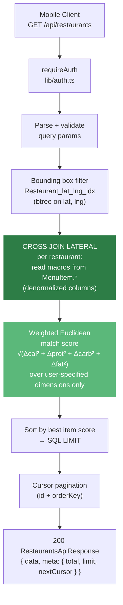

# API Reference

> **Status:** living · **Last verified:** 2026-06-12

Merged reference for all Fitsy API routes. Supersedes the archived `api-endpoints-spec.md` (S-12/S-13) and `jwt-middleware-spec.md` (S-57). See `docs/engineering/architecture/auth.md` for the full auth architecture.

---

## Route Table

| Path | Method | Auth | Purpose |
|---|---|---|---|
| `/api/health` | GET | None | Health check + DB probe |
| `/api/auth/apple` | POST | None | Apple Sign-In |
| `/api/auth/google` | POST | None | Google Sign-In |
| `/api/auth/register` | POST | None | Legacy email/password register (deprecated) |
| `/api/auth/login` | POST | None | Legacy email/password login (deprecated) |
| `/api/restaurants` | GET | Bearer JWT | Search nearby restaurants |
| `/api/restaurants/preview` | GET | None | Onboarding teaser (no auth) |
| `/api/restaurants/stats` | GET | None | Onboarding aggregate stats |
| `/api/restaurants/[id]/menu` | GET | Bearer JWT | Restaurant detail + menu |
| `/api/saved-items` | GET, POST | Bearer JWT | List / save items |
| `/api/saved-items/[id]` | DELETE | Bearer JWT | Unsave item |
| `/api/user/profile` | GET, PATCH | Bearer JWT | User profile |
| `/api/user/push-token` | POST | Bearer JWT | Register push token |
| `/api/user` | DELETE | Bearer JWT | Delete account |
| `/api/subscriptions/status` | GET | Bearer JWT | Server-trusted entitlement state |
| `/api/subscriptions/sync` | POST | Bearer JWT | Re-read entitlement from RevenueCat |
| `/api/revenuecat/webhook` | POST | `REVENUECAT_WEBHOOK_AUTH` header | RevenueCat event webhook |
| `/api/feedback` | POST | Bearer JWT | Submit feedback |
| `/api/internal/audit-macro-drift` | GET | `CRON_SECRET` Bearer | Vercel cron — macro drift audit |
| `/api/internal/feedback-digest` | POST | `CRON_SECRET` Bearer | Vercel cron — feedback digest |

---

## Read Path Architecture

### Query Design (Post-2026-04-25 Perf Rewrite)

The restaurant search uses a **LATERAL join** over **denormalized macro columns on `MenuItem`**. This is the critical architectural detail to understand: macros are **not** fetched via a `MacroEstimate` join at query time. The four columns (`calories`, `proteinG`, `carbsG`, `fatG`) are stored directly on the `MenuItem` row, written by the pipeline.

The `MacroEstimate` table is retained as an **estimation audit log** (confidence tier, source, reasoning, `estimatedAt`) but is not read in the hot search path.

**Measured impact (3-mile Silver Lake search, LIMIT 20, `EXPLAIN ANALYZE` on staging):**

| State | Cold cache | Plan |
|---|---|---|
| Before (DISTINCT ON + MacroEstimate join) | 7,400 ms | Full table scan |
| After (LATERAL + denormalized MenuItem) | **123 ms** | Geo index + per-restaurant LATERAL |

Cumulative speedup: **60×**.



The `MacroEstimate` join still exists in the menu detail path (`GET /api/restaurants/[id]/menu`) to return confidence and metadata for individual items, but even there macros are read from `MenuItem` first and the `MacroEstimate` is fetched via `Memoize` in the query plan.

**Source:** `apps/api/lib/restaurantService.ts` · **Handoff doc:** `docs/engineering/backend/perf-and-security-handoff-2026-04-25.md`

---

## Endpoint Details

### GET /api/health

**Auth:** None  
**File:** `apps/api/app/api/health/route.ts`

```json
{
  "status": "ok",
  "db": "connected",
  "version": "1.0.0",
  "timestamp": "2026-06-12T00:00:00.000Z"
}
```

Returns `503` with `{ "status": "error", "db": "unreachable" }` if the DB ping fails.

> Note: SEC-10 (parked) — this endpoint leaks DB connectivity and package version to unauthenticated callers.

---

### POST /api/auth/apple

**Auth:** None · **Rate limited:** Yes (`authLimiter`)  
**File:** `apps/api/app/api/auth/apple/route.ts`

See `docs/engineering/architecture/auth.md` for full flow and request/response shapes.

---

### POST /api/auth/google

**Auth:** None · **Rate limited:** Yes (`authLimiter`)  
**File:** `apps/api/app/api/auth/google/route.ts`

See `docs/engineering/architecture/auth.md` for full flow and request/response shapes.

---

### GET /api/restaurants

**Auth:** Bearer JWT required (`requireAuth`)  
**File:** `apps/api/app/api/restaurants/route.ts`

#### Query Parameters

| Parameter | Type | Required | Default | Constraints |
|---|---|---|---|---|
| `lat` | float | Yes | — | Valid latitude (-90 to 90) |
| `lng` | float | Yes | — | Valid longitude (-180 to 180) |
| `radius` | float | No | 3 | Miles, > 0 |
| `calories` | int | No | — | Target calories |
| `protein` | float | No | — | Target protein (g) |
| `carbs` | float | No | — | Target carbs (g) |
| `fat` | float | No | — | Target fat (g) |
| `cuisineType` | string | No | — | Exact match on cuisine tags |
| `chainOnly` | boolean | No | — | `true` / `false` |
| `dietary` | string | No | — | Dietary tag filter |
| `maxPriceLevel` | string | No | — | Must be one of the valid price levels |
| `minRating` | float | No | — | 0–5 |
| `q` | string | No | — | Free-text menu search (capped length) |
| `limit` | int | No | 20 | 1–50 |
| `cursor` | string | No | — | Opaque pagination cursor from previous page |

#### Macro Match Scoring

For each restaurant the query uses a `CROSS JOIN LATERAL` to find the best-matching menu item. Match score is weighted Euclidean distance across only the macro dimensions the user specified:

```
score = sqrt(
  ((cal - target_cal) / target_cal)^2 +
  ((prot - target_prot) / target_prot)^2 +
  ((carb - target_carb) / target_carb)^2 +
  ((fat - target_fat) / target_fat)^2
)
```

Lower score = better match. Restaurant score = the **lowest** item score across its menu. If no macro targets are specified, results sort by distance.

Macros are read from denormalized `MenuItem` columns — not from a `MacroEstimate` join.

#### Response Shape

```json
{
  "data": [
    {
      "id": "cuid",
      "name": "Guerrilla Tacos",
      "address": "2000 E 7th St, Los Angeles, CA 90021",
      "lat": 34.0346,
      "lng": -118.2229,
      "distanceMiles": 0.8,
      "cuisineTags": ["mexican"],
      "chainFlag": false,
      "bestMatch": {
        "menuItemId": "cuid",
        "name": "Shrimp Tostada",
        "calories": 610,
        "proteinG": 38,
        "carbsG": 55,
        "fatG": 21,
        "confidence": "HIGH",
        "matchScore": 0.09
      }
    }
  ],
  "meta": { "total": 42, "limit": 20, "nextCursor": "<opaque>" }
}
```

`bestMatch` is `null` when no macro targets are specified or no macro data exists for the restaurant.

#### Error Responses

| Status | Body | Trigger |
|---|---|---|
| 401 | `{ "error": "Unauthorized" }` | Missing / invalid JWT |
| 400 | `{ "error": "lat and lng are required" }` | Missing lat/lng |
| 400 | `{ "error": "Invalid lat/lng values" }` | Non-numeric |
| 400 | `{ "error": "lat must be between -90 and 90" }` | Out of range |
| 400 | `{ "error": "limit must be between 1 and 50" }` | limit out of range |
| 400 | `{ "error": "minRating must be between 0 and 5" }` | minRating out of range |
| 400 | `{ "error": "maxPriceLevel must be one of: …" }` | Invalid price level |
| 400 | `{ "error": "Invalid cursor" }` | Malformed cursor token |
| 500 | `{ "error": "Internal server error" }` | Unhandled exception |

---

### GET /api/restaurants/preview

**Auth:** None (public)  
**File:** `apps/api/app/api/restaurants/preview/route.ts`

Used in the onboarding teaser screen before the user signs up. Accepts the same `lat`, `lng`, and macro target params as the main search but returns only `{ id, name, cuisineTags, distanceMiles, photoUrl? }` — `bestMatch` and meal details are intentionally omitted to act as a teaser.

---

### GET /api/restaurants/stats

**Auth:** None (public, 1-hour cache)  
**File:** `apps/api/app/api/restaurants/stats/route.ts`

Returns aggregate stats for the onboarding data-scale screen.

```json
{ "totalDishes": 6791, "indiePercent": 64 }
```

---

### GET /api/restaurants/[id]/menu

**Auth:** Bearer JWT required  
**File:** `apps/api/app/api/restaurants/[id]/menu/route.ts`

#### Path Parameters

| Parameter | Type | Required |
|---|---|---|
| `id` | string (CUID) | Yes |

#### Response Shape

```json
{
  "data": {
    "restaurantId": "cuid",
    "restaurantName": "Guerrilla Tacos",
    "menuItems": [
      {
        "id": "cuid",
        "name": "Shrimp Tostada",
        "description": "gulf shrimp, avocado, chipotle aioli",
        "category": "Starters",
        "price": 14.00,
        "macros": {
          "calories": 610,
          "proteinG": 38,
          "carbsG": 55,
          "fatG": 21,
          "confidence": "HIGH",
          "hadPhoto": false,
          "estimatedAt": "2026-03-24T00:00:00Z"
        }
      }
    ]
  }
}
```

`macros` is `null` when no macro data exists for the item. Macros are sourced from denormalized `MenuItem` columns; `confidence` / `hadPhoto` / `estimatedAt` come from the latest `MacroEstimate` record for that item.

#### Error Responses

| Status | Body | Trigger |
|---|---|---|
| 401 | `{ "error": "Unauthorized" }` | Missing / invalid JWT |
| 404 | `{ "error": "Restaurant not found" }` | Unknown restaurant ID |
| 500 | `{ "error": "Internal server error" }` | Unhandled exception |

---

### GET/POST /api/saved-items

**Auth:** Bearer JWT required  
**File:** `apps/api/app/api/saved-items/route.ts`

- `GET` — Returns the authenticated user's saved menu items with restaurant context.
- `POST` — Saves a menu item. Body: `{ menuItemId: string }`.

### DELETE /api/saved-items/[id]

**Auth:** Bearer JWT required  
**File:** `apps/api/app/api/saved-items/[id]/route.ts`

Deletes the saved item by its ID. Returns 404 if not found or not owned by the caller.

---

### GET/PATCH /api/user/profile

**Auth:** Bearer JWT required  
**File:** `apps/api/app/api/user/profile/route.ts`

- `GET` — Returns `{ id, email, name, macroTarget, subscription }`.
- `PATCH` — Updates editable profile fields and/or macro targets.

---

### DELETE /api/user

**Auth:** Bearer JWT required  
**File:** `apps/api/app/api/user/route.ts`

Permanently deletes the account. Cascade order (all in a `$transaction`):
1. `SavedItem` → `MacroTarget` → `Subscription` → `User`
2. Best-effort Supabase Admin `deleteUser` (non-blocking if it fails)

Returns `204` on success.

---

### GET /api/subscriptions/status

**Auth:** Bearer JWT required  
**File:** `apps/api/app/api/subscriptions/status/route.ts`

Returns `{ active }` from the `Subscription` table (plus the dev/demo bypass).
Replaced the old stubbed `/api/subscriptions/verify` receipt endpoint: clients never send receipts, RevenueCat validates and notifies the webhook.

---

### POST /api/subscriptions/sync

**Auth:** Bearer JWT required  
**File:** `apps/api/app/api/subscriptions/sync/route.ts`  
**Env:** `REVENUECAT_PUBLIC_API_KEY` (the app's public SDK key; RevenueCat's v1 subscriber read accepts it)

Pull path for entitlement state: asks RevenueCat for the caller's `pro` entitlement (`services/revenuecatService.ts`) and upserts the `Subscription` row.
Returns `{ active, synced }`; `synced: false` means RevenueCat could not be consulted and `active` is the existing DB state.
The mobile client calls it right after a purchase or restore, on sign-in when the device already reports Pro, and when the device says Pro while the API serves locked responses.
This covers the cases the webhook alone cannot: `TRANSFER` events carry no product/expiry, the first search after purchase can race webhook delivery, and a missed delivery would otherwise lock a paying user out until the next renewal.

---

### POST /api/revenuecat/webhook

**Auth:** `REVENUECAT_WEBHOOK_AUTH` header (constant-time compare)  
**File:** `apps/api/app/api/revenuecat/webhook/route.ts`

Push path for RevenueCat subscription lifecycle events (purchase, renewal, cancellation, expiration, billing issue).
`TRANSFER` (same Apple ID moved to a new Fitsy account) re-reads both sides from RevenueCat via the same sync as above and returns 500 if the new owner cannot be read, so RevenueCat retries.
Purchases made under an anonymous pre-login id resolve to the merged account via the event's `aliases`.
`billing_issue` rows stay entitled until `expiresAt` passes (store grace period), in both write paths.

---

### POST /api/feedback

**Auth:** Bearer JWT required  
**File:** `apps/api/app/api/feedback/route.ts`

Accepts in-app feedback submissions.

---

### POST /api/user/push-token

**Auth:** Bearer JWT required  
**File:** `apps/api/app/api/user/push-token/route.ts`

Registers an Expo push token for the authenticated user.

---

### GET /api/internal/audit-macro-drift

**Auth:** `CRON_SECRET` Bearer (Vercel cron header)  
**File:** `apps/api/app/api/internal/audit-macro-drift/route.ts`  
**Schedule:** `0 14 * * *` (Vercel cron)

Compares denormalized `MenuItem` macro columns against `MacroEstimate` records. Posts to Slack `C0ASM3865AA` if any disagreement is found. This guards against silent drift between the two tables caused by a pipeline run that only wrote one side.

---

## Error Response Shape

All errors follow the same shape:

```json
{ "error": "Human-readable message" }
```

HTTP status codes used: `400` (bad input), `401` (unauthenticated), `404` (not found), `429` (rate limited), `500` (server error), `503` (DB unreachable).

---

## Auth Middleware

`requireAuth` is documented in full at `docs/engineering/architecture/auth.md`. The short version: extract `Bearer <token>` from `Authorization` header → `verifyToken` via `jose` against Supabase JWKS (ES256) → returns `JwtPayload { sub, email }` or `NextResponse(401)`.

---

## Implementation Files

| File | Purpose |
|---|---|
| `apps/api/lib/auth.ts` | `requireAuth` middleware |
| `apps/api/lib/restaurantService.ts` | `findNearbyRestaurants` — LATERAL + denorm query |
| `apps/api/lib/macroScoring.ts` | Pure match scoring function |
| `apps/api/services/authService.ts` | `verifyToken` — jose JWKS verification |
| `packages/shared/src/types/index.ts` | Shared request/response types |

---

## Source History

- `docs/engineering/archive/api-endpoints-spec.md` — S-12/S-13 original spec (stale: described MacroEstimate join, not denormalized MenuItem read)
- `docs/engineering/archive/jwt-middleware-spec.md` — S-57 `requireAuth` spec (stale: described HS256/JWT_SECRET, not JWKS)
- `docs/engineering/backend/perf-and-security-handoff-2026-04-25.md` — authoritative perf handoff (60× speedup, LATERAL + denorm architecture)
