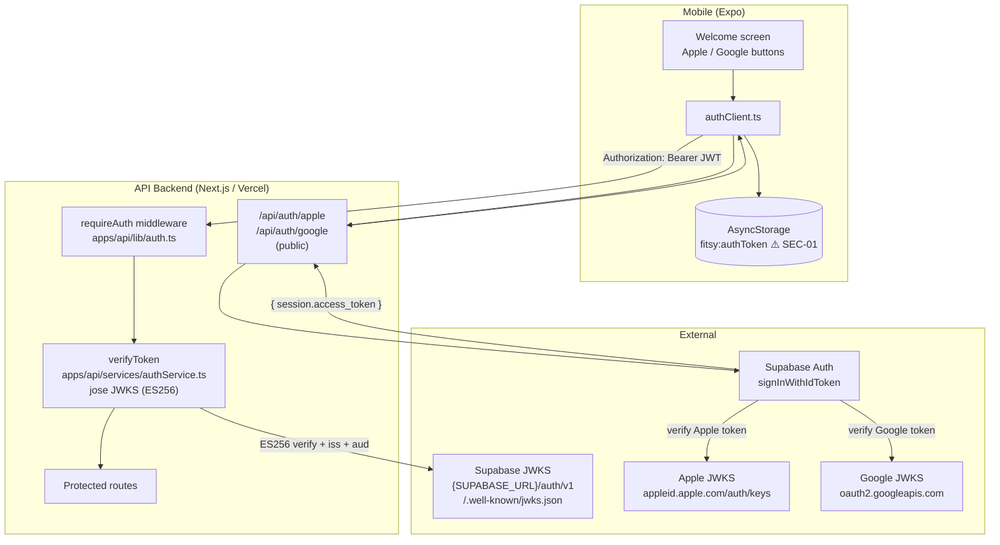
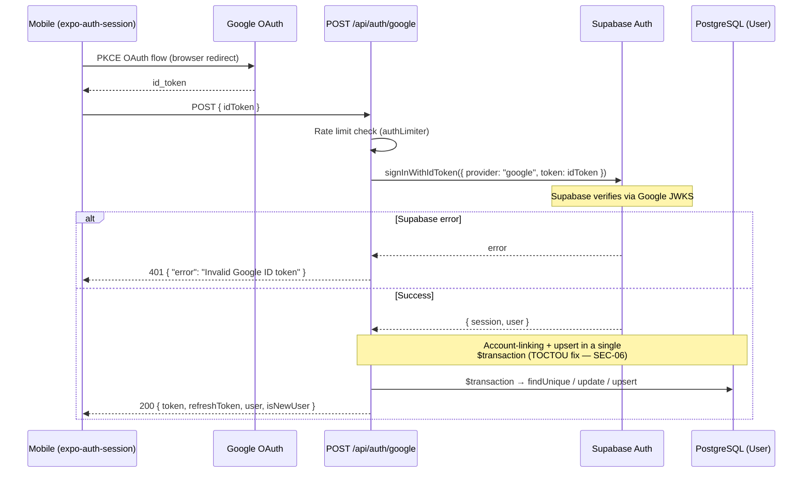
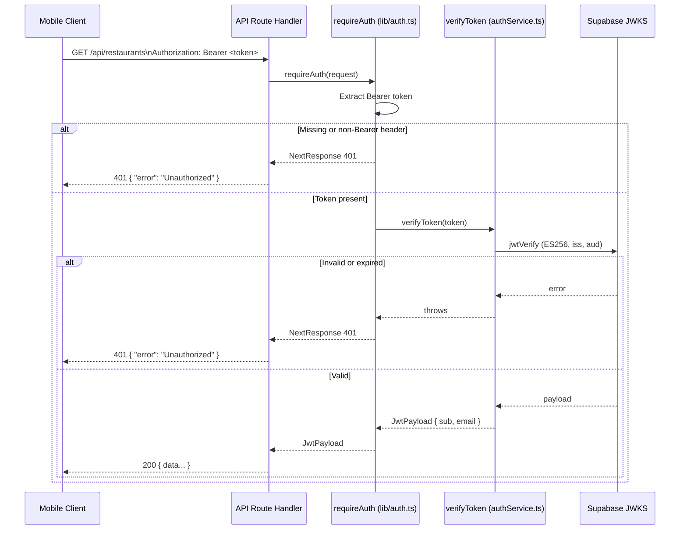

# Auth Architecture

> **Status:** living · **Last verified:** 2026-06-12

End-to-end reference for Fitsy authentication: mobile UX, provider flows, JWT verification, middleware, token storage, and open security items.

---

## Overview

Fitsy uses **Apple Sign-In** and **Google Sign-In** as the only production auth paths. Both are implemented via Supabase's `signInWithIdToken`, which delegates JWKS-based verification to the identity provider (Apple or Google). The resulting Supabase JWT is verified on every protected API request using `jose` against Supabase's own JWKS endpoint — no local `JWT_SECRET` or HS256 signing exists in the codebase.



---

## Mobile UX

The welcome screen (`app/welcome/signin.tsx` and `app/welcome/login.tsx`) shows two buttons: **Continue with Apple** and **Continue with Google**. There is no email/password input in the production UI — see [Legacy note](#legacy-emailpassword-deprecated) below.

### Token Storage (SEC-01 open item)

After a successful auth flow, the Supabase `access_token` (JWT) is stored in `AsyncStorage` under the key `fitsy:authToken` (`apps/mobile/lib/authClient.ts`).

> **SEC-01 (open, S-103):** `AsyncStorage` is an unencrypted key-value store. On a jailbroken or rooted device any process can read its contents. This token should be migrated to `expo-secure-store` (iOS Keychain / Android Keystore). Tracked as S-103. Until S-103 ships, this is an accepted P0 risk for TestFlight beta (trusted testers only).

---

## Sign-In Flows

### Apple Sign-In

**File:** `apps/api/app/api/auth/apple/route.ts`

```mermaid
sequenceDiagram
    participant App as iOS App (expo-apple-authentication)
    participant API as POST /api/auth/apple
    participant Supa as Supabase Auth
    participant DB as PostgreSQL (User)

    App->>App: Generate SHA-256 nonce
    App->>App: signInAsync() → identityToken, authorizationCode, fullName
    App->>API: POST { identityToken, authorizationCode, nonce, fullName? }

    API->>API: Validate required fields
    API->>Supa: signInWithIdToken({ provider: "apple", token, nonce })
    Note over Supa: Supabase verifies Apple JWT signature<br/>against Apple JWKS (appleid.apple.com/auth/keys)<br/>Checks aud, iss, exp, nonce

    alt Supabase verification fails
        Supa-->>API: error
        API-->>App: 401 { "error": "Invalid identity token" }
    else Supabase verification succeeds
        Supa-->>API: { session: { access_token }, user: { id, email } }
        API->>DB: findUnique({ id: user.id })
        Note over API,DB: Account linking: if ID not found,<br/>check by email; update ID if match
        API->>DB: upsert({ where: { id }, create: { id, email, name } })
        API-->>App: 200 { token, user: { id, email, name }, isNewUser }
    end
```

**Request:**

| Field | Required | Notes |
|---|---|---|
| `identityToken` | Yes | Apple-signed JWT |
| `nonce` | Yes | Raw nonce (Supabase hashes for comparison) |
| `authorizationCode` | No | Apple one-time code |
| `fullName` | No | Apple only sends on first sign-in |

**Responses:**

| Status | Body | Condition |
|---|---|---|
| 200 | `{ token, user, isNewUser }` | Success |
| 400 | `{ error: "identityToken is required" }` | Missing token |
| 400 | `{ error: "nonce is required" }` | Missing nonce |
| 401 | `{ error: "Invalid identity token" }` | Supabase verification failed |

---

### Google Sign-In

**File:** `apps/api/app/api/auth/google/route.ts`



The `/api/auth/google` handler wraps the account-linking check and upsert in a single Prisma `$transaction` to prevent the TOCTOU race condition identified in SEC-06 (fixed in Sprint 10 security audit).

**Request:**

| Field | Required |
|---|---|
| `idToken` | Yes |

**Responses:**

| Status | Body | Condition |
|---|---|---|
| 200 | `{ token, refreshToken, user, isNewUser }` | Success |
| 400 | `{ error: "idToken is required" }` | Missing token |
| 400 | `{ error: "Google account has no email" }` | No email on account |
| 401 | `{ error: "Invalid Google ID token" }` | Supabase verification failed |
| 429 | `{ error: "Too many requests…" }` | Rate limit exceeded |

---

## JWT Verification — requireAuth Middleware

**File:** `apps/api/lib/auth.ts`

Every protected route calls `requireAuth(request)` at the top of its handler. The middleware:

1. Extracts the `Bearer <token>` from the `Authorization` header.
2. Calls `verifyToken(token)` from `apps/api/services/authService.ts`.
3. Returns the decoded `JwtPayload` (`{ sub, email }`) on success, or a `NextResponse(401)` on any failure.



### JWKS Verification Details

`verifyToken` uses `jose`'s `jwtVerify` against:

```
{SUPABASE_URL}/auth/v1/.well-known/jwks.json
```

The JWKS client is lazily initialized as a module-level singleton (not recreated per request). Verification enforces:

- **Algorithm:** ES256
- **Issuer:** `{SUPABASE_URL}/auth/v1`
- **Audience:** `"authenticated"`

There is **no `JWT_SECRET` in the codebase.** All token verification is signature-based via JWKS.

---

## Protected Routes

Routes that call `requireAuth`:

| Route | Method(s) | Notes |
|---|---|---|
| `/api/restaurants` | GET | Search |
| `/api/restaurants/[id]/menu` | GET | Restaurant detail |
| `/api/saved-items` | GET, POST | User's saved items |
| `/api/saved-items/[id]` | DELETE | Delete saved item |
| `/api/user/profile` | GET, PATCH | User profile |
| `/api/user/push-token` | POST | Register push token |
| `/api/user` | DELETE | Delete account |
| `/api/subscriptions/verify` | POST | RevenueCat subscription check |
| `/api/feedback` | POST | Submit feedback |

Public routes (no auth required):

| Route | Notes |
|---|---|
| `GET /api/health` | Health check |
| `POST /api/auth/apple` | Apple sign-in |
| `POST /api/auth/google` | Google sign-in |
| `POST /api/auth/login` | Legacy email/password |
| `POST /api/auth/register` | Legacy email/password |
| `GET /api/restaurants/preview` | Onboarding teaser (unauthenticated) |
| `GET /api/restaurants/stats` | Onboarding stats (unauthenticated) |
| `POST /api/revenuecat/webhook` | RevenueCat webhook (REVENUECAT_WEBHOOK_AUTH header) |
| `GET /api/internal/audit-macro-drift` | Vercel cron (CRON_SECRET Bearer) |
| `POST /api/internal/feedback-digest` | Vercel cron (CRON_SECRET Bearer) |

---

## Environment Variables

| Variable | Purpose |
|---|---|
| `SUPABASE_URL` | Used by `authService` to construct the JWKS URL, and by the Supabase client for `signInWithIdToken` |
| `SUPABASE_ANON_KEY` | Used by the Supabase client |

Apple's own signing keys are not stored — Supabase fetches them from Apple's JWKS endpoint internally.

---

## Session Refresh

The mobile client listens to `supabase.auth.onAuthStateChange`. When the auth state rotates the access token (`session_refreshed` analytics event), the new token is stored to `AsyncStorage`. If the refresh token is rejected (forced sign-out), the `session_refresh_failed` event fires and the user is redirected to the welcome screen.

---

## Legacy: Email/Password (Deprecated)

`POST /api/auth/register` and `POST /api/auth/login` still exist in the codebase for test harness use, but email/password auth is **not exposed in the production mobile UI**. The original spec (`docs/engineering/archive/auth-spec.md`, S-22) described HS256 signing with a `JWT_SECRET` — this approach was superseded by Supabase JWKS verification when Apple and Google Sign-In were introduced.

The `passwordHash` column remains on the `User` model (nullable). No production code path sets it.

---

## Open Security Items

| ID | Severity | Finding | Status |
|---|---|---|---|
| SEC-01 / S-103 | P0 | JWT stored in `AsyncStorage` — readable on jailbroken devices. Must migrate to `expo-secure-store`. | **Open** |

For the full Sprint 10 security audit findings (including fixed items SEC-02 through SEC-11), see `docs/engineering/backend/security-audit-sprint10.md`.

---

## Source History

For detailed implementation notes on individual flows, see the archived specs:

- `docs/engineering/archive/apple-signin-spec.md` — S-94 implementation spec
- `docs/engineering/archive/google-signin-validation.md` — S-99 validation + gap analysis
- `docs/engineering/archive/auth-e2e-test-spec.md` — S-93 integration test approach
- `docs/engineering/archive/auth-spec.md` — S-22 original email/password spec (deprecated)
- `docs/engineering/archive/jwt-middleware-spec.md` — S-57 `requireAuth` implementation spec
