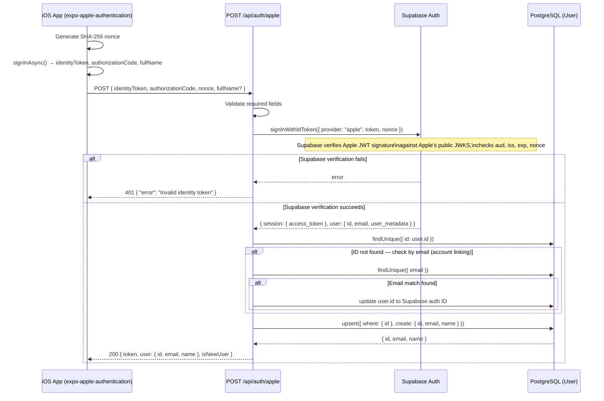
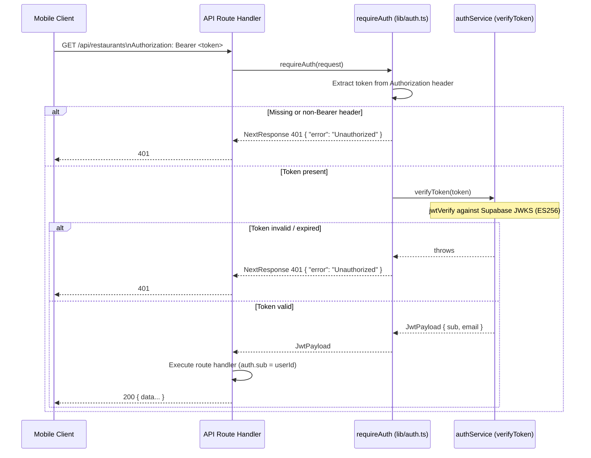

> **🗄️ ARCHIVED 2026-06-12** — Superseded by `docs/engineering/architecture/auth.md`. Historical record; do not update.

# Apple Sign-In + JWT Middleware Spec (S-94)

**Sprint**: S-94
**Author**: Backend Engineer
**Date**: 2026-04-08
**Status**: Implemented

---

## Overview

This spec covers two tightly coupled pieces:

1. **Apple Sign-In** — the `/api/auth/apple` endpoint accepts an Apple identity
   token from the mobile client, delegates verification to Supabase's
   `signInWithIdToken`, upserts the user in the Fitsy database, and returns a
   Supabase-issued JWT.
2. **JWT middleware** — the `requireAuth` helper in `apps/api/lib/auth.ts`
   verifies that JWT on every protected API route (`/api/restaurants`,
   `/api/restaurants/[id]/menu`, `/api/saved-items`, `/api/user/profile`).

Both are in the **Auth Danger Zone** per `CLAUDE.md`.

---

## Full Flow: Apple Sign-In



### Why Supabase for Verification?

Apple identity tokens are JWTs signed with ES256 using keys from
`https://appleid.apple.com/auth/keys`. Rather than fetching and caching Apple's
JWKS ourselves, we delegate to Supabase's `signInWithIdToken` which:

- Fetches Apple's public keys via JWKS
- Verifies the JWT signature (ES256)
- Validates `iss` (must be `https://appleid.apple.com`), `aud` (must match the
  configured Apple app bundle ID), and `exp`
- Validates the nonce (SHA-256 hash of the raw nonce we pass)
- Returns a Supabase session (access_token = Supabase JWT) once verified

This avoids maintaining Apple key rotation logic in application code.

---

## Endpoint: POST /api/auth/apple

**File**: `apps/api/app/api/auth/apple/route.ts`

### Request

```json
{
  "identityToken": "<Apple JWT>",
  "authorizationCode": "<Apple one-time code>",
  "nonce": "<raw nonce string>",
  "fullName": { "givenName": "Jane", "familyName": "Doe" }
}
```

| Field | Required | Notes |
|-------|----------|-------|
| `identityToken` | Yes | Apple-signed JWT; passed directly to Supabase |
| `authorizationCode` | No | Apple one-time auth code; forwarded but not used server-side |
| `nonce` | Yes | Raw nonce (Supabase hashes it for comparison) |
| `fullName` | No | Apple only sends this on first sign-in |
| `email` | No | Apple only sends this on first sign-in |

### Responses

| Status | Body | Condition |
|--------|------|-----------|
| 200 | `{ token, user, isNewUser }` | Success |
| 400 | `{ error: "identityToken is required" }` | Missing identityToken |
| 400 | `{ error: "nonce is required" }` | Missing nonce |
| 400 | `{ error: "Apple account has no email" }` | Edge case: Apple account without email |
| 400 | `{ error: "Invalid JSON body" }` | Malformed request |
| 401 | `{ error: "Invalid identity token" }` | Supabase verification failed |

### Success Response Shape

```json
{
  "token": "<Supabase access_token JWT>",
  "user": {
    "id": "<Supabase user UUID>",
    "email": "user@icloud.com",
    "name": "Jane Doe"
  },
  "isNewUser": true
}
```

### Account Linking Logic

If no user exists with the Supabase user ID but one exists with the same email
(e.g. previously registered via email/password), we update the existing record's
ID to the Supabase auth ID. This ensures users who switch auth providers don't
get duplicate accounts.

---

## JWT Middleware: requireAuth

**File**: `apps/api/lib/auth.ts`



### Signature

```ts
export async function requireAuth(
  request: NextRequest,
): Promise<JwtPayload | NextResponse>
```

Returns `JwtPayload` (with `sub` and `email`) on success, or a `NextResponse`
with status 401 on any failure. Callers distinguish the two paths with
`instanceof NextResponse`.

### JWT Verification

`verifyToken` in `apps/api/services/authService.ts` uses `jose`'s `jwtVerify`
against Supabase's JWKS endpoint (`{SUPABASE_URL}/auth/v1/.well-known/jwks.json`).
The JWKS client is lazily initialized and reused across requests (module-level
singleton). Supabase issues ES256 JWTs — this matches what Apple Sign-In
returns via `signInWithIdToken`.

---

## Protected Routes

All routes below require a valid `Authorization: Bearer <token>` header:

| Route | Method(s) | Handler |
|-------|-----------|---------|
| `/api/restaurants` | GET | `requireAuth` → query nearby restaurants |
| `/api/restaurants/[id]/menu` | GET | `requireAuth` → query menu items |
| `/api/saved-items` | GET, POST | `requireAuth` → user's saved items |
| `/api/saved-items/[id]` | DELETE | `requireAuth` → delete saved item |
| `/api/user/profile` | GET, PATCH | `requireAuth` → user profile |
| `/api/subscriptions/verify` | POST | `requireAuth` → subscription verification |

Public routes (no auth required):
- `GET /api/health`
- `POST /api/auth/apple`
- `POST /api/auth/google`
- `POST /api/auth/login`
- `POST /api/auth/register`

---

## Environment Variables

| Variable | Purpose |
|----------|---------|
| `SUPABASE_URL` | Used by authService to construct JWKS URL |
| `SUPABASE_ANON_KEY` | Used by Supabase client for `signInWithIdToken` |

Apple's own keys are not stored — Supabase fetches them from Apple's JWKS
endpoint and caches them internally.

---

## Security Notes

- **Token is never decoded without verification.** `verifyToken` calls
  `jose.jwtVerify` which checks the cryptographic signature before returning
  any claims.
- **Nonce prevents replay attacks.** The nonce is included in the Apple JWT
  claims; Supabase verifies the hash matches the raw nonce we send.
- **No token stored server-side.** The issued JWT is stateless; revocation
  would require blocklist logic (not needed at MVP scale).
- **Generic 401 error.** `requireAuth` never reveals why verification failed
  (expired vs. invalid signature).
- **Account linking is conservative.** We only link by email when there is an
  exact match and update the ID atomically before the upsert.

---

## Files

| File | Purpose |
|------|---------|
| `apps/api/app/api/auth/apple/route.ts` | POST /api/auth/apple handler |
| `apps/api/app/api/auth/apple/route.test.ts` | Tests for apple auth route |
| `apps/api/lib/auth.ts` | `requireAuth` middleware helper |
| `apps/api/lib/auth.test.ts` | Tests for requireAuth |
| `apps/api/services/authService.ts` | `verifyToken` (Supabase JWKS verification) |
| `apps/api/services/authService.test.ts` | Tests for verifyToken |
| `packages/shared/src/types/index.ts` | `AppleAuthRequest`, `AppleAuthResponse` shared types |
