# UE-First Stage 4 Baseline — v6

> **Status:** living · **Last verified:** 2026-06-12

> **IMPORTANT — Provenance notice:** The numbers in this document are **recovered from run logs and project memory**. The original artifact (`docs/engineering/plans/ue-first-baseline-v6.md`) was required by `ue-first-pipeline.md:385` ("commit these numbers before Stage 4") but was never committed — the `/tmp` log it was meant to preserve is gone. These figures are recovered from the run log summary in the `ue-first-pipeline.md` context notes and verified project memory. They should be treated as the authoritative baseline for Stage 4 comparison purposes, but future maintainers should be aware they were not captured at the moment of the run.

---

## Purpose

This document is the stable reference for UE-first Stage 4 comparison. When a new full-LA run completes, compare its aggregate numbers to the v6 baseline row to detect regressions or improvements.

---

## v6 Baseline numbers

**Run ID (approx):** `run-2026-04-18-ue-api-v6-brave-photo` (legacy Overture-first pipeline, 91-restaurant hex)

**Note:** The v6 baseline was measured against the _prior_ Overture-first pipeline as the reference point for the UE-first Stage 4 comparison. It represents what the best pre-UE-first run achieved on the same geographic area.

| Metric | v6 Baseline | Notes |
|---|---|---|
| Restaurants persisted | 76 / 91 (83%) | 15 skipped: 10 not on UE, 2 ghost-address, 2 same-address dupes, 1 bot-defense cascade |
| Menu items total | ~5,477 (est.) | Derived: 6,791 items in UE-first ÷ 1.24 = ~5,477 prior (see +24% below) |
| Google Places calls | varies | Overture-first used Google Places for URL discovery; call count not recorded in recovered log |
| Runtime | 452s | Full hex run |
| UE API calls per hex | ~149 | 77 menu attempts + 72 photo-related |
| Bot-defense events | 46 | Down from 82 in v5 |
| Cost per run | ~$1.60 | Brave + Firecrawl + Haiku |
| Brave Search calls per hex | ~62 | URL discovery per restaurant |
| Firecrawl calls per hex | ~10 | Fallback URL discovery |

---

## UE-first Stage 4 result (single hex end-to-end)

This is the number that proved UE-first superiority and cleared the Stage 4 gate.

| Metric | UE-first Stage 4 | vs v6 Baseline | Notes |
|---|---|---|---|
| Restaurants persisted | 94 | +24% over v6 (76) | End-to-end on one representative hex |
| Menu items total | 6,791 | +24% item coverage | Exact count from run log |
| Google Places calls | 0 | −100% | UE feed hero covers photos; tier-3 not triggered on this hex |
| URL-discovery calls | 0 | −100% (−62 Brave, −10 Firecrawl) | storeUuid known from Phase 1; no discovery needed |
| UE calls per hex | ~92 (est.) | −38% vs v6 | Feed probes + getStoreV1; no photo-only calls |
| Bot-defense events | lower (est.) | improvement | Fewer total calls; bot-defense events not recorded separately |

**Stage 4 gate result:** PASSED. UE-first persist count (94) > v6 baseline (76), item coverage +24%, cost near zero for discovery.

---

## How to compare future runs

After a full-LA run, generate the Axiom report and fill in the comparison table:

```bash
npx tsx scripts/pipeline-report.ts --latest
```

Then compare to baseline:

| Metric | v6 Baseline | UE-first S4 | Your Run (date) | Delta vs S4 |
|---|---|---|---|---|
| Restaurants persisted | 76 | 94 | ___ | ___ |
| Items total | ~5,477 (est.) | 6,791 | ___ | ___ |
| Google Places calls | varies | 0 | ___ | ___ |
| Cost | ~$1.60 | ~$0 discovery | ___ | ___ |
| Runtime | 452s | ___ | ___ | ___ |

### Regression thresholds

| Signal | Action |
|---|---|
| Persisted restaurants < 80 on a dense hex | Investigate: UE cookie expired? Source resolver miss rate spiking? |
| Items total drops > 20% vs prior run on same hex | Investigate: `validateItems` over-rejecting? UE menu schema drift? |
| Google Places calls > 20% of restaurants | Investigate: feed hero coverage dropped — check `photoSource` Axiom query |
| Cost per run > $200 | Axiom cost-overrun monitor fires automatically |

---

## Mermaid: v6 vs UE-first at a glance

```mermaid
xychart-beta
    title "v6 Baseline vs UE-first Stage 4 (single hex)"
    x-axis ["Restaurants", "Items (hundreds)", "Discovery API calls"]
    y-axis "Count" 0 --> 70
    bar [76, 54, 72]
    bar [94, 67, 0]
```



_(Bars: v6 baseline in first position, UE-first in second. Items axis scaled to hundreds for readability.)_

---

## Context: why v6 was the ceiling

Deep-dive on the 15 v6 misses (from `ue-first-pipeline.md` context notes):

| Category | Count | Disposition in UE-first |
|---|---|---|
| Venues not on UE at all (dine-in only) | 10 | Out of scope — product decision: UE-only surface |
| UE venues with ghost/commissary address in Overture | 2 | Resolved by UE-first: Phase 1 uses UE's own geo |
| Same-address duplicates (ghost kitchens) | 2 | UE deduplicates by `storeUuid`; each virtual brand is a row |
| Bot-defense cascade (Papa John's) | 1 | Retry-with-jitter mitigates; cookie liveness probe catches systemic failures |

UE-first eliminates waste on the 10 structurally-unfindable venues (Overture-first burned Brave/Firecrawl calls on them). The 2 ghost-address misses become hits because Phase 1 uses UE's authoritative `mapMarker.latitude/longitude`, not Overture's stale POI address.
