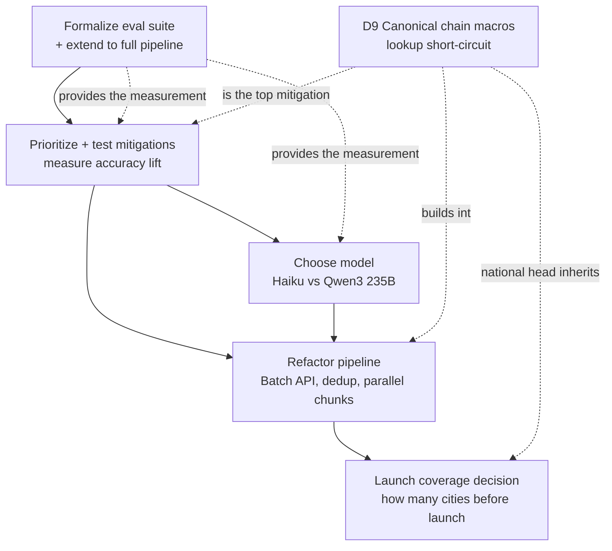

# Macro Accuracy & Model Selection - Decision Handoff

**Created:** 2026-08-16
**Branch:** `spike/open-model-macro-eval` (7 commits ahead of `origin/main`, not pushed)
**Status:** Investigation complete. Nine decisions open for the next session.
**Predecessor doc:** `docs/engineering/pipeline/open-model-spike-2026-07-20.md` (round-by-round evidence log - read it for the raw numbers behind every claim here)

---

## Purpose

A cost-reduction question ("can we run macros cheaper with an open-source model?") turned into an accuracy investigation.
The headline: **cost was never the real problem - accuracy is.**
Both the current model (Haiku 4.5) and the cheapest credible open alternative (Qwen3 235B) get **~27-31% of production-like items catastrophically wrong** (>50% off the official value).

This doc hands off nine coupled decisions.
Decisions 1-5 are the accuracy/model/launch core; Decisions 6-9 (cleanup, monitoring, performance, canonical-chain-macros) are the surrounding engineering questions raised in the same session.
None should be made in isolation, because the model choice, the mitigations, the pipeline refactor, and the canonical-macro work all depend on each other.

> **Branch-topology warning (read before "just merge this").**
> The canonical-chain-macros work (the `Brand`/`ChainItem` models, `phase0`/`phase1` scripts, and `canonical-chain-macros.md`) is **not on `origin/main`** - it lives on `feat/subscription-gate` (21 commits ahead, unmerged), with related work on `feat/onboarding-macro-fixes`.
> This spike branch was cut from `main` and therefore does not even have `ChainItem` in its Prisma schema; the eval fixture worked only because staging's database already has the table from the other branch's applied migration.
> So "the latest production pipeline" is genuinely split across unmerged branches - see Decision 6 and the "Moving this doc to main" section at the end.



Decisions 6-9 (cleanup, monitoring, performance, canonical) run alongside: cleanup and monitoring are independent engineering hygiene; performance gates the launch-coverage decision; canonical-chain-macros (D9) is the highest-leverage form of the D2 mitigation and threads through D3/D4/E.

The logical order is: **eval suite first** (it is the measuring instrument for everything else), **then mitigations** (measured through it), **then model + refactor together**, **then the launch-coverage decision** (how many cities to onboard before launch, which depends on all of the above).

---

## What is settled (do not re-litigate)

These are backed by the evidence in the predecessor doc and should be treated as findings, not opinions.

1. **Accuracy on production-like data is poor for every model tested.**
   Haiku 31.3% MdAPE / 27% catastrophic; Qwen3 235B 35.0% / 31%.
   Measured on 2,708 LA-regional chain items with official published macros.

2. **The docs' 13.5% figure was measured on an easier distribution.**
   National chains (McDonald's, Chipotle) are heavily represented in training data; LA regional restaurants (Boba Time, bb.q Chicken, JINYA Ramen Bar) are not.
   Production serves the latter, so ~31% is the number that describes shipped behavior.

3. **Haiku is more accurate than Qwen3 235B - real but small.**
   +3.7pp MdAPE, paired 95% CI excludes zero (statistically significant).
   But both models are ~23pp from the harness's 8% target, so the model-to-model gap is ~1/6 of the gap that matters.

4. **The two models fail on the same items for the same reasons.**
   Per-item error correlation r = 0.43; of items either model gets catastrophically wrong, 45% are wrong for both.
   Dominant cause for both: **serving-size ambiguity** (pizza/fractional and size-qualified items are the two worst buckets for each model, both over-estimating ~60% of the time).
   **Consequence: mitigations are model-independent.** The same fixes help whichever model you run.

5. **Serving-size context is the single highest-value untested mitigation.**
   The `ChainItem.servingSize` field is populated on 2,392 of 4,667 items and is **never sent to the model**.
   The model estimates a whole pizza when the menu means two slices.

6. **The lookup path is ~9x more accurate than estimation and free.**
   Prior two-path eval measured the FatSecret path at 3.52% MdAPE vs ~31% for Haiku estimation.
   Every item moved from estimation to lookup wins on accuracy AND cost simultaneously.

7. **Two real reliability bugs were found and fixed (already committed).**
   - Positional result-matching silently attributed macros to the wrong dish on ~15% of Haiku batches (78% for Qwen). Fixed: match by echoed name.
   - A single stray control character (0x08) discarded an entire 100-item batch. Fixed: strip C0 controls before parse.
   These are reliability fixes, not accuracy fixes - they did **not** move MdAPE (paired CI straddled zero), which independently confirms the 27% is genuine estimation error, not misalignment.

8. **Cost is a rounding error at LA scale, a real number nationally.**
   See pricing table below.

---

## Pricing - the actual numbers

Per-item token estimate (production shape, 50/batch, includes the +30% output from the name-echo fix): ~65 input, ~52 output.
Haiku path = ~85% of items (15% short-circuit to FatSecret).

| Scale | Items (Haiku path) | Haiku 4.5 | Qwen3 235B | Delta |
|---|---|---|---|---|
| LA (today) | ~0.57M | ~$152 | ~$18 | ~$135 |
| LA + Batch API (50% off) | ~0.57M | ~$76 | ~$9 | ~$67 |
| **National ~1M restaurants** | **~61.6M** | **~$20,000** | **~$2,100** | **~$17,900** |
| National + Batch API | ~61.6M | **~$10,000** | **~$1,060** | **~$8,950** |

Ratio is ~9.4x at any scale (batching halves both sides equally).
Model IDs and live pricing are in `scripts/eval/hero-eval/providers.ts`, verified against OpenRouter `GET /api/v1/models` on 2026-07-20 - **re-verify before quoting as current.**

---

## The five decisions

### Decision 1 - Formalize the eval suite + extend to the full pipeline

**What exists now.** A working, production-faithful eval on branch:
- `scripts/eval/hero-eval/run.ts` - runs any model against a fixture via `--model` / `--fixture` / `--max-spend`, with token/cost accounting and a hard spend cap.
- `scripts/eval/hero-eval/providers.ts` - shims OpenAI-compatible providers (OpenRouter/DeepInfra/Groq/Ollama) **behind the real `estimateMacros` call path**, so the production prompt, batching, parsing and calibration are all exercised. This wrap-don't-reimplement choice is why the eval survived four rounds of production drift; the older `scripts/eval/` (v1) reimplemented the prompt and rotted (frozen at its 2026-04-05 commit).
- `scripts/eval/hero-eval/build-chainitem-fixture.ts` - derives a fixture from the `ChainItem` table with quality filters (drop <150 cal, drop 4/4/9-inconsistent, cap per brand).
- `scripts/eval/hero-eval/ground-truth-chainitem.json` - the 2,708-item fixture (committed).
- `scripts/eval/hero-eval/spike-logs/` - per-item run logs (**uncommitted** - decide whether to keep).

**Known limitations to resolve when formalizing:**
- **Calorie-only scoring.** Protein/carbs/fat are returned but not scored. A model can get calories right via canceling errors. Extend metrics to all four macros.
- **Chain-only ground truth.** Production's Haiku path serves *indie* restaurants exclusively (chains short-circuit to lookup at `preload-ue-first.ts:807`). We are measuring on an adjacent, easier population and inferring. There is no indie ground truth today - acquiring some is the single biggest credibility gap.
- **`name-only` config.** The eval strips descriptions; production passes `{name, description, price, section}`. Prior eval-v2 found descriptions *hurt* (24.2% vs 18.3%), so this may be pessimistic or may not - untested on the new fixture.
- **No CI integration / regression gate.** Decide whether this becomes a gate (e.g. "MdAPE must not regress >Xpp") and whether it runs per-PR or on a schedule (cost-gated).

**Question for the next session:** what does "extend to the full production pipeline" mean concretely?
Options: (a) a scheduled eval that samples real persisted `MacroEstimate` rows against a slowly-growing golden set; (b) a pre-persist validator that flags high-uncertainty items for review; (c) an offline benchmark that gates model/prompt changes. These are not mutually exclusive.

### Decision 2 - Which mitigations to prioritize, test, and expected lift

Ranked by expected value (all are model-independent - see settled finding #4):

| Priority | Mitigation | Mechanism | Expected lift | Cost/effort | Status |
|---|---|---|---|---|---|
| 1 | **Pass `servingSize` into the prompt** | #1 failure cause; data exists on 2,392 items, never sent | Hypothesis: large drop in the pizza/fractional (40-54% cata) and size-qualified (32-35% cata) buckets | ~$0.70 to test; small prompt+plumbing change | **Untested - run first** |
| 2 | **Expand lookup coverage** | Move items from ~31% estimation to ~3.5% lookup | Enormous where it applies; also cuts cost | Depends on source (FatSecret/Nutritionix/USDA FDC) | Partly built (FatSecret live) |
| 3 | **Description in prompt** | More context per item | Unknown - eval-v2 said it *hurt*; re-test on new fixture | Cheap | Untested on new fixture |
| 4 | **Per-model recalibration** | `CARB_MULT`/`FAT_MULT` at `macroEstimationService.ts` are Haiku-derived; wrong for any other model | Recovers ~5pp *if* switching models | Cheap | Only relevant if Decision 3 picks Qwen |

**The test protocol for each:** run it through `hero-eval/run.ts` on `ground-truth-chainitem.json`, compare paired MdAPE + catastrophic rate + per-bucket breakdown against the committed baseline, and require the change to clear zero on a paired bootstrap CI before believing it (small fixtures produce wide CIs - see the predecessor doc's round-1 mistake).

**Serving-size test is scoped and ready to run** - it is the obvious first action for the next session.

### Decision 3 - Which model to move forward with

The user's prior is **likely Qwen**. The evidence both supports and complicates that:

**For Qwen3 235B:** ~9.4x cheaper (~$8,950/national rebuild saved), and the accuracy gap is small (3.7pp) relative to how far both models are from good.

**Against / caveats:**
- Haiku is *significantly* more accurate (CI-confirmed), and its catastrophic tail is lower (27% vs 31%) - the tail is the health-relevant metric.
- **Decision order matters.** Choose the model *after* mitigations, because mitigations may change the ranking. If serving-size context closes the pizza gap (Qwen's worst bucket, 54% vs Haiku's 40%), Qwen's disadvantage shrinks. If it doesn't, Haiku's tail advantage persists.
- **Qwen must be re-measured with per-model calibration** (Decision 2, priority 4) before a fair comparison - it currently runs under Haiku's multipliers.
- **Qwen needs the name-echo fix to hold the batch contract** - already in production code, verified (5/5 bad batches -> 0/5).
- One unexplained Qwen failure: a whole-chain unparseable response (Paris Baguette) in an early run, separate from count drift, not root-caused.

**Recommended framing for the decision:** run serving-size + Qwen recalibration first, re-measure both models, then decide whether the residual accuracy gap is worth $8,950/rebuild at national scale. At LA scale ($67-135) Haiku is the trivially safe pick; the decision only bites nationally.

### Decision 4 - Pipeline refactor

Independent of model choice; several are pure wins found this session.

| Change | Where | Value | Risk |
|---|---|---|---|
| **Enable Batch API** | `macroEstimationService.ts` call path | Flat 50% cost cut, unused today | Low - async, non-latency-sensitive bulk job |
| **Per-item dedup** | `preload-ue-first.ts:806-807` | `menuHash` is whole-menu, so one new item re-pays for all N; ~10x waste on refresh runs. Add per-item content hash / skip items with a fresh `MacroEstimate` | Low |
| **Parallelize chunk calls** | `macroEstimationService.ts:176-184` | Chunks run serially under `await`; they are independent. `Promise.all` makes smaller batches ~free in wall-clock. Note the semaphore at `preload-ue-first.ts:840` wraps the whole call - move it inside if parallelizing | Medium - concurrency vs rate limits |
| **Add usage/cost telemetry** | `preload-ue-first.ts:683-691` | `cumulativeCost` is hardcoded `0`; `message.usage` is never read; Axiom cost monitors compare 0 to thresholds and can never fire. Also `braveSearch`/`firecrawl` keys are vestigial (not called by this pipeline) | Low |
| **Ship the name-echo + control-char fixes** | already committed on branch | Prevents silent macro misattribution + whole-batch loss | Already done, 485 tests pass |

**Batch-size interaction with model choice:** if the model is switched to one that batches worse even with the name echo, smaller `CHUNK_SIZE` + parallel calls is the lever. Decide `CHUNK_SIZE` after the model is chosen.

### Decision 5 - Launch coverage: do we have room to onboard more cities before launching?

This is a **launch/GTM decision, not a pipeline-mechanics one.**
The question is not "which cities should the pipeline technically support" - it is "given we are a lean bootstrap with only LA data today, does the evidence from this session give us room to broaden coverage before we launch, and should we?"

**The forcing function is the go-to-market channel, not the technology.**
Launch relies primarily on social - Meta ads, UGC, influencer content.
None of those geo-scope cleanly to Los Angeles: a Meta campaign leaks well past any radius target, and influencer/UGC content is seen nationally by definition.
So launch traffic **will** include a large fraction of out-of-area users, no matter how the ads are targeted.
Those users currently hit the onboarding empty state - `apps/mobile/app/welcome/results.tsx:154`, "We're not in your area yet" - when the preview returns zero restaurants.
Every out-of-area signup is acquisition spend converted into a dead end.
This is the real driver behind "more cities": broader coverage widens the funnel that social is already pouring into.

**What this session's evidence says about the room to expand:**

- **Cost is not the constraint.** A metro the size of LA is ~$76 per full build on Haiku with the Batch API, or single-digit dollars on Qwen (see pricing table). Even a bootstrap can afford several metros for low hundreds of dollars. Cost does not gate this decision.
- **The pipeline is more robust than it was.** The reliability fixes this session (name-match, control-char strip) remove two silent failure modes, so onboarding a new city is less likely to persist corrupted data. Adding a city is mechanically a `CONFIG.bbox` + hex-grid change in `preload-ue-first.ts:113`; discovery is UE-driven and already parameterized.
- **But accuracy is geographic, and unvalidated outside LA.** This is the catch. The core finding is that model accuracy depends on how well local restaurants are represented in training data - LA regional spots already sit at ~27% catastrophic. A new city's indie scene is equally unrepresented, and we have **no eval for it**: the `ChainItem` fixture is LA-specific, and there is no indie ground truth anywhere (Decision 1's biggest gap). Broadening coverage before validating means shipping data of unknown, probably-similar-or-worse quality to those newly-reachable users.

**The tension to resolve:** GTM pressure pushes toward broad coverage before launch (so social spend converts); data quality pushes toward validated coverage (so we do not launch bad macros into a health product - the CLAUDE.md Danger Zone). These pull in opposite directions and the decision is how to sequence them.

**Options for the next session (not exhaustive):**
1. **Launch LA-only, instrument the leak.** Accept out-of-area funnel loss; make the empty state capture demand (waitlist by city) so the out-of-area traffic tells us where to expand next, data-driven. Lowest risk, slowest coverage.
2. **Broaden to a few high-confidence metros first.** Prefer chain-dense cities (better model accuracy per the geographic finding) so coverage grows without the accuracy floor dropping. Requires at least a coverage/quality check per city.
3. **Thin national coverage before launch.** Maximizes funnel conversion from social, but ships the least-validated data the widest - highest health-data risk, directly against the session's central finding.

**This decision depends on Decisions 1-4** and should be made after them: the eval suite (D1) is what would let us validate a new city at all; the mitigations (D2) set the accuracy floor any new city inherits; the model + cost (D3, D4) set the per-city budget. Deciding cities before those is deciding blind.

### Decision 6 - Code and docs cleanup

A dead-code sweep this session (agent-driven, evidence-backed) produced a categorized inventory.
The live pipeline is confirmed: **`scripts/preload-ue-first.ts` is the sole orchestrator**, run manually / on a CI runner (not a cron service), instantiating exactly `MenuSourceResolver([FatSecretSource, UeApiDirectSource])` at `preload-ue-first.ts:760-763` and calling the real `estimateMacros`. The user's mental model (UE sourcing + menu sourcing -> LLM with hex checkpointing) is correct.

There are **three parallel bodies of dead weight**, safe to remove but requiring surgical care:

| Category | Dead / safe to delete | Keep (live) | Trap |
|---|---|---|---|
| **Orchestrators** | `scripts/rerun.ts` (self-`@deprecated`, breaks post-migration; drags the whole legacy source stack) | `preload-ue-first.ts` | `scripts/preload.ts` already deleted - but dangling references remain (see below) |
| **Menu sources** | `uberEatsSource.ts`, `webScraperSource.ts`, `ueSitemapIndex.ts`, `firecrawlSource.ts` (zero importers), `scrapers/{firecrawl,braveSearch,jina}Scraper.ts` | `resolver.ts`, `fatSecretSource.ts`, `ueApiDirectSource.ts`, `ueApiClient.ts`, `types.ts` | deleting the dead sources also requires retiring `rerun.ts`, `backfill-photos.ts`, `ue-mode-smoke.ts` + their tests |
| **Eval harnesses** | v1 `scripts/eval/*.ts` + `lib/` + `prompts/` + `cost-config.ts` (reimplements the prompt, frozen 2026-04-05); v2 `scripts/eval-v2/` (also reimplements, 2026-04-09) | **`scripts/eval/hero-eval/`** (imports the REAL `estimateMacros` - this is the spike's harness) | **name collision:** dead file `scripts/eval/hero-eval.ts` vs live dir `scripts/eval/hero-eval/`; delete `scripts/eval/*.ts` but KEEP the `hero-eval/` subdir |

**Vestigial, not dead:** the `braveSearch` / `firecrawl` keys in `preload-ue-first.ts:689` are hardcoded-0 cost-breakdown fields, not live calls - remove when adding real cost telemetry (Decision 7).

**Dangling references to the deleted `scripts/preload.ts`** (now misleading):
- `docs/engineering/pipeline/ue-first-pipeline.md` - worst offender, ~12 references treating `preload.ts` as a live file to reuse from; its status line also still says **"implementation not started"** though the code shipped. Either mark "implemented, see runbook" or archive.
- `status.md:37,44,50` and the in-code comment at `preload-ue-first.ts:806` reference the deleted file.

**Docs to archive (stale design docs for shipped work):** `data-pipeline-v3.md` (describes the pre-UE-first Overture->Brave->Firecrawl architecture that was replaced) and `ue-first-pipeline.md` (design doc, implementation done). Keep as authoritative: `runbook.md`, `status.md` (minor fix), `open-model-spike-2026-07-20.md`, this doc.

**AI action item:** this cleanup is mechanical and well-scoped - a good candidate to hand to an agent with the inventory above as the spec. Do it on its own branch off whichever branch is chosen as the consolidation base (see branch-topology warning), not entangled with the accuracy work.

### Decision 7 - Monitoring and observability

The pipeline already emits telemetry, but the cost side is broken and the surfaces are undocumented (easy to lose).

**What exists:**
- **Axiom**, single dataset **`fitsy-pipeline`** (`scripts/pipeline-events.ts` emits; `scripts/axiom-setup.ts` provisions monitors; `scripts/pipeline-report.ts --latest` reads). Event types: `restaurant` (~6-10k/run), `error`, `cost_checkpoint` (~1/hex), `run` (1/run).
- **Slack alerts** via `notifySlack` (`packages/shared`, imported at `preload-ue-first.ts:140`) - fires on UE cookie expiry (`:507`), hex abort (`:657`), and fatal exceptions (`:992`). Alert channel is in the `SLACK_ALERT_CHANNEL` env var.
- **Axiom monitors** provisioned in `axiom-setup.ts`: Error spike (>50), Run failed (`restaurantsFailed > restaurantsPersisted`), Cost overrun (`costTotal > 200`), Zero output, Cost-checkpoint spike.
- **Review watcher** cron `apps/api/app/api/internal/watch-review/route.ts` (App Store review pings, unrelated to pipeline accuracy but part of the ops surface).

**What is broken:**
- **The cost monitors can never fire.** `cumulativeCost` is hardcoded `0` (`preload-ue-first.ts:683-691`), `costTotal: 0` on the run event, and `message.usage` is never read. So "Cost overrun > $200" and "Cost checkpoint spike" compare 0 to their thresholds forever. This is the same finding as Decision 4's telemetry item - **fixing cost telemetry is what makes the existing monitors real.**
- **No accuracy monitoring at all.** Nothing tracks MdAPE, catastrophic rate, or the new `reconcile()` name-mismatch warnings over time. The eval (Decision 1) is offline-only.

**Decisions for the next session:**
- Wire real `message.usage` -> per-hex + per-run cost so the provisioned monitors work (small change, high value).
- Decide whether the new `[macroEstimation]` warnings (name-mismatch, positional-fallback, malformed - added this session in `macroEstimationService.ts`) should emit structured events to `fitsy-pipeline` so batch-drift is visible in production, not just in logs.
- **Keep the surfaces from getting lost:** there is no single "here is how to watch the pipeline" doc. The runbook has fragments. Recommend a short `docs/engineering/pipeline/monitoring.md` listing the Axiom dataset link, the Slack channel, the `pipeline-report.ts` command, and each monitor + what it means - and link it from CLAUDE.md so it survives.

### Decision 8 - Performance at national scale (the "1 month" risk)

The concern is real and quantified. Hexes are processed **serially** (`preload-ue-first.ts:616`, `for (const hexId of pendingHexIds)`); within a hex a 20-worker pool runs, and the Haiku semaphore is 40. National is ~107x the LA footprint (~10,600 res-7 hexes vs ~100).

**Single-machine, current serial architecture:**

| Anchor | Per-hex | National wall-clock |
|---|---|---|
| Dense-hex baseline (baseline-v6: 452s, 94-restaurant downtown hex) | 452s | ~1,340h = **~56 days** |
| Runbook LA average (~100 hexes in 4-5h) | ~160s | ~470h = **~20 days** |

Either anchor says **weeks-to-a-month on one machine** - exactly the risk raised.

**The dominant lever is running hexes in parallel, not per-item speedups.**
Hexes are already independent and checkpointed (`PipelineCompletedHex`, `filterPendingHexes`), so they shard across workers/machines with no code change to the hex logic - just an outer dispatcher. At the runbook-average rate:

| Parallelism | National wall-clock |
|---|---|
| 10x | ~2 days |
| 25x | ~0.8 days |
| 50x | ~9 hours |

**How the Decision-4 refactors interact with the deadline:**
- **Parallel chunk calls** (`macroEstimationService.ts:176-184`, currently serial `await` over independent chunks) cut wall-clock *within* a hex - real, but second-order next to parallel hexes.
- **Batch API** trades latency for 50% cost: it is async with up to a 24h collection window. That is *fine* for a big offline build (fire all hexes' batches, collect), and it decouples cost from wall-clock - but only if the launch timeline tolerates the async window. If a city must be built in hours, use synchronous calls + horizontal hexes; if it can absorb a day, Batch API halves the bill.
- **Per-item dedup** only helps *refresh* runs, not the first national build.

**Decision:** national is a horizontal-scaling problem. Decide the target build-time per city, then choose (a) synchronous + N-way parallel hexes for speed, or (b) Batch API + parallel hexes for cost, accepting the async window. Neither needs the hex/checkpoint logic rewritten. Also revisit `CHUNK_SIZE` and the semaphore ceilings once the model (Decision 3) is fixed, since a worse-batching model wants smaller parallel chunks.

### Decision 9 - Canonical chain macros: continue?

**Yes - and it is not a side quest; it is the single highest-leverage accuracy mitigation, already partly built.**
Full design: `canonical-chain-macros.md` (on `feat/subscription-gate`, NOT on main - see branch warning).

**Why it is central.** The whole accuracy problem is that items reach the LLM at all. Canonical chain macros resolve macros **once per brand per item from the best source (official -> FatSecret -> Haiku-once)** and short-circuit them ahead of estimation. That is exactly the "expand lookup coverage" mitigation in Decision 2, at its most structural. The lookup path measures ~3.5% MdAPE vs ~31% for estimation, so every item this captures is a ~9x accuracy win plus a cost win.

**What is already done (per the doc, measured 2026-06-14):**
- Phase 0 chain **detection** validated (v3): 660 restaurant brands over the 9,327 restaurants; `Brand`/`brandId`/`menuKind` schema designed.
- Phase 1 **official extraction** ran over gated brands: **52 official brands, 40,200 items (6% of the catalog) sourced from official PDFs/HTML** via an agentic multimodal extractor with a 4/4/9 validator - this is the `ChainItem` table this spike's eval fixture was built from.
- Runtime match rate measured: incoming UE items resolve to a canonical macro **41%** of the time across the 52 official brands (vs 11% naive-slug), zero per-item LLM at runtime.

**The big open prize (the doc's own framing):**
- **27% of the entire catalog** is SPA/calculator big chains (Subway, McDonald's, Starbucks) whose nutrition lives behind JS calculators the agent cannot easily extract - scoped as a **Nutritionix (buy) decision**, landing into the same `ChainItem` table.
- **17%** is other detected chains with no official artifact -> stays FatSecret/Haiku.
- Build-vs-buy split proposed: **buy the national head (~top 100 chains), agent the regional mid-tail, Haiku-once the long tail.**

**How it scopes into the refactors (the AI action item the user asked for):**
- Decision 2 (mitigations): canonical lookup IS the top lookup-coverage mitigation - measure its accuracy lift through the Decision-1 eval on the 41%-matched items vs the fall-through.
- Decision 4 (refactor): Phase 3 of the canonical doc wires the lookup as a short-circuit in `preload-ue-first.ts` *ahead of* FatSecret/Haiku (`canonical-chain-macros.md` §Phase 3). The refactor should build this short-circuit, not just tune the estimation path.
- Decision 5 (cities): the canonical head is **national and does not multiply per city** - ingest the top ~300 national brands once and every future city inherits them. This is a direct argument that expanding coverage is cheaper than it looks, and couples canonical work to the launch decision.
- Decision 3 (model): canonical short-circuit shrinks the *volume* of items hitting any LLM, which changes the cost math - the more the canonical layer covers, the less the model choice matters financially.

**Decision:** confirm whether to resume canonical work now (before or alongside the other refactors) or after launch. Recommendation: it is the highest-value accuracy work available and the detection + 6% extraction are already done, so at minimum wire the existing `ChainItem` lookup as the Phase-3 short-circuit (if not already live) and measure the lift - that is a small, high-return step. The Nutritionix buy is a separate, larger commitment to scope against the 27% prize. **First: reconcile the branch topology** - this work must be consolidated onto the chosen base branch before it can be built on.

---

## Pointers for the next session

**Read first:** `docs/engineering/pipeline/open-model-spike-2026-07-20.md` (raw evidence, round by round).

**Branch state:** `spike/open-model-macro-eval`, 7 commits, **not pushed, no PR**.
```
e0bc0e8 docs(eval): round 4 - fixes verified, Haiku beats Qwen by a real 2.5pp
be92d2b fix(api): match macro estimates to items by name, harden JSON parse   <- the only production change
a188361 docs(eval): name echo fixes Qwen too - retracts capability-limit conclusion
d9d237a docs(eval): batch count mismatches - root cause and a verified prompt fix
6361717 docs(eval): round 2 - production-like fixture 31.6% MdAPE
dd74849 feat(eval): expand hero-eval fixture (160 -> 2708)
6bcf6cd feat(eval): measure open-weight models through the production macro path
```

**Production change under review** (`apps/api/services/macroEstimationService.ts`, in the nutrition Danger Zone):
- `SYSTEM_PROMPT` now requests a `name` echo field
- `reconcile()` (line ~95) matches results to inputs by name, positional fallback when no names
- `stripControlChars()` (line ~73) drops C0 controls before parse
- 6 new tests in `macroEstimationService.test.ts`; full suite 485 passing

> **This is production code, not eval code, and it is NOT on main.** It lives only on `spike/open-model-macro-eval` as commit `be92d2b`.
> It fixes a bug that is **live on main today**: `estimateMacros` matches model output to input dishes by array position, but the model returns the wrong item count on ~15% of 50-item Haiku batches (78% for Qwen), so macros silently attach to the wrong dish; and a single stray control character can discard a whole 100-item menu.
> **Next-session decision:** cherry-pick this one file + its tests to main as a standalone PR now (it stands alone, 485 tests pass, independent of the model choice), or land it with the model decision. It is not eval scaffolding - leaving it on the branch leaves the production bug live.

**To reproduce the comparison:**
```bash
# from apps root, env from .env.local (needs OPENROUTER_API_KEY + ANTHROPIC_API_KEY)
NODE_OPTIONS= npx tsx scripts/eval/hero-eval/run.ts \
  --config name-only-default --model haiku-4-5 \
  --fixture ground-truth-chainitem.json --max-spend 4
# swap --model or:qwen3-235b for the challenger
```
(Clear `NODE_OPTIONS` - a stale cmux preload var breaks tsx in this environment.)

**Spend so far:** ~$3 of a $10 cap across all rounds. The OpenRouter key has a $10 provider-side credit limit as a backstop.

**Open loose ends:**
- `spike-logs/` per-item logs are uncommitted (regenerable; decide keep vs gitignore).
- Qwen's whole-chain unparseable response (Paris Baguette) is not root-caused.
- The eval has no indie ground truth - the biggest credibility gap.

---

## Moving this doc to main (and the branch-topology problem it exposes)

The ask is "move this doc to main without interrupting other work/branches." That is doable for the doc, but it surfaces a real consolidation problem worth deciding deliberately rather than papering over.

**The snag.** This doc cross-references `open-model-spike-2026-07-20.md` and `canonical-chain-macros.md`. Neither is on `main`:
- `open-model-spike-2026-07-20.md` is on this spike branch (would land with the doc).
- `canonical-chain-macros.md` (plus the `Brand`/`ChainItem` schema and `phase0`/`phase1` scripts) is only on `feat/subscription-gate`, unmerged.

So a naive "cherry-pick the doc onto main" leaves a dangling reference, and more importantly it does not fix the underlying issue: **pipeline-critical work is scattered across unmerged branches** (`feat/subscription-gate`, `feat/onboarding-macro-fixes`, this spike), and `main` is behind all of them.

**Options for moving the doc, least to most invasive:**
1. **Doc-only cherry-pick.** `git checkout main -b docs/macro-handoff && git checkout spike/open-model-macro-eval -- docs/engineering/pipeline/macro-accuracy-handoff-2026-08-16.md docs/engineering/pipeline/open-model-spike-2026-07-20.md`, commit, PR. Fast, non-disruptive, but the `canonical-chain-macros.md` reference dangles until that branch merges. Add a one-line note in the doc that canonical lives on `feat/subscription-gate` pending merge (already flagged in the branch warning at the top).
2. **Doc + the production fix.** Same, plus the `macroEstimationService.ts` name-match/control-char fix and its tests. This puts the reliability fix on main where it protects production, independent of the model decision. Recommended if the fix is considered review-ready - it stands alone and 485 tests pass.
3. **Full consolidation** (a separate, larger effort, not this session): decide the base branch, merge the outstanding feature branches in order, then the doc references resolve naturally. This is the right long-term fix and is itself part of Decision 6.

**Recommendation:** option 1 or 2 now (both are non-disruptive to other branches - they only add files to `main`), and log the consolidation as an explicit task under Decision 6. Do **not** merge `spike/open-model-macro-eval` wholesale into main - it carries the eval fixture (19k-line JSON) and spike scaffolding that do not all belong on main; cherry-pick the doc(s) and optionally the fix.

**Mechanics that keep it non-disruptive:** all three options branch *from* `main` and only *add* files, touching nothing on `feat/subscription-gate` or `feat/onboarding-macro-fixes`. No existing branch is rebased or altered. The spike branch stays intact as the record.
