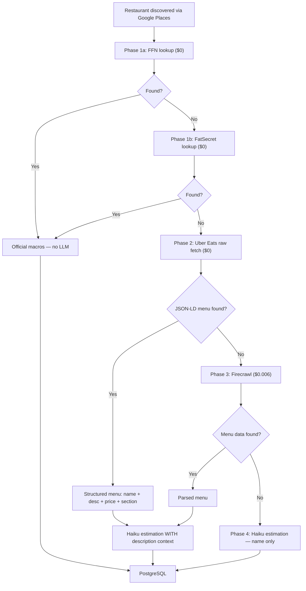

> **🗄️ ARCHIVED 2026-06-12** — Superseded by `docs/engineering/pipeline/data-pipeline-v3.md`. Historical record; do not update.

# Menu Data Sources Analysis

Audit of food delivery platforms and restaurant aggregators for extractable structured data via raw HTTP fetch (no headless browser, no Firecrawl).

**Date:** 2026-04-05  
**Method:** Raw `fetch()` with browser User-Agent to each platform's restaurant/store page. Analyzed all HTML elements that carry structured menu or nutrition data: JSON-LD, microdata, semantic CSS classes, HTML tables, `data-*` attributes, ARIA roles, and SSR payloads.

### Approach: Targeted Element Extraction vs Full DOM Scraping

Traditional web scraping fetches the full page and parses the entire DOM to extract data — expensive, fragile, and often requires a headless browser to render JavaScript. The alternative is **targeted element extraction**: identifying specific HTML elements that carry structured data and extracting only those, often from the raw HTTP response without rendering JS at all.

This approach leverages the fact that many platforms embed machine-readable structured data in their HTML for SEO purposes. Search engines like Google require this structured markup to generate Rich Results (star ratings, menu items, prices in search). Platforms that remove it lose visibility in search — making it a reliable, durable extraction target.

Key extraction patterns (detailed in [Extractable HTML Patterns](#extractable-html-patterns)):
- **Embedded structured data** (JSON-LD `<script>` tags, microdata attributes) — cleanest, most reliable
- **Semantic HTML elements** (tables with `title` attributes, CSS classes like `.menu-item`) — moderate reliability
- **Component identifiers** (`data-testid` attributes in React apps) — requires rendered HTML but more stable than CSS classes

See [References](#references) for background on these techniques.

---

## Summary Matrix

| Platform | Raw Fetch | Extractable Menu Data | Method | Items | Prices | Bot Detection | Indie Coverage |
|----------|-----------|----------------------|--------|-------|--------|---------------|----------------|
| **Uber Eats** | 200 | **Full menu** | JSON-LD `MenuItem` | **133** | **804** | Passive | Excellent |
| **Postmates** | 200 | **Full menu** | JSON-LD `MenuItem` | **133** | **804** | Passive | Same as UE |
| **Allmenus** | 200 | **Partial menu** | CSS classes (`.menu-item`, `.item-title`, `.item-price`) | varies | some | None | Moderate |
| **FastFoodNutrition** | 200 | **Full nutrition** | HTML tables (`<table>`, `<td title="">`) + `data-*` attrs | varies | 0 | None | Chains only |
| **FatSecret** | 200 | **Full nutrition** | HTML tables (31 per chain page) + CSS classes (`.menuItem`) | varies | 0 | None | Chains only |
| **BeyondMenu** | 200 | **Partial menu** | Unstructured HTML with prices | varies | 242 | Passive | Moderate |
| DoorDash | **403** | Full (via Firecrawl) | SSR HTML + `data-testid` attrs | 246+ | 246 | Cloudflare | Excellent |
| Caviar | **403** | Same as DoorDash | Same as DoorDash | — | — | Cloudflare | Same as DD |
| Grubhub | 200 | **None** | Empty shell (client-side JS) | 0 | 0 | None | — |
| Seamless | 200 | **None** | Empty shell (Grubhub-owned) | 0 | 0 | None | — |
| Yelp | 200 | **None** | Menu behind JS; HTML has `ItemList` JSON-LD (listings, not menus) | 0 | 0 | Passive | — |
| TripAdvisor | **403** | None | Blocked | 0 | 0 | Active | — |
| Google Maps | 200 | **None** | No menu in HTML; use Places API | 0 | 0 | None | — |
| Nutritionix | 200 | **None** | JS calculator widget | 0 | 0 | None | Chains only |
| MenuPix | **403** | None | Blocked | 0 | 0 | Cloudflare | — |
| Toast | **403** | None | Blocked | 0 | 0 | Cloudflare | — |
| EatStreet | 200 | Minimal | 4 prices in HTML, no structure | 0 | 4 | Passive | Limited |
| ChowNow | 200 | **None** | Empty shell | 0 | 0 | Passive | — |
| Square Online | 200 | **None** | No menu data | 0 | 0 | Passive | — |
| Slice | 200 | **None** | No menu data | 0 | 0 | Passive | — |

---

## Extractable HTML Patterns

Six distinct patterns for extracting menu/nutrition data from HTML, ordered by reliability:

### 1. JSON-LD (`<script type="application/ld+json">`)

Schema.org structured data embedded in `<script>` tags. Parsed as JSON — no DOM traversal needed.

**Found on:** Uber Eats, Postmates  
**Data:** Full menu hierarchy — `Restaurant` → `hasMenu` → `hasMenuSection[]` → `hasMenuItem[]`  
**Fields per item:** name, description, price, currency  
**Example:**
```json
{"@type":"MenuItem","name":"Pad Thai","description":"Stir-fried rice noodles with protein, egg, bean sprouts in tamarind sauce.","offers":{"@type":"Offer","price":"18.00","priceCurrency":"USD"}}
```
**Reliability:** High — required for Google Rich Results. Removing it hurts SEO.  
**Extraction:** Regex for `<script type="application/ld+json">`, then `JSON.parse()`

### 2. HTML Tables with Semantic Attributes

Nutrition data in `<table>` elements with `title` attributes on `<td>` cells and semantic CSS classes.

**Found on:** FastFoodNutrition, FatSecret  
**Data:** Full macros — calories, protein, carbs, fat, serving size  
**Example (FastFoodNutrition):**
```html
<tr>
  <td class="nfactl"><span class="f700">Calories</span></td>
  <td title="Calories in a McDonald's Big Mac">540</td>
</tr>
```
**Example (FatSecret):**
```
Per 1 serving - Calories: 1160kcal | Fat: 89.00g | Carbs: 20.00g | Protein: 47.00g
```
**Reliability:** High — simple static sites, stable HTML  
**Extraction:** Regex or DOM parser for `<table>` → `<tr>` → `<td>` with known class/title patterns

### 3. Semantic CSS Classes

Menu items identified by human-readable CSS class names.

**Found on:** Allmenus (`.menu-item`, `.item-title`, `.item-price`, `.category-name`), FatSecret (`.menuItem`)  
**Data:** Item names, some prices, menu categories  
**Example (Allmenus):**
```html
<li class="menu-item">
  <div class="item-title">Breakfast Burrito</div>
  <div class="item-price">$12.00</div>
  <div class="description">Scrambled eggs, chorizo, black beans...</div>
</li>
```
**Reliability:** Medium — classes can change on redesign, but these are simple sites  
**Extraction:** Regex or DOM parser for elements with known class names

### 4. `data-testid` Attributes (SSR React Apps)

Stable test identifiers on React components. More durable than CSS classes (which get hashed).

**Found on:** DoorDash (requires Firecrawl — 403 on raw fetch)  
**Data:** Menu items, prices, sections (712 item-related `data-testid` attrs)  
**Example:**
```html
<span data-testid="MenuItem" class="sc-8342d7ae-20 bUZSwj">Shanghai Lo Mein</span>
<span data-testid="MenuItemPrice" class="sc-8342d7ae-10 dQiMbe">$14.95</span>
```
**Reliability:** Medium-High — test IDs are more stable than CSS classes but can still change  
**Extraction:** Requires Firecrawl/headless browser first, then regex on `data-testid`

### 5. `data-*` Custom Attributes

Site-specific data attributes for analytics or internal use.

**Found on:** FastFoodNutrition (`data-ctrack`, `data-loc` — 88 food-related attrs)  
**Data:** Navigation hints only (e.g., `data-ctrack="calories_analysis"`), not actual nutrition values  
**Reliability:** Low — these are internal and change frequently  
**Extraction:** Not useful for data extraction — the actual values are in the HTML tables (pattern 2)

### 6. Microdata (`itemscope`, `itemprop`)

Schema.org markup via HTML attributes instead of JSON-LD.

**Found on:** Allmenus (`itemscope itemtype="http://schema.org/WebPage"` — page-level only, no menu items)  
**Data:** Page metadata only, no menu items  
**Reliability:** N/A — none of the surveyed sites use microdata for menu data  
**Note:** The Schema.org spec supports `itemprop="menu"` but no food platform uses it

---

## Tier Analysis

### Tier 1: Structured Menu Data via Raw Fetch ($0)

**Uber Eats / Postmates** — JSON-LD `MenuItem` objects
- 133 items per restaurant with name, description, price, menu sections
- Single raw HTTP fetch, no headless browser
- Excellent indie restaurant coverage in major US cities
- Bot detection present but not enforced on initial page load (Google SEO requirement)

### Tier 2: Nutrition Ground Truth via Raw Fetch ($0, Chains Only)

**FastFoodNutrition / FatSecret** — HTML tables
- Full macro data: calories, protein, carbs, fat, serving size
- Chains only (McDonald's, IHOP, Chick-fil-A, etc.)
- Stable sites, reliable parsing
- Use for: eval fixtures, chain macro lookups (skip LLM estimation)

### Tier 3: Menu Data via Headless Browser (~$0.006/restaurant)

**DoorDash / Caviar** — SSR HTML with `data-testid` attrs
- Requires Firecrawl (Cloudflare blocks raw fetch)
- Rich data: 246+ prices, item names, sections, review-based portion hints
- Excellent indie coverage
- Use for: fallback when Uber Eats doesn't have the restaurant

### Tier 4: Partial Menu Data via Raw Fetch ($0, Fragile)

**Allmenus** — CSS classes (`.menu-item`)
**BeyondMenu** — unstructured HTML with prices
- Menu items parseable but structure varies per restaurant
- No descriptions on most items
- Moderate coverage
- Use for: last-resort fallback

### Tier 5: No Extractable Menu Data

**Grubhub / Seamless** — empty React shell, all data via client-side JS  
**Yelp** — menu data behind JS, not in initial HTML  
**Google Maps** — no menu in HTML (use Places API instead)  
**ChowNow, Toast, Square, Slice** — ordering platforms, no static data

### Tier 6: Blocked

**TripAdvisor, MenuPix, Toast** — active bot detection, 403 on raw fetch

---

## Recommended Pipeline Architecture

Two-path architecture — the data source determines the estimation strategy. No explicit chain detection; if FFN or FatSecret has the data, it's a chain. Everything else is indie.

**Key insight (from hero eval, 2026-04-06):** Descriptions hurt chain estimation (+18pp MdAPE regression) because Haiku recomputes from ingredients instead of recalling memorized data. But descriptions help indie estimation (Kuya Tray: 680 → 2840 cal) because there's nothing to recall. The pipeline must use different estimation strategies for each path.

**Coverage:** FFN (~200 chains) + FatSecret (~1,060 chains) = ~1,100+ chains with official macros. Any restaurant not on either is indie — descriptions are safe.



---

## Cost Comparison (50-restaurant run)

| Architecture | Phase 1 (chains) | Phase 2 (indie) | Phase 3 (fallback) | Estimation | Total |
|-------------|-----------------|----------------|-------------------|-----------|-------|
| **Current** | — | — | Firecrawl for all ($0.30) | Haiku name+markdown ($0.025) | ~$0.35 |
| **New (phased)** | FFN/FatSecret ($0) | UE raw fetch ($0) | Firecrawl for ~5% ($0.015) | Haiku structured ($0.025) | ~$0.04 |

~88% cost reduction. The remaining cost is Firecrawl for the ~5% of restaurants not on FFN or Uber Eats, plus Haiku estimation for non-chain items.

---

## Technical Implementation

### Current State: Monolith

`scripts/preload.ts` (1,140 lines) contains everything inline — Google Places discovery, Firecrawl scraping, Haiku estimation, Prisma persistence, photo uploads, cuisine tagging, chain detection. No separation of concerns. Each external API is called directly with inline fetch logic, error handling, and config.

This worked for the MVP but won't scale to the phased architecture. Adding a new data source (FFN, Uber Eats) means adding more inline code to an already-large file, with no way to test sources independently or swap them out.

### Design Principles

**Separation of extraction from estimation.** The current pipeline asks Haiku to do two jobs in one call: parse a wall of raw markdown into structured items AND estimate macros. This conflates two distinct concerns ([see: targeted element extraction vs full DOM scraping](https://www.firecrawl.dev/glossary/web-extraction-apis/how-to-extract-structured-data-from-unstructured-html)). The new architecture separates them — extraction is handled programmatically per data source, and Haiku only does macro estimation on already-structured input.

**Data source as an interface, not an implementation detail.** Each data source (FFN, Uber Eats, Firecrawl) returns the same shape — the pipeline doesn't care where the data came from. This follows the same principle behind Schema.org: [standardized data contracts decouple producers from consumers](https://www.schemapilot.app/blog/json-ld-guide/).

**Prefer structured data over raw content.** When a source provides machine-readable structured data (JSON-LD, HTML tables), extract it directly rather than converting to markdown and re-parsing with an LLM. This is cheaper, faster, and more accurate — [crawl efficiency increases because explicit schema eliminates the need for interpretation](https://serpapi.com/blog/web-scraping-with-ai-parsing-html-to-structured-data/).

### Proposed Module Structure

```
apps/api/services/
├── menuSources/
│   ├── types.ts                  # MenuSource interface + shared types
│   ├── ffnSource.ts              # FastFoodNutrition HTML table parser
│   ├── fatSecretSource.ts        # FatSecret HTML table parser
│   ├── uberEatsSource.ts         # JSON-LD extraction via raw fetch
│   ├── firecrawlSource.ts        # Existing Firecrawl logic (refactored)
│   └── resolver.ts               # Phased fallback orchestrator
├── googlePlacesService.ts        # Discovery (extract from preload.ts)
├── macroEstimationService.ts     # Haiku estimation (extract from preload.ts)
├── supabaseStorageService.ts     # Photo uploads (extract from preload.ts)
└── yelpService.ts                # Existing

scripts/
├── preload.ts                    # Thin orchestrator — calls services
└── eval/                         # Existing eval suite
```

### MenuSource Interface

Each data source implements one interface. The pipeline doesn't know which source provided the data.

```typescript
// apps/api/services/menuSources/types.ts

interface StructuredMenuItem {
  name: string;
  description?: string;
  price?: number;
  category?: string;         // "Entree", "Side", "Drink"
  section?: string;          // Menu section heading
}

interface MacroData {
  calories: number;
  proteinG: number;
  carbsG: number;
  fatG: number;
  confidence: "HIGH" | "MEDIUM" | "LOW";
  source: string;            // "ffn", "fatsecret", "haiku"
}

interface MenuSourceResult {
  found: boolean;
  restaurant?: {
    name: string;
    cuisine?: string[];
    priceRange?: string;
  };
  items: StructuredMenuItem[];
  macros?: Map<string, MacroData>;  // Only populated by FFN/FatSecret
  sourceId: string;                  // "ffn" | "fatsecret" | "ubereats" | "firecrawl"
}

interface MenuSource {
  id: string;
  lookup(name: string, address: string): Promise<MenuSourceResult>;
}
```

### Phased Resolver

```typescript
// apps/api/services/menuSources/resolver.ts

class MenuSourceResolver {
  private sources: MenuSource[];

  constructor(sources: MenuSource[]) {
    this.sources = sources;
  }

  async resolve(name: string, address: string): Promise<MenuSourceResult> {
    for (const source of this.sources) {
      const result = await source.lookup(name, address);
      if (result.found) return result;
    }
    return { found: false, items: [], sourceId: "none" };
  }
}

// Usage in preload.ts:
const resolver = new MenuSourceResolver([
  new FFNSource(),            // Phase 1a: official chain data (~200 chains)
  new FatSecretSource(),      // Phase 1b: official chain data (~1,060 chains)
  new UberEatsSource(),       // Phase 2: structured indie menus (JSON-LD, $0)
  new FirecrawlSource(),      // Phase 3: fallback scraping ($0.006)
]);

// Estimation strategy depends on which source succeeded:
// - FFN/FatSecret → use macros directly, no LLM
// - UberEats/Firecrawl → Haiku WITH description context (indie path)
// - Nothing found → Haiku name-only (last resort)
```

### Source Implementations

**FFNSource** — HTML table extraction (~200 chains)
- Raw `fetch()` to `fastfoodnutrition.org/{slug}`
- Parse `<td title="Calories in a ...">540</td>` pattern
- Returns `macros` map — pipeline skips Haiku entirely

**FatSecretSource** — HTML table extraction (~1,060 chains)
- Raw `fetch()` to `foods.fatsecret.com/calories-nutrition/{slug}`
- Parse `Per 1 serving - Calories: Xkcal | Fat: Xg | Carbs: Xg | Protein: Xg` pattern
- 160-190 items per chain, 0-9% variance from official data
- Returns `macros` map — pipeline skips Haiku entirely

**UberEatsSource** — JSON-LD extraction
- Raw `fetch()` with browser UA to store page
- Extract `<script type="application/ld+json">` blocks
- Parse `Restaurant.hasMenu.hasMenuSection[].hasMenuItem[]`
- Returns structured items with name, description, price, section
- **URL discovery:** requires one-time Firecrawl search to find store URL, cached in DB or filesystem
- No macros — pipeline passes structured items to Haiku

**FirecrawlSource** — existing scraping (refactored)
- Extract `firecrawlSearch()`, `firecrawlMap()`, `firecrawlScrape()` from `preload.ts`
- Convert markdown to `StructuredMenuItem[]` (LLM-assisted or regex)
- Fallback source — used when FFN/FatSecret and Uber Eats both miss

### Changes to Estimation

The `macroEstimationService` receives `StructuredMenuItem[]` instead of raw markdown:

```typescript
// Current (preload.ts:393)
async function estimateMacros(
  restaurantName: string,
  menuMarkdown: string,          // raw blob
): Promise<HaikuMenuItem[]>

// New (macroEstimationService.ts)
async function estimateMacros(
  restaurantName: string,
  items: StructuredMenuItem[],   // pre-extracted, structured
): Promise<MacroData[]>
```

The prompt changes from "extract items AND estimate macros from this markdown" to "estimate macros for these items" — one job instead of two.

### Changes to preload.ts

After refactoring, `preload.ts` becomes a thin orchestrator (~200 lines instead of 1,140):

```
1. Validate env vars
2. Discover restaurants (googlePlacesService)
3. For each restaurant:
   a. resolver.resolve(name, address) → MenuSourceResult
   b. If result has macros (FFN/FatSecret) → persist directly
   c. If result has items (UberEats/Firecrawl) → macroEstimationService → persist
   d. If nothing found → name-only estimation → persist
   e. [Optional] fetch and store photo
4. Print stats and cost summary
```

### Schema Changes

```prisma
model MacroEstimate {
  // ... existing fields ...
  source    String?    // "ffn", "fatsecret", "haiku" — tracks where macros came from
}

model MenuItem {
  // ... existing fields ...
  price     Float?     // already exists in schema
  section   String?    // NEW: menu section from source (e.g., "Appetizers", "Entrees")
}

model Restaurant {
  // ... existing fields ...
  menuSourceId  String?   // "ffn", "ubereats", "firecrawl" — tracks data provenance
}
```

### Migration Path

Phase the refactor to avoid a big-bang rewrite:

1. **Extract services** — move Google Places, Firecrawl, Haiku, and persistence logic from `preload.ts` into `apps/api/services/` and `apps/api/lib/`. Keep `preload.ts` working with imports instead of inline code. No behavior change.

2. **Add FFN/FatSecret source** — implement `FFNSource` and `FatSecretSource`. Add as first sources in resolver. Chains now get official data. Everything else still uses Firecrawl.

3. **Add Uber Eats source** — implement `UberEatsSource`. Add between FFN and Firecrawl in resolver. Indies now get structured data. Firecrawl becomes fallback only.

4. **Update estimation prompt** — change Haiku from "extract + estimate" to "estimate only" with structured input. Run eval to verify accuracy improvement.

5. **Remove dead code** — drop `isChain()`, `KNOWN_CHAIN_NAMES`, `CHAIN_INDICATOR_TYPES`. Remove Firecrawl as a required env var (now optional fallback).

### Testing Strategy

#### Hero Eval: Uber Eats Pipeline vs Ground Truth

This is the primary eval. It tests the **actual code path indie restaurants will take** — but against chain items where we have verified macros, so we can measure accuracy.

```
For each chain with both Uber Eats coverage AND FFN/FatSecret ground truth:
  1. Fetch the chain's Uber Eats store page (raw HTTP)
  2. Extract JSON-LD menu items (name, description, price, section)
  3. Send structured items to Haiku for macro estimation
  4. Compare Haiku's estimates against FFN/FatSecret official macros
```

This is a higher-fidelity test than the current eval suite, which sends `"Dish: Big Mac, Restaurant: McDonald's"` — a synthetic prompt that doesn't match what the pipeline actually does. The hero eval tests the **real extraction → real estimation** flow end-to-end.

**Why chains work as a proxy for indie restaurants:** The Haiku estimation step is identical for chains and indies — same prompt, same model, same structured input format. The only difference is the JSON-LD source. If Haiku estimates Big Mac at 560 cal (3.7% error) using Uber Eats structured context, that same error rate is our best estimate for "Joe's Double Stack Burger" with the same context quality.

**Baseline metrics (from current eval runs — name-only, no structured context):**

| Metric | Current Value | Source |
|--------|--------------|--------|
| MdAPE (calories, 60 chain items) | 10.1-13.0% | `haiku-baseline` eval runs |
| Red flags (>15% cal error) | 27-28 / 60 | Consistent across runs |
| Worst chains | Denny's ~32%, Chipotle ~18% | Per-chain breakdown |
| Best chains | McDonald's ~3%, Starbucks ~6% | Per-chain breakdown |
| Internal consistency (cal vs P×4+C×4+F×9) | 3.7% mean error | test-two-flow results |

**Hero eval targets (structured context from Uber Eats):**

| Metric | Target | Rationale |
|--------|--------|-----------|
| MdAPE (estimation flow) | **≤ 8%** | Structured context (description, price, section) should improve on 10-13% baseline |
| Red flags (>15% error) | **≤ 12 / 60** | Portion-tricky items caught by descriptions + prices |
| Catastrophic errors (>50%) | **≤ 3 / 60** | Serving type confusion (avocado spread, party trays) eliminated by descriptions |
| Portion-tricky items | **Correct direction** | Multi-serving items (trays, combos) estimated above 1000 cal. Condiments estimated below 200 cal. |
| Confidence calibration | **HIGH items ≤ 8% median error** | If the model says HIGH, it should actually be accurate |

#### FFN/FatSecret Parser Validation

Separate from the hero eval. This tests the **official data path** — no LLM, just HTML parsing.

- Scrape 10 chains from FFN/FatSecret
- Parse HTML tables for calories, protein, carbs, fat
- Compare parsed values against our hand-curated `ground-truth.json` fixtures (60 items)
- **Pass criteria: 0% error.** If the parser extracts different values than the published data, it's a parser bug, not an estimation error. Every mismatch must be investigated and fixed.

#### Unit Tests

Each `MenuSource` implementation tested independently with cached HTML fixtures (no live API calls):

- **FFNSource / FatSecretSource:** Cache raw HTML from FFN/FatSecret for 5 chains. Assert correct extraction of calories, protein, carbs, fat, serving size from HTML tables. Assert `macros` map is populated and `found: true`. Assert graceful `found: false` for unknown restaurant names.
- **UberEatsSource:** Cache raw HTML from Uber Eats for 5 restaurants. Assert correct JSON-LD parsing: item count, names, descriptions, prices, section names. Assert `found: false` when JSON-LD is absent or has no `hasMenu`.
- **FirecrawlSource:** Cache Firecrawl markdown responses. Assert `StructuredMenuItem[]` extraction. Assert fallback order (search → map → scrape → fail).
- **MenuSourceResolver:** Mock all sources. Assert phased fallback: FFN returns first when found, UberEats tried second, Firecrawl last. Assert `sourceId` is correct on each result.
- **macroEstimationService:** Assert Haiku receives structured input (not raw markdown). Assert JSON parsing handles markdown fences, malformed responses. Mock Anthropic SDK.

#### Integration Tests

- **Resolver end-to-end:** Run `resolver.resolve()` against 5 known restaurants (2 chains, 3 indie) with live API calls. Assert each hits the expected source (chains → FFN, indies → UberEats or Firecrawl).
- **Full pipeline:** Run `preload.ts` against 3 restaurants. Assert records created in DB with correct `menuSourceId` and `source` fields on MacroEstimate.

#### Exit Criteria Per Migration Phase

| Phase | Gate | Pass Criteria |
|-------|------|---------------|
| 1. Extract services | No behavior change | All existing tests pass. Hero eval MdAPE within ±1pp of baseline (10-14%). Zero new red flags. |
| 2. Add FFN/FatSecret | Parser accuracy | FFN parser validation: 0% error against hand-curated fixtures. Chain items routed to FFN have `source: "ffn"` on MacroEstimate. |
| 3. Add Uber Eats | Estimation improves | **Hero eval:** MdAPE ≤ 8% (down from 10-13%). Red flags ≤ 12/60. Portion-tricky items (trays, condiments) estimated correctly. |
| 4. Update estimation prompt | Quality maintained | Hero eval MdAPE must not regress >1pp vs Phase 3. Internal consistency ≤ 5%. |
| 5. Remove dead code | Clean codebase | All tests pass. `isChain()`, `KNOWN_CHAIN_NAMES` no longer referenced. `FIRECRAWL_API_KEY` not in `REQUIRED_ENV_VARS`. Structural tests pass. |

#### Overall Ship Criteria

All phases complete. The pipeline is ready to ship when:

| Metric | Target | How Measured |
|--------|--------|-------------|
| FFN parser accuracy | **0%** error | FFN parser validation against hand-curated fixtures |
| Estimation MdAPE (hero eval) | **≤ 8%** | Hero eval: UE extraction → Haiku estimation → vs FFN ground truth |
| Red flags | **≤ 12 / 60** | Hero eval red flag count |
| Catastrophic errors (>50%) | **≤ 3 / 60** | Hero eval |
| Cost per 50-restaurant run | **≤ $0.10** | Pipeline cost tracking |
| Pipeline runtime | **≤ 5 min** for 50 restaurants | Timed run |

#### Structural Tests

Add to `scripts/structural-tests.sh`:

- `preload.ts` must not contain inline `fetch()` calls to external APIs (all calls go through service modules)
- Every `MenuSource` implementation must have a corresponding `.test.ts` file
- `MacroEstimate.source` field must be populated on all new records (no null values after Phase 2)

---

## References

### Targeted Element Extraction

- [Restaurant Menu Data Scraping: A Data-Driven Approach](https://www.foodspark.io/restaurant-menu-data-scraping-data-driven-approach/) — Overview of menu data scraping strategies, multi-layered metadata extraction, and the role of Schema.org markup in modern food data pipelines
- [How to Extract Structured Data from Unstructured HTML](https://www.firecrawl.dev/glossary/web-extraction-apis/how-to-extract-structured-data-from-unstructured-html) — Comparison of DOM parsing, CSS selectors, and structured data extraction approaches for web scraping
- [Structured vs Unstructured Data in Web Scraping](https://www.scraperapi.com/blog/structured-data-and-unstructured-data-explained/) — When to target embedded structured data vs parsing raw HTML

### Schema.org for Restaurant Data

- [Schema.org Menu Type](https://schema.org/Menu) — Official spec for `Menu`, `MenuSection`, `MenuItem` types
- [Schema.org MenuItem Type](https://schema.org/MenuItem) — Fields: `name`, `description`, `offers` (price), `nutrition`, `suitableForDiet`
- [JSON-LD: The Complete Guide to Structured Data in 2026](https://www.schemapilot.app/blog/json-ld-guide/) — Why JSON-LD is Google's recommended format; extraction is a JSON parse, not DOM traversal
- [Markup Your Restaurant Menu with Structured Data](https://www.searchenginenews.com/sample/update/entry/markup-your-restaurant-menu-with-structured-data) — How and why restaurants and delivery platforms implement Schema.org menu markup
- [Restaurant Schema Markup: Menu & Reservations Guide](https://onthemap.agency/blog/restaurant-schema-markup/) — Practical guide to `Restaurant` → `hasMenu` → `hasMenuSection` → `hasMenuItem` hierarchy

### Crawl Efficiency

- [Web Scraping with AI: Parsing HTML to Structured Data](https://serpapi.com/blog/web-scraping-with-ai-parsing-html-to-structured-data/) — AI-driven extraction vs rule-based crawlers; 35% accuracy improvement by understanding page semantics
- [Choosing the Right Web Scraping Tool](https://www.firecrawl.dev/blog/choosing-web-scraping-tools) — Tradeoffs between full DOM rendering (headless browser) and lightweight structured data extraction
