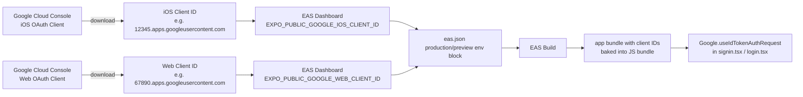

> **🗄️ ARCHIVED 2026-06-12** — Completed/historical (one-off ticket or spike). Kept for context; do not update. Current docs: `docs/README.md`.

# S-105: EAS Build Profiles — Google OAuth Environment Variables

**Author**: Frontend Agent
**Date**: 2026-04-08
**Status**: FINAL
**Ticket**: S-105

---

## 1. Purpose

Wire `EXPO_PUBLIC_GOOGLE_IOS_CLIENT_ID` and `EXPO_PUBLIC_GOOGLE_WEB_CLIENT_ID`
into EAS build profiles so that production and preview builds include the Google
OAuth client IDs. Without these, the Google Sign-In button shows an error alert
("Not Configured") on any build that isn't running locally with `.env.local`.

---

## 2. Architecture



---

## 3. Changes

### `apps/mobile/eas.json`

Add `env` blocks to `preview` and `production` profiles that document which
variables must be set. The env var names in `eas.json` serve as build-time
documentation — actual values are injected from the EAS dashboard at build time.

```json
"preview": {
  "distribution": "internal",
  "env": {
    "EXPO_PUBLIC_GOOGLE_IOS_CLIENT_ID": "CONFIGURE_IN_EAS_DASHBOARD",
    "EXPO_PUBLIC_GOOGLE_WEB_CLIENT_ID": "CONFIGURE_IN_EAS_DASHBOARD"
  }
},
"production": {
  "env": {
    "EXPO_PUBLIC_GOOGLE_IOS_CLIENT_ID": "CONFIGURE_IN_EAS_DASHBOARD",
    "EXPO_PUBLIC_GOOGLE_WEB_CLIENT_ID": "CONFIGURE_IN_EAS_DASHBOARD"
  }
}
```

> **Note**: The `CONFIGURE_IN_EAS_DASHBOARD` placeholder values will be
> overridden by EAS environment variables set in the project dashboard before
> building. Do not commit real client IDs to the repo.

---

## 4. Manual Steps (Required Before Any TestFlight Build)

These steps must be completed in external systems and cannot be automated here.

### Step 1: Get OAuth Client IDs from Google Cloud Console

1. Go to [console.cloud.google.com](https://console.cloud.google.com) →
   APIs & Services → Credentials
2. Look for the iOS OAuth 2.0 client for Fitsy (or create one):
   - Application type: iOS
   - Bundle ID: `app.fitsy.mobile` (matches S-104)
   - This gives you the **iOS Client ID** (format: `XXXX.apps.googleusercontent.com`)
3. Look for the Web OAuth 2.0 client (or create one):
   - Application type: Web application
   - This gives you the **Web Client ID** (format: `YYYY.apps.googleusercontent.com`)

### Step 2: Verify Redirect URI (G-3 from S-99)

In the iOS OAuth client settings, verify that the authorized redirect URI
includes:
```
com.googleusercontent.apps.XXXX:/
```
Where `XXXX` is the numeric portion of the iOS Client ID. This is the URI
scheme that `expo-auth-session` uses when returning from the Google OAuth flow.

### Step 3: Set Environment Variables in EAS Dashboard

```bash
# Set for preview environment
eas env:create --name EXPO_PUBLIC_GOOGLE_IOS_CLIENT_ID --value "XXXX.apps.googleusercontent.com" --environment preview
eas env:create --name EXPO_PUBLIC_GOOGLE_WEB_CLIENT_ID --value "YYYY.apps.googleusercontent.com" --environment preview

# Set for production environment
eas env:create --name EXPO_PUBLIC_GOOGLE_IOS_CLIENT_ID --value "XXXX.apps.googleusercontent.com" --environment production
eas env:create --name EXPO_PUBLIC_GOOGLE_WEB_CLIENT_ID --value "YYYY.apps.googleusercontent.com" --environment production
```

Or set them via the EAS web dashboard:
1. Go to expo.dev → your Fitsy project → Environment variables
2. Add both variables for `preview` and `production` environments

---

## 5. Verification

After setting EAS env vars, trigger a preview build and verify:

```bash
eas build --platform ios --profile preview
```

Then check the build logs for:
- `EXPO_PUBLIC_GOOGLE_IOS_CLIENT_ID` is non-empty
- The app on device shows the Google Sign-In button without an alert
- Tapping Google Sign-In opens the OAuth browser flow

---

## 6. What's NOT Needed

- `expo-google-services` plugin (addressed in S-104 spec — not required for
  `expo-auth-session` browser OAuth)
- `GoogleService-Info.plist` (same reason)
- Changes to `signin.tsx` or `login.tsx` — they already correctly read
  `EXPO_PUBLIC_GOOGLE_IOS_CLIENT_ID` from env
