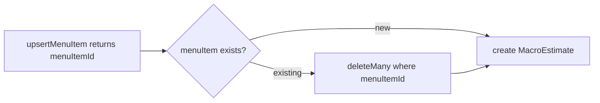

> **🗄️ ARCHIVED 2026-06-12** — Completed/historical (one-off ticket or spike). Kept for context; do not update. Current docs: `docs/README.md`.

# S-82: Fix MacroEstimate Upsert

## Problem

On preload re-run, `MacroEstimate` rows are duplicated. `upsertMenuItem` correctly returns the existing `menuItemId`, but both `preload.ts` and `preload-rest.ts` then unconditionally `create` a new `MacroEstimate` for that ID. After N re-runs, each menu item has N duplicate estimates.

## Fix

Delete all existing `MacroEstimate` rows for the `menuItemId` before inserting the new one. This is equivalent to "delete + insert" upsert semantics — simpler and safer than a true upsert since `MacroEstimate` has no natural unique key that Prisma can use for `upsert()`.

## Changes

### `scripts/preload.ts`

In `persistItems`: wrap `macroEstimate.create` with a preceding `macroEstimate.deleteMany({ where: { menuItemId } })`, inside a transaction.

### `scripts/preload-rest.ts`

In `createMacroEstimate`: issue a DELETE to the Supabase REST `MacroEstimate` endpoint filtering by `menuItemId` before POSTing the new row.

## Notes

- Idempotency: after this fix, re-running preload produces exactly one `MacroEstimate` per `MenuItem`.
- No schema changes needed — this is a behavior fix only.
- Data loss: intentional — stale estimates are replaced by fresh ones on re-run.
