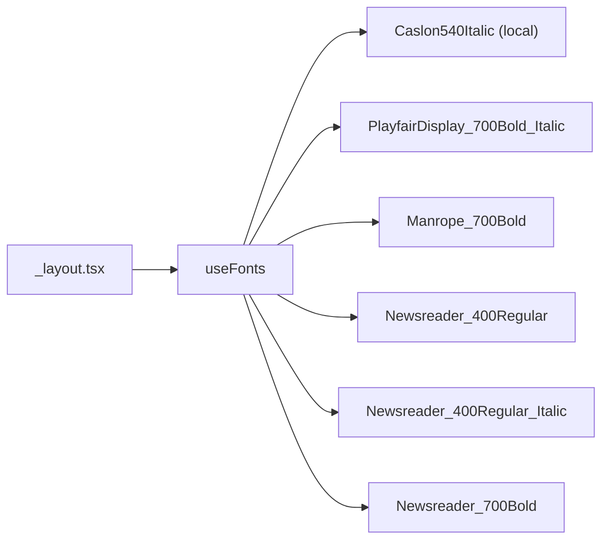

> **🗄️ ARCHIVED 2026-06-12** — Completed/historical (one-off ticket or spike). Kept for context; do not update. Current docs: `docs/README.md`.

# S-84: Add Newsreader Font

## Summary

Add the Newsreader serif font family to the mobile app's root layout so it's available to the mockup screens (S-85–S-88) that use it for editorial headlines.

## Changes

### `apps/mobile/package.json`
Add `@expo-google-fonts/newsreader`.

### `apps/mobile/app/_layout.tsx`
Load Newsreader weights alongside existing PlayfairDisplay and Manrope:

## Font names used in code

| Key | Weight | Use |
|-----|--------|-----|
| `Newsreader-Regular` | 400 | Body copy |
| `Newsreader-Italic` | 400 italic | Section headers, pull quotes |
| `Newsreader-Bold` | 700 | Card headlines |

## Notes

- Follows the same pattern as existing Google Fonts (path-based require)
- All three weights are loaded once at root to avoid per-screen font flashes
