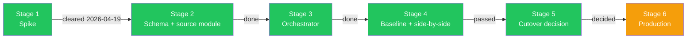
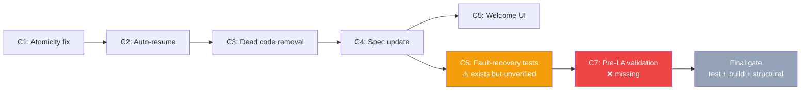

# Pipeline Implementation Status

> **Status:** living · **Last verified:** 2026-06-12

Tracks the UE-first pipeline from initial spike through production. Source truth: `docs/engineering/pipeline/ue-first-pipeline.md` (design) and `docs/engineering/archive/pipeline-v3-hardening.md` (7-commit hardening plan C1–C7).

---

## Stage diagram

---

## Stage status table

| Stage | Name | Status | Source doc | Notes |
|---|---|---|---|---|
| Stage 1 | Spike | Done 2026-04-19 | `ue-first-pipeline.md` §Spike | All kill-criteria cleared: unauth cookie works US-wide; `mapMarker` has per-store geo; feed returns 52–100 stores per probe |
| Stage 2 | Schema + source module | Done 2026-04-19 | `ue-first-pipeline.md` §Stage 2 | Destructive migration `20260419_ue_first_rebuild` applied; `externalPlaceId` dropped; `storeUuid/homeHex/brand/photoSource` added; `ueApiClient.ts` extended with `fetchFeedV1/paginateFeedV1`; `UeApiDirectSource` built with unit tests |
| Stage 3 | Pipeline orchestrator | Done | `ue-first-pipeline.md` §Stage 3 | `scripts/preload-ue-first.ts` written; all flags implemented (`--phase`, `--hex-id`, `--max-hexes`, `--dry-run`, `--force`, `--days`, `--run-id`, `--skip-preflight`); gate: South Pasadena hex persist ≥ v6 baseline — passed |
| Stage 4 | Baseline + side-by-side | Done | `docs/engineering/pipeline/baseline-v6.md` | 94 restaurants, 6,791 items, 0 Google Places calls, +24% over v6; gate passed |
| Stage 5 | Cutover decision | Done | `ue-first-pipeline.md` §Stage 5 | UE-first persist count (94) > v6 (76); coverage delta favorable; `scripts/preload.ts` marked `@deprecated` |
| Stage 6 | Production | **In progress** | `ue-first-pipeline.md` §Stage 6 | Cron wiring, `verify-prod.sh` extension, and Axiom `phase=ue-first` monitoring still pending. See hardening gaps below. |

---

## Hardening plan (C1–C7)

From `docs/engineering/archive/pipeline-v3-hardening.md`. Root cause: S-141 wired `preload.ts` to bypass `persistHex()`, violating the hex-atomicity invariant. All commits target the core pipeline, not UE-first-specific code.

| Commit | Description | Status | Exit criteria met |
|---|---|---|---|
| C1 | Atomicity — wire `persistHex()` + menuHash in txn | Done | `persistHex()` is the only DB write path; menuHash inside `$transaction` |
| C2 | Auto-resume across midnight | Done | `findLatestIncompleteRunId()` in `hex-resume.ts`; resume test passes |
| C3 | Dead code removal | Done | `googlePlacesService.ts`, `yelpSource.ts`, `preload-rest.ts`, `hex-grid.ts` deleted; `GOOGLE_PLACES_API_KEY` removed from required env |
| C4 | Spec update | Done | `data-pipeline-v3.md` updated; Google Places / old `--resume` flag references removed |
| C5 | Welcome screen UI fixes | Done | Stashed onboarding updates committed |
| **C6** | **Fault recovery tests** | **Partial** | `scripts/mini-hex-e2e.test.ts` EXISTS. All 3 required tests are present (transaction rollback, partial-hex resume, DuckDB failure propagation). However, these are `describeIfE2E` tests requiring a live DB + DuckDB (`E2E=1`). It is not confirmed whether they pass in the current environment — **they should be run before Stage 6 production cutover.** |
| **C7** | **Pre-LA validation gate** | **Missing** | `scripts/la-validation.ts` does NOT exist. The C7 plan specified a lightweight validation script (download Overture cache for LA bbox, assert 18K–21K restaurants, probe 3 representative hexes). **This script was never written.** Mark as a required pre-production task. |

---

## Known gaps before production cutover

### C6 — Fault-recovery tests need a verified run

The three tests exist in `scripts/mini-hex-e2e.test.ts` but require `E2E=1` and a live database connection. They have not been confirmed passing in CI or staging.

**Action required:** Run `E2E=1 npm test --workspace=@fitsy/scripts -- --testPathPattern='mini-hex-e2e'` against staging DB and confirm all 3 pass before enabling the production cron.

### C7 — `scripts/la-validation.ts` is missing

The pre-production validation script described in the hardening plan was never implemented. It was intended to:
1. Download Overture cache for the LA bbox
2. Assert restaurant count 18,000–21,000
3. Probe 3 representative hexes (sparse, medium, dense) through source resolution

**Note:** Since the pipeline is now UE-first (no Overture download), C7's validation approach needs to be updated: the LA readiness check should instead run Phase 1 against the LA bbox, assert store count is in a reasonable range (e.g., 5,000–15,000 UE-listed restaurants), and probe 3 diverse hexes through Phase 2 source resolution before committing to a full run.

**Action required:** Write `scripts/la-validation.ts` (or equivalent UE-first variant) and run it before the first full-LA production run.

### Stage 6 — Production wiring incomplete

Per `ue-first-pipeline.md` §Stage 6, the following remain:
- Wire `scripts/preload-ue-first.ts --phase=discover` to daily cron
- Wire `scripts/preload-ue-first.ts --phase=enrich` to a backlog-draining worker
- Extend `scripts/verify-prod.sh` with Phase 1 + Phase 2 invariants
- Verify Axiom monitoring dashboards filter by `phase=ue-first`

---

## Mermaid: hardening commit dependency chain

