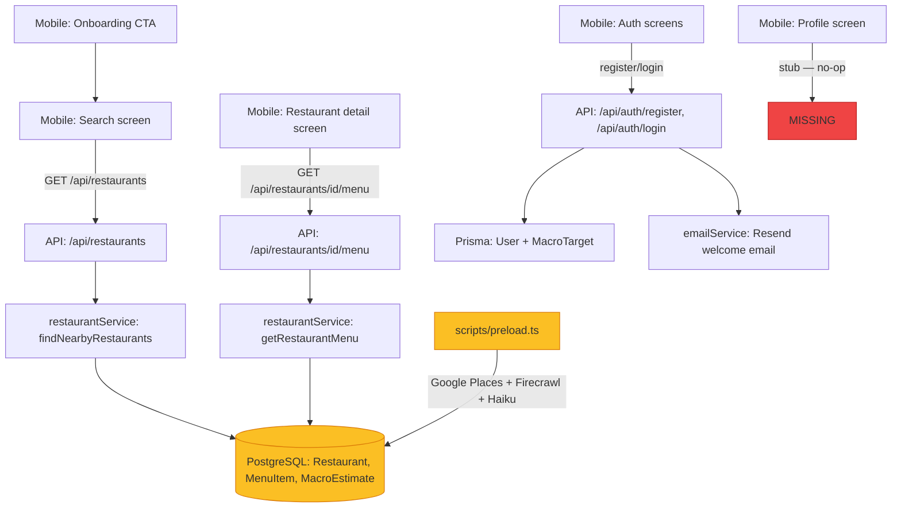

# Codebase Audit — 2026-03-25

**Author**: CTO agent (S-45)
**Purpose**: Verify what is actually built, wired up, and working vs. what is still missing. This is a read-of-the-code audit — not a live-system smoke test. A live smoke test is tracked separately in S-47.

---

## Methodology

Audited every file in `apps/api/`, `apps/mobile/`, `packages/shared/`, `prisma/`, and `scripts/` by reading source code, running `npm test`, running `npm run build`, and running `bash scripts/structural-tests.sh`. The database has **not** been preloaded with real restaurant data yet (S-46 is still In Progress).

---

## Summary Diagram

Yellow = exists but DB not preloaded. Red = not yet implemented.

---

## What Is Actually Built

### Prisma Schema

- **Status**: Complete and migrated (2 migrations present)
- **Models**: `User`, `MacroTarget`, `Restaurant`, `MenuItem`, `MacroEstimate`, `SavedItem`
- **Enums**: `GoalType`, `ConfidenceLevel`, `SavedItemType`
- **Notes**: Full schema is defined and migration files exist in `prisma/migrations/`. DB connection requires `POSTGRES_PRISMA_URL` and `POSTGRES_URL_NON_POOLING` env vars.

### API Backend (`apps/api/`)

#### `GET /api/health`
- **Status**: Implemented. Pings DB with `SELECT 1`, returns `{status, db, version, timestamp}`. Tests pass.

#### `POST /api/auth/register`
- **Status**: Implemented. Hashes password (bcrypt, 12 rounds), creates user via Prisma, signs JWT, fires welcome email (Resend, fire-and-forget). Tests pass.

#### `POST /api/auth/login`
- **Status**: Implemented. Verifies password hash, signs JWT, returns token + user. Tests pass.

#### `GET /api/restaurants`
- **Status**: Implemented. Accepts `lat`, `lng`, `radius`, `limit`, `calories`, `protein`, `carbs`, `fat`, `cuisineType`, `chainOnly`. Queries Prisma using bounding-box filter + in-memory haversine distance check + macro scoring. Returns `RestaurantResult[]`. Tests pass. **Returns empty array until DB is preloaded (S-46).**

#### `GET /api/restaurants/[id]/menu`
- **Status**: Implemented. Returns `MenuResponse` (restaurant name + `MenuItemResult[]` with macros). Tests pass. **Returns 404 until DB is preloaded (S-46).**

#### Duplicate auth route folders
- **Status**: Empty folders named `login 2` and `register 2` exist in `apps/api/app/api/auth/`. These appear to be leftover macOS Finder duplicates. They are empty and do not affect the build, but should be removed.

### API Services

#### `authService.ts`
- **Status**: Implemented. `hashPassword`, `verifyPassword` (bcrypt), `signToken`, `verifyToken` (jose/JWT, 7-day expiry). Tests pass.

#### `emailService.ts`
- **Status**: Implemented. Sends welcome email via Resend. Silently skips if `RESEND_API_KEY` is absent. Tests pass.

### Mobile App (`apps/mobile/`)

#### Auth flow: Register → Onboarding → Search
- **Status**: Fully wired. `register.tsx` → `registerAndStore` → API → `onboarding.tsx` → `/(tabs)/search`. Tested via unit tests on `authClient.ts`.

#### Auth flow: Login → Search
- **Status**: Fully wired. `login.tsx` → `loginAndStore` → API → `/(tabs)/search`.

#### Search screen (`/(tabs)/search.tsx`)
- **Status**: Implemented. MacroInputBar with 600ms debounce, persists targets to AsyncStorage, calls `fetchRestaurants`, renders `RestaurantCard` list. Hardcoded default lat/lng to Silver Lake, LA (34.0869, -118.3269) — real GPS not yet wired.

#### Restaurant detail screen (`/restaurant/[id].tsx`)
- **Status**: Implemented. Calls `fetchMenu(id)`, renders `SectionList` grouped by category with `MenuItem` component and macro info.

#### Onboarding CTA screen (`/onboarding.tsx`)
- **Status**: Implemented (S-37f). Shows personalized greeting, CTA to search, skip option.

#### Profile screen (`/(tabs)/profile.tsx`)
- **Status**: Stub only. Renders "Profile — coming soon" placeholder.

#### Components
- `MacroInputBar`, `RestaurantCard`, `MenuItem`, `ConfidenceBadge`: all implemented.

### Shared Package (`packages/shared/`)
- **Status**: Complete. All shared types, API response shapes, macro targets, and auth types defined and used consistently by both `apps/api/` and `apps/mobile/`.

### Preload Pipeline (`scripts/preload.ts`)
- **Status**: Script is fully implemented (Google Places Nearby Search → Firecrawl scrape → Claude Haiku macro estimation → Prisma upsert). Has **never been run against the staging database**. S-46 tracks executing this run.

### CI/CD (`.github/workflows/`)
- **Status**: `ci.yml` runs structural tests, security checks, TypeScript check, unit tests, and build on every PR. `e2e-staging.yml` exists for post-merge Maestro flows. `playwright.yml` exists for video recording (S-34, done). `reviewer.yml` automates PR review routing. `fix-review.yml` was added to handle fix PRs.

---

## What Is NOT Working / Missing

| # | Item | Reason |
|---|------|--------|
| 1 | **DB has no restaurant data** | Preload pipeline (S-46) has not been run against staging yet |
| 2 | **GET /api/restaurants returns []** | Consequence of #1 |
| 3 | **GET /api/restaurants/[id]/menu returns 404** | Consequence of #1 |
| 4 | **GPS location not used** | Search screen hardcodes Silver Lake coordinates — `expo-location` not integrated |
| 5 | **Profile screen is a stub** | No user profile, macro target editing, or saved items UI |
| 6 | **No macro target setup flow** | Onboarding CTA says "Set up my macros" but routes to search, not a macro setup screen |
| 7 | **JWT not validated server-side on restaurant routes** | `/api/restaurants` and `/api/restaurants/[id]/menu` are public — no auth middleware |
| 8 | **Duplicate empty folders** | `apps/api/app/api/auth/login 2/` and `register 2/` are empty artifacts |
| 9 | **Root-level `npx tsc --noEmit` reports errors** | Root tsconfig does not have `jsx` set; per-package `tsc` (apps/api and apps/mobile) build correctly via `npm run build`. This is a monorepo root-level tsconfig gap, not a compile failure. |

---

## Test Coverage Status

| Suite | Tests | Status |
|-------|-------|--------|
| `apps/api` — 6 suites | 75 tests | All pass |
| `apps/mobile` — 3 suites | 29 tests | All pass |
| Structural tests | 12 checks | All pass |
| Build | Next.js + Expo | Build succeeds |

---

## Blocking Dependency for End-to-End Smoke Test (S-47)

S-47 (the smoke test) is blocked by S-46 (preload staging DB). Until S-46 runs successfully:
- The app can open, register users, and log in.
- The search screen renders but returns no results.
- Restaurant detail and menu screens cannot be exercised.
