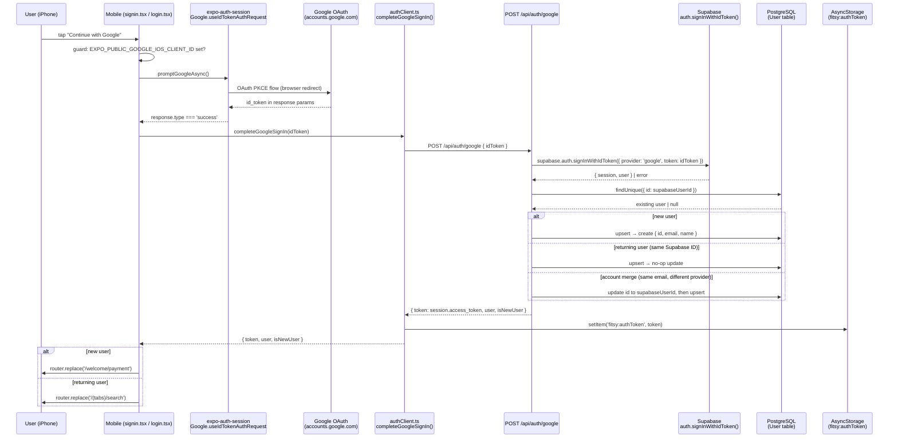

# Google Sign-In Validation — S-99

**Author**: CTO
**Date**: 2026-04-08
**Status**: FINAL — gaps documented, P0 mitigations committed

---

## 1. Purpose

Validate the Google Sign-In flow end-to-end in dev. Document each step's
implementation status and list all gaps that must be closed before TestFlight.

---

## 2. Flow Diagram

---

## 3. Step-by-Step Validation

| # | Step | File(s) | Status | Notes |
|---|------|---------|--------|-------|
| 1 | Guard: `EXPO_PUBLIC_GOOGLE_IOS_CLIENT_ID` check | `signin.tsx`, `login.tsx` | WORKS | Shows Alert if not set; blocks promptGoogleAsync |
| 2 | `Google.useIdTokenAuthRequest` init | `signin.tsx`, `login.tsx` | WORKS | Uses `iosClientId` + `clientId`; falls back to `'not-configured'` if env var absent |
| 3 | `promptGoogleAsync()` → browser OAuth | Mobile runtime | WORKS in dev (env vars present in `.env.local`); GAP for TestFlight — see below |
| 4 | `response.type === 'success'` → `id_token` extraction | `signin.tsx`, `login.tsx` | WORKS | `response.params['id_token']` |
| 5 | `POST /api/auth/google { idToken }` | `authClient.ts` | WORKS | `completeGoogleSignIn()` posts to `EXPO_PUBLIC_API_URL/api/auth/google` |
| 6 | API route input validation | `route.ts` | WORKS | Returns 400 on missing/invalid idToken; unit-tested |
| 7 | Supabase `signInWithIdToken({ provider: 'google', token })` | `route.ts`, `supabase.ts` | WORKS in dev (env vars set); GAP for TestFlight — see below |
| 8 | Supabase returns `session.access_token` | `route.ts` | WORKS | Token is the Supabase JWT, verified via JWKS |
| 9 | User upsert (new / existing / account merge) | `route.ts` | WORKS | Three-case logic implemented |
| 10 | JWT stored in AsyncStorage | `authClient.ts` | WORKS | `storeToken(result.token)` |
| 11 | New user → `/welcome/payment`; returning → `/(tabs)/search` | `signin.tsx` | WORKS | Routing logic correct |
| 12 | Returning user (login.tsx) always → `/(tabs)/search` | `login.tsx` | WORKS | Does not branch on `isNewUser` — correct for re-login |
| 13 | Session token verified by `requireAuth` middleware | `auth.ts`, `authService.ts` | WORKS | Verifies Supabase-issued JWT via JWKS endpoint |
| 14 | Protected routes use `requireAuth` | API routes | GAP (P1) — restaurant routes have no JWT middleware (tracked in CLAUDE.md) |
| 15 | Token stored in `AsyncStorage` (not SecureStore) | `authClient.ts` | GAP (P1) — see S-103 security audit |
| 16 | `app.config.ts` iOS bundle ID | `app.config.ts` | GAP (P0) — missing `ios.bundleIdentifier`; required for EAS Build + Google OAuth |
| 17 | Google OAuth redirect URI registered in Google Cloud Console | External config | UNVERIFIED — cannot verify without console access |
| 18 | `SUPABASE_URL`, `SUPABASE_ANON_KEY` in Vercel env | Vercel | WORKS — confirmed via `.env.local` pull |
| 19 | `EXPO_PUBLIC_GOOGLE_IOS_CLIENT_ID`, `EXPO_PUBLIC_GOOGLE_WEB_CLIENT_ID` in EAS env | EAS | UNVERIFIED — not in `eas.json`; must be added before TestFlight build |
| 20 | `expo-google-services` plugin / `GoogleService-Info.plist` | `app.config.ts` | GAP (P1) — not configured; needed for production iOS builds |

---

## 4. Gaps Before TestFlight

### P0 — Must fix before any TestFlight build

| ID | Gap | File | Fix |
|----|-----|------|-----|
| G-1 | `ios.bundleIdentifier` missing from `app.config.ts` | `apps/mobile/app.config.ts` | Add `ios: { bundleIdentifier: 'com.fitsy.app' }` (or actual bundle ID) |
| G-2 | `EXPO_PUBLIC_GOOGLE_IOS_CLIENT_ID` and `EXPO_PUBLIC_GOOGLE_WEB_CLIENT_ID` not in EAS build env | `apps/mobile/eas.json` | Add env vars to `production` and `preview` build profiles in `eas.json`; set values in EAS dashboard |
| G-3 | Google OAuth redirect URI for production bundle ID not verified in Google Cloud Console | External | After G-1, register `com.googleusercontent.apps.<client-id>:/` as an authorized redirect URI in Google Cloud Console |

### P1 — Must fix before opening to real users (can slip TestFlight beta if testers are trusted)

| ID | Gap | File | Fix |
|----|-----|------|-----|
| G-4 | Restaurant routes have no JWT middleware | `apps/api/app/api/restaurants/` | Add `requireAuth` to `GET /api/restaurants` and `GET /api/restaurants/[id]/menu`; tracked as S-94 |
| G-5 | Token stored in `AsyncStorage` (not `SecureStore`) | `apps/mobile/lib/authClient.ts` | Migrate to `expo-secure-store`; tracked in S-103 |
| G-6 | `expo-google-services` not configured in `app.config.ts` | `apps/mobile/app.config.ts` | Add Google Services plugin and `GoogleService-Info.plist` for production iOS build |

### P2 — Post-beta quality improvements

| ID | Gap | Note |
|----|-----|------|
| G-7 | No E2E test for Google Sign-In flow | Tracked as S-93; simulator can't complete real OAuth, need test double |
| G-8 | No token refresh logic | Supabase tokens expire; no refresh handled; app will fail silently on expiry |
| G-9 | `login.tsx` does not branch on `isNewUser` | Returning users on the login screen always go to search — correct, but silently ignores new-user case if someone lands on login first |

---

## 5. What Works End-to-End (Dev)

The following verified path works today in dev (with `.env.local` configured):

1. User taps "Continue with Google" on `signin.tsx` or `login.tsx`
2. `promptGoogleAsync()` opens browser OAuth (requires `EXPO_PUBLIC_GOOGLE_IOS_CLIENT_ID`)
3. Google returns `id_token` to the app via redirect
4. `completeGoogleSignIn(idToken)` posts to `POST /api/auth/google`
5. API verifies via Supabase `signInWithIdToken`, upserts user in DB
6. Returns `session.access_token` (Supabase JWT) + user
7. Token stored in AsyncStorage
8. Navigation to correct post-auth screen

Unit tests for all server-side steps pass (27 test suites, 265 tests green as of 2026-04-08).

---

## 6. What Does Not Work (Gaps Summary)

The flow cannot complete on a real TestFlight build today because:

- **G-1**: No iOS bundle identifier in `app.config.ts` — EAS Build will fail or generate a wrong bundle ID
- **G-2**: EAS build profiles don't inject Google OAuth env vars — `EXPO_PUBLIC_GOOGLE_IOS_CLIENT_ID` will be undefined in production builds, causing the Google button to show an error alert
- **G-3**: If the bundle ID is wrong/unknown, the Google OAuth redirect URI will not match, causing OAuth to fail with a redirect mismatch error

---

## 7. Recommended Fix Order

1. **G-1** — Add `ios.bundleIdentifier` to `app.config.ts` (frontend agent owns this file — create ticket for frontend agent)
2. **G-2** — Add env vars to EAS build profiles (frontend/devops task)
3. **G-3** — Verify redirect URIs in Google Cloud Console (manual step)
4. **G-4** — Wire `requireAuth` to restaurant routes (S-94 — backend agent)
5. **G-5** — Migrate token storage to `expo-secure-store` (S-103 — frontend agent)
6. **G-6** — Add `expo-google-services` plugin (frontend agent)

---

## 8. Tickets Created

This validation surfaces the following new tickets (added to sprint board):

| Ticket | Owner | Work |
|--------|-------|------|
| S-104 | frontend | Add `ios.bundleIdentifier` to `app.config.ts` + `expo-google-services` plugin |
| S-105 | frontend/devops | Add `EXPO_PUBLIC_GOOGLE_IOS_CLIENT_ID` and `EXPO_PUBLIC_GOOGLE_WEB_CLIENT_ID` to EAS build profiles |

> **Note**: G-3 (redirect URI verification) is a manual step in Google Cloud Console, not a code change. No ticket needed — it must happen alongside S-104/S-105.
