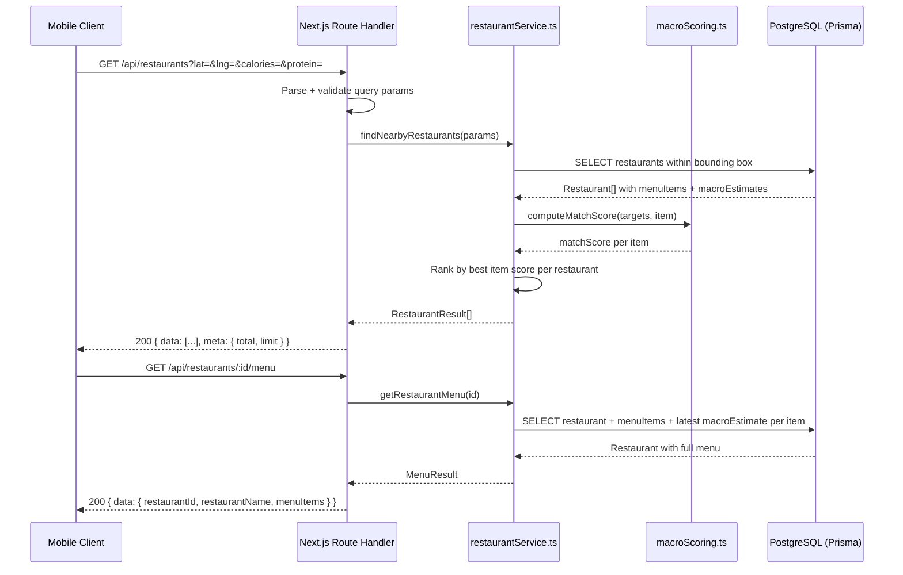
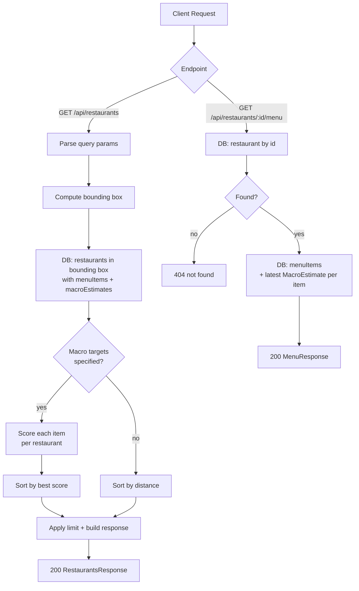

# API Endpoints Spec — S-12 / S-13

> **Status**: Approved
> **Author**: Backend Engineer
> **Date**: 2026-03-24
> **Sprint tasks**: S-12 (GET /api/restaurants), S-13 (GET /api/restaurants/[id]/menu)

---

## Overview

This spec covers the two read-only query endpoints that form the core of the
Fitsy API backend. Both endpoints serve preloaded data from PostgreSQL — no
external API calls happen at request time.

---

## Architecture



---

## S-12: GET /api/restaurants

**File**: `apps/api/app/api/restaurants/route.ts`

### Query Parameters

| Parameter    | Type    | Required | Default | Constraints           |
|-------------|---------|----------|---------|----------------------|
| `lat`        | float   | yes      | —       | valid latitude        |
| `lng`        | float   | yes      | —       | valid longitude       |
| `radius`     | float   | no       | 3       | miles, > 0            |
| `calories`   | int     | no       | —       | target calories       |
| `protein`    | float   | no       | —       | grams                 |
| `carbs`      | float   | no       | —       | grams                 |
| `fat`        | float   | no       | —       | grams                 |
| `cuisineType`| string  | no       | —       | exact match on tags   |
| `chainOnly`  | boolean | no       | —       | true/false filter     |
| `limit`      | int     | no       | 20      | max 50                |

### Bounding Box Distance Filter

PostGIS is a post-MVP upgrade. For MVP, use a lat/lng bounding box approximation:

```
latMin = lat - radius / 69
latMax = lat + radius / 69
lngMin = lng - radius / (69 * cos(lat * π/180))
lngMax = lng + radius / (69 * cos(lat * π/180))
```

After the DB query, compute exact Euclidean distance and filter out any
restaurants outside the true radius (handles bounding-box overshoot at corners).

### Macro Match Scoring

Scoring is defined in `apps/api/lib/macroScoring.ts`. The algorithm:

1. For each menu item with a `MacroEstimate`, compute weighted Euclidean
   distance across only the dimensions the user specified:

   ```
   score = sqrt(
     w_cal * ((cal - target_cal) / target_cal)^2 +
     w_p   * ((p   - target_p)   / target_p)^2   +
     w_c   * ((c   - target_c)   / target_c)^2   +
     w_f   * ((f   - target_f)   / target_f)^2
   )
   ```

   where all weights = 1.0 (equal weighting at MVP).

2. Restaurant score = the **lowest** item score across all its menu items.
3. If no macro targets are specified → sort by distance only.

### Response Shape

```json
{
  "data": [
    {
      "id": "cuid",
      "name": "Guerrilla Tacos",
      "address": "2000 E 7th St, Los Angeles, CA 90021",
      "lat": 34.0346,
      "lng": -118.2229,
      "distanceMiles": 0.8,
      "cuisineTags": ["mexican"],
      "chainFlag": false,
      "bestMatch": {
        "menuItemId": "cuid",
        "name": "Shrimp Tostada",
        "calories": 610,
        "proteinG": 38,
        "carbsG": 55,
        "fatG": 21,
        "confidence": "HIGH",
        "matchScore": 0.09
      }
    }
  ],
  "meta": { "total": 42, "limit": 20 }
}
```

`bestMatch` is `null` when no macro targets are specified or no
`MacroEstimate` exists for any menu item at the restaurant.

### Error Responses

| Status | Body | Trigger |
|--------|------|---------|
| 400    | `{ "error": "lat and lng are required" }` | Missing lat/lng |
| 400    | `{ "error": "Invalid lat/lng values" }` | Non-numeric lat/lng |
| 400    | `{ "error": "limit must be between 1 and 50" }` | limit out of range |
| 500    | `{ "error": "Internal server error" }` | Unhandled exception |

---

## S-13: GET /api/restaurants/[id]/menu

**File**: `apps/api/app/api/restaurants/[id]/menu/route.ts`

### Path Parameters

| Parameter | Type   | Required |
|-----------|--------|----------|
| `id`      | string | yes      |

### Response Shape

```json
{
  "data": {
    "restaurantId": "cuid",
    "restaurantName": "Guerrilla Tacos",
    "menuItems": [
      {
        "id": "cuid",
        "name": "Shrimp Tostada",
        "description": "gulf shrimp, avocado, chipotle aioli",
        "category": "Starters",
        "price": 14.00,
        "macros": {
          "calories": 610,
          "proteinG": 38,
          "carbsG": 55,
          "fatG": 21,
          "confidence": "HIGH",
          "hadPhoto": false,
          "estimatedAt": "2026-03-24T00:00:00Z"
        }
      }
    ]
  }
}
```

`macros` is `null` when no `MacroEstimate` exists for the item.

The response includes the **latest** `MacroEstimate` per item (ordered by
`estimatedAt DESC`).

### Error Responses

| Status | Body | Trigger |
|--------|------|---------|
| 404    | `{ "error": "Restaurant not found" }` | Unknown restaurant id |
| 500    | `{ "error": "Internal server error" }` | Unhandled exception |

---

## Data Flow Diagram



---

## Implementation Files

| File | Purpose |
|------|---------|
| `apps/api/lib/macroScoring.ts` | Pure scoring function — no DB, no I/O |
| `apps/api/lib/restaurantService.ts` | DB queries, orchestration |
| `apps/api/app/api/restaurants/route.ts` | Thin route handler (S-12) |
| `apps/api/app/api/restaurants/[id]/menu/route.ts` | Thin route handler (S-13) |
| `apps/api/lib/macroScoring.test.ts` | Unit tests (S-14) |
| `packages/shared/src/types/index.ts` | Shared response types |
