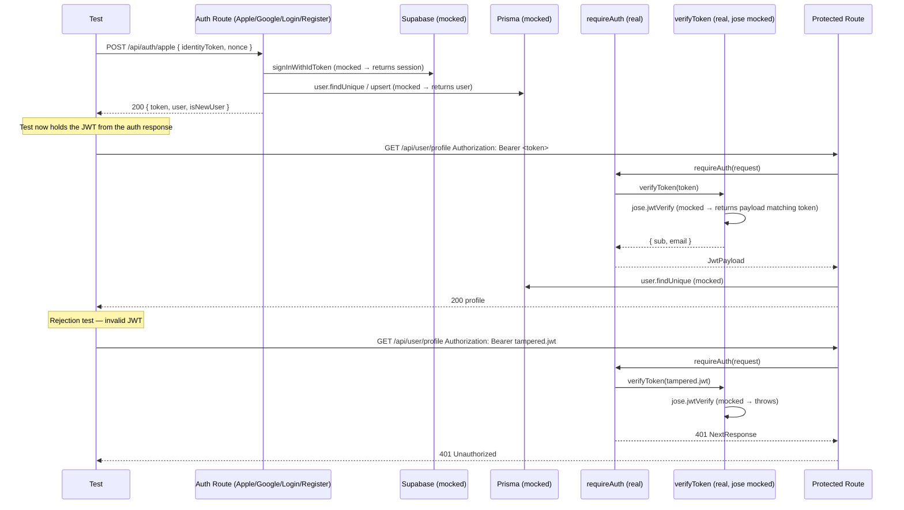

# Auth Integration Test Spec (S-93)

## Overview

This spec covers the integration test suite for all authentication flows
in the Fitsy API. The existing unit tests exercise individual route
handlers and helpers in isolation. This suite goes deeper — testing the
**full auth → JWT → protected route flow** without breaking the isolation
boundary between internal code and external services.

---

## Scope

### What these tests cover

1. **Apple Sign-In full flow** — `POST /api/auth/apple` → JWT issued → protected route accepts it
2. **Google Sign-In full flow** — `POST /api/auth/google` → JWT issued → protected route accepts it
3. **Email/password register + login flow** — `POST /api/auth/register` → `POST /api/auth/login` → JWT → protected route
4. **Protected route auth enforcement** — valid JWT grants access, missing/expired/malformed JWTs are rejected
5. **Cross-route JWT portability** — token returned from any auth endpoint works on all protected routes
6. **Account linking** — existing email user signing in via Apple/Google gets the same profile
7. **Edge cases** — no-email Apple accounts, DB errors during upsert, token issued for deleted user

### What these tests do NOT cover

- Live Supabase API calls (mocked at the `getSupabaseClient`/`getSupabaseAdmin` boundary)
- Live PostgreSQL queries (mocked at the `prisma` boundary via `@/lib/restaurantService`)
- `verifyToken` JWKS fetch (mocked at the `jose` boundary in `authService`)
- Mobile client behavior

---

## Test Approach

### Mock boundary

Per `CLAUDE.md`: **mock only external services, never internal code.**

| Layer | How it's tested |
|-------|-----------------|
| `POST /api/auth/apple` route | Direct handler call |
| `POST /api/auth/google` route | Direct handler call |
| `POST /api/auth/register` route | Direct handler call |
| `POST /api/auth/login` route | Direct handler call |
| `GET /api/user/profile` (protected) | Direct handler call |
| `GET /api/saved-items` (protected) | Direct handler call |
| `requireAuth` middleware | Real implementation (not mocked) |
| `verifyToken` / `authService` | Real implementation; `jose` mocked at module boundary |
| Supabase client/admin | Mocked via `jest.mock("@/lib/supabase", ...)` |
| Prisma | Mocked via `jest.mock("@/lib/restaurantService", ...)` |

The key distinction from existing unit tests:

- **Existing unit tests** mock `requireAuth` itself, testing the route handler in isolation.
- **These integration tests** let `requireAuth` run for real, mocking only `verifyToken` (and through it, `jose`). This verifies that the JWT emitted by auth routes is correctly threaded through the auth middleware chain.

---

## Test Flows



---

## Scenarios

### Group 1 — Apple Sign-In → Protected Route

| # | Scenario | Expected |
|---|----------|----------|
| 1.1 | New Apple user signs in; then calls GET /api/user/profile with the returned token | 200 on profile |
| 1.2 | Existing Apple user signs in (profile already exists); token works on GET /api/saved-items | 200 on saved-items |
| 1.3 | Apple token returned from sign-in is rejected after verifyToken throws (tampered) | 401 on profile |
| 1.4 | Apple sign-in succeeds but Apple account has no email | 400 from auth route |

### Group 2 — Google Sign-In → Protected Route

| # | Scenario | Expected |
|---|----------|----------|
| 2.1 | New Google user signs in; token works on GET /api/user/profile | 200 on profile |
| 2.2 | Google account-link path: email exists under old ID; linked user's token works on protected route | 200 on profile |
| 2.3 | Supabase returns error for Google token | 401 from auth route |

### Group 3 — Email/Password → Protected Route

| # | Scenario | Expected |
|---|----------|----------|
| 3.1 | Register new user; returned token works on GET /api/user/profile | 200 on profile |
| 3.2 | Login existing user; returned token works on GET /api/saved-items | 200 on saved-items |

### Group 4 — Protected Route JWT Enforcement

| # | Scenario | Expected |
|---|----------|----------|
| 4.1 | No Authorization header on protected route | 401 |
| 4.2 | Malformed header (not Bearer scheme) | 401 |
| 4.3 | Bearer token present but verifyToken throws (expired) | 401 |
| 4.4 | Bearer token present but verifyToken throws (wrong issuer) | 401 |
| 4.5 | Valid JWT, but user not found in DB (deleted account) | 404 |
| 4.6 | Valid JWT on GET /api/saved-items | 200 |
| 4.7 | Valid JWT on PATCH /api/user/profile | 200 |

---

## File Location

```
apps/api/app/api/auth/integration.test.ts
```

Placed alongside the existing auth route tests. Picked up by the
existing Jest config (`testMatch: ["**/*.test.ts"]`).

---

## Files Created/Modified

| File | Change |
|------|--------|
| `docs/engineering/backend/auth-e2e-test-spec.md` | This spec |
| `apps/api/app/api/auth/integration.test.ts` | New integration test suite |
