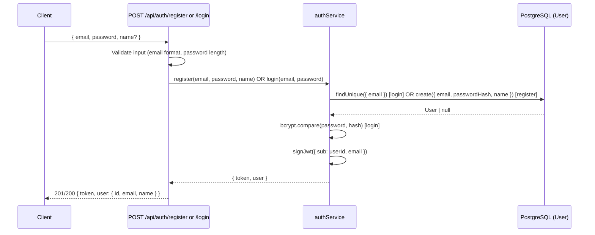

# Auth Backend Spec (S-22)

## Overview

JWT-based sign-up and sign-in endpoints for Fitsy users. No OAuth in Sprint 4 —
email + password only. Tokens are short-lived access tokens (no refresh token
in MVP; added in Roll Out if needed).

## Data Flow



## Endpoints

### POST /api/auth/register

Creates a new user account.

**Request body:**
```json
{ "email": "user@example.com", "password": "minimum8chars", "name": "Alice" }
```

**Success response (201):**
```json
{ "token": "<jwt>", "user": { "id": "clxxx", "email": "user@example.com", "name": "Alice" } }
```

**Error responses:**
| Status | Condition |
|--------|-----------|
| 400 | Missing fields, invalid email, password < 8 chars |
| 409 | Email already registered |
| 500 | Internal server error |

### POST /api/auth/login

Authenticates an existing user.

**Request body:**
```json
{ "email": "user@example.com", "password": "minimum8chars" }
```

**Success response (200):**
```json
{ "token": "<jwt>", "user": { "id": "clxxx", "email": "user@example.com", "name": "Alice" } }
```

**Error responses:**
| Status | Condition |
|--------|-----------|
| 400 | Missing fields |
| 401 | Invalid credentials |
| 500 | Internal server error |

## JWT Claims

```json
{
  "sub": "<userId>",
  "email": "user@example.com",
  "iat": 1234567890,
  "exp": 1234654290
}
```

- Expiry: 7 days
- Algorithm: HS256
- Secret: `JWT_SECRET` env var (required at startup)

## Security Notes

- Passwords hashed with bcrypt (12 rounds)
- Generic "Invalid credentials" for login failures — never reveal whether email exists
- No token stored server-side in MVP (stateless)
- Auth endpoints are in the **Danger Zone** per CLAUDE.md — any future changes require a spec

## Database Change

Adds `passwordHash String?` to the `User` model. Nullable to support
future OAuth users who won't have a password. Application enforces
non-null for email/password auth paths.

## Files Changed

| File | Change |
|------|--------|
| `prisma/schema.prisma` | Add `passwordHash String?` to User |
| `prisma/migrations/…` | New migration for passwordHash column |
| `apps/api/services/authService.ts` | New — JWT signing + bcrypt helpers |
| `apps/api/app/api/auth/register/route.ts` | New — POST /api/auth/register |
| `apps/api/app/api/auth/login/route.ts` | New — POST /api/auth/login |
| `packages/shared/src/types/index.ts` | Add AuthResponse, AuthUser types |
| `apps/api/package.json` | Add jose, bcryptjs devDep |
