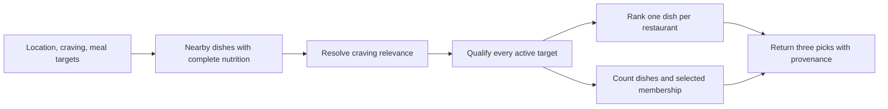

# Goal-matched guided preview

`GET /api/restaurants/preview?guided=1` returns up to three restaurant picks and separate coverage and meal-target counts.
It stays public, rate limited and fixed to a three-mile radius.
It never returns full menus or a cursor.

## Close-to-target policy

`within-20-percent-v1` means each active target dimension is between 80% and 120% of that target, inclusive.
Active dimensions are positive calories, protein, carbs or fat; zero and omitted targets are inactive.
Decimal SQL bounds avoid excluding an exact boundary because of binary float rounding.
All counted dishes must have all four nutrition values.
This describes closeness to meal targets, not guaranteed fitness results, nutritional completeness or medical suitability.
Published and estimated nutrition keep their existing provenance labels.
The aggregate includes estimates, so clients must disclose that caveat alongside numerical meal claims.

## Query relevance and ranking

Standard search and guided preview use the same craving rule.
First determine whether any dish name with complete nutrition matches the query within the search radius, before applying macro targets or other search filters.
When such dishes exist, only matching dish names qualify; a ramen-named restaurant cannot substitute unrelated chicken because its ramen misses the targets.
Otherwise, partial restaurant-name and cuisine matches remain available.
A partial `Chipotle` query opens that restaurant's options only when no nearby dish name matches that token; the exact full-name override remains available in either case.
An exact full restaurant name also selects its menu, including when other dish names match that phrase.
Matching uses PostgreSQL full-text search with the configured dictionary, normalized whitespace and case-insensitive exact restaurant-name matching.

Guided preview with active targets ranks only qualifying dishes.
Each restaurant contributes its lowest macro-distance dish, with menu-item ID breaking exact ties.
Restaurant order combines squared macro distance and the existing distance weight, with restaurant ID breaking ties.
Standard search retains its broader ranked result set for existing clients and server-side entitlement enforcement.
Entitled clients can send `goalMatched=1` to apply exactly the same target qualifier as guided preview, preserving their first-three ordering after purchase.
Unentitled standard-search callers retain legacy discovery and redaction, so qualification does not reveal membership of locked dishes.
With no active targets the flag has no effect.
Goal-matched pagination cursors bind the policy, flag, targets, normalized craving, location, radius and optional filters; stale or legacy cursors cannot be reused in that context.
Ordinary legacy searches continue to accept their existing cursors.

## Response contract

`meta.nearbyDishCount` remains the unfiltered local coverage count.
`meta.goalMatch` is optional in the shared decoder for older servers and is `null` when no targets are active.
With targets it contains `policy`, canonical `activeTargets`, `matchingDishCount`, `additionalDishCount` and `selectedItemMatches`.
This response contract retains `within-20-percent-v1`; a future qualification policy must require an explicit new client contract rather than silently changing the literal for installed clients.
Counts describe menu-item rows, not distinct recipes or restaurants.
The optional `selectedItemId` must be nonempty and at most 128 characters.
It affects count exclusion only and cannot pin a dish, change the three picks or expose an otherwise hidden menu item.

`additionalDishCount` is `matchingDishCount - 1` only when the selected item is one of the three visible qualifying picks in the current location, query and target context.
`selectedItemMatches` is a visible-pick check, not an oracle for arbitrary hidden item IDs.
Otherwise the count is unchanged and `selectedItemMatches` is false.
Clients must not unconditionally subtract one or reuse the coverage count as a target-match claim.
A short-lived cached response may derive the additional count only when the same location, query and target context is retained and the selected ID is verified in that response’s visible qualifying picks.
A zero matching count with positive coverage is a search/target empty state, not an unsupported area.

## Intentional public exposure

The launch product deliberately exposes exact query-and-target-qualified counts before subscription so the paywall can show a truthful number of additional meals.
This includes queries containing an exact restaurant name, which can narrow the qualifying set to that restaurant.
Repeated public queries with changing targets can infer restaurant-level aggregate nutrition/count distributions, including increasingly fine calorie and joint macro histograms.
Changing public queries can also expose different three-pick samples over time.
This is an accepted product tradeoff, not an anti-reconstruction or paid-data confidentiality guarantee.

The full-menu endpoint remains entitlement gated, and standard search redacts dish matches for unentitled callers.
An arbitrary hidden item ID receives no selected-item membership signal; only a dish already in the current visible sample can be subtracted from its count.
These controls limit direct responses, not inference from repeated public aggregate queries.
The public preview has a fixed three-mile radius, no cursor, at most three restaurant picks, and an in-memory per-instance IP burst limit of 30 requests per minute.
That limiter is not shared across serverless instances and must not be treated as an identity, anti-scraping or reconstruction-prevention boundary.

## Execution and verification

The guided response uses one SQL statement and one database snapshot for coverage, qualifying counts, selected membership and picks.
Nearby menu rows are materialized once, and the one-row craving context is explicitly materialized to prevent repeated aggregate scans.
Only three winners receive provenance lookups and cross the database boundary.
There is no response cache, result overfetch or per-result network request.

`apps/api/tests/db/goal-preview.db.test.ts` runs real handlers, JWT verification and Postgres for query, target, count, navigation-context and boundary regressions.
The existing search-route suite covers backward compatibility, aliases, invalid inputs, sample limits and rate limiting.
Run `apps/api/tests/db/goal-preview.performance.ts` with `tsx --tsconfig apps/api/tsconfig.json` against an explicitly local database for a reproducible 400-restaurant, 32,000-dish benchmark.
Set `GOAL_BENCH_RESTAURANTS=2000` for 160,000 dishes, with the standard query tested at its 50-mile maximum radius.
It verifies one application data query per call, exact counts and three returned picks, records separate connection health checks, and writes timing and `EXPLAIN ANALYZE` evidence under `.evidence/goal-preview/`.
Synthetic local measurements do not establish production latency.
