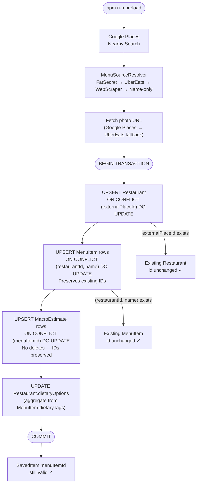

# Idempotent Preload Strategy

**Task:** S-101
**Owner:** Backend
**Status:** Draft
**Date:** 2026-04-08

---

## Problem

The preload pipeline is not safely re-runnable today. Running `npm run preload`
a second time over an already-populated database has silent data-loss side
effects that corrupt user data.

---

## Current Behavior (What Happens on Re-Run Today)

### `scripts/preload.ts` — destructive replace

The `persistItems` function unconditionally deletes all menu items and macro
estimates for a restaurant before inserting new ones:

```sql
DELETE FROM "MacroEstimate" WHERE "menuItemId" IN (
  SELECT "id" FROM "MenuItem" WHERE "restaurantId" = $restaurantId
);
DELETE FROM "MenuItem" WHERE "restaurantId" = $restaurantId;
-- then bulk INSERT fresh rows with new gen_random_uuid() ids
```

This means every re-run generates **new primary keys** for all `MenuItem` rows.
Any `SavedItem` row pointing to the old `menuItemId` gets its `menuItemId`
silently set to `NULL` (via `onDelete: SetNull` in the schema). The user's
saved item is orphaned — they lose the menu item reference but the save record
remains. The item stops appearing correctly in the saved-items screen.

Additionally:
- The `Restaurant` row is safely upserted via `ON CONFLICT (externalPlaceId)
  DO UPDATE` (correct).
- No unique constraint exists on `MenuItem(restaurantId, name)`, so there is no
  DB-level guard against duplicates if the delete-then-insert is interrupted
  mid-flight.

### `scripts/preload-rest.ts` — mostly safe, but inconsistent

Uses `getOrCreateMenuItem` (lookup by `restaurantId + name`, create if missing)
and `upsertMacroEstimate` (delete existing estimate then insert fresh). This
approach preserves `MenuItem` IDs across re-runs as long as item names don't
change. However:
- It inherits the same risk of `SavedItem` orphaning if macro estimates are
  ever fetched via `menuItemId` after a delete.
- It is inconsistent with `preload.ts`, so operators may choose the wrong
  script for a re-run.

### Targeted re-scrape — historical pattern

A previous `scripts/rescrape-thin.ts` used `findFirst` + `update` (or
`create`) without ever deleting — the safe pattern for targeted re-scraping
of specific restaurants. The script was removed when the macro denormalization
work consolidated all writes through `persistItemsInTx` / `persistHexBulkInTx`
to keep `MenuItem.calories/proteinG/carbsG/fatG` in sync with `MacroEstimate`.
Re-scraping today goes through the bulk path.

---

## Desired Behavior (Safe Re-Run Contract)

A re-run of the preload pipeline MUST:

1. **Preserve `MenuItem.id`** — existing `SavedItem` rows must never be
   orphaned by a preload re-run.
2. **Update in place** — if a restaurant and its items already exist, update
   their data (macros, descriptions, metadata) rather than deleting and
   reinserting.
3. **Add new items** — if a re-run discovers new menu items not previously
   stored, insert them.
4. **Remove stale items** — (optional, deferred) items that no longer appear
   in the scraped menu can be soft-deleted or archived. For now: leave
   them; the risk of stale items is lower than the risk of orphaning saves.
5. **Be safe to interrupt** — a partial run must leave the DB in a consistent
   state. No half-replaced restaurants.
6. **Be deterministic on input** — running with the same Google Places result
   and menu markdown should produce exactly the same DB state.

---

## Strategy

### 1. Add a unique constraint on `MenuItem(restaurantId, name)`

This is the cornerstone. Without it, there is no natural key for
`MenuItem` upsert — we cannot do `ON CONFLICT` without a unique constraint.

```sql
ALTER TABLE "MenuItem" ADD CONSTRAINT "MenuItem_restaurantId_name_key"
  UNIQUE ("restaurantId", name);
```

Prisma migration: add `@@unique([restaurantId, name])` to the `MenuItem` model.

### 2. Replace delete-then-insert with upsert in `preload.ts`

Replace the `persistItems` function's delete+bulk-insert pattern with a
proper upsert that preserves existing IDs.

**New approach for each item:**

```sql
INSERT INTO "MenuItem" (
  "id", "restaurantId", "name", "description", "category", "section",
  "price", "dietaryTags", "createdAt", "updatedAt"
)
VALUES (gen_random_uuid(), ...)
ON CONFLICT ("restaurantId", name) DO UPDATE SET
  "description" = EXCLUDED."description",
  "category"    = EXCLUDED."category",
  "section"     = EXCLUDED."section",
  "price"       = EXCLUDED."price",
  "dietaryTags" = EXCLUDED."dietaryTags",
  "updatedAt"   = now()
RETURNING "id"
```

This preserves the existing `id` for matched rows (PostgreSQL returns the
existing `id` on DO UPDATE), so `SavedItem.menuItemId` references remain valid.

**New approach for macro estimates:**

```sql
INSERT INTO "MacroEstimate" (
  "id", "menuItemId", "calories", "proteinG", "carbsG", "fatG",
  "confidence", "source", "hadPhoto", "estimatedAt"
)
VALUES (gen_random_uuid(), ...)
ON CONFLICT ("menuItemId") DO UPDATE SET
  "calories"    = EXCLUDED."calories",
  "proteinG"    = EXCLUDED."proteinG",
  "carbsG"      = EXCLUDED."carbsG",
  "fatG"        = EXCLUDED."fatG",
  "confidence"  = EXCLUDED."confidence",
  "source"      = EXCLUDED."source",
  "estimatedAt" = now()
```

This requires a unique constraint on `MacroEstimate(menuItemId)` — one estimate
per item (the latest). Currently there is no such constraint; the model supports
multiple estimates per item (see `MacroEstimate[]` relation). For the preload
pipeline specifically, we want exactly one active estimate per item. We add the
constraint on `menuItemId` and keep `ON CONFLICT DO UPDATE`.

> **Note:** A previous `reestimate-low.ts` script used `findFirst` + `update`
> to re-score low-confidence estimates. It was removed when macros were
> denormalized onto `MenuItem` — re-estimation now needs to update both
> tables atomically and should be reintroduced through the bulk persist path
> if needed.

### 3. Unique constraint on `MacroEstimate(menuItemId)`

```sql
ALTER TABLE "MacroEstimate" ADD CONSTRAINT "MacroEstimate_menuItemId_key"
  UNIQUE ("menuItemId");
```

Prisma: add `@@unique([menuItemId])` or `@unique` on the `menuItemId` field.

> **Caveat:** The schema currently allows multiple estimates per item (for
> future confidence-tier tracking or source comparison). Adding a unique
> constraint removes that flexibility. Decision: **accept the constraint** for
> now. If we later need multiple estimates per item, we can add a
> `(menuItemId, source)` composite unique or use a `latest` flag. This is an
> explicit architectural simplification — the preload pipeline only ever
> produces one estimate per item.

### 4. Wrap per-restaurant work in a transaction

Each restaurant's upsert + item upserts + dietary options update should run in
a single `prisma.$transaction(...)` call. If any step fails, the restaurant is
rolled back to its previous state (not left half-updated).

### 5. Remove the manual delete step from `preload-rest.ts`

The REST variant deletes MacroEstimate rows before upserting. With the new
unique constraint + `ON CONFLICT DO UPDATE`, this is unnecessary. Replace the
delete+insert pattern with upsert-only.

---

## Preload Flow (Updated)



---

## Schema Changes

### Migration: `add_preload_unique_constraints`

**File:** `prisma/migrations/20260408000000_add_preload_unique_constraints/migration.sql`

```sql
-- MenuItem: enforce one row per (restaurant, item name)
ALTER TABLE "MenuItem"
  ADD CONSTRAINT "MenuItem_restaurantId_name_key"
  UNIQUE ("restaurantId", name);

-- MacroEstimate: enforce one estimate per menu item
ALTER TABLE "MacroEstimate"
  ADD CONSTRAINT "MacroEstimate_menuItemId_key"
  UNIQUE ("menuItemId");
```

**Prisma schema changes:**

```prisma
model MenuItem {
  // ...existing fields...
  @@unique([restaurantId, name])  // ADD THIS
  @@index([restaurantId])
}

model MacroEstimate {
  menuItemId  String  @unique  // CHANGE from plain String to @unique
  // ...existing fields...
}
```

### Pre-migration check

Before applying the migration, verify there are no existing duplicates:

```sql
-- Check for duplicate MenuItems
SELECT "restaurantId", name, COUNT(*) AS cnt
FROM "MenuItem"
GROUP BY "restaurantId", name
HAVING COUNT(*) > 1;

-- Check for duplicate MacroEstimates per item
SELECT "menuItemId", COUNT(*) AS cnt
FROM "MacroEstimate"
GROUP BY "menuItemId"
HAVING COUNT(*) > 1;
```

If duplicates exist, run the dedup query before migrating:

```sql
-- Keep the most recent MacroEstimate per menuItemId, delete the rest
DELETE FROM "MacroEstimate"
WHERE id NOT IN (
  SELECT DISTINCT ON ("menuItemId") id
  FROM "MacroEstimate"
  ORDER BY "menuItemId", "estimatedAt" DESC
);

-- Keep the most recently created MenuItem per (restaurantId, name)
DELETE FROM "MenuItem"
WHERE id NOT IN (
  SELECT DISTINCT ON ("restaurantId", name) id
  FROM "MenuItem"
  ORDER BY "restaurantId", name, "createdAt" DESC
);
```

---

## Implementation Plan

| Step | What | File(s) |
|------|------|---------|
| 1 | Prisma schema — add `@@unique` constraints | `prisma/schema.prisma` |
| 2 | Migration — `add_preload_unique_constraints` | `prisma/migrations/` |
| 3 | Refactor `persistItems` in `preload.ts` — upsert instead of delete+insert | `scripts/preload.ts` |
| 4 | Wrap per-restaurant work in transaction | `scripts/preload.ts` |
| 5 | Refactor `upsertMacroEstimate` in `preload-rest.ts` — remove delete step | `scripts/preload-rest.ts` |
| 6 | (removed) `rescrape-thin.ts` deleted as part of macro denormalization — re-scrapes go through `persistItemsInTx` | — |
| 7 | Update `preload-runbook.md` — remove the "wipe and re-preload" truncate step | `docs/engineering/backend/preload-runbook.md` |

---

## Testing

The idempotency property should be testable without hitting live APIs. Add a
unit test in the backend test suite (`apps/api/` or `scripts/`) that:

1. Seeds a test restaurant + items + macros + saved item
2. Calls `persistItems` (or its extracted helper) with the same data
3. Asserts: `MenuItem.id` values are unchanged
4. Asserts: `SavedItem.menuItemId` still points to a valid item
5. Asserts: macro values are updated (not duplicated)

---

## Non-Goals

- Soft-delete / archival of stale menu items — out of scope for this sprint.
  Stale items (present in DB but no longer on the menu) are lower risk than
  broken saved-item references. Deferred to a future sprint.
- Multi-estimate-per-item history — not needed for MVP. The `@unique` on
  `MacroEstimate(menuItemId)` explicitly removes this option for now.
- (removed) `reestimate-low.ts` was deleted with the macro denormalization work; re-introducing LLM re-scoring is deferred and must update both `MenuItem` and `MacroEstimate` atomically.
