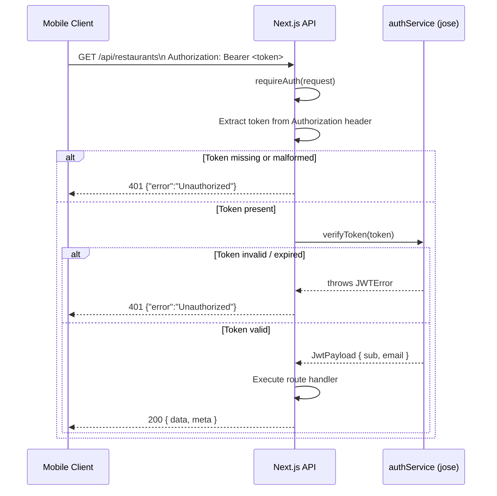

# JWT Middleware — Restaurant Routes

**Sprint**: S-57
**Author**: Backend Engineer
**Date**: 2026-03-25
**Status**: Approved

---

## Problem

`GET /api/restaurants` and `GET /api/restaurants/[id]/menu` are currently
unauthenticated. Any caller — including unauthenticated web scrapers — can
query the preloaded restaurant and menu data. These routes must require a
valid JWT Bearer token to enforce that only registered Fitsy users can access
the data.

---

## Solution

Add a `requireAuth` helper in `apps/api/lib/auth.ts` that extracts and
validates the Bearer token from the `Authorization` header. Apply it at the
top of both restaurant route handlers. Return `401 {"error": "Unauthorized"}`
on missing or invalid tokens.

---

## Auth Flow



---

## Implementation Details

### New file: `apps/api/lib/auth.ts`

Exports a single function:

```ts
export async function requireAuth(
  request: NextRequest,
): Promise<{ sub: string; email: string } | NextResponse>
```

- Reads the `Authorization` header.
- Expects the format `Bearer <token>`.
- Calls `verifyToken` from `@/services/authService`.
- Returns the decoded payload on success.
- Returns a `NextResponse` with status 401 on any failure.

Callers distinguish the two by checking `instanceof NextResponse`.

### Modified files

| File | Change |
|------|--------|
| `apps/api/app/api/restaurants/route.ts` | Call `requireAuth`; return early if 401 |
| `apps/api/app/api/restaurants/[id]/menu/route.ts` | Call `requireAuth`; return early if 401 |

### Error response

```json
{ "error": "Unauthorized" }
```

HTTP status: `401`

---

## Tests

New test files:

| File | Scenarios |
|------|-----------|
| `apps/api/lib/auth.test.ts` | missing header, malformed header (no Bearer), invalid token, valid token |
| `apps/api/app/api/restaurants/route.test.ts` | 401 without token, 401 with bad token, 200 with valid token |
| `apps/api/app/api/restaurants/[id]/menu/route.test.ts` | 401 without token, 401 with bad token, 200 with valid token, 404 for unknown restaurant |

---

## Security Notes

- Token verification delegates entirely to `verifyToken` in `authService`,
  which uses `jose`'s `jwtVerify` with HS256 + `JWT_SECRET`.
- No token details are leaked in error responses.
- The helper is intentionally minimal — no role-based logic yet.
