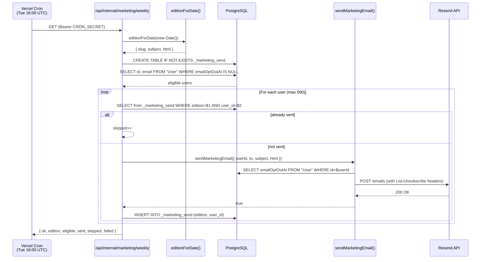

# Marketing Emails

## Overview

Fitsy sends two categories of marketing email: a one-time city-launch blast and a recurring weekly editorial.
Both share the same brand shell, compliance pipeline, and send primitive.
All compliance requirements (suppression check, unsubscribe URL, postal address, RFC 8058 one-click headers) are enforced inside `sendMarketingEmail` — callers only supply `userId`, `to`, `subject`, and `html`.

---

## Architecture



---

## Brand Shell

`brandEmailShell()` in `apps/api/lib/emailTemplates.ts` generates email-safe HTML with inline styles only.
It renders correctly in Gmail, Apple Mail, and Outlook.
Visual spec:

- Page background: cream `#FDFBF7`
- Card: white `#FFFFFF`, 1px `#E8E2D8` border, 16px border-radius, 36px padding, max-width 560px
- Wordmark: "fitsy." in Georgia serif, 26px, `#1B3A26`
- Headings: Georgia serif, `#1B3A26`
- Body text: `-apple-system/Segoe UI/Roboto` sans, 15px/1.65, `#3A4F41`
- Optional hidden preheader span (Gmail preview text)
- Optional CTA button: `#1B3A26` background, `#FDFBF7` text, 32px border-radius

The shell does not include unsubscribe footer or postal address.
`sendMarketingEmail` appends the CAN-SPAM-required footer before sending.

---

## Launch Email

`launchEmailContent(city: string | null)` in `apps/api/lib/emailTemplates.ts` generates the city-launch notification.
It is re-exported from `apps/api/lib/marketingEmail.ts` for backward compatibility.
Triggered via `POST /api/internal/waitlist/notify` — see [launch-waitlist.md](launch-waitlist.md) for the full flow.

Subject: `Fitsy just launched in <city>` (falls back to "in your city" when city is null).
CTA: "Open Fitsy" → `https://fitsy.org`.

---

## Weekly Editorial

### Edition Rotation

Eight editions are defined in `WEEKLY_EDITIONS` in `apps/api/lib/emailTemplates.ts`.
`editionForDate(date)` picks deterministically:

```
weekIndex = Math.floor((date.getTime() - Date.UTC(2026, 0, 5)) / (7 * 86400e3))
idx = ((weekIndex % 8) + 8) % 8
```

Week 0 begins Monday, January 5, 2026.
The rotation repeats every 8 weeks indefinitely.

### Current Editions

| # | Slug | Subject |
|---|------|---------|
| 0 | `restaurant-calorie-gap` | Why restaurant calories are almost always higher than you think |
| 1 | `protein-first-ordering` | The protein-anchor method for ordering out |
| 2 | `sauce-math` | Where 300–500 hidden calories actually live |
| 3 | `menu-language` | A short glossary of menu words that matter |
| 4 | `cut-vs-bulk-dining` | How eating out changes when you're cutting vs. building |
| 5 | `healthy-halo` | The "healthy bowl" trap — why salads often beat burgers |
| 6 | `chain-vs-indie` | Chains publish macros. Indie spots don't. Here's how to handle both. |
| 7 | `consistency-not-perfection` | One restaurant meal never ruins a week. Here's the math. |

### Adding an Edition

1. Add a new object to `WEEKLY_EDITIONS` with a unique `slug`, `subject`, and `build()` function.
2. Update the rotation modulus (`% 8` → `% N`) in `editionForDate`.
3. Editions use `brandEmailShell()` for consistent rendering.
4. Body copy should be 180–280 words: editorial-first (genuine fitness/restaurant education), with Fitsy mentioned briefly at the end.

---

## Weekly Cron Route

**File:** `apps/api/app/api/internal/marketing/weekly/route.ts`
**Schedule:** every Tuesday at 16:00 UTC (`0 16 * * 2` in `vercel.json`)
**Auth:** `CRON_SECRET` Bearer header (same pattern as all internal cron routes)

### Send cap

The route processes at most 500 sends per invocation.
The dedup table ensures subsequent runs (next week's cron, or a manual retry) pick up where the previous one left off.
This bounds Vercel function wall-time while guaranteeing eventual delivery to all eligible users.

### Dedup table

`_marketing_send` is a self-creating PostgreSQL table (created with `CREATE TABLE IF NOT EXISTS`, no Prisma migration needed):

```sql
CREATE TABLE IF NOT EXISTS "_marketing_send" (
  edition  text        NOT NULL,
  user_id  text        NOT NULL,
  sent_at  timestamptz DEFAULT now(),
  PRIMARY KEY (edition, user_id)
);
```

A dedup row is written only after `sendMarketingEmail` returns `true`.
A failed or transient-error send is never recorded, so the next run retries it.

### Dry run

`GET /api/internal/marketing/weekly?dryRun=1` returns `{ ok, dryRun: true, edition, eligible, alreadySent }` without sending any email.
Useful for verifying audience size and edition selection before a live run.

### Response

```json
{
  "ok": true,
  "edition": "restaurant-calorie-gap",
  "eligible": 1200,
  "sent": 500,
  "skipped": 0,
  "failed": 3
}
```

---

## Audience Definition

Eligible users are those with `emailOptOutAt IS NULL` in the `User` table.
Because `emailOptOutAt` was added via migration after the shared Prisma client was generated, all queries touching it use `prisma.$queryRawUnsafe` with explicit row types — never the Prisma typed client.

---

## Compliance

All compliance requirements are enforced inside `sendMarketingEmail` in `apps/api/lib/marketingEmail.ts`.
Callers do not need to handle any of the following:

- **Suppression check:** `sendMarketingEmail` re-checks `emailOptOutAt` per-send before calling Resend, even if the audience query ran seconds earlier.
- **Unsubscribe URL:** HMAC-signed one-click unsubscribe URL appended to every email footer.
- **Postal address:** `FITSY_POSTAL_ADDRESS` env var appended to every email footer.
- **RFC 8058 one-click headers:** `List-Unsubscribe` and `List-Unsubscribe-Post` headers set on every Resend API call.
- **CAN-SPAM footer:** "You're receiving this because you have a Fitsy account and joined our launch list." appended to every send.

`sendMarketingEmail` is fail-closed: if any compliance env var is missing or the suppression check fails, it returns `false` without sending.

---

## Related Docs

- [launch-waitlist.md](launch-waitlist.md) — waitlist signup, notify route, and city-launch blast flow
- [perf-and-security-handoff-2026-04-25.md](perf-and-security-handoff-2026-04-25.md) — security context
