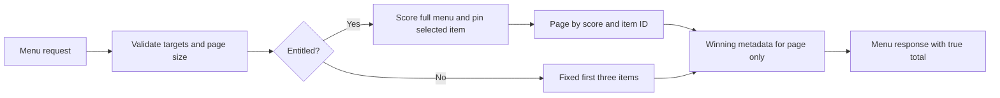

# Complete, consistent restaurant menus

An entitled caller must be able to reach every item in a restaurant's menu.
Rank the complete menu using the search formula before taking a page, and
read the same denormalized macros and winning-source metadata as search.

- Default page size stays 200 for existing clients. `pageSize=1..250` lets new
  clients request smaller pages and follow `nextCursor` until it is null.
- `calories`, `protein`/`proteinG`, `carbs`/`carbsG`, and `fat`/`fatG` use the
  shared parser. Zero is inactive; invalid/conflicting values return 400.
- A cursor binds to its restaurant, normalized targets and selected item.
  Its score stays PostgreSQL text to avoid float rounding through Prisma.
- `selectedItemId` pins a search result before score ordering. It does not
  add an item from a different restaurant or alter that item's nutrition.
- Locked responses ignore selection, target ordering, cursor and page size;
  they always return the same three items with no continuation cursor.
- `totalItemCount` reports the whole menu, including on an empty last page.
  Counts and page reads are separate statements; concurrent menu edits may
  change a total between requests. Menu refresh is outside this release.

The native route integration uses real Postgres, locally signed JWTs and the
real entitlement check. It tests 251-item menus (the best dish sorts past the
old alphabetical cap), exact ID traversal through tied scores, cross-context
cursor rejection, selected-item continuation, invalid input, zero targets,
expired subscriptions, missing restaurants and non-enumerable free samples.
Local registry checks, production build and preview/prod smoke must pass.
No schema migration, menu ingestion or nutrition-data update is included.
