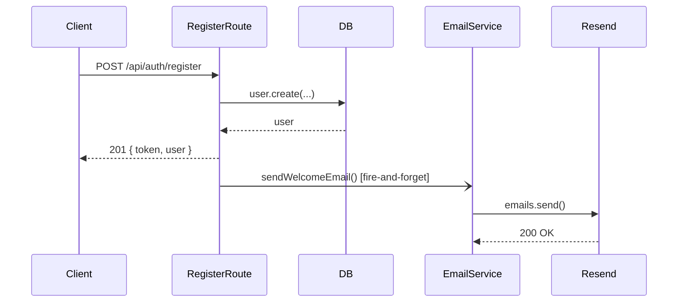

# User Onboarding Email — Backend Spec (S-37b)

## Goal

Send a welcome email when a user registers for the first time.
The email reinforces the value prop and links them to set up macro targets.

## Trigger

`POST /api/auth/register` — immediately after a new user is created and
persisted to the database.

## Email Content

- **Subject**: "Welcome to Fitsy 🥗 — let's find food that fits"
- **To**: the registered user's email address
- **Body** (plain text + HTML):
  - "You're in! Fitsy finds restaurants near you with meals that match
    your macros."
  - CTA button: "Set up your macro targets" → links to the app (deep
    link or web URL TBD; use `EXPO_PUBLIC_APP_URL` env var with fallback
    to `https://fitsy.app`)
  - Footer: "This is a transactional email. To stop receiving emails,
    delete your account."

## Implementation

### Transport: Resend

Use the [Resend](https://resend.com) API (free tier: 3,000 emails/month).
API key stored as `RESEND_API_KEY` env var.

**Why Resend:** Zero-config DNS setup, generous free tier for MVP, simple
REST API, TypeScript SDK.

### Service: `apps/api/services/email.ts`

```typescript
export async function sendWelcomeEmail(to: string, name?: string): Promise<void>
```

- Calls Resend's `emails.send()` with the welcome template.
- Fires and forgets — does NOT await in the register route (avoids
  adding latency to auth response; delivery failure is non-fatal).
- Logs errors to console.error (picked up by Vercel logs).

### Integration: register route

In `apps/api/app/api/auth/register/route.ts`, after `db.user.create(...)`:
```typescript
sendWelcomeEmail(user.email, user.name ?? undefined).catch(console.error);
```

### Environment variable

| Variable | Purpose | Source |
|----------|---------|--------|
| `RESEND_API_KEY` | Email delivery | resend.com dashboard |
| `APP_URL` | CTA deep-link base URL | Vercel env (default: `https://fitsy.app`) |

## Architecture diagram



## Testing

- Unit test: mock Resend client, assert `emails.send` called with correct
  `to`, `subject` after `POST /api/auth/register` with a new email.
- Skip in unit tests if `RESEND_API_KEY` is absent (integration only).
- Do NOT test email delivery in unit tests — mock the service wrapper.

## Acceptance Criteria

- [ ] `POST /api/auth/register` triggers a welcome email (assert in tests)
- [ ] Email delivery failure does not cause register to return 500
- [ ] `RESEND_API_KEY` absent: email silently skipped, register succeeds
- [ ] `sendWelcomeEmail` is in `apps/api/services/email.ts`
