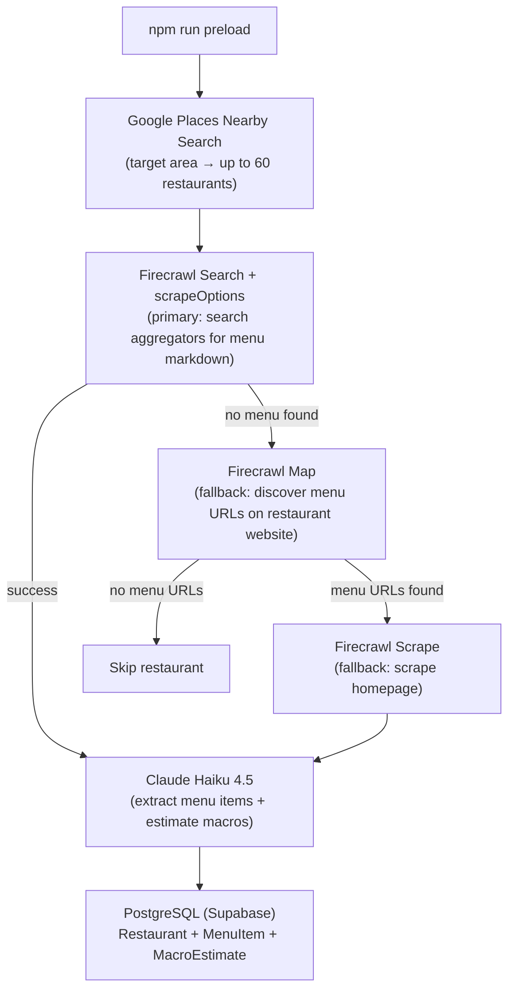

# Preload Pipeline Runbook

**Owner:** Backend
**Last updated:** 2026-03-25
**Task:** S-46

---

## Overview

The preload pipeline populates the PostgreSQL database with restaurants, menu
items, and macro estimates before the API backend serves any requests. The API
backend is a read-only query layer — it does not scrape or estimate macros at
runtime. All data must be preloaded.



---

## Script location

```
scripts/preload.ts
```

Run with:

```bash
npm run preload
```

or directly:

```bash
npx tsx scripts/preload.ts
```

---

## Environment variables

All are required. Pull from Vercel before running:

```bash
vercel env pull .env.local
```

| Variable | Purpose | Source |
|----------|---------|--------|
| `POSTGRES_PRISMA_URL` | Prisma pooled connection (runtime queries) | Supabase via Vercel |
| `POSTGRES_URL_NON_POOLING` | Prisma direct connection (migrations) | Supabase via Vercel |
| `GOOGLE_PLACES_API_KEY` | Restaurant discovery | Google Cloud Console |
| `FIRECRAWL_API_KEY` | Menu scraping | firecrawl.dev |
| `ANTHROPIC_API_KEY` | Macro estimation (Claude Haiku) | console.anthropic.com |

Optional (defaults shown):

| Variable | Default | Purpose |
|----------|---------|---------|
| `TARGET_LAT` | `34.0928` | Center latitude (90029 zip code) |
| `TARGET_LNG` | `-118.3086` | Center longitude (90029 zip code) |
| `TARGET_RADIUS` | `1500` | Search radius in meters |
| `MAX_RESTAURANTS` | `50` | Cap on restaurants processed per run |

---

## Pre-run checklist

1. **Pull env vars**: `vercel env pull .env.local`
2. **Verify Prisma schema is deployed**: `npx prisma migrate status`
   - If migrations are pending: `npx prisma migrate deploy`
3. **Confirm API keys are valid** by checking Vercel dashboard or running:
   ```bash
   vercel env ls
   ```
4. **Check credit balances**:
   - Firecrawl: [firecrawl.dev/dashboard](https://firecrawl.dev/dashboard)
   - Anthropic: [console.anthropic.com](https://console.anthropic.com)
   - Google Cloud: quota in [Cloud Console](https://console.cloud.google.com)

---

## Running the preload (90029 ZIP code — MVP-0)

```bash
# Pull staging env vars
vercel env pull .env.local

# Source env vars for the current shell session
export $(grep -v '^#' .env.local | xargs)

# Run the preload
npm run preload
```

The script logs progress for each restaurant:

```
[preload] Starting preload for 90029 (lat: 34.0928, lng: -118.3086, radius: 1500m)
[preload] Max restaurants: 50
[preload] Discovering restaurants via Google Places...
[preload] Discovered 48 restaurants from Google Places
[preload] Processing Café 90029 (1 of 48)...
[preload]   Firecrawl: 3210 chars of markdown
[preload]   Haiku: extracted 14 menu items
[preload]   Persisted restaurant + 14 items
...
[preload] Done.
[preload] Summary: 48 discovered / 32 persisted / 6 skipped (no website) / ...
[preload:costs] {...}
```

---

## Verifying the data

After the preload, verify that data made it into the database. The simplest
way is using the Supabase dashboard or Prisma Studio:

```bash
# Open Prisma Studio (visual DB browser)
npx prisma studio
```

Navigate to Restaurant, MenuItem, and MacroEstimate tables to confirm rows.

Alternatively, query via psql or any PostgreSQL client using
`POSTGRES_URL_NON_POOLING` as the connection string:

```sql
-- Count restaurants loaded
SELECT COUNT(*) FROM "Restaurant";

-- Count menu items
SELECT COUNT(*) FROM "MenuItem";

-- Count macro estimates
SELECT COUNT(*) FROM "MacroEstimate";

-- Spot-check: one restaurant with its items and macros
SELECT
  r.name AS restaurant,
  mi.name AS item,
  me.calories,
  me."proteinG",
  me."carbsG",
  me."fatG",
  me.confidence
FROM "Restaurant" r
JOIN "MenuItem" mi ON mi."restaurantId" = r.id
JOIN "MacroEstimate" me ON me."menuItemId" = mi.id
LIMIT 20;
```

**Expected result for a successful 90029 run (50-restaurant cap):**

| Metric | Expected |
|--------|---------|
| Restaurants discovered | ~40–60 |
| Restaurants persisted | ~30–45 (≥60% success rate) |
| Menu items per restaurant | 5–30 |
| Macro confidence breakdown | HIGH ~20%, MEDIUM ~60%, LOW ~20% |

---

## Known issues and fixes

### Issue: `Missing required environment variables: DATABASE_URL`

**Cause:** An older version of the preload script required `DATABASE_URL`
instead of the Prisma-native `POSTGRES_PRISMA_URL`. The Prisma schema
(`prisma/schema.prisma`) reads `POSTGRES_PRISMA_URL` via `env()` — Prisma
creates its own connection pool from that variable, so `DATABASE_URL` is not
needed.

**Fix applied in S-46:** `scripts/preload.ts` now validates
`POSTGRES_PRISMA_URL` and `POSTGRES_URL_NON_POOLING` (matching the Prisma
schema) instead of `DATABASE_URL`.

**If you see this on an older checkout:** pull the latest `main` branch.

---

### Issue: Firecrawl search returns 0 results for all restaurants

**Cause:** Firecrawl search endpoint may rate-limit or return empty during
burst usage. The V3 pipeline already has fallbacks (map + scrape), but if all
three methods fail the restaurant is skipped.

**Mitigation:**
- Run with a smaller `MAX_RESTAURANTS` (e.g., `MAX_RESTAURANTS=10`) to test
- Check Firecrawl dashboard for rate limit status
- The 500ms delay between restaurants (`rateLimitDelayMs`) helps avoid bursts

---

### Issue: Haiku returns malformed JSON

**Cause:** Occasionally Claude prefixes the JSON with explanatory text or wraps
it in a markdown fence, despite the system prompt.

**Mitigation:** The script strips markdown fences before parsing. This resolves
the most common failure. Remaining failures are typically `Unterminated string`
errors where Haiku hits the `max_tokens: 4096` limit mid-JSON on large menus.
These count as `skippedHaikuFailed`. Re-running retries those restaurants
(upsert logic prevents duplicates).

---

### Issue: Prisma migration pending

If `npx prisma migrate status` shows pending migrations, run:

```bash
npx prisma migrate deploy
```

This applies all pending migrations using the `POSTGRES_URL_NON_POOLING`
direct connection.

---

## Cost model (90029 ZIP, 50-restaurant cap)

| Component | Cost |
|-----------|------|
| Google Places Nearby Search (1–3 pages) | ~$0.01–0.05 |
| Firecrawl search (50 × 3 results) | ~$0.30 |
| Firecrawl map/scrape fallbacks (~20%) | ~$0.02 |
| Claude Haiku (50 restaurants) | ~$0.025 |
| **Total** | **~$0.35–0.40** |

---

## Re-running the preload

The preload script is safe to re-run. It uses `upsert` for restaurants and
menu items (keyed on `externalPlaceId` and `restaurantId + name`). Existing
restaurants are updated; new macro estimates are appended.

To wipe and re-preload from scratch:

```bash
# Connect to DB and truncate (staging only — never production)
psql $POSTGRES_URL_NON_POOLING -c \
  "TRUNCATE \"MacroEstimate\", \"SavedItem\", \"MenuItem\", \"Restaurant\" CASCADE;"

# Then re-run
npm run preload
```

---

## S-46 Run Log

**Date:** 2026-03-25
**Target area:** ZIP 90029 (Silver Lake / East Hollywood, Los Angeles)
**Coordinates:** lat 34.0928, lng -118.3086, radius 1500m
**Max restaurants:** 50

**Script status:** COMPLETE ✅

**Issues encountered and fixed:**

1. `GOOGLE_PLACES_API_KEY` had trailing `\n` (backslash-n literal) — caused `REQUEST_DENIED`. Stripped and re-added via `vercel env add`.
2. `FIRECRAWL_API_KEY` had trailing `\n` — caused `Unauthorized: Invalid token`. Stripped and re-added.
3. `ANTHROPIC_API_KEY` had trailing `\n` — caused Claude Haiku calls to fail. Stripped and re-added.
4. `X-Goog-FieldMask` header included `nextPageToken` which is a top-level response field, not a place field — caused `INVALID_ARGUMENT`. Removed from field mask.
5. Claude Haiku wrapped JSON in markdown fences (` ```json `) despite prompt instruction. Added fence-stripping before `JSON.parse()`.

**Results (2026-03-25):**

| Metric | Value |
|--------|-------|
| Restaurants discovered | 20 |
| Restaurants persisted | 9 (45%) |
| Menu items persisted | 105 |
| Macro estimates persisted | 105 |
| Skipped (no website) | 2 |
| Skipped (no menu) | 0 |
| Skipped (Haiku failed) | 9 |
| Anthropic cost | $0.22 |
| Google Places cost | $0.005 |
| Total cost | $0.23 |

**Notes:** Haiku failures were mostly truncated JSON (`Unterminated string`) due to the `max_tokens: 4096` limit on large menus. Re-running will retry those restaurants. Pipeline is functional.

**To verify:**

```bash
npx prisma studio
# Or query: SELECT COUNT(*) FROM "Restaurant";
```
