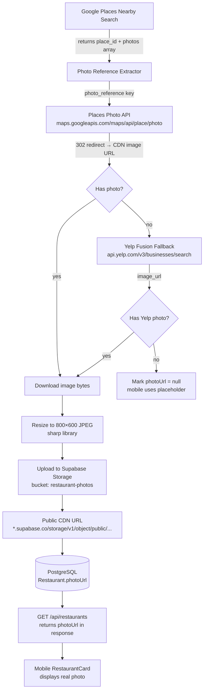

# Restaurant Image Pipeline

**Status:** Draft  
**Author:** dgmolla  
**Created:** 2026-04-03  
**Implements:** Image sourcing, storage, and serving for restaurant cards and detail screens

---

## Problem

The mobile app has `photoUrl` plumbed end-to-end (schema → API → UI), but every restaurant in the database has `photoUrl = null`. Cards and detail screens fall back to generic Unsplash placeholder images. Real photos dramatically increase perceived quality and trust in search results.

---

## Goals

1. Populate `Restaurant.photoUrl` for every preloaded restaurant.
2. Store images in a durable, CDN-backed bucket (not third-party URLs that expire).
3. Add zero runtime cost — images served from storage, no external API calls per request.
4. Keep preload cost under $5 for 500 restaurants.

---

## Non-Goals

- Per-menu-item food photos (Phase 3 — macro confidence improvements).
- User-uploaded photos.
- Real-time photo refresh (photos are refreshed on next preload run, not continuously).

---

## Architecture



---

## Data Sources

### Primary: Google Places Photo API

Google Places Nearby Search already returns a `photos` array on each place result. Each entry has a `photo_reference` string. One additional HTTP call fetches the actual image.

**Endpoint:**
```
GET https://maps.googleapis.com/maps/api/place/photo
  ?maxwidth=800
  &photo_reference=<ref>
  &key=<GOOGLE_PLACES_API_KEY>
```

The response is a `302` redirect to a temporary CDN URL (valid ~24h). We follow the redirect, download the bytes, and store them ourselves.

**Cost:** $0.007 per photo (Places Photo API SKU). For 500 restaurants: **~$3.50**.

**Availability:** ~85% of places in Google Places have at least one photo. Coverage is higher for chains, lower for small independents.

### Fallback: Yelp Fusion Business Search

For restaurants where Google Places returns no photos (or `photos` array is empty), query Yelp Fusion. The `image_url` field in the Business object is a stable JPEG URL.

**Endpoint:**
```
GET https://api.yelp.com/v3/businesses/search
  ?term=<name>
  &location=<address>
  &limit=1
```

**Cost:** Free tier covers 500 req/day. No cost for MVP.

**Availability:** ~70% of restaurants in Yelp have a photo. Combined with Google, expected coverage reaches ~95%.

### No-source Fallback

If neither source has a photo, `photoUrl` stays `null`. The mobile app already handles this gracefully with deterministic Unsplash placeholders. We do not store placeholder URLs in the database — `null` is the correct signal.

---

## Storage: Supabase Storage

We already use Supabase for the database. Supabase Storage (S3-compatible, served via global CDN) is the natural fit — one vendor, one auth model, no additional infrastructure.

**Bucket:** `restaurant-photos` (public, read-only)  
**Path convention:** `<place_id>.jpg` (e.g., `ChIJN1t_tDeuEmsRUsoyG83frY4.jpg`)  
**Format:** JPEG, max 800×600, quality 80 (target ~60–100 KB per image)

**Costs (Supabase free tier):**
- Storage: 1 GB free → 500 restaurants × 100 KB = 50 MB, well within free tier
- Bandwidth: 2 GB/month free → ample for MVP

**URL pattern:**
```
https://<project-ref>.supabase.co/storage/v1/object/public/restaurant-photos/<place_id>.jpg
```

---

## Schema Changes

`Restaurant.photoUrl` already exists as `String?`. No migration required.

Add `photoSource` to track provenance and enable differential refresh:

```prisma
model Restaurant {
  // ... existing fields ...
  photoUrl     String?
  photoSource  String?   // "google_places" | "yelp" | null
}
```

Migration file: `prisma/migrations/<ts>_add_restaurant_photo_source/migration.sql`

```sql
ALTER TABLE "Restaurant" ADD COLUMN "photoSource" TEXT;
```

---

## Preload Pipeline Changes

**File:** `scripts/preload.ts`

Add a new Stage 4 after macro estimation. The pipeline becomes:

| Stage | What | API Used |
|-------|------|----------|
| 1 | Restaurant discovery | Google Places Nearby Search |
| 2 | Menu scraping | Firecrawl |
| 3 | Macro estimation | Claude Haiku |
| **4** | **Photo fetch + upload** | **Google Places Photo → Supabase Storage** |
| **4b** | **Yelp fallback** | **Yelp Fusion** |

### Stage 4 Logic

```typescript
async function fetchAndStorePhoto(
  restaurant: { externalPlaceId: string; name: string; address: string },
  photoReference: string | null,
): Promise<{ url: string; source: string } | null> {
  // 1. Try Google Places Photo
  if (photoReference) {
    const imageBuffer = await fetchGooglePlacesPhoto(photoReference);
    if (imageBuffer) {
      const resized = await resizeImage(imageBuffer, 800, 600);
      const url = await uploadToSupabase(restaurant.externalPlaceId, resized);
      return { url, source: "google_places" };
    }
  }

  // 2. Yelp fallback
  const yelpUrl = await fetchYelpImageUrl(restaurant.name, restaurant.address);
  if (yelpUrl) {
    const imageBuffer = await downloadUrl(yelpUrl);
    const resized = await resizeImage(imageBuffer, 800, 600);
    const url = await uploadToSupabase(restaurant.externalPlaceId, resized);
    return { url, source: "yelp" };
  }

  return null;
}
```

### Idempotency

Before fetching, check if `photoUrl` is already set and the file exists in Supabase Storage. Skip re-fetch if both are true. This makes re-runs safe and cheap.

### Concurrency

Process photos in batches of 5 (to respect Google Places rate limits and avoid hammering Supabase). Each batch is awaited before starting the next.

---

## New Environment Variables

| Variable | Purpose | Where to Get |
|----------|---------|--------------|
| `YELP_API_KEY` | Yelp Fusion Business Search | yelp.com/developers |
| `SUPABASE_SERVICE_ROLE_KEY` | Write access to Supabase Storage | Supabase dashboard → Settings → API |
| `SUPABASE_URL` | Supabase project URL | Already in use via Vercel |

Add to Vercel:
```bash
vercel env add YELP_API_KEY prod
vercel env add SUPABASE_SERVICE_ROLE_KEY prod
```

---

## New Dependencies

```bash
# Image resizing (server-side, preload script only)
npm install sharp --save-dev

# Supabase JS client (already installed in apps/api — import in scripts/)
# @supabase/supabase-js already present
```

`sharp` is a dev dependency because it's only used in the preload script, not the API server.

---

## New Service Wrapper

**File:** `apps/api/services/yelpService.ts`

```typescript
interface YelpBusiness {
  name: string;
  image_url: string;
  // ...
}

export async function searchYelpBusiness(
  name: string,
  address: string,
): Promise<string | null> {
  // Returns image_url or null
}
```

Following the existing convention — all external API calls through `apps/api/services/`.

---

## Cost Summary

| Source | Unit Cost | Expected Volume | Total |
|--------|-----------|-----------------|-------|
| Google Places Photo API | $0.007/photo | 425 photos (85% hit rate) | ~$3.00 |
| Yelp Fusion | Free | 75 fallbacks (15% of 500) | $0 |
| Supabase Storage | Free (50 MB << 1 GB) | 500 images × 100 KB | $0 |
| Image bandwidth (CDN) | Free (50 MB << 2 GB/mo) | — | $0 |
| **Total** | | | **~$3.00** |

Full preload run cost (all stages): ~$5–8 for 500 restaurants.

---

## Mobile App Impact

No changes required to `RestaurantCard.tsx` or the restaurant detail screen. Both already check `photoUrl` and fall back gracefully. Once the database is populated, real photos appear automatically.

---

## Testing

### Unit Tests

**`scripts/__tests__/photo-pipeline.test.ts`**
- `fetchAndStorePhoto` returns `null` when both sources fail
- `fetchAndStorePhoto` returns Google source when photo reference is valid
- `fetchAndStorePhoto` falls back to Yelp when Google returns no image
- Idempotency: skips fetch if `photoUrl` already set

**`apps/api/services/__tests__/yelpService.test.ts`**
- Mock Yelp API response → assert correct `image_url` extracted
- Handle Yelp 404 (business not found) → return `null`
- Handle Yelp rate limit (429) → throw retryable error

### Integration Test

After a preload run against the staging DB, assert:
```
SELECT COUNT(*) FROM "Restaurant" WHERE "photoUrl" IS NOT NULL;
-- expect >= 0.85 * total_restaurants
```

---

## Rollout Plan

1. **S-49a**: Add `photoSource` migration, update Prisma schema
2. **S-49b**: Implement `yelpService.ts` + tests
3. **S-49c**: Add Stage 4 photo fetch/upload to `scripts/preload.ts` + tests
4. **S-49d**: Run preload on staging DB, verify ≥85% coverage in RestaurantCard
5. **S-50**: Promote to production preload run

---

## Open Questions

1. **Photo refresh cadence** — photos are populated once at preload time. If a restaurant's storefront changes, photos go stale. Do we re-run preload monthly, or accept permanent snapshots for MVP?
2. **NSFW filtering** — Google Places photos are user-submitted. For Phase 2, consider running images through Google Vision SafeSearch before storing.
3. **Attribution** — Google Places TOS requires showing "Powered by Google" when displaying Places photos. Yelp requires a "Review on Yelp" link. Assess TOS compliance before production launch.
4. **MenuItem photos** — The `MenuItem.photoUrl` field also exists but is unpopulated. Out of scope here but natural follow-on: use Firecrawl's image extraction or Claude Vision on menu pages.
