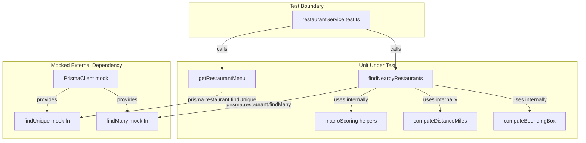

# S-18: API Endpoint Integration Tests

## Overview

Integration tests for the service layer backing the two primary restaurant API endpoints:
- `GET /api/restaurants` — implemented by `findNearbyRestaurants`
- `GET /api/restaurants/[id]/menu` — implemented by `getRestaurantMenu`

Test file: `apps/api/lib/restaurantService.test.ts`

---

## What Is Being Tested

The tests target `apps/api/lib/restaurantService.ts`, which is the business logic layer between the Next.js route handlers and Prisma. The external dependency (Prisma / database) is mocked at the constructor level so tests are deterministic and do not require a live database.



---

## Test Coverage Plan

### `findNearbyRestaurants` (11 tests)

| # | Test | What it verifies |
|---|------|-----------------|
| 1 | Returns restaurants within radius | Both returned DB rows appear in results |
| 2 | Filters out restaurants outside true radius | Bounding-box corners beyond `radiusMiles` are excluded |
| 3 | Sorts by match score when targets provided | Better-scoring restaurant appears first |
| 4 | Sorts by distance when no targets | Closer restaurant appears first |
| 5 | Applies cuisineType filter | `findMany` is called with `cuisineTags: { has: cuisineType }` |
| 6 | Applies chainOnly filter | `findMany` is called with `chainFlag: chainOnly` |
| 7 | Respects limit | At most `limit` results returned |
| 8 | Returns correct distanceMiles rounding | Rounded to 2 decimal places |
| 9 | Returns bestMatch with correct matchScore | `bestMatch` populated with correct fields when targets match |
| 10 | Returns bestMatch: null when no targets | `targets = {}` yields `bestMatch: null` |
| 11 | Returns bestMatch: null when no estimates | Items with empty `macroEstimates` yield `bestMatch: null` |

### `getRestaurantMenu` (7 tests)

| # | Test | What it verifies |
|---|------|-----------------|
| 12 | Returns null for unknown restaurant | `findUnique` returns null → service returns null |
| 13 | Returns restaurant with menu items | `restaurantId`, `restaurantName`, `menuItems` array present |
| 14 | Maps macros from latest estimate | First estimate in array maps to all macro fields |
| 15 | Returns macros: null when no estimates | Item with empty `macroEstimates` → `macros: null` |
| 16 | Includes optional fields when present | `description`, `category`, `price` appear in output |
| 17 | Omits optional fields when null | `description/category/price = null` → fields absent from output |
| 18 | Sorts items by name ascending | `orderBy: { name: 'asc' }` passed to Prisma |

---

## Mock Strategy

Prisma is mocked at the module level by intercepting the `PrismaClient` constructor. The singleton pattern in `restaurantService.ts` (`globalForPrisma.prisma ?? new PrismaClient()`) means the constructor fires once when the module loads. The mock must be registered with `jest.mock` before any import of the service module.

```
jest.mock('@prisma/client') → intercepts constructor
                           → provides mockFindMany / mockFindUnique
restaurantService.ts        → imports PrismaClient → gets mock instance
tests                       → set return values on mock fns per test
```

Each test resets mock state with `beforeEach` to ensure isolation.
