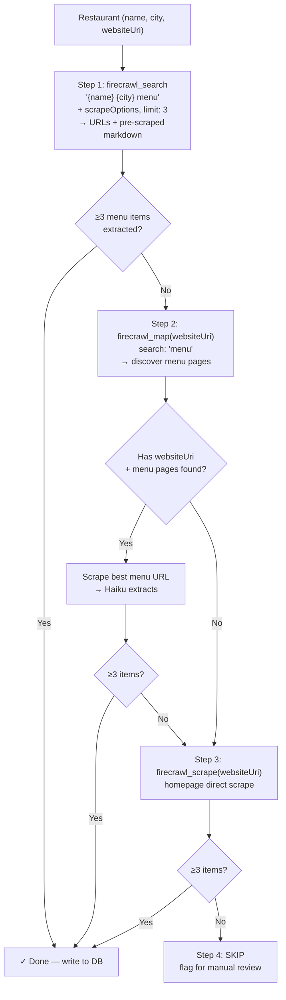

# Scraping Pipeline Spike — Session Handoff

**Date:** 2026-03-23
**Status:** In progress — v3 pipeline validated, ready for full 50-restaurant run

---

## Context

We need to scrape restaurant menus and estimate macronutrients for each item.
The original system design specified Firecrawl for MVP, Crawl4AI at scale.
Previous Apify-based scraping was inconsistent (frequent 403s on delivery platforms).
This spike tested multiple approaches to find the best pipeline.

---

## What We Tested

### 1. Website-First Pipeline (Firecrawl + Haiku)
- Scrape restaurant's own website (from Google Places `websiteUri`)
- Haiku extracts menu items and estimates macros

**Result:** 48% hit rate (24/50). Cheap ($0.17/50 restaurants) but many sites
have image-based menus, JS-rendered tabs, or dead domains.

### 2. Google Custom Search (CSE) as Fallback
- Searched menu aggregators (allmenus, zmenu, menupix, sirved, opentable)
- Excluded Yelp/TripAdvisor initially

**Result:** 0% — GCP permissions blocked all requests. Custom Search API
requires both API enablement AND API key permissions, which never propagated
during the session. Also, without Yelp, aggregator coverage for independent
LA restaurants is very poor.

### 3. Firecrawl Search API (standalone)
- `POST /v1/search` with query

**Result:** Inconsistent. Returned empty for 48/50 queries in one run,
but worked inside the agent run. Possibly rate-limited or flaky.

### 4. LLM Agent (Haiku + Firecrawl tools)
- Gave Haiku tools: `firecrawl_search`, `firecrawl_scrape`, `submit_macros`
- Agent autonomously searched, scraped, and extracted

**Result:** Recovered 15/26 failures (58%). Combined with pipeline: 78% (39/50).
But slow — agent averaged 7.6 tool calls/restaurant. Over-searched, scraped
redundant sources, hit max turns without submitting.

### 5. V3 Pipeline — Firecrawl Search + scrapeOptions (WINNER)
- `firecrawl_search` with `scrapeOptions` (search + scrape in one call)
- Haiku extracts macros from pre-scraped markdown
- Fallback: `firecrawl_map` to find menu pages on restaurant's own site
- Fallback: scrape homepage directly

**Result:** 6/8 hard cases solved in 1-2 API calls each. The two previous
hardest cases (Tacos Zamas with no website, Yamashiro with JS tabs) both
solved via third-party sources (zmenu, Yelp reviews).

---

## V3 Pipeline — The Winning Design



```
For each restaurant:

Step 1: firecrawl_search("{name} {city} menu", scrapeOptions, limit: 3)
  → Returns URLs + already-scraped markdown
  → Haiku extracts macros from result 1, then result 2 if needed
  → If macros ≥ 3: DONE

Step 2: firecrawl_map(websiteUri, search: "menu")
  → Discovers menu pages on the restaurant's own site
  → Scrape best menu URL → Haiku extracts
  → If macros ≥ 3: DONE

Step 3: firecrawl_scrape(websiteUri homepage)
  → Haiku extracts (some restaurants embed menu on homepage)
  → If macros ≥ 3: DONE

Step 4: SKIP + flag for manual review
```

### Why This Works
- **Search** finds third-party sources (Grubhub, Yelp, zmenu, food blogs)
  that have text menus even when the restaurant's own site doesn't
- **scrapeOptions** eliminates a round trip — search returns pre-scraped content
- **Map** catches hidden menu pages (e.g., `/menus/` not `/menu/`)
- **No agent loop** — deterministic, predictable costs, no over-searching
- **No content cap** — full markdown with `onlyMainContent: true`

### Cost Estimates

| Scale | Restaurants | Est. Cost |
|-------|-----------|-----------|
| 50 (test) | 50 | ~$0.25 |
| 500 (LA MVP) | 500 | ~$2.50 |
| 5,000 (Full LA) | 5,000 | ~$25 |
| 50,000 (USA subset) | 50,000 | ~$240 |

### Expected Hit Rate
- Step 1 (search): ~70-80%
- Step 2 (map): recovers ~5-10% more
- Step 3 (homepage): recovers ~5% more
- **Total: ~85-90%**

---

## Hard Case Results (V3 Pipeline)

| Restaurant | Problem | V3 Result | Source |
|---|---|---|---|
| Jones Hollywood | Menu on separate page | 20 items (1 call) | joneshollywood.com/menus/ |
| Tacos Zamas | No website at all | 15 items (1 call) | zmenu.com |
| Sanamluang Cafe | Domain hijacked | 10 items (1 call) | grubhub.com |
| Yamashiro | JS-rendered tabs | 12 items (2 calls) | yelp.com reviews |
| Mother Wolf | Image-heavy site | 15 items (2 calls) | kevineats.com blog |
| Virgil Cafe | No website | 4 items (1 call) | grubhub.com |
| Tacos Al Pastor | No website | 20 items (1 call) | doordash.com |
| The Black Cat | Image-based menu (BentoBox) | FAILED | — |
| Agra Cafe | Image-based menu | FAILED | — |

---

## Unsolved: Image-Based Menus (~10-15%)

Restaurants using BentoBox, Squarespace menu blocks, or embedded PDFs render
menus as images. No text to extract.

**Proposed solution:** Detect image menu (scrape returns content but 0 items
extracted) → re-scrape with `formats: ["screenshot"]` → Claude Vision extracts
from the screenshot. Not yet tested.

---

## Agent Design Learnings

When we built an LLM agent for menu finding, it failed due to:
1. **Redundant searches** — searched 2-3 times for the same restaurant
2. **Over-scraping** — scraped 4-5 sources when the first one had the answer
3. **Never submitted** — kept looking for "better" data instead of extracting
4. **6k char cap** — truncated delivery platform content before menu items

**Guardrails that fixed it (v2 agent, tested but superseded by v3):**
- Search done deterministically before agent starts
- `scrape_and_extract` tool combines scrape + Haiku extraction — agent
  never sees raw markdown, can't get distracted
- No content cap — full markdown with `onlyMainContent`
- Agent only decides "try next URL" or "give up"

The v3 pipeline made the agent unnecessary — deterministic steps are faster,
cheaper, and more predictable.

---

## Infrastructure & Keys

API keys are stored in macOS Keychain (scoped to `fitsy`) and
exported via `~/.zshrc`. See `.env.example` for required variables.

### Google CSE
- **Status: BLOCKED** — Custom Search JSON API permissions never propagated.
  Low priority since v3 pipeline uses Firecrawl search instead.

### Test Scripts
All in `scripts/discovery-test/`:
- `run.ts` — website-first pipeline (original)
- `run-google-first.ts` — CSE-based pipeline (broken)
- `run-agent.ts` — LLM agent approach
- `run-v2-test.ts` — guardrailed agent
- `run-v3-test.ts` — **current best: firecrawl search + map + haiku**
- `run-search-pipeline.ts` — firecrawl search standalone (flaky)
- `run-haiku-search.ts` — scraping Google directly (blocked)
- `debug.ts`, `check-aggs.ts`, `check-aggs-direct.ts` — diagnostic scripts
- `results-*.json` — output from each run

---

## Sprint Work: Scraping Pipeline Implementation

**Dependency:** Backend scaffolding must be complete first (monorepo, Prisma,
`apps/api/` structure). This work comes immediately after.

**Phase 1: Spec** — Write the scraping pipeline specification. **CTO review required.**

The spec must cover two versions:

**MVP-0 version (50 restaurants, 90029 zip code):**
- V3 pipeline: firecrawl_search → firecrawl_map → homepage scrape → skip
- Simple sequential batch script
- No parallelism, no retry queue, no monitoring
- Runs on a dev machine in ~10 min, costs ~$0.25
- Error handling: log and skip on failure

**Scaled version (5k-50k+ restaurants):**
- Must be time and cost optimized — the MVP-0 sequential approach won't work
  at 50k restaurants (~2 days sequential)
- The spec should evaluate and recommend across these dimensions:
  - **Parallelism**: concurrent Firecrawl/Haiku calls within rate limits
  - **Batching**: Haiku batch API for bulk estimation (lower cost, higher latency)
  - **Provider alternatives**: Crawl4AI (self-hosted, $0 software) vs Firecrawl
    ($166 at USA scale). DIY Playwright + Turndown as a third option.
  - **Incremental preload**: only scrape new/changed restaurants, not the full set
  - **Credit optimization**: skip search for restaurants that already have a known
    menu URL from a previous run
  - **Failure recovery**: persistent queue with retry, don't re-scrape successes
  - **Cost model**: detailed comparison of all approaches at 500 / 5k / 50k scale
  - **Monitoring**: progress tracking, cost tracking, success rate dashboards
- Target: full LA (5k restaurants) in <2 hours, <$25
- Target: USA (50k restaurants) in <24 hours, <$250

**Phase 2: Implementation** — Build and run the MVP-0 preload:
- Implement MVP-0 version of the pipeline as a preload script
- Run on 50 LA restaurants (90029 zip code)
- Persist results to database
- No human review gate — pipeline output goes directly to DB
- ~$0.25 cost, ~5-10 min runtime
- Scaled version implementation is a separate sprint task

**Not needed for MVP-0:**
- Screenshot + Vision fallback (only affects ~5-10% of restaurants)
- Google CSE (Firecrawl search replaces it)
- Live scraping (preload-only for MVP-0)
- Parallelism, queuing, monitoring (scaled version only)

---

## Additional Notes

- **Rotate API keys** — keys were shared in plain text during spike session
- Google CSE was set up but never worked (GCP permissions). Abandoned in
  favor of Firecrawl search. CSE ID and config can be deleted.

---

## Key Decision: Firecrawl Search Replaces CSE

The original plan used Google CSE as the search layer. Firecrawl search with
`scrapeOptions` is strictly better:
- Search + scrape in one API call (vs CSE search + separate Firecrawl scrape)
- No GCP permissions to manage
- Returns pre-scraped markdown (no extra round trip)
- $0.002/query vs CSE $0.005/query + scrape cost

Recommend updating system design to use Firecrawl search as the primary
discovery mechanism, with `firecrawl_map` as fallback for restaurant-owned sites.
