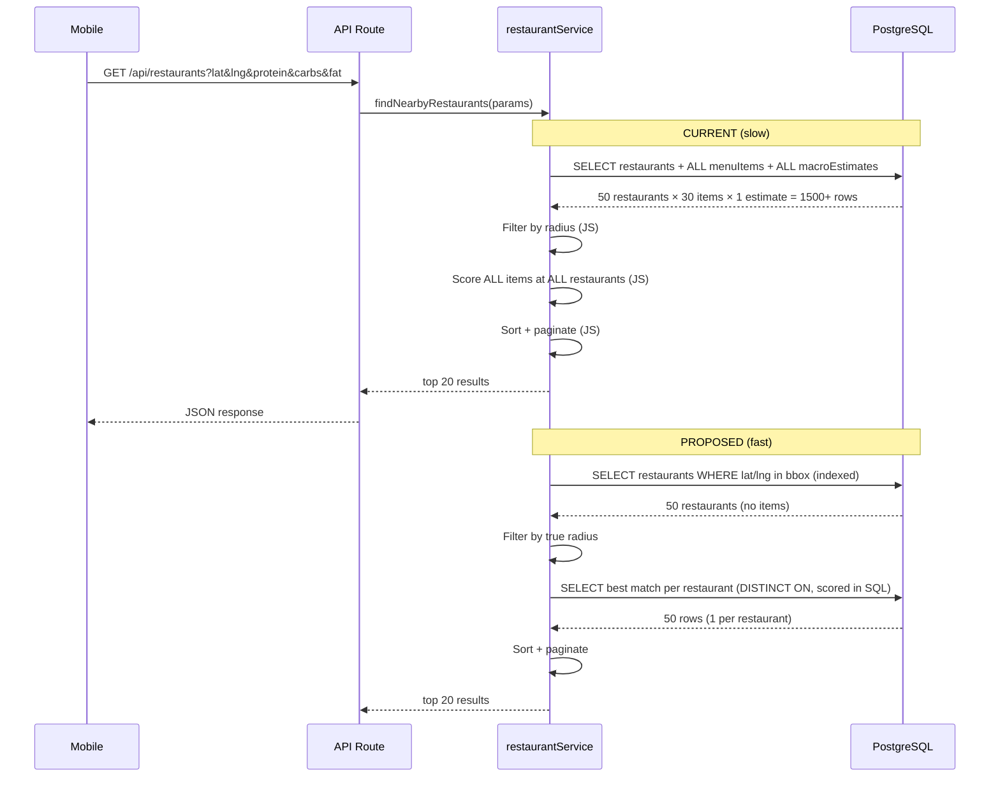

# Search API Performance Optimization

**Status:** SPEC
**Priority:** HIGH — search is the core loop; every user hits this on every session
**Author:** Claude (CTO agent)
**Date:** 2026-03-29

---

## Problem

The `GET /api/restaurants` endpoint is slow. The query loads **all menu items and macro estimates** for every restaurant in radius, scores them in application code, then discards most of the data. With 50 restaurants averaging 30 menu items each, a single search fetches ~1,500 rows of macro data when only ~50 (best match per restaurant) are needed.

### Current Request Path

```
Mobile (search.tsx:64)
  → fetchRestaurants() (apiClient.ts)
    → GET /api/restaurants?lat=..&lng=..&protein=..&carbs=..&fat=.. (route.ts:69)
      → findNearbyRestaurants() (restaurantService.ts:67)
        → prisma.restaurant.findMany({ include: menuItems + macroEstimates }) ← BOTTLENECK
        → filter by true radius (JS)                                          ← REDUNDANT
        → score ALL items at ALL restaurants (JS)                             ← N×M WORK
        → sort + paginate (JS)
```

---

## Bottlenecks (ranked by impact)

### 1. Over-fetching menu items — `restaurantService.ts:79-98`

```typescript
// Current: loads EVERYTHING
const restaurants = await prisma.restaurant.findMany({
  include: {
    menuItems: {                    // ALL items per restaurant
      include: {
        macroEstimates: {           // + their estimates
          orderBy: { estimatedAt: "desc" },
          take: 1,
        },
      },
    },
  },
});
```

**Impact:** For 50 restaurants × 30 items = 1,500 menu items + 1,500 macro estimates loaded into memory. Only the single best match per restaurant is used in the response.

**Fix:** Two-phase query:
1. Phase 1: Fetch restaurants in bounding box (no menu items)
2. Phase 2: Raw SQL to get best-matching item per restaurant using `DISTINCT ON` or window function — compute scores in SQL, return only the top match per restaurant

### 2. No spatial index — `prisma/schema.prisma:42-48`

```prisma
model Restaurant {
  lat  Float    // ← NO INDEX
  lng  Float    // ← NO INDEX
}
```

**Impact:** Every search does a full table scan with range filters on `lat` and `lng`. As the restaurant count grows, this degrades linearly.

**Fix:** Add compound index:
```prisma
model Restaurant {
  @@index([lat, lng])
}
```

### 3. Distance computed twice — `restaurantService.ts:101-111`

```typescript
// First: filter
const inRadius = restaurants.filter((r) => {
  const dist = computeDistanceMiles(lat, lng, r.lat, r.lng);  // ← call 1
  return dist <= radiusMiles;
});

// Second: annotate
const withScores = inRadius.map((r) => {
  const distanceMiles = computeDistanceMiles(lat, lng, r.lat, r.lng);  // ← call 2
  // ...
});
```

**Impact:** 2× distance calculations per restaurant. Minor but trivially fixable.

**Fix:** Compute once during filter, carry result forward:
```typescript
const inRadius = restaurants
  .map(r => ({ ...r, distanceMiles: computeDistanceMiles(lat, lng, r.lat, r.lng) }))
  .filter(r => r.distanceMiles <= radiusMiles);
```

### 4. O(N×M) scoring in JS — `restaurantService.ts:115-146`

```typescript
for (const item of r.menuItems) {           // M items
  const score = computeMatchScore(targets, { ... });
  scoredItems.push({ ... });
}
bestMatch = bestScoredItem(scoredItems);     // min of M scores
```

**Impact:** Iterates every item at every restaurant. For the current 9 restaurants this is fine, but at scale (500 restaurants × 50 items = 25,000 iterations) it becomes the dominant cost.

**Fix (Phase 1 — easy):** Track best score during iteration instead of collecting all scores:
```typescript
let bestScore = Infinity;
let bestMatch: ScoredItem | null = null;
for (const item of r.menuItems) {
  const score = computeMatchScore(targets, ...);
  if (score !== null && score < bestScore) {
    bestScore = score;
    bestMatch = { ... };
  }
}
```

**Fix (Phase 2 — SQL):** Move scoring to a SQL expression or stored function. The scoring formula (normalized Euclidean distance) is expressible in SQL:
```sql
SELECT DISTINCT ON (restaurant_id)
  mi.id, mi.name, me.calories, me."proteinG", me."carbsG", me."fatG",
  SQRT(
    POW((me.calories - $cal) / $cal::float, 2) +
    POW((me."proteinG" - $protein) / $protein::float, 2) +
    POW((me."carbsG" - $carbs) / $carbs::float, 2) +
    POW((me."fatG" - $fat) / $fat::float, 2)
  ) AS match_score
FROM "MenuItem" mi
JOIN "MacroEstimate" me ON me."menuItemId" = mi.id
WHERE mi."restaurantId" = ANY($restaurantIds)
ORDER BY restaurant_id, match_score ASC
```

### 5. No response caching — `route.ts`

**Impact:** Identical searches (same lat/lng/targets) always hit the DB. Restaurant data changes infrequently (only on preload runs).

**Fix:** Add `Cache-Control: public, max-age=300` (5 min) to restaurant search responses. Vercel edge will cache at the CDN layer. Also consider `stale-while-revalidate`.

### 6. No client-side timeout — `api.ts:25-36`

```typescript
const res = await fetch(`${BASE_URL}${path}`, { ... });
// No AbortController, no timeout
```

**Impact:** If the API is slow or hangs, the mobile app waits indefinitely. Users see the FitsyLoader forever.

**Fix:** Add `AbortController` with 10-second timeout:
```typescript
const controller = new AbortController();
const timeout = setTimeout(() => controller.abort(), 10_000);
const res = await fetch(url, { ...opts, signal: controller.signal });
clearTimeout(timeout);
```

---

## Diagrams



---

## Approach

### Phase 1 — Quick wins (no schema changes)

1. **Add lat/lng compound index** — new Prisma migration
2. **Compute distance once** — refactor filter+map in `restaurantService.ts`
3. **Track best score inline** — eliminate `scoredItems` array allocation
4. **Add response Cache-Control** — 5 min cache on `GET /api/restaurants`
5. **Add client timeout** — 10s AbortController in `api.ts`

**Estimated impact:** 2-3× faster for current data size. Prevents degradation at scale.

### Phase 2 — SQL scoring (schema change)

6. **Two-phase query** — fetch restaurants first, then raw SQL for best match per restaurant
7. **Move scoring to SQL** — `DISTINCT ON` with score expression
8. **Add `menuItemId` index on MacroEstimate** — already exists, verify it's used

**Estimated impact:** 10-50× fewer rows transferred from DB. Constant-time per restaurant regardless of menu size.

### Phase 3 — Caching layer

9. **Edge caching** via Vercel CDN headers
10. **Client-side result cache** — cache last search result, show stale while revalidating

---

## Constraints

- No PostGIS — spatial queries use bounding box + Haversine in JS (sufficient for <10 mile radius)
- Prisma doesn't support `DISTINCT ON` — Phase 2 requires `prisma.$queryRaw`
- Cache invalidation: restaurant data only changes on preload runs (weekly), so 5-min TTL is safe
- Scoring formula must stay identical between JS and SQL implementations — test with snapshot comparisons
