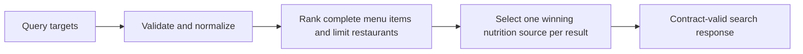

# Search serving consistency

Search must return one restaurant per result even when a dish has several
nutrition sources. Confidence must describe the winning source, and search
must use only complete macro records. Zero targets are inactive; short names
(`protein`) and gram names (`proteinG`) mean the same target. Invalid, blank,
negative, excessive or conflicting values return HTTP 400.

The scoring formula lives in shared code; SQL uses the same active dimensions.
Restaurant/menu IDs and stored nutrition are unchanged. This release requires
no schema migration and does not enable chain sourcing or change estimation.

Verification: `macroTargetParams.test.ts` covers aliases and invalid targets;
`search-provenance.db.test.ts` runs real SQL with multiple sources, partial
macros and zero targets. The existing DB search/entitlement tests, all local
workspace tests, coverage gate, static checks and production build must pass.
Before deployment, the new database regression runs against the old service
to prove that it detects the original failures. After deployment, run the
production-safe API smoke and compare short/gram target responses.

Menu ordering, pagination and locked-sample behavior follow as a separate
serving release using the same scoring and parsing helpers.
