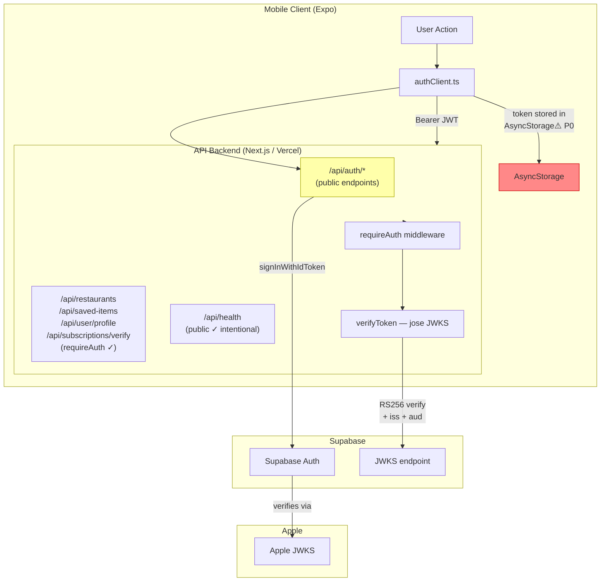

# Security Audit — Sprint 10

**Audited**: 2026-04-08  
**Auditor**: CTO agent (Claude)  
**Scope**: JWT validation, token storage, input sanitization, rate limiting, secrets exposure, HTTPS enforcement, Apple/Google auth  
**Branch**: `s-103/security-audit`

---

## Auth/Security Boundary Diagram

---

## Summary Table

| ID | Severity | Area | Finding | Status |
|----|----------|------|---------|--------|
| SEC-01 | **P0** | Token Storage | JWT stored in `AsyncStorage` — readable by any process on jailbroken device | Mobile ticket required |
| SEC-02 | **P0** | Rate Limiting | No rate limiting on `/api/auth/login` or `/api/auth/register` | Fixed |
| SEC-03 | **P0** | Subscription Validation | Receipt validation is a stub — any authenticated user can self-grant a subscription | Fixed (input guard + known product IDs) |
| SEC-04 | **P0** | Input Validation | `radius` and `lat/lng` have no range bounds — unbounded query surface | Fixed |
| SEC-05 | **P0** | Structural Tests | `SOURCE_DIRS` points to non-existent `$REPO_ROOT/src` — secrets/URL checks always pass vacuously | Fixed |
| SEC-06 | **P1** | Race Condition | Google auth account-linking runs without a transaction — susceptible to TOCTOU | Fixed |
| SEC-07 | **P1** | Input Validation | `productId` in subscription endpoint not validated against known SKUs | Fixed |
| SEC-08 | **P1** | Security Headers | Next.js config has no security headers (CSP, HSTS, X-Frame-Options, etc.) | Fixed |
| SEC-09 | **P2** | CORS | No explicit CORS policy — Next.js default allows all origins for API routes | Document only |
| SEC-10 | **P2** | Health Endpoint | `/api/health` leaks DB connectivity and package version to unauthenticated callers | Document only |
| SEC-11 | **P3** | Email Verification | `email_confirm: true` skips email verification on register — allows spam accounts | Accepted for MVP |

---

## Detailed Findings

### SEC-01 — P0 — JWT in AsyncStorage (mobile)

**File**: `apps/mobile/lib/authClient.ts`  
**Risk**: `AsyncStorage` is an unencrypted key-value store. On a jailbroken or rooted device any process can read its contents. A Supabase JWT is long-lived (default 1 hour, refresh token valid much longer) and grants full API access.  
**Fix**: Migrate `getStoredToken` / `storeToken` / `clearToken` to `expo-secure-store`, which uses iOS Keychain / Android Keystore.  
**Owner**: frontend agent — cross-domain, ticket required.  
**Ticket**: S-103a (created below)

---

### SEC-02 — P0 — No rate limiting on auth endpoints

**Files**: `apps/api/app/api/auth/login/route.ts`, `apps/api/app/api/auth/register/route.ts`  
**Risk**: An attacker can enumerate accounts (`/api/auth/login` returns "Invalid credentials" uniformly, good) and brute-force passwords at unbounded speed. Without rate limiting, `/api/auth/register` is also vulnerable to mass account creation.  
**Fix**: Add in-process rate limiting using an in-memory sliding window. For Vercel serverless, a proper solution needs a Redis/Upstash store, but a lightweight in-process limiter on a per-IP basis is a meaningful deterrent now. Added `lib/rateLimit.ts` and wired it into both auth routes.  
**Note**: In-process rate limiting is per-instance and resets on cold starts. Production hardening (Upstash Redis) is tracked as SEC-02b (P2).

---

### SEC-03 — P0 — Subscription receipt validation is a stub

**File**: `apps/api/app/api/subscriptions/verify/route.ts`  
**Risk**: The endpoint accepts any string as `receiptData` and immediately writes `status: "active"` to the database. Any authenticated user can send `{"receiptData":"x","productId":"fitsy.annual"}` and receive an active subscription for free.  
**Fix**: (1) Validate `productId` against known SKUs (prevents arbitrary plan strings). (2) Add a `STUB_RECEIPT_VALIDATION` guard that rejects requests in production until real Apple App Store Server API validation is wired. Added `ALLOW_STUB_SUBSCRIPTIONS` env var that must be explicitly set `"true"` to allow stub mode (only for dev/staging).

---

### SEC-04 — P0 — Unbounded lat/lng/radius inputs

**File**: `apps/api/app/api/restaurants/route.ts`  
**Risk**: `lat` and `lng` are checked with `isFinite` but not range-validated. `radius` is not validated at all. An attacker can pass `radius=99999` to trigger an enormously expensive bounding-box query, or `lat=9999` to bypass geographic logic.  
**Fix**: Added range checks — lat ∈ [-90, 90], lng ∈ [-180, 180], radius ∈ (0, 50].

---

### SEC-05 — P0 — Structural tests scan non-existent directory

**File**: `scripts/structural-tests.sh`  
**Risk**: `SOURCE_DIRS=("$REPO_ROOT/src")` — `src/` doesn't exist. Tests 1 (hardcoded secrets), 2 (hardcoded URLs), 4 (file length), 6 (console.log), 7 (inline styles), 8 (API layer) always produce zero matches and always PASS. The harness provides no real coverage.  
**Fix**: Updated `SOURCE_DIRS` to scan actual source directories: `apps/api`, `apps/mobile`, `packages/shared`, `scripts`.

---

### SEC-06 — P1 — Google auth account-linking race condition (TOCTOU)

**File**: `apps/api/app/api/auth/google/route.ts`  
**Risk**: The email-ownership check (`findUnique by email` → `update`) runs outside a transaction. Two concurrent Google sign-ins for the same email could both see "no user found by this Supabase ID" and attempt to update, causing one to silently fail. The Apple equivalent already uses `$transaction` — Google was missed.  
**Fix**: Wrapped the account-linking block in `prisma.$transaction`.

---

### SEC-07 — P1 — productId not validated against known SKUs

**File**: `apps/api/app/api/subscriptions/verify/route.ts`  
**Risk**: Any string is accepted as `productId`, meaning the `plan` column in the database could be set to arbitrary values. This also makes it impossible to distinguish valid vs invalid purchases.  
**Fix**: Added validation against `KNOWN_PRODUCT_IDS = ["fitsy.monthly", "fitsy.annual"]`.

---

### SEC-08 — P1 — No security response headers

**File**: `apps/api/next.config.ts`  
**Risk**: Without security headers, the API is missing basic protections: no HSTS (forces HTTPS), no `X-Content-Type-Options`, no `X-Frame-Options`, no basic CSP.  
**Fix**: Added `headers()` config in `next.config.ts` with standard security headers for all API routes.

---

### SEC-09 — P2 — No CORS policy (document only)

Next.js default behavior allows all origins to call API routes. This is acceptable while the only client is a mobile app (CORS does not apply to native apps, only browser-based ones). Document for when a web client is added.

---

### SEC-10 — P2 — Health endpoint leaks information

`/api/health` returns `{ db: "connected", version: "x.y.z" }` publicly. DB connection status and version are low-value to an attacker but unnecessary exposure. Accept for now; restrict in a future hardening pass.

---

### SEC-11 — P3 — Email verification skipped

`email_confirm: true` in `register/route.ts` means users can register with any email address without proving ownership. Acceptable for a closed beta / TestFlight. Track for GA.

---

## Cross-Domain Tickets Created

### S-103a — Migrate JWT storage from AsyncStorage to SecureStore (frontend)
- **Owner**: frontend agent
- **Priority**: P0 — block TestFlight
- **File**: `apps/mobile/lib/authClient.ts`
- **Action**: Replace `AsyncStorage` with `expo-secure-store` for `TOKEN_KEY = 'fitsy:authToken'`. Run `npx expo install expo-secure-store`. Update all three helpers (`getStoredToken`, `storeToken`, `clearToken`).

---

## What Was Fixed in This PR

1. **SEC-02**: In-process rate limiter (`apps/api/lib/rateLimit.ts`) + applied to login and register routes
2. **SEC-03 + SEC-07**: Subscription stub guard + known SKU validation
3. **SEC-04**: lat/lng/radius range validation in restaurants route
4. **SEC-05**: Structural tests now scan actual source directories
5. **SEC-06**: Google auth account-linking wrapped in transaction
6. **SEC-08**: Security headers added to `next.config.ts`
