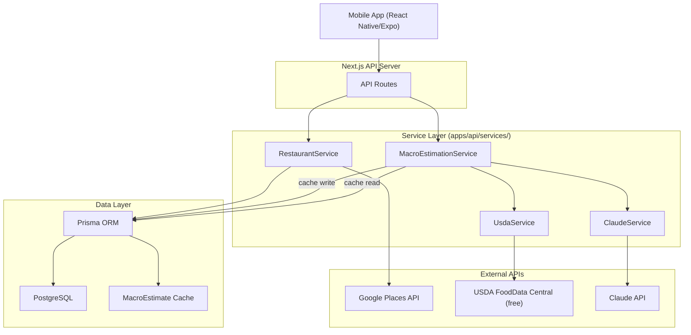
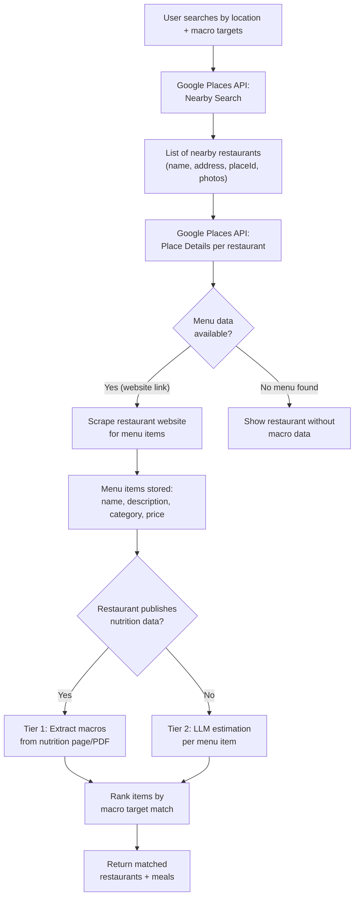
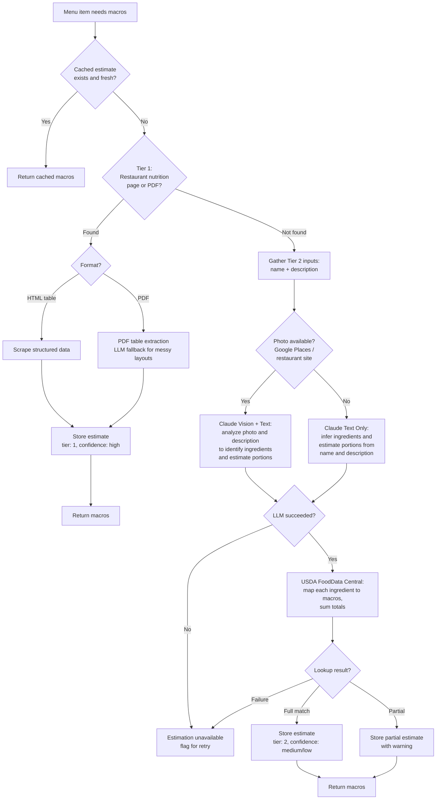
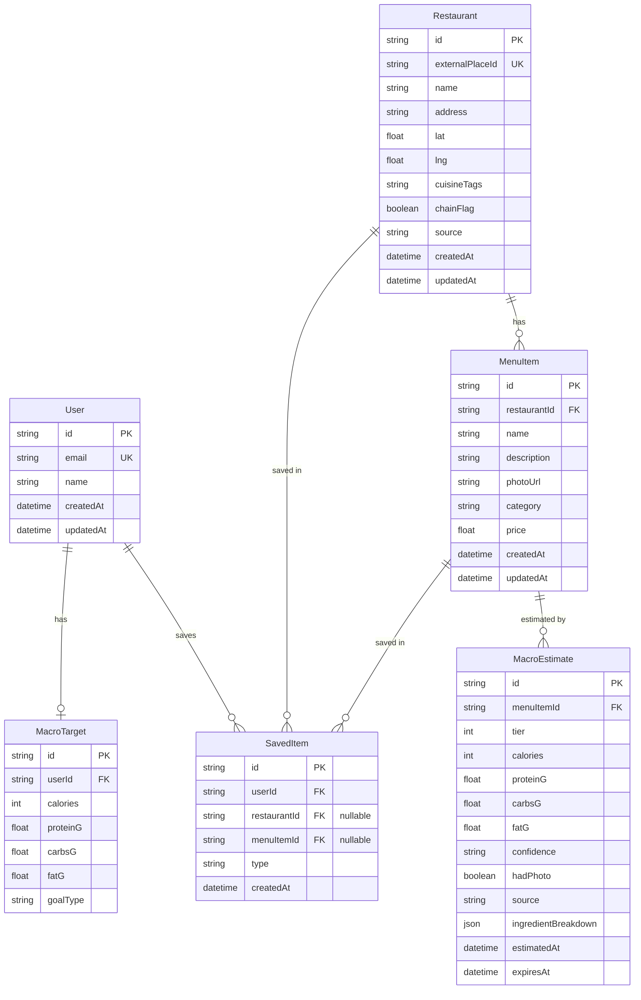

# System Design — Spec Outline

> **Status**: DRAFT — awaiting human review before full write-up.
> **Author**: CTO
> **Date**: 2026-03-22

---

## 1. System Overview

- High-level description of Fitsy: macro-aware restaurant discovery
- Architecture style: React Native (Expo) mobile client + Next.js API backend (monorepo), Prisma ORM, PostgreSQL
- Key data flow summary: User query -> restaurant discovery -> menu retrieval -> tiered macro estimation -> ranked results
- Architecture diagram:

- Deployment topology (to be determined)

---

## 2. Tiered Macro Estimation Pipeline

### 2.1 Pipeline Overview
- Two-tier pipeline: verified data (Tier 1) or LLM estimation (Tier 2)
- Pipeline short-circuits: if Tier 1 returns data, skip Tier 2
- Tier 2 produces a normalized ingredient list: `{ ingredient, quantity, unit }[]`
- USDA FoodData Central converts ingredients to macros (free API, no paid nutrition service needed)
- Confidence tier is stored alongside results and exposed to the user

### 2.2 Tier 1 — Verified Data (Restaurant Website)
- Source: restaurant's own published nutrition data (website pages, PDFs)
- Parsing strategy by format:
  - Structured HTML tables → simple scraper, no LLM needed
  - Nutrition PDFs (common for chains) → PDF table extraction library; LLM fallback for messy layouts
  - Note: LLM here is an *extraction* tool, not an estimation source — confidence stays high
- Maintain a per-restaurant registry of known nutrition URL/PDF locations (cached)
- When matched: return macros directly (skip ingredient decomposition)
- Confidence: high
- Edge cases: menu item name mismatches, regional menu variations, PDF format changes
- Why not Nutritionix for Tier 1: chains in Nutritionix almost always publish on their own site too. Scraping is free; Nutritionix is a paid middleman. Can add later as a fast-path if scraping proves unreliable at scale.

### 2.3 Tier 2 — LLM Estimation
- Source: menu item name + description + **photo if available** (from Google Places or restaurant site — no user uploads)
- Photo is an optional input that improves portion size and ingredient accuracy, not a separate tier
- Claude model (vision when photo available, text-only otherwise) infers ingredients and estimates portions
- Output: ingredient list with estimated quantities
- Confidence: medium (with photo) or low (without photo)
- Edge cases: vague descriptions ("chef's special"), culturally specific dishes, obscured ingredients in photos, portion distortion

### 2.4 USDA Lookup (Tier 2 Final Step)
- Receives ingredient list from Tier 2 LLM estimation
- Maps each ingredient + quantity to **USDA FoodData Central** API (free, ~380k foods)
- Databases used: SR Legacy (raw ingredients), FNDDS (prepared foods)
- Sums per-ingredient macros (calories, protein, carbs, fat) for menu item total
- Handles partial matches (best-effort ingredient mapping)
- Returns structured macro result with per-ingredient breakdown
- Why USDA over Nutritionix: USDA is free, comprehensive for common ingredients, and we're already decomposing into ingredients. Nutritionix Common Foods does the same thing but costs per call.

### 2.5 Restaurant Data Retrieval Flow

### 2.6 Macro Estimation Pipeline

---

## 3. API Architecture

The Next.js backend is API-only — no server-rendered pages. All endpoints serve JSON and are consumed by the React Native (Expo) mobile client.

### 3.1 Endpoint Inventory
- `GET /api/restaurants` — discover nearby restaurants (lat/lng, radius, filters)
- `GET /api/restaurants/[id]` — restaurant detail with menu items
- `GET /api/restaurants/[id]/menu` — menu items with cached macros
- `POST /api/meals/estimate` — on-demand macro estimation for a menu item
- `GET /api/user/targets` — retrieve user's macro targets
- `PUT /api/user/targets` — update macro targets
- `GET /api/user/saved` — saved restaurants / meals
- `POST /api/user/saved` — save a restaurant or meal

### 3.2 Request/Response Patterns
- Standard JSON envelope: `{ data, error, meta }`
- Pagination: cursor-based for list endpoints
- Error shape: `{ "error": "message" }` with HTTP status codes
- Macro results always include `{ tier, confidence, estimatedAt, source }`

### 3.3 Query and Filtering
- Macro target matching: calorie range, protein min, carb max, fat max
- Cuisine filter, chain vs. independent filter
- Sort options: distance, macro match closeness, confidence tier

---

## 4. External Service Integration

### 4.1 Integration Principles
- All external calls go through service wrappers in `apps/api/services/`
- Each wrapper handles: auth, request formatting, response normalization, error mapping
- No raw external API types leak into business logic

### 4.2 Google Places API
- Purpose: restaurant discovery by location, basic restaurant metadata, photos
- Endpoints used: Nearby Search, Place Details, Place Photos
- Rate limits and quota management
- Response mapping to internal Restaurant model

### 4.3 USDA FoodData Central API
- Purpose: ingredient-to-macro lookup (Tier 2 final step)
- Free API, no paid tier needed. Key: api.nal.usda.gov (free registration)
- Databases: SR Legacy (raw ingredients), FNDDS (prepared foods)
- Endpoints used: Food Search, Food Details
- Good coverage for common ingredients (chicken, rice, vegetables, oils, etc.)
- Edge cases: regional/ethnic ingredients may have limited coverage — LLM can suggest closest USDA match
- Cache ingredient→macro mappings locally (long TTL, ingredients don't change)

### 4.4 Claude API
- Purpose: Tier 1 nutrition page/PDF extraction, Tier 2 estimation (vision + text)
- Prompt design: structured output format (ingredient list with quantities)
- Vision mode: when photo available, analyze photo + text for better portion estimates
- Text mode: infer ingredients and portions from name/description only
- Model selection and cost considerations
- Token budget per request, timeout handling
- Prompt versioning strategy

### 4.5 Yelp Fusion API (Optional)
- Purpose: supplementary restaurant data, reviews, photos
- When to use: fallback if Google Places data is insufficient
- Endpoints used: Business Search, Business Details

---

## 5. Data Model / Database Schema

### 5.1 Core Entities
- **User**: id, email, name, auth fields, created/updated timestamps
- **MacroTarget**: userId (FK), calories, proteinG, carbsG, fatG, goal type
- **Restaurant**: id, externalPlaceId, name, address, lat, lng, cuisine tags, chain flag, source, created/updated
- **MenuItem**: id, restaurantId (FK), name, description, photoUrl, category, price, created/updated
- **MacroEstimate** (cache): id, menuItemId (FK), tier (1/2), calories, proteinG, carbsG, fatG, confidence (high/medium/low), hadPhoto (bool), source, ingredientBreakdown (JSON), estimatedAt, expiresAt
- **SavedItem**: userId (FK), restaurantId or menuItemId (FK), type, created

### 5.2 Entity Relationship Diagram

### 5.3 Key Relationships
- User 1:1 MacroTarget
- User 1:N SavedItem
- Restaurant 1:N MenuItem
- MenuItem 1:N MacroEstimate (history; latest = active)

### 5.4 Indexes
- Restaurant: geospatial index on (lat, lng), index on externalPlaceId
- MenuItem: index on restaurantId, composite index on (restaurantId, name)
- MacroEstimate: index on menuItemId, index on expiresAt (for staleness queries)

---

## 6. Caching Strategy

### 6.1 Macro Cache Lifecycle
- On first request for a menu item: run pipeline, persist MacroEstimate row
- Subsequent requests: serve from cache if not stale
- Staleness thresholds by tier:
  - Tier 1: 30 days (verified data changes infrequently)
  - Tier 2: 14 days (LLM estimates may improve with model updates)
- Re-estimation: **on-demand only** — when a stale record is accessed, re-estimate inline. No background jobs at MVP scale.

### 6.2 Cache Invalidation
- Explicit: admin or user flags an estimate as wrong
- Time-based: expiresAt field checked on read
- Source change: if restaurant menu is updated (detected via Place Details)

### 6.3 Application-Level Caching
- Start with **in-memory LRU cache** (no Redis at MVP). Monitor memory utilization and cache hit rate to know when to migrate.
- Restaurant search results: short-lived in-memory cache (~5 min TTL)
- USDA ingredient→macro mappings: in-memory cache with long TTL (ingredients don't change)
- Rate limit budgets tracked per service per time window

---

## 7. Error Handling and Resilience

### 7.1 External Service Failures
- Circuit breaker pattern per external service
- Retry policy: exponential backoff, max 3 retries for transient errors
- Timeout budgets: per-service configurable timeouts
- Graceful degradation: if one tier fails, fall through to next tier

### 7.2 Rate Limit Management
- Track remaining quota per API key per service
- Proactive throttling before hitting hard limits
- Queue and defer non-urgent requests when near limits
- Alert on sustained high usage

### 7.3 Pipeline Failure Modes
- Tier 1 miss: normal, proceed to Tier 2
- Tier 2 LLM failure: return "estimation unavailable" with reason, flag for retry
- USDA lookup partial failure: return partial macros with warning
- Both tiers fail: return restaurant/menu item without macro data, flag for retry

### 7.4 User-Facing Error Responses
- Consistent `{ "error": "message" }` format
- Never expose internal service details or API keys
- Actionable messages where possible ("try again", "results may be incomplete")

---

## 8. Performance Considerations

- Pipeline latency budget: target < 2s for cached, < 8s for uncached estimation
- Parallel external API calls where independent (e.g., restaurant fetch + cache check)
- Database query optimization: lean selects, avoid N+1 on menu item lists
- Batch USDA lookups: group ingredients into single API call where possible
- Connection pooling for database and HTTP clients
- Response payload size: paginate menu items, lazy-load macro details

---

## 9. Security Considerations

- API keys stored in environment variables, never in code or the mobile app bundle
- All external service calls server-side only (no API key exposure to the mobile client)
- Secure token storage on device via `expo-secure-store` for auth tokens
- User input sanitization on search queries and filter parameters
- Rate limiting on public API routes to prevent abuse
- Authentication required for user-specific endpoints (targets, saved items)
- Macro estimates include confidence disclaimers — never present estimates as medical/dietary advice
- Audit logging for macro estimate corrections and cache invalidations
- HTTPS only; CORS configured to allow requests from the mobile client

---

## Resolved Questions

- **Database hosting**: Managed Postgres (Neon or Supabase) — free tier for MVP, PostGIS support for geospatial queries
- **Application caching**: In-memory LRU to start. Monitor utilization; migrate to Redis when needed.
- **Background jobs**: None at MVP. Re-estimation is on-demand only.
- **Photo sourcing**: Google Places and restaurant websites only. No user uploads.
- **Nutrition data source**: USDA FoodData Central (free) for ingredient→macro lookup. No Nutritionix at MVP — can add later as Tier 1 fast-path if website scraping proves unreliable.
- **Tier 2/3 merge**: Collapsed into single Tier 2 (LLM estimation). Photo is an optional input that improves accuracy, not a separate tier.

## Open Questions

- [ ] Neon vs. Supabase — both work, pick before first migration
- [ ] USDA coverage gaps for ethnic/regional ingredients — fallback strategy?
- [ ] Claude model selection for Tier 2: Haiku (fast/cheap) vs. Sonnet (better accuracy) — benchmark needed
