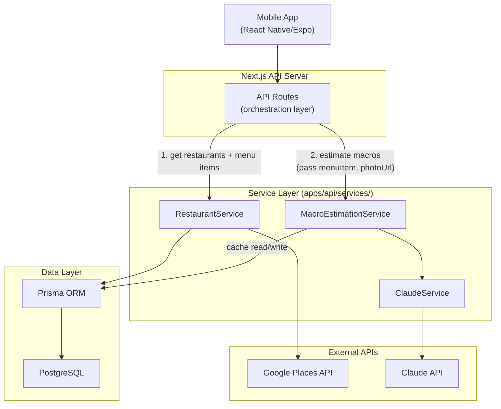
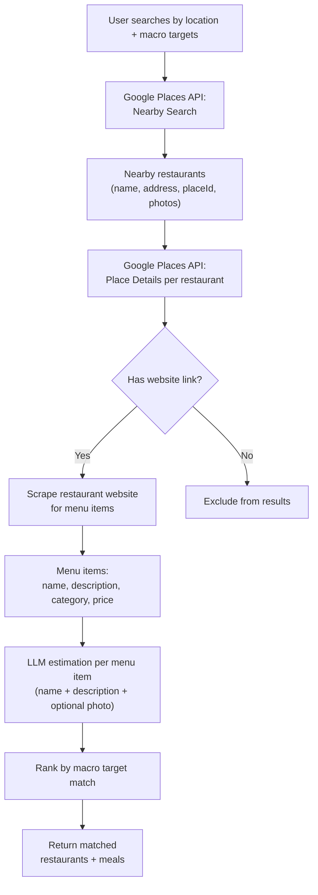
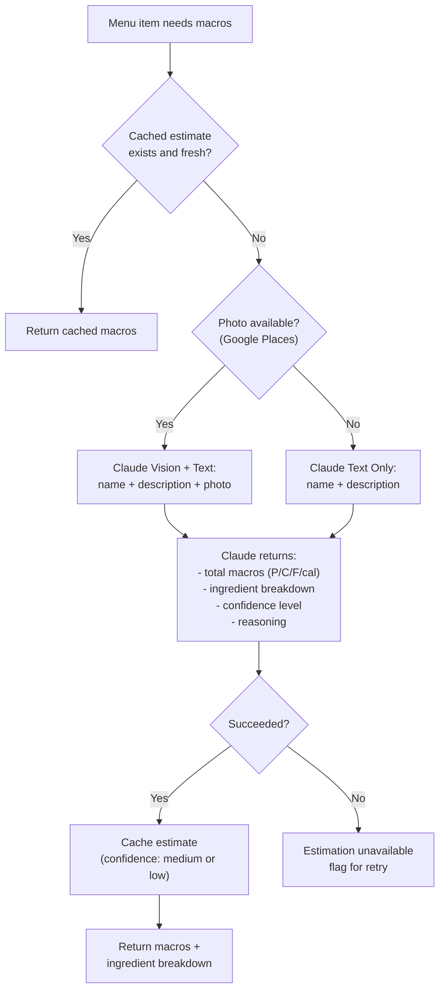
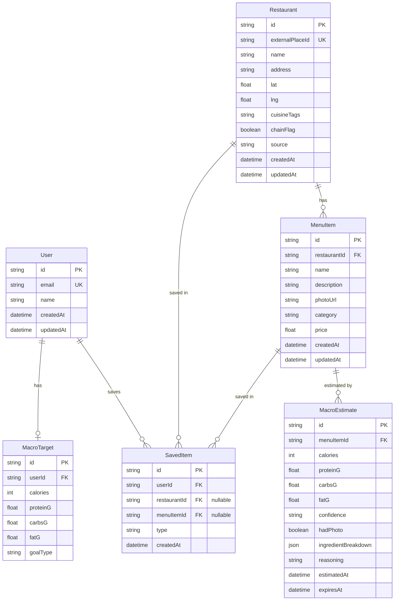

# System Design — Spec Outline

> **Status**: DRAFT — awaiting human review before full write-up.
> **Author**: CTO
> **Date**: 2026-03-22

---

## 1. System Overview

- High-level description of Fitsy: macro-aware restaurant discovery
- Architecture style: React Native (Expo) mobile client + Next.js API backend (monorepo), Prisma ORM, PostgreSQL
- Key data flow summary: User query → restaurant discovery → menu retrieval → LLM macro estimation → ranked results
- Architecture diagram:

- **Orchestration pattern**: API routes coordinate between services. Services never call each other — MacroEstimationService receives menu item data (name, description, photoUrl) as input from the route, not by calling RestaurantService. This keeps services independently testable.
- **Single external dependency for estimation**: Claude API only. No USDA at MVP — LLM returns macros + ingredient breakdown in one call.
- Deployment topology (to be determined)

---

## 2. Macro Estimation Pipeline

### 2.1 Pipeline Overview (MVP)
- **Single pipeline**: Every menu item goes through one Claude API call
- LLM returns **both** total macros AND ingredient breakdown in one response
- Ingredient breakdown gives users transparency into the estimate ("where did 42g protein come from?")
- Photo (when available from Google Places) is an optional input that improves accuracy
- Confidence: medium (with photo) or low (without photo)
- Results cached per menu item; on-demand re-estimation when stale
- Single external dependency for estimation: Claude API only

### 2.2 How It Works
- Input: menu item name + description + optional photo
- Claude prompt returns structured JSON:
  - `macros`: `{ calories, proteinG, carbsG, fatG }`
  - `ingredients`: `[{ name, quantity, unit, calories, proteinG, carbsG, fatG }]`
  - `confidence`: `"medium"` or `"low"`
  - `reasoning`: short explanation of estimation approach
- Ingredients should approximately sum to total macros (allows sanity checking)
- Edge cases: vague descriptions ("chef's special"), culturally specific dishes, obscured ingredients in photos, portion distortion

### 2.3 Restaurant Data Retrieval Flow (MVP)

### 2.4 Macro Estimation Pipeline

### 2.5 Post-MVP Accuracy Upgrades

In priority order:

1. **USDA cross-validation**: Run ingredient breakdown through USDA FoodData Central in background. If USDA sum diverges >15% from LLM's stated macros, flag lower confidence and surface the discrepancy.
2. **Verified data layer**: Search `"{restaurant_name} nutrition information"` for restaurant-published nutrition data. When found, use it instead of LLM — highest confidence, no estimation needed.
3. **Prompt calibration loop**: Log LLM estimates vs verified data for chains where we have both. Use divergence patterns to improve prompts over time.
4. **User corrections**: Let users flag "this doesn't look right" — feeds back into prompt tuning and identifies systematic errors.
5. **Confidence scoring model**: Instead of just medium/low, score based on: known chain? how detailed was the description? photo available? how common are the ingredients?
6. **Extended retrieval**: Web search fallback for restaurants without website links. Partial menu extraction from Google Places reviews/photos/listings.

---

## 3. API Architecture

The Next.js backend is API-only — no server-rendered pages. All endpoints serve JSON and are consumed by the React Native (Expo) mobile client.

### 3.1 Endpoint Inventory
- `GET /api/restaurants` — discover nearby restaurants (lat/lng, radius, filters)
- `GET /api/restaurants/[id]` — restaurant detail with menu items
- `GET /api/restaurants/[id]/menu` — menu items with cached macros
- `POST /api/meals/estimate` — on-demand macro estimation for a menu item
- `GET /api/user/targets` — retrieve user's macro targets
- `PUT /api/user/targets` — update macro targets
- `GET /api/user/saved` — saved restaurants / meals
- `POST /api/user/saved` — save a restaurant or meal

### 3.2 Request/Response Patterns
- Standard JSON envelope: `{ data, error, meta }`
- Pagination: cursor-based for list endpoints
- Error shape: `{ "error": "message" }` with HTTP status codes
- Macro results always include `{ confidence, hadPhoto, estimatedAt, ingredientBreakdown }`

### 3.3 Query and Filtering
- Macro target matching: calorie range, protein min, carb max, fat max
- Cuisine filter, chain vs. independent filter
- Sort options: distance, macro match closeness, confidence tier

---

## 4. External Service Integration

### 4.1 Integration Principles
- All external calls go through service wrappers in `apps/api/services/`
- Each wrapper handles: auth, request formatting, response normalization, error mapping
- No raw external API types leak into business logic

### 4.2 Google Places API
- Purpose: restaurant discovery by location, basic restaurant metadata, photos
- Endpoints used: Nearby Search, Place Details, Place Photos
- Rate limits and quota management
- Response mapping to internal Restaurant model

### 4.3 Claude API
- Purpose: macro estimation — the core of the pipeline
- Single call per menu item returns macros + ingredient breakdown as structured JSON
- Vision mode: when photo available, analyze photo + text for better accuracy
- Text mode: infer from name/description only
- Model selection and cost considerations
- Token budget per request, timeout handling
- Prompt versioning strategy (prompts are a core asset — version and track changes)

### 4.5 Yelp Fusion API (Optional)
- Purpose: supplementary restaurant data, reviews, photos
- When to use: fallback if Google Places data is insufficient
- Endpoints used: Business Search, Business Details

---

## 5. Data Model / Database Schema

### 5.1 Core Entities
- **User**: id, email, name, auth fields, created/updated timestamps
- **MacroTarget**: userId (FK), calories, proteinG, carbsG, fatG, goal type
- **Restaurant**: id, externalPlaceId, name, address, lat, lng, cuisine tags, chain flag, source, created/updated
- **MenuItem**: id, restaurantId (FK), name, description, photoUrl, category, price, created/updated
- **MacroEstimate** (cache): id, menuItemId (FK), calories, proteinG, carbsG, fatG, confidence (medium/low), hadPhoto (bool), ingredientBreakdown (JSON), reasoning (text), estimatedAt, expiresAt
- **SavedItem**: userId (FK), restaurantId or menuItemId (FK), type, created

### 5.2 Entity Relationship Diagram

### 5.3 Key Relationships
- User 1:1 MacroTarget
- User 1:N SavedItem
- Restaurant 1:N MenuItem
- MenuItem 1:N MacroEstimate (history; latest = active)

### 5.4 Indexes
- Restaurant: geospatial index on (lat, lng), index on externalPlaceId
- MenuItem: index on restaurantId, composite index on (restaurantId, name)
- MacroEstimate: index on menuItemId, index on expiresAt (for staleness queries)

---

## 6. Caching Strategy

### 6.1 Macro Cache Lifecycle
- On first request for a menu item: run pipeline, persist MacroEstimate row
- Subsequent requests: serve from cache if not stale
- Staleness threshold: 14 days (LLM estimates may improve with model/prompt updates)
- Re-estimation: **on-demand only** — when a stale record is accessed, re-estimate inline. No background jobs at MVP scale.

### 6.2 Cache Invalidation
- Explicit: admin or user flags an estimate as wrong
- Time-based: expiresAt field checked on read
- Source change: if restaurant menu is updated (detected via Place Details)

### 6.3 Application-Level Caching
- Start with **in-memory LRU cache** (no Redis at MVP). Monitor memory utilization and cache hit rate to know when to migrate.
- Restaurant search results: short-lived in-memory cache (~5 min TTL)
- Rate limit budgets tracked per service per time window

---

## 7. Error Handling and Resilience

### 7.1 External Service Failures
- Circuit breaker pattern per external service
- Retry policy: exponential backoff, max 3 retries for transient errors
- Timeout budgets: per-service configurable timeouts
- Graceful degradation: return restaurant without macros if estimation fails

### 7.2 Rate Limit Management
- Track remaining quota per API key per service
- Proactive throttling before hitting hard limits
- Queue and defer non-urgent requests when near limits
- Alert on sustained high usage

### 7.3 Pipeline Failure Modes
- LLM failure (timeout, error, malformed response): return "estimation unavailable", flag for retry
- LLM returns inconsistent data (ingredients don't sum to totals): accept LLM totals, flag ingredient breakdown as approximate
- Menu scraping failure: exclude restaurant from results

### 7.4 User-Facing Error Responses
- Consistent `{ "error": "message" }` format
- Never expose internal service details or API keys
- Actionable messages where possible ("try again", "results may be incomplete")

---

## 8. Performance Considerations

- Pipeline latency budget: target < 2s for cached, < 8s for uncached estimation
- Parallel external API calls where independent (e.g., restaurant fetch + cache check)
- Database query optimization: lean selects, avoid N+1 on menu item lists
- Batch LLM calls: estimate multiple menu items per request where possible
- Connection pooling for database and HTTP clients
- Response payload size: paginate menu items, lazy-load macro details

---

## 9. Security Considerations

- API keys stored in environment variables, never in code or the mobile app bundle
- All external service calls server-side only (no API key exposure to the mobile client)
- Secure token storage on device via `expo-secure-store` for auth tokens
- User input sanitization on search queries and filter parameters
- Rate limiting on public API routes to prevent abuse
- Authentication required for user-specific endpoints (targets, saved items)
- Macro estimates include confidence disclaimers — never present estimates as medical/dietary advice
- Audit logging for macro estimate corrections and cache invalidations
- HTTPS only; CORS configured to allow requests from the mobile client

---

## Resolved Questions

- **Database hosting**: Managed Postgres (Neon or Supabase) — free tier for MVP, PostGIS support for geospatial queries
- **Application caching**: In-memory LRU to start. Monitor utilization; migrate to Redis when needed.
- **Background jobs**: None at MVP. Re-estimation is on-demand only.
- **Photo sourcing**: Google Places only. No user uploads.
- **Pipeline approach**: Single LLM call returns macros + ingredient breakdown. No separate tiers, no USDA dependency at MVP. Verified data layer and USDA cross-validation are post-MVP accuracy upgrades.
- **Estimation model**: LLM returns both totals and ingredient reasoning in one call. Ingredient breakdown builds user trust and enables future validation.

## Open Questions

- [ ] Neon vs. Supabase — both work, pick before first migration
- [ ] Claude model selection: Haiku (fast/cheap) vs. Sonnet (better accuracy) — benchmark needed
- [ ] Prompt structure: how many menu items can we batch per call while maintaining accuracy?
