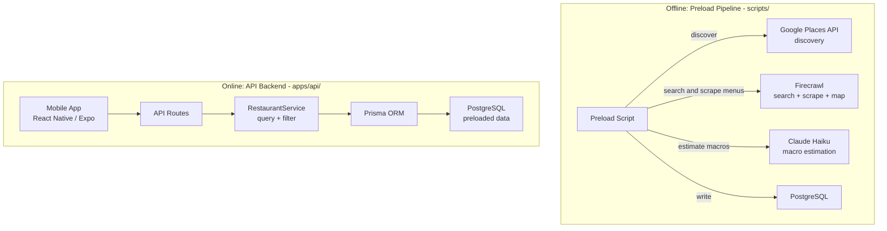
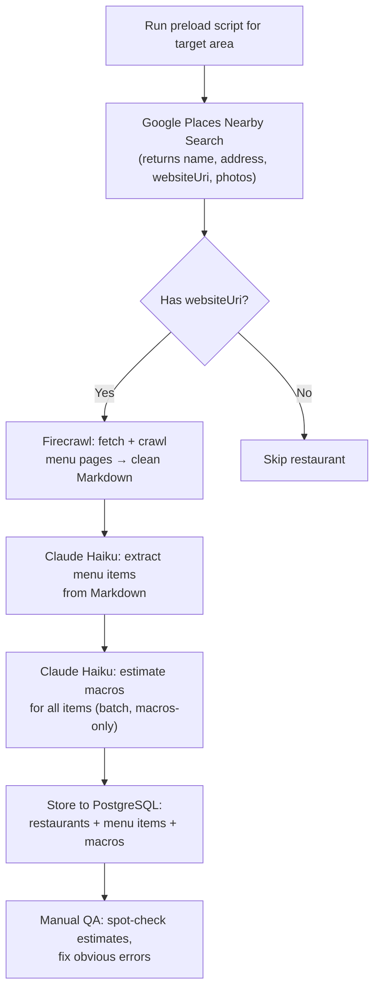
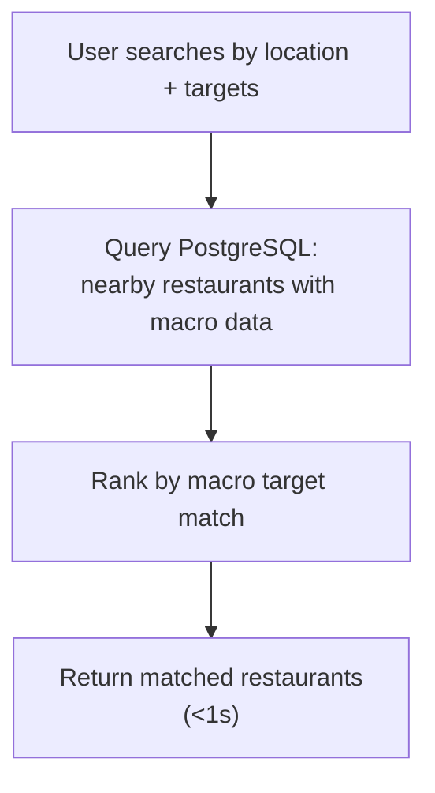
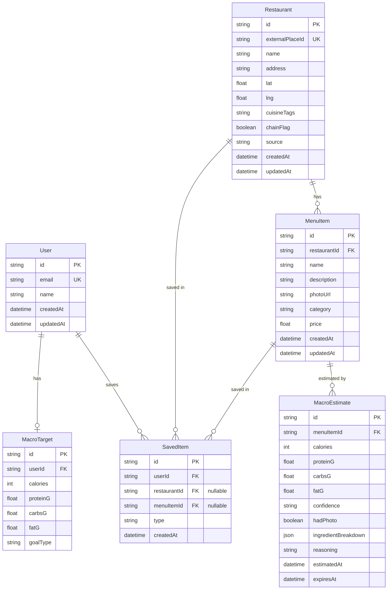

# System Design — Spec Outline

> **Status**: DRAFT — awaiting human review before full write-up.
> **Author**: CTO
> **Date**: 2026-03-22

---

## 1. System Overview

Fitsy is a macro-aware restaurant discovery app. Users search by location and
macronutrient targets; the app returns nearby restaurants with meals matching
their goals.

**Architecture:** React Native (Expo) mobile client + Next.js API backend
(monorepo), Prisma ORM, PostgreSQL.

**Key insight: the API backend does not scrape or estimate macros at runtime.**
All restaurant and macro data is preloaded offline by a batch script. The API
backend is a read-only query layer over a pre-populated database.

### 1.1 Two Separate Systems

### 1.2 Preload Pipeline (Offline)

Runs as a script (`scripts/`), not as a production service. Calls external APIs
directly — no service wrappers needed. Writes results to the database.

| Component | Purpose | Used at runtime? |
|-----------|---------|-----------------|
| Google Places API | Discover restaurants by location | No — preload only |
| Firecrawl (search) | Find menu URLs on third-party sites | No — preload only |
| Firecrawl (scrape/map) | Fetch menu page content as Markdown | No — preload only |
| Claude Haiku | Estimate macros from menu text | No — preload only |

**Pipeline flow (validated in scraping spike, see `docs/engineering/backend/scraping-spike.md`):**

1. **firecrawl_search** — search "{name} {city} menu" with `scrapeOptions` → returns URLs + pre-scraped markdown from aggregators (Grubhub, Yelp, zmenu, etc.)
2. **Claude Haiku** — extract menu items and estimate macros from markdown
3. **Fallback: firecrawl_map** — if search fails and restaurant has a website, discover menu pages on the site
4. **Fallback: firecrawl_scrape** — scrape the restaurant homepage directly
5. **Fallback: screenshot + Claude Vision** — for image-based menus (BentoBox, etc.)
6. **Skip + flag** — ~5-10% of restaurants have no extractable menu

### 1.3 API Backend (Online)

The Next.js backend is a **read-only query layer**. No external API calls at
request time. No scraping, no LLM calls, no macro estimation.

| Component | Purpose |
|-----------|---------|
| `RestaurantService` | Query restaurants by location, filter by macros/cuisine/chain |
| Prisma ORM | Database access |
| PostgreSQL | Preloaded restaurant + menu + macro data |

**Service wrappers in `apps/api/services/`:**
- `restaurant.ts` — query, filter, rank restaurants and menu items
- No scraping service, no Claude service, no macro estimation service at runtime

**Future (post-MVP):** On-demand ingredient breakdown may add a Claude service
wrapper for Phase 2 estimation (when user taps a specific meal). This is not
needed for MVP-0.

### 1.4 External Dependencies Summary

| Service | Used by | When |
|---------|---------|------|
| Google Places API | Preload script | Offline batch only |
| Firecrawl API (search, scrape, map) | Preload script | Offline batch only |
| Claude API (Haiku) | Preload script | Offline batch only |
| Claude API (Haiku) | API backend | Post-MVP only (on-demand ingredient breakdown) |

Deployment topology (to be determined)

---

## 2. Data Pipeline

### 2.1 Pipeline Overview (MVP)
Three-stage pipeline: discover restaurants → scrape menus → estimate macros.

- **Discovery**: Google Places Nearby Search returns restaurants with `websiteUri` included (no Place Details call needed)
- **Menu scraping**: Firecrawl fetches restaurant websites and returns clean Markdown. Handles JS-rendered sites, anti-bot, proxies.
- **Macro estimation**: Claude Haiku estimates macros for all menu items in a single call per restaurant. Returns structured JSON with macros per item.
- **Two-phase estimation**: Batch preload returns macros only (cheap). Ingredient breakdown loaded on-demand when user taps a meal (separate Haiku call).
- **Model**: Claude Haiku 4.5 — tested at ~$0.0005/restaurant, ~1.7s latency, accurate within ±20% for common items.
- All results cached in PostgreSQL. Once estimated, cost drops to $0.

### 2.2 MVP-0: Preload Only (No Live Scraping)

The app serves entirely from a pre-populated database. No live scraping, no real-time estimation, no progressive loading. Every search is a database query — instant.

**Preload script (run once, offline):**

**User search flow (production):**

**MVP-0 scope:**
- Target area: a few zip codes in LA (e.g., DTLA / Little Tokyo / Arts District)
- ~200-500 restaurants preloaded
- Cost: ~$2-5 total
- Manual QA before users see data
- Preload is a script, not a production service

### 2.3 Two-Phase Macro Estimation

**Phase 1 — Batch macros (preload or first search):**
- Input: all menu items for a restaurant (names + descriptions)
- Claude Haiku returns compact JSON: `[{n, cal, p, c, f}]`
- ~240 input tokens, ~320 output tokens per restaurant
- Cost: ~$0.0005/restaurant
- Used for ranking and display in restaurant list

**Phase 2 — Ingredient breakdown (on-demand):**
- Triggered when user taps into a specific meal
- Separate Haiku call for that one item with full ingredient breakdown
- Cost: ~$0.001/call
- Most users view 2-3 meals per session → pay for ~5% of items

### 2.4 Scraping Design (High-Level)

_Full scraping spec required during implementation sprint. Multi-page menu navigation is the hardest problem — most restaurant sites require hopping from homepage → menu page → subpages (lunch/dinner/drinks). The dedicated spec must define the crawling strategy, credit budget per restaurant, and failure handling._

**Constraints:**
- MVP scope: **Los Angeles only** (~25k restaurants)
- Respect robots.txt on all sites
- Rate limit: max 2 requests/second per domain
- No scraping behind logins, paywalls, or CAPTCHAs
- Store menu data only (name, description, price) — no personal data

**Scraping pipeline:**
1. Google Places Nearby Search → restaurant list with `websiteUri`
2. Firecrawl API → fetch + crawl pages, handle JS rendering, return clean Markdown
3. Claude Haiku → extract menu items from Markdown (or use schema.org `Menu` structured data when available — some sites embed this, e.g., Los Tacos No.1)

**Multi-page navigation (to be detailed in scraping spec):**
- Most restaurants require 2-3 page fetches (homepage → menu → subpages)
- Budget: ~2-3 pages per restaurant

**Scraping tool:**
- MVP: **Firecrawl** (managed, no infra — $83/mo for 100k credits)
- Post-MVP: swap to **Crawl4AI** (open source, self-hosted via Docker, $0 software cost) or DIY Playwright + Turndown. Saves ~$1,800 at USA scale.
- Scraping service must be behind an interface so the provider is swappable without changing business logic.

**HTML preprocessing:** Firecrawl returns clean Markdown, which reduces token consumption by 20-30% vs raw HTML and removes nav/ads/boilerplate. Industry standard for LLM ingestion.

**Exit criteria before launch:**
- Menu extraction rate: >60% of restaurants in target area have parseable menus
- Macro accuracy: spot-check 50 chain items against published nutrition, within ±20% on calories
- All results served from cache in <1s

### 2.5 Cost Model

**MVP-0 preload (few zip codes in LA, ~200-500 restaurants):**

| Component | Cost |
|---|---|
| Google Places Nearby Search | $1-2 |
| Firecrawl (~1,500 pages) | $1-2 |
| Claude Haiku | $0.25 |
| **Total** | **~$2-5** |

**Full LA preload (~25k restaurants):**

| Component | Cost |
|---|---|
| Google Places Nearby Search (1,250 searches) | $40 |
| Firecrawl (~75k pages at ~3/restaurant) | $63 |
| Claude Haiku (25k restaurants, macros-only) | $11 |
| **Total** | **~$114** |

**USA scale (~750k restaurants):**

| Component | Cost |
|---|---|
| Google Places Nearby Search | $1,200 |
| Firecrawl (~2.25M pages, or Crawl4AI at ~$50-100) | $100-1,868 |
| Claude Haiku (750k restaurants) | $340 |
| **Total** | **~$1,640-3,408** |

**Ongoing costs:** ~$0. Serving from cache only. Cache refresh and on-demand ingredient breakdown are post-MVP.

### 2.6 Scaling Strategy (Post-MVP)

**Expand preload coverage:**
- MVP-0: few zip codes in LA (~500 restaurants, ~$5)
- MVP-1: all of LA (~25k restaurants, ~$114)
- Scale: all of USA (~750k restaurants, ~$1,640-3,408 one-time)
- Preloading all of USA is feasible and avoids building a live pipeline entirely. At ~$1,640 with Crawl4AI, it's cheaper than a month of live scraping infrastructure.

**Live scraping pipeline (consider if needed):**
- Only needed if we can't preload fast enough for demand (e.g., expanding to new cities faster than preload can run)
- Adds significant complexity: real-time Firecrawl orchestration, error handling, latency management
- If built: show restaurant list immediately, macros fill in as estimation completes (~3-4s/restaurant)
- Recommendation: preload aggressively, avoid live pipeline as long as possible

### 2.7 Post-MVP Accuracy Upgrades

In priority order:

1. **On-demand ingredient breakdown**: Separate Haiku call when user taps a meal — shows reasoning behind the estimate.
2. **USDA cross-validation**: Run ingredient breakdown through USDA FoodData Central in background. Flag discrepancies >15%.
3. **Verified data layer**: Search for restaurant-published nutrition data. When found, use instead of LLM.
4. **Prompt calibration loop**: Log LLM estimates vs verified data for chains. Use divergence patterns to improve prompts.
5. **User corrections**: Let users flag "this doesn't look right" — feeds into prompt tuning.
6. **Confidence scoring model**: Score based on: known chain? description detail? photo available? common ingredients?
7. **Extended retrieval**: Web search fallback for restaurants without websites. Google Places photo menu extraction via Claude vision.
8. **Cache refresh**: Periodic re-estimation on a schedule. Low priority — menus rarely change.
9. **Fine-tuned model**: Once we have enough estimates + user corrections as training data, fine-tune a small model for near-zero inference cost.

---

## 3. API Architecture

The Next.js backend is API-only — no server-rendered pages. All endpoints serve JSON and are consumed by the React Native (Expo) mobile client.

### 3.1 Endpoint Inventory
- `GET /api/restaurants` — discover nearby restaurants (lat/lng, radius, filters)
- `GET /api/restaurants/[id]` — restaurant detail with menu items
- `GET /api/restaurants/[id]/menu` — menu items with cached macros
- `POST /api/meals/estimate` — on-demand macro estimation for a menu item
- `GET /api/user/targets` — retrieve user's macro targets
- `PUT /api/user/targets` — update macro targets
- `GET /api/user/saved` — saved restaurants / meals
- `POST /api/user/saved` — save a restaurant or meal

### 3.2 Request/Response Patterns
- Standard JSON envelope: `{ data, error, meta }`
- Pagination: cursor-based for list endpoints
- Error shape: `{ "error": "message" }` with HTTP status codes
- Macro results always include `{ confidence, hadPhoto, estimatedAt, ingredientBreakdown }`

### 3.3 Query and Filtering

**Distance filtering (hard cutoff):**
- `radius` param: user-configurable max distance (1mi, 3mi, 5mi, 10mi). Default: 3mi.
- PostGIS `ST_DWithin` query on restaurant `(lat, lng)` — only returns restaurants within the radius.
- Distance is a **filter**, not a ranking signal.

**Ranking (by macro match quality):**
- Primary sort: **macro match score** — how closely a restaurant's best menu item matches the user's macro targets.
- Match score calculation: for each menu item, compute distance from user targets across all specified macros (calories, protein, carbs, fat). Restaurant score = best item score.
- A restaurant 2mi away with a perfect macro match ranks above one 0.5mi away with a poor match.
- Tie-breaking: number of matching items (more options = better), then distance.

**Additional filters:**
- Cuisine type (multi-select)
- Chain vs. independent
- Confidence tier (optional: only show high-confidence estimates)

**Match score formula (to be refined during implementation):**
- Normalize each macro dimension by the user's target
- Weighted Euclidean distance: `sqrt(w_cal * (cal_diff/target)^2 + w_p * (p_diff/target)^2 + ...)`
- Only compute on dimensions the user specified (skip unset fields)
- Lower score = better match

---

## 4. External Service Integration

### 4.1 Integration Principles
- **Preload script**: calls external APIs directly (no wrappers needed — it's a batch script, not a service)
- **API backend**: no external API calls at runtime for MVP-0. All data served from DB.
- **Post-MVP**: if on-demand estimation is added, Claude calls go through a service wrapper in `apps/api/services/`
- No raw external API types leak into business logic

### 4.2 Google Places API (New)
- Purpose: restaurant discovery by location, metadata, `websiteUri`
- Endpoints used: Nearby Search (returns websiteUri — no Place Details needed)
- Cost: $0.032 per Nearby Search call (returns up to 20 results)
- Response mapping to internal Restaurant model

### 4.3 Firecrawl API (Preload Only)
- Purpose: find and scrape restaurant menus for the preload pipeline
- **Three endpoints used:**
  - `POST /v1/search` — web search with `scrapeOptions` (search + scrape in one call). Primary discovery mechanism — finds menus on aggregators (Grubhub, Yelp, zmenu, allmenus) without needing to know the restaurant's website.
  - `POST /v1/map` — discover all pages on a restaurant's website, filtered by "menu". Fallback when search doesn't find a third-party source.
  - `POST /v1/scrape` — scrape a single URL for Markdown. Fallback for homepage scraping and screenshot capture.
- Handles: JavaScript-rendered sites, anti-bot, proxies
- Returns: clean Markdown (20-30% fewer tokens than raw HTML), or screenshots for image-based menus
- Cost: ~$0.002/search, $0.00083/scrape, $0.00083/map
- **Not used at runtime** — preload pipeline only

### 4.4 Claude API (Haiku 4.5)
- Purpose: macro estimation from menu text
- **Preload (MVP-0)**: Extract menu items and estimate macros from scraped Markdown. One Haiku call per restaurant. Returns structured JSON with item name, calories, protein, carbs, fat, confidence tier.
- **On-demand (post-MVP)**: Full ingredient breakdown when user taps a specific meal. Requires a Claude service wrapper in `apps/api/services/`.
- Cost: ~$0.001/restaurant (preload), ~$0.001/item (on-demand breakdown)
- Latency: ~1.7s per call
- **Not used at runtime for MVP-0** — all estimates precomputed and stored in DB
- Prompt versioning strategy (prompts are a core asset — version and track changes)

### 4.5 Yelp Fusion API (Optional, post-MVP)
- Purpose: supplementary restaurant data, reviews, photos
- When to use: fallback if Google Places data is insufficient

---

## 5. Data Model / Database Schema

### 5.1 Core Entities
- **User**: id, email, name, auth fields, created/updated timestamps
- **MacroTarget**: userId (FK), calories, proteinG, carbsG, fatG, goal type
- **Restaurant**: id, externalPlaceId, name, address, lat, lng, cuisine tags, chain flag, source, created/updated
- **MenuItem**: id, restaurantId (FK), name, description, photoUrl, category, price, created/updated
- **MacroEstimate** (cache): id, menuItemId (FK), calories, proteinG, carbsG, fatG, confidence (high/medium/low), hadPhoto (bool), ingredientBreakdown (JSON), reasoning (text), estimatedAt, expiresAt
- **SavedItem**: userId (FK), restaurantId or menuItemId (FK), type, created

### 5.2 Entity Relationship Diagram

### 5.3 Key Relationships
- User 1:1 MacroTarget
- User 1:N SavedItem
- Restaurant 1:N MenuItem
- MenuItem 1:N MacroEstimate (history; latest = active)

### 5.4 Indexes
- Restaurant: geospatial index on (lat, lng), index on externalPlaceId
- MenuItem: index on restaurantId, composite index on (restaurantId, name)
- MacroEstimate: index on menuItemId, index on expiresAt (for staleness queries)

---

## 6. Caching Strategy

### 6.1 Macro Cache Lifecycle
- **MVP-0**: All macro estimates are preloaded. No estimation at runtime. Every request is a DB read.
- **Post-MVP**: Staleness threshold of 14 days. Re-estimation on-demand when a stale record is accessed, or via periodic re-preload batch.
- No background jobs at MVP scale.

### 6.2 Cache Invalidation
- Explicit: admin or user flags an estimate as wrong
- Time-based: expiresAt field checked on read
- Source change: if restaurant menu is updated (detected via Place Details)

### 6.3 Application-Level Caching
- Start with **in-memory LRU cache** (no Redis at MVP). Monitor memory utilization and cache hit rate to know when to migrate.
- Restaurant search results: short-lived in-memory cache (~5 min TTL)
- Rate limit budgets tracked per service per time window

---

## 7. Error Handling and Resilience

### 7.1 External Service Failures
- Circuit breaker pattern per external service
- Retry policy: exponential backoff, max 3 retries for transient errors
- Timeout budgets: per-service configurable timeouts
- Graceful degradation: return restaurant without macros if estimation fails

### 7.2 Rate Limit Management
- Track remaining quota per API key per service
- Proactive throttling before hitting hard limits
- Queue and defer non-urgent requests when near limits
- Alert on sustained high usage

### 7.3 Pipeline Failure Modes
- LLM failure (timeout, error, malformed response): return "estimation unavailable", flag for retry
- LLM returns inconsistent data (ingredients don't sum to totals): accept LLM totals, flag ingredient breakdown as approximate
- Menu retrieval failure (website unreachable, no parseable menu): exclude restaurant from results

### 7.4 User-Facing Error Responses
- Consistent `{ "error": "message" }` format
- Never expose internal service details or API keys
- Actionable messages where possible ("try again", "results may be incomplete")

---

## 8. Performance Considerations

- All searches served from preloaded cache — target <1s response time
- Database query optimization: lean selects, avoid N+1 on menu item lists
- Geospatial index on restaurant (lat, lng) for fast nearby queries
- Connection pooling for database clients
- Response payload size: paginate menu items, lazy-load macro details

---

## 9. Security Considerations

- API keys stored in environment variables, never in code or the mobile app bundle
- All external service calls server-side only (no API key exposure to the mobile client)
- Secure token storage on device via `expo-secure-store` for auth tokens
- User input sanitization on search queries and filter parameters
- Rate limiting on public API routes to prevent abuse
- Authentication required for user-specific endpoints (targets, saved items)
- Macro estimates include confidence disclaimers — never present estimates as medical/dietary advice
- Audit logging for macro estimate corrections and cache invalidations
- HTTPS only; CORS configured to allow requests from the mobile client

---

## Resolved Questions

- **Database hosting**: Managed Postgres (Neon or Supabase) — free tier for MVP, PostGIS support for geospatial queries
- **Application caching**: In-memory LRU to start. Monitor utilization; migrate to Redis when needed.
- **Background jobs**: None at MVP. Cache refresh is a low-priority follow-up.
- **Photo sourcing**: Google Places only. No user uploads.
- **Pipeline approach**: Three-stage (discover → scrape → estimate). Single LLM call per restaurant for batch macros. Ingredient breakdown on-demand.
- **Estimation model**: Claude Haiku 4.5. Tested: accurate within ±20% for common items, ~1.7s latency, ~$0.0005/restaurant. Gemini Flash-Lite tested but less reliable (outlier estimates).
- **Scraping approach**: Firecrawl search + map + scrape pipeline (validated in spike, see `docs/engineering/backend/scraping-spike.md`). Firecrawl search with `scrapeOptions` is the primary discovery mechanism — finds menus on aggregator sites. Map and homepage scrape as fallbacks. No self-hosted headless browsers.
- **MVP geography**: Los Angeles only (90029 zip code for MVP-0). Preload cost: ~$0.25 for 50 restaurants.
- **Place Details not needed**: `websiteUri` is available directly from Nearby Search, saving $0.017/restaurant.
- **Two-phase estimation**: Macros-only for preload (cheap), ingredient breakdown on-demand post-MVP.
- **No runtime external API calls**: MVP-0 is preload-only. The API backend is a read-only query layer.
- **Menu extraction rate**: ~85-90% validated in spike (50 restaurants in 90029). Remaining ~10-15% are image-based menus or restaurants with no online presence.

## Open Questions

- [ ] Neon vs. Supabase — both work, pick before first migration
- [ ] Prompt structure: how many menu items can we batch per call while maintaining accuracy?
