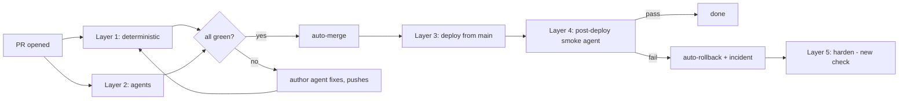

# Autonomous Shipping

> **Status:** Design, approved direction 2026-08-28 · **Owner:** CTO
> Goal: no human review in the merge path. Agents and deterministic checks are the reviewers. The check set grows every time something escapes.

## Principle

A human review gate is a fixed-cost check that never gets better.
An automated gate is a check that gets better every time it fails to catch something, because the miss becomes a new check.
The design below trades the first for the second and makes the growth loop mandatory, not aspirational.

Two rules make this safe:

1. **Nothing reaches `main` except through a PR with all required checks green.** Branch protection enforces this for humans and agents alike.
2. **Every escaped defect produces a check.** Not a fix alone: a fix plus a detector plus, where possible, a constraint that makes the class of bug unwritable. Tracked in the harness log; a PR that closes an incident without one is blocked by the review agent.

## The pipeline

### Layer 1: deterministic checks (CI, required)

Fast, binary, no judgment.
Everything here already exists except the items marked new.

| Check | Status |
|---|---|
| tsc, lint, build | exists |
| api + scripts unit tests with coverage gate | exists |
| mobile unit tests | **new** (16 test files never run in CI) |
| structural tests (`scripts/structural-tests.sh`) | exists; this is the growing checklist, see Layer 5 |
| secrets, .env, build-output scans | exists |
| single-domain routing | exists; **change:** `docs/` does not count as a domain |
| migration safety: `prisma migrate diff` must be additive unless the PR carries a reverse migration | **new** |
| native-change detector: `app.config.ts` or native deps changed → PR labelled `needs-binary`, `eas update` path disabled for that merge | **new** |

### Layer 2: agent checks (GitHub Actions, required)

Judgment calls, run as Claude Code in CI on every PR.
Each agent posts findings as a PR comment and sets a check status.
A `CONFIRMED` correctness finding fails the check; `PLAUSIBLE` findings are comments only.

| Agent | Trigger | What it does | Blocks on |
|---|---|---|---|
| **Review** | every PR | `/code-review high` with an adversarial verify pass; each finding refuted by an independent verifier before it counts | confirmed correctness bug |
| **Spec conformance** | every PR | reads the linked spec or ticket, extracts its invariants, checks the diff and tests against them; flags scope that is not in the spec | invariant with no test; unspecified behavior change |
| **Danger zone** | paths under auth, subscriptions, macro estimation, external API clients | second review with the danger-zone lens from `CLAUDE.md` (auth bypass, false precision, rate limits, resume) | any confirmed finding |
| **Mobile E2E** | `apps/mobile/**` | boots the simulator on the PR bundle, drives the changed flow with mobile-mcp, attaches screenshots; pixel-level diff of touched screens against main | flow fails; unexplained visual diff |
| **Harness audit** | PR closes an incident (label `incident`) | confirms the PR adds a detector and, where feasible, a constraint; refuses a fix-only PR | missing detector |

Self-review bias is the known weakness: the review agent runs on the same model family as the author.
Mitigations: a different system prompt and lens per agent, the refute-first verifier panel, and Layer 1 catching the mechanical classes regardless.
The escape rate in Layer 5 tells us whether this is enough.

### Layer 3: deploy from main (automatic)

Deploys are derived from the merged diff, never from memory.

| Path changed | Action (GitHub Action on push to main) |
|---|---|
| `prisma/migrations/**` | `prisma migrate deploy` against prod before the Vercel build completes; failure blocks the deploy and pages Slack |
| `apps/api/**` | Vercel auto-deploy (exists) |
| `apps/mobile/**`, no `needs-binary` label | `eas update --branch production --message "<sha7>: <title>"` |
| `needs-binary` | no OTA; open a `release` ticket; tag-triggered `eas-build.yml` handles the binary |

### Layer 4: post-deploy smoke (agent, automatic)

Runs after each production deploy.
Hits `/api/health`, then the routes the merged diff touched (derived from `apps/api/app/api/**` paths), with the review demo account.
For mobile updates: confirms the update group is live and boots the simulator on the published bundle for one search.
On failure: promotes the previous Vercel deployment or republishes the previous EAS update group, opens an `incident` issue with the diff and logs, posts to Slack.
Rollback first, diagnosis second.

### Layer 5: the growth loop

This is the part that replaces human judgment over time.

**Inputs** (anything that got past the gates):

- Slack API error alerts and mobile `client_error` events attributable to a deploy
- feedback notes categorized as Bug in triage
- App Store reviews mentioning a defect
- smoke failures and rollbacks
- review-agent findings that were `PLAUSIBLE` and turned out real

**Process:** each input becomes an `incident` issue with three required fields:

1. **Fix**: the code change.
2. **Detect**: a test, structural check, or agent rule that would have failed the original PR. Named in the issue and the PR.
3. **Constrain**: a lint rule, type, or structural invariant that makes the class unwritable, or an explicit "not feasible because ...".

The harness-audit agent (Layer 2) blocks the closing PR until 1 and 2 are present and 3 is addressed.

**Where checks live**, by kind:

| Kind of miss | Goes into |
|---|---|
| mechanical (a route lost its auth guard, a page missing) | `scripts/structural-tests.sh` |
| logic | unit test next to the code |
| judgment (a class of bug the review agent should look for) | `.claude/agents/reviewer-lenses.md`, read by the review agent every run |
| flow | mobile E2E scenario list |

**Metric:** escaped defects per week, split by which layer should have caught them.
Reviewed in the Monday scoreboard once the count is non-zero.
Target: trending down while PR volume holds; if it rises two weeks running, tighten the layer that leaked.

## Shipyard settings after this lands

| Knob | Value | Enforced by |
|---|---|---|
| human-review-gate | **off** | branch protection: required checks only, no required reviewers |
| spec-requirement | always | spec-conformance agent |
| auto-merge | on-green | GitHub auto-merge, required checks = Layers 1 and 2 |
| harden-on-incident | required | harness-audit agent + `incident` label |

`docs/engineering/tuning-guide.md` needs the new knob and the "enforced by" column; a knob with no mechanism is documentation, not a setting.

## Rollout order

1. Branch protection on `main`: PR required, required checks = current `ci.yml` jobs, no direct pushes (admins included). Nothing else works without this.
2. Layer 1 additions: mobile tests, docs exempt from domain check, native-change detector, migration safety.
3. Review agent as a required check, with the refute panel.
4. Layer 3 deploy workflows (migrations, `eas update`).
5. Layer 4 smoke agent with auto-rollback.
6. Spec-conformance and danger-zone agents.
7. Harness-audit agent, `incident` label, escaped-defects metric on the scoreboard.
8. Mobile E2E agent last; most expensive, gate it on path filters and keep the scenario list small.

Steps 1-2 are an afternoon.
Steps 3-5 are each a small PR.
Steps 6-8 are where the design earns its keep and should follow the first few real incidents, so the agents are tuned on actual misses rather than imagined ones.

## Known costs

- CI wall time rises: budget 8-12 minutes per PR with agents; mobile E2E adds more, hence the path filter.
- Token spend per PR: review + verifiers roughly 100-200k tokens at high effort; acceptable at current PR volume, revisit above ~30 PRs/week.
- A confident-but-wrong agent can block a good PR. The escape hatch is a `override-check` label that requires a written justification in the PR and is itself logged as a Layer 5 input.
