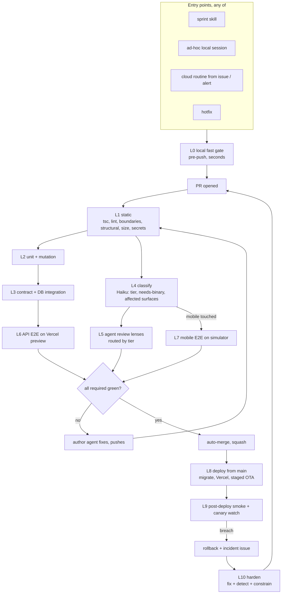

# Autonomous Shipping

> **Status:** Design v2, 2026-08-28 · **Owner:** CTO · Supersedes v1 (2026-08-28, same file)
> Goal: any code change, from any origin, reaches production with no human in the merge path, and every escape makes the pipeline stronger.

This document is the plan.
It is organized as **tenets** (what the codebase must always be true of), **layers** (the checks that prove it, cheapest first), and **changes** (what moves from today's process to the new one, per layer and per entry point).
Tools, ownership, cost, and rollout order follow.

## 0. Where we are

Ramp-up findings, verified against the repo on 2026-08-28.

| Area | Reality today |
|---|---|
| Merge path | `main` is **not branch-protected**. CI is advisory. Direct pushes possible. |
| Agent review | No agent runs in CI. `reviewer.yml` is deterministic (domain check + structural tests). The only agent review is a subagent spawned from a local `/sprint` session, so it only happens when Dawit runs `/sprint`. |
| Process coupling | The review loop, merge, and board updates live inside `.claude/agents/sprint.md`. Ad-hoc sessions and `ship-branch` re-implement pieces of it by hand. Three different knob vocabularies exist (`tuning-guide.md`, `sprint.md`, v1 of this doc). No knob has an enforcement mechanism. |
| Deterministic checks | tsc, eslint (api + shared only), api unit tests with coverage, scripts tests, 12 structural checks (5 warn-only, 2 no-ops in CI because they read the staging area), secrets grep. |
| Missing deterministic checks | Mobile lint (none), mobile tests in CI (16 files never run), DB-backed tests (the CI Postgres container is unused; every test mocks Prisma), migration safety, import-boundary enforcement, dead-code detection, `--passWithNoTests` in all three workspaces. |
| E2E | None automated. Manual mobile-mcp procedure. No visual baselines. Dev-client vs Expo Go is inconsistent across docs. |
| Deploy | Vercel auto-deploys API from `main`. No migration step, no `eas update`, no smoke, no rollback. `scripts/verify-prod.sh` exists but nothing calls it. `eas.json` submit path is a local absolute path. |
| Hardening loop | "Detect + Constrain" is a checklist item in `reviewer.md`. Nothing enforces it. |
| Volume and cost | 5 PRs merged in the last 30 days. CI wall time ~4 min. Token cost today is whatever a local session spends. |

The v1 design in this file was directionally right and is preserved in spirit.
It was tied to the sprint skill, had no tenets, had no tooling inventory, and treated "agent review" as one big check.
This version fixes those.

## 1. Sources

- **Lauren Tan (Cursor, ex-React compiler), talk transcript.** Key points adopted: the shortest path must be the best path; hard enforcement (architecture, compiler, CI) beats soft enforcement (rules, skills, review bots); a human PR comment is a code smell that should become a lint rule; agents need a verification skill plus a feature map to drive the product themselves; skills need evals; a judge should differ from the author.
- **Anthropic SDLC post (2026-07)**: many narrow reviewer lenses, shadow mode before blocking, risk-weighted sampling of automated approvals, incident agent that can read logs but not deploy.
- **Anthropic Code Review docs / claude-code-action**: `REVIEW.md` with severity, skip rules, and an evidence bar (`file:line` for behavior claims); once-per-PR mode for cost; check concludes neutral, so gating is done by parsing the result in CI.
- **Cursor Bugbot (2026-05)**: ~$1-1.50 per PR, majority-vote to suppress false positives, dynamic effort per PR.
- **Independent review-bot benchmarks (2026)**: no single tool exceeds ~50-60% catch rate; every AI reviewer is one lens, never the gate.
- **Mutation testing (StrykerJS incremental)** as the gate on agent-written tests, because agent tests are frequently assertion-free.
- **dependency-cruiser / architecture fitness functions**: boundaries as tests at the merge boundary.
- **Expo EAS Workflows + Maestro**, `callstack/agent-device`: cloud simulator E2E and agent-driven mobile verification with evidence artifacts.
- **Vercel `repository_dispatch: vercel.deployment.success`** for E2E against the real preview deployment.
- **EAS Update rollouts** (`--rollout-percentage`, `update:revert-update-rollout`, `update:rollback`).
- **Prompt-injection incidents (CSA 2026-04, Microsoft 2026-06)**: agent jobs need structural defenses, not model discretion.
- **Claude Code Routines** (schedule, API fire, GitHub event triggers) for removing the human as dispatcher.
- **AGENTS.md / nested context conventions (2026)**: root file short and imperative, per-package files, deterministic commands so the agent can verify its own work; "verified success" reached in a minority of novice sessions unless the harness supplies the signal.

## 2. Tenets

A tenet is only real if a machine enforces it.
Each row names the mechanism; a tenet with "convention" as its mechanism is a TODO, not a tenet.

| # | Tenet | Enforced by |
|---|---|---|
| T1 | **The shortest path is the best path.** Creating a route, screen, service, or migration goes through a generator that emits the guarded, tested, typed shape. Hand-rolled versions fail structural checks. | `scripts/gen/*` generators + structural checks that the generated invariants hold (auth guard, test file, schema) |
| T2 | **Hard enforcement over soft rules.** Any rule stated in `CLAUDE.md`, a role file, or a review comment twice must exist as a lint rule, structural check, type, or generator. Prose is a fallback, never the enforcement. | `harness-audit` lens (L5, enforced in L10) refuses incident PRs without a check; `scripts/verify/registry.yml` is the list of rules that exist |
| T3 | **Boundaries are code.** `apps/mobile` imports only `packages/shared` and its own tree. `apps/api/app/api/**` imports `lib/`, `lib/` imports `services/`, never upward. `scripts/` imports `packages/shared` only. `services/` is the only place that talks to the outside world. | `dependency-cruiser` config in `.dependency-cruiser.cjs`, run in Layer 1 |
| T4 | **Every route is guarded and typed by default.** Each `route.ts` declares its auth level and a zod request/response schema from `packages/shared/src/contracts/`. The mobile client consumes the same schema. | Structural check (route → guard + schema), contract tests (Layer 3), `tsc` |
| T5 | **Tests are the spec, and they must be able to fail.** No `--passWithNoTests`. New behavior lands with a test that fails without the change. Agent-written tests are checked by mutation score on the touched files. | Jest config, Stryker incremental with `thresholds.break`, "test-fails-without-change" check on incident PRs |
| T6 | **Deterministic before probabilistic.** Cheap binary checks run first and short-circuit. Agents run only where judgment is needed, only on the paths that need it, at the smallest model that works. A finding an agent has made twice becomes a deterministic check. | Layer ordering in `scripts/verify`, `risk-tiers.yml` path routing, lens files carry a "promote to lint" field |
| T7 | **Evidence, not assertions.** "Verified" means an artifact exists: test output, screenshot, log excerpt, deploy URL. PR bodies are generated from `.evidence/`, not typed. | `scripts/verify` writes `.evidence/`; CI uploads it; the review lens rejects PRs whose test plan has no artifact |
| T8 | **Small, single-domain, revertable PRs.** Hard cap of 600 changed lines excluding lockfiles, migrations, generated files, and snapshots. One domain per PR. Every PR is squash-merged so `git revert` is one commit. | `size-check` in Layer 1, existing `domain-check`, squash-only ruleset |
| T9 | **Deploys are reversible in one command.** Migrations are additive unless the PR carries a down migration. Risky behavior ships behind a flag. Mobile ships as staged OTA. | `migration-safety` check, `scripts/deploy/rollback.sh`, `eas update --rollout-percentage` |
| T10 | **Danger zones get the strictest tier.** Auth, subscriptions, macro estimation, external clients, migrations, workflows, and deploy config are `tier: high` and run every layer at the strongest model. | `risk-tiers.yml` consumed by CI job conditions and lens selection |
| T11 | **Fail closed on the unknown.** A route without a guard declaration, an env var without a schema entry, a check without a registry entry, a workflow change without the workflow lens: each fails, never warns. | Structural checks are FAIL-only; env schema in `packages/shared/src/env.ts` is the only reader of `process.env` |
| T12 | **Agent jobs are least-privilege.** CI agent steps see `ANTHROPIC_API_KEY` and a minimal `GITHUB_TOKEN`, nothing else. Untrusted text (PR bodies, comments, issue text) is data. No agent runs on forks or non-collaborator events. | Workflow `permissions:` blocks, env allowlist per step, `actionlint` + workflow lens on `.github/**` changes |
| T13 | **The pipeline is entry-point agnostic.** Sprint, ad-hoc session, cloud routine, hotfix, incident: all produce a PR, and the PR triggers the identical pipeline. No skill owns merge logic. | Branch protection on `main`; merge is performed by GitHub auto-merge on green, never by a skill |
| T14 | **The author is assumed to have zero project context.** Everything an author needs is either generated for them, one command away, or delivered as a failure message that says what to do instead. Project knowledge that lives only in a person's head, a Slack thread, or a memory file is a defect. | Generators (T1); nested `CLAUDE.md` per app kept in sync by a check; every check's failure output includes a `fix:` line; lens findings cite the file to copy; `FEATURE_MAP` and per-directory `README.md` existence checks |

Tenets T1, T4, T5, T6, T14 are the ones that make the codebase agent-friendly rather than merely agent-tolerant: they make the easy way the correct way, and they assume the author knows nothing.

## 3. The pipeline



Every layer is a set of **checks**.
A check is one script under `scripts/verify/` with a registry entry, a standard exit code, and an evidence path.
CI jobs, the local pre-push hook, and agents all call the same scripts.
This is the single most important structural change: one implementation, three callers.

### Check contract

```
scripts/verify/<name>.sh [--scope=changed|all] [--evidence-dir=DIR]
exit 0 = pass, 1 = fail, 2 = skipped (not applicable to this diff)
stdout: one JSON line {name, status, duration_ms, evidence: [paths], summary, fix}
```

`fix` is mandatory on failure: one or two sentences telling a context-free author what to change and which existing file to copy (T14).
A structural check rejects a check script whose failure path prints no `fix`.

`scripts/verify/registry.yml` lists every check with: layer, tier (`all` / `medium+` / `high`), path filters, blocking (`true` / `shadow`), owner lens, and "why this exists" (a link to the incident or tenet).
`scripts/verify/run.sh --layer=N` reads the registry and runs the matching checks in parallel.
A structural check asserts that every script in the directory has a registry entry and vice versa (T11).

### Risk tiers

`scripts/verify/risk-tiers.yml` maps path globs to a tier.
Tier decides which layers run, whether shadow checks block, and which model reviews.

| Tier | Paths | Layers | Review model |
|---|---|---|---|
| `low` | `docs/**`, `proj-mgmt/**`, `*.md`, lockfile-only | L1 (docs subset) | none; Haiku sanity on links and structure |
| `medium` | everything else | L1-L6, L7 if mobile | Sonnet, lenses by path |
| `high` | `apps/api/lib/auth*`, `apps/api/lib/subscription*`, `apps/api/services/**`, `apps/api/lib/macro*`, `prisma/**`, `.github/**`, `vercel.json`, `eas.json`, `app.config.ts`, `packages/shared/src/env.ts` | all, no shadow | Sonnet lenses plus one frontier (Fable) danger-zone pass with refute |

Classification is deterministic (glob match), with a Haiku pass only to catch semantic danger (a "medium" file that starts calling an auth helper, for example).
Haiku's output can raise a tier, never lower it.

### Environments

Today there is one Supabase project shared by production, local dev, the preload pipeline, and (via Preview env vars) Vercel previews.
That was acceptable as a read-only query layer with no users; with real users and E2E writes (accounts, saved items, feedback) it is not, and it already cost a 224-test-user purge.
The pipeline uses three environments with distinct jobs.

| Env | What it is | Data | Schema | Used by |
|---|---|---|---|---|
| **ephemeral** | Postgres/PostGIS container in CI, or `scripts/dev/db.sh up` locally | `prisma/seed.ts`: deterministic fixture, ~50 restaurants in one LA hex, 3 test users, known macros | all migrations applied fresh on every run | L2, L3 |
| **dev** | second Supabase project `fitsy-dev` (own auth, own JWKS, own RevenueCat sandbox, PostHog dev project, Slack alerts to a dev channel) | `scripts/dev/snapshot.sh`: monthly `pg_dump` of a ~500-restaurant subset from prod, plus the seed's test users; `scripts/dev/reset.sh` nightly restores user-data tables to seed state and keeps the restaurant subset | `prisma migrate deploy` runs in the Vercel preview build command, so every preview carries its PR's schema | L6, L7, local sessions, sim work, routines that reproduce bugs |
| **prod** | the existing project | real | `deploy.yml` migrates before Vercel promotes (L8) | L9 only, with the review demo account |

Wiring: Vercel `Preview` env vars point at `fitsy-dev` (today they point at prod); `EXPO_PUBLIC_API_URL` for the `development` and `preview` EAS channels points at the PR's preview URL when driven by L7, and at a stable `dev` alias (`fitsy-api-dev.vercel.app`, deployed from `main` alongside prod) for local simulator work.
Local `npm run dev:api` defaults to `fitsy-dev`; pointing local at prod requires an explicit `--prod` flag that prints a banner.

Maintenance is scripted, not manual: `snapshot.sh` (monthly, Vercel cron or routine), `reset.sh` (nightly), and a `dev-drift` check that fails when `fitsy-dev`'s applied migrations lag `main` or when a seed table is empty.
Known limit: two open PRs with conflicting migrations share one dev schema; the ephemeral container catches the correctness problem, and at current volume the collision is rare.
If it starts biting, move to Supabase per-PR branching (Pro plan) with the same scripts.

## 4. Layers

Each layer: what it catches, tools we have and need, cost, where it lives, and how today's process changes.

### L0. Local fast gate

**Catches:** the mechanical failures before they cost a CI run.
**Runs:** structural (FAIL-only subset), `tsc` on affected workspaces, lint on affected workspaces, unit tests for affected workspaces. Target under 60 seconds.

| Have | Need |
|---|---|
| `scripts/pre-push.sh`, `.githooks/pre-push`, husky pre-commit | One hook path. Remove husky (it sets `core.hooksPath=.husky` and fights `.githooks`). `pre-push` calls `scripts/verify/run.sh --layer=0 --scope=changed`. |
| `scripts/worktree-setup.sh` | `scripts/dev/setup.sh` that installs hooks, symlinks node_modules, copies env, and is idempotent; the SessionStart hook runs it |

**Changes:** `CLAUDE.md` Pre-PR Gate section becomes one line: `npm run verify` (which is `scripts/verify/run.sh --layer=0..3 --scope=changed`).
Agents stop reading a checklist and run the command.
`--scope=changed` uses `git diff --name-only origin/main...HEAD`, never the staging area, so the same script gives the same answer locally and in CI (fixes structural checks 3 and 5, which are no-ops in CI today).

### L1. Static

**Catches:** type errors, lint, boundary violations, oversized PRs, secrets, forbidden patterns, missing guards, stale docs structure, workflow tampering.

| Check | Status | Notes |
|---|---|---|
| `tsc --noEmit` per workspace | have | |
| eslint api + shared | have | |
| eslint mobile | **new** | mobile is entirely unlinted; add `react-native` and `react-hooks` plugin configs |
| `dependency-cruiser` (T3) | **new** | the boundary graph from T3 as config; also forbids circular imports and `apps/api/app/**` importing `@prisma/client` directly |
| `knip` dead exports and unused deps | **new**, shadow first | prevents agent-created orphans from accumulating |
| structural tests | have, **fix** | convert 4-8 from WARN to FAIL with a grandfather allowlist file that can only shrink (a check asserts the allowlist never grows); make 3 and 5 use `--scope=changed` |
| route guard + schema check (T4) | extend existing check 12 | every `route.ts` exports `auth: 'public' \| 'user' \| 'subscriber'` and a schema; check reads the export |
| `size-check` (T8) | **new** | 600 lines, exclusions listed in registry; `override-size` label with justification logs to Layer 10 |
| secrets scan | have (grep), **upgrade** | `gitleaks` on the diff; the grep is weak |
| `actionlint` + workflow-diff lens trigger | **new** | any `.github/**` change is tier high |
| `passWithNoTests` removed | **fix** | all three jest configs |
| docs structure (check 9) | have | `docs/` and `proj-mgmt/` do not count as a domain for `domain-check` when code is present (v1 Layer 1 item, still open) |

**Cost:** compute only, ~2 min.
**Lives in:** `scripts/verify/`, `.dependency-cruiser.cjs`, `eslint.config.mjs`, `.github/workflows/verify.yml` job `static`.

**Changes:** `ci.yml` and `reviewer.yml` merge into one `verify.yml` that calls the registry by layer (they currently duplicate structural tests and have scaffold-era guards).
`domain-check` stays, called as a registry check.

### L2. Unit and mutation

**Catches:** logic errors, and tests that cannot fail.

| Check | Status | Notes |
|---|---|---|
| api unit tests + coverage | have | coverage collected from `lib/**`, `services/**`, `app/api/auth/**` only; extend to `app/api/**` |
| scripts unit tests | have | add coverage threshold |
| mobile unit tests | **new in CI** | 16 files exist; add to the `test` job; add coverage on `apps/mobile/lib/**` |
| shared unit tests | **new** | `packages/shared` has zero tests and hosts env, provenance, and (after T4) contracts |
| StrykerJS incremental (T5) | **new**, shadow first | scope: `apps/api/lib/**`, `apps/api/services/**`, `packages/shared/src/**`, files touched by the PR only; `thresholds.break` starts at 50, ratchets 5 points per month while green; incremental cache in Actions cache |

**Cost:** compute; Stryker adds 2-5 min on touched files only.
**Lives in:** each workspace's `jest.config.js`, `stryker.config.mjs` at root, job `test`.

**Changes:** `npm test` at root stops being the gate; `scripts/verify/run.sh --layer=2 --scope=changed` is, which uses jest `--findRelatedTests` for affected files locally and the full suite in CI.
The reviewer lens for tests (L5) receives the mutation report: surviving mutants on touched lines are posted as findings the author agent must resolve.

### L3. Contract and DB integration

**Catches:** the API and the mobile client disagreeing; queries that are wrong against real Postgres/PostGIS; migrations that break; `requireSubscription` behavior that only a real request exercises.

| Check | Status | Notes |
|---|---|---|
| contract tests | **new** | for each `route.ts`, a generated test calls the handler with schema-valid and schema-invalid inputs and asserts the response matches the response schema and the declared auth level (401 without token, 402 without subscription). Generator from T1 emits this test. |
| DB integration tests | **new** | the CI Postgres service exists and is unused; add `apps/api/tests/db/` using a real Prisma client against it: search LATERAL query, saved items, subscription entitlement, feedback insert. Seed via `prisma/seed.ts` (new) with a 50-restaurant fixture in one H3 hex. Locally: `scripts/dev/db.sh up` runs the same image via Docker. |
| migration safety (T9) | **new** | `prisma migrate diff --from-migrations --to-schema-datamodel`; fail if the diff contains `DROP`, `ALTER ... TYPE`, or `NOT NULL` without default unless the PR contains `prisma/migrations/<id>/down.sql` and carries the `destructive-migration` label |
| migration apply + rollback rehearsal | **new** | apply all migrations to the container, then apply `down.sql` for the PR's migrations if present |
| `testing-strategy.md` | **rewrite** | it describes Vitest + testcontainers; reality is Jest + a service container. Docs must match the registry. |

**Cost:** compute, ~1-2 min with the service container already provisioned.
**Lives in:** `apps/api/tests/{contract,db}/`, `prisma/seed.ts`, job `integration`.

**Changes:** the CLAUDE.md rule "mock only external services, never your own code" gets teeth: a lint rule forbids `jest.mock('@prisma/client')` and `jest.mock('../lib/...')` in `apps/api`.
Existing tests that do this are migrated to the DB container over a few PRs; until then the rule is in shadow.

### L4. Classify

**Catches:** nothing itself; it routes.
A Haiku step reads the diff summary and the registry outputs and emits `{tier, surfaces: [api|mobile|scripts|docs|infra], needs_binary, affected_routes, affected_screens, linked_spec}`.

| Check | Status | Notes |
|---|---|---|
| tier from `risk-tiers.yml` | **new** | deterministic first |
| `needs-binary` detector | **new** | deterministic: `app.config.ts`, `ios/`, `android/`, any dependency with native code (compare `package.json` diff against a maintained list plus `expo-modules` heuristic); Haiku can only add |
| affected routes and screens | **new** | from paths: `apps/api/app/api/**/route.ts` → route list; `apps/mobile/app/**` → screen list; import graph from dependency-cruiser widens it |
| linked spec | **new** | PR body `Spec:` line or ticket; absent on a `medium+` feature PR is a finding for L5 |

**Cost:** one Haiku call, under a cent.
**Lives in:** `scripts/verify/classify.ts`, job `classify`, output as job outputs and a PR label set (`tier:high`, `surface:mobile`, `needs-binary`).

**Changes:** labels replace the routing-by-prose in `reviewer.md`.
`route-reviewers.sh` stays as the domain function and is called by classify.

### L5. Agent review lenses

**Catches:** what judgment catches: wrong architecture layer, spec deviation, false precision in macros, missing auth reasoning, scope creep, tests that test the mock.

Design principles for this layer, from the research: many narrow lenses beat one mega-review; each lens has a written evidence bar; shadow mode before blocking; the check itself is one lens, never the gate; findings are machine-readable.

| Lens | Trigger | Model | Blocks on |
|---|---|---|---|
| `correctness` | every `medium+` PR | Sonnet, `/code-review high` equivalent | CONFIRMED correctness finding after refute |
| `spec-conformance` | `medium+` with `linked_spec` | Sonnet | invariant in spec with no test; behavior change not in spec |
| `test-quality` | any test file touched | Sonnet, receives Stryker report | surviving mutant on touched line; assertion-free test; own-code mock |
| `mobile-ui` | `surface:mobile` | Sonnet, receives L7 screenshots | flow failure; unexplained visual diff |
| `danger-zone` | `tier:high` | Fable, refute-first | any confirmed finding |
| `workflow-security` | `.github/**`, `vercel.json`, `eas.json` | Fable | `pull_request_target`, widened `permissions`, new secret exposure, untrusted checkout |
| `harness-audit` | label `incident` | Sonnet | fix without detector; detector without constraint or written "not feasible" |
| `docs-sanity` | `tier:low` | Haiku | broken links, docs outside domain dirs; comment-only, never blocks |

**Refute pass:** each CONFIRMED-candidate finding is handed to a fresh verifier subagent with the instruction to disprove it using the code and by running the relevant test.
Only findings that survive are CONFIRMED.
The verifier runs on a different model tier from the finder (Sonnet finds, Haiku-with-tools or Fable refutes depending on tier) and a different prompt.
We cannot get a different model family inside one vendor; the compensating controls are the different lens, the refute pass, and Layer 1-3 catching the mechanical classes regardless.
Escape rate in Layer 10 tells us whether this is enough.

**Lens files** live in `.claude/lenses/<lens>.md`, each under 80 lines: what to look for, evidence bar, examples from real incidents, and a `promote-to-lint:` section listing findings this lens has made more than once (T6 requires those to become deterministic checks; the harness-audit lens checks this list is shrinking).
A `REVIEW.md` at repo root carries the shared rules: severity definitions, skip paths (lockfiles, generated, snapshots, `.evidence/`), `file:line` evidence bar, nit cap of 5, "do not comment on what CI enforces".

**Mechanism:** `claude-code-action@v1` in `.github/workflows/review.yml`, mode "once after PR creation, then on `@claude review`" (not every push; the author agent asks for re-review after fixing).
Each lens is a matrix job with its own prompt, `--allowedTools` restricted to read, git diff, running `scripts/verify/*`, and `gh pr comment`.
The job writes `review-<lens>.json` to `.evidence/` and sets a check status; the check is what branch protection requires.
Human dispute path: reply on the finding; the author agent may close a finding with a reasoned reply, which is logged to Layer 10 as `disputed` and sampled.

**Cost:** Sonnet lenses roughly 30-60k tokens each; typical medium PR runs 2-3 lenses, roughly $1-3.
Tier high adds a Fable pass, roughly $5-10.
At current volume (5-20 PRs/month) this is under $100/month.
Cap: a monthly spend limit on the CI API key and a per-PR token budget in the workflow; over budget fails closed with a `review-budget` label for a human.

**Changes:** the spawned-subagent review in `sprint.md` §3b is removed.
Review happens in CI for every PR, whoever opened it.
`.claude/agents/reviewer.md` shrinks to the routing table and a pointer to `REVIEW.md` and lenses.
Role files keep their "review lens" sections only as input to the lens files, then drop them.

**Runners.** The pipeline requires a check-run on the PR named `lens/<name>`; it does not care which process posts it.
`scripts/review/run-lens.sh <pr> <lens>` is the single implementation: reads the lens file and `REVIEW.md`, runs `claude -p` with the restricted tool set, writes `.evidence/review-<lens>.json`, posts the check-run via `gh api`.
Callers, in the order we adopt them:

| Runner | Mechanism | Cost | When |
|---|---|---|---|
| `local` (**default now**) | launchd job on Dawit's Mac (same pattern as the daily-memo job) polls `gh pr list` every 2 minutes for open PRs missing a lens check-run and runs them; also reachable by hand as `npm run review -- <pr>` | covered by the Max subscription | from rollout step 4 |
| `cloud-routine` | Claude Code routine on PR-open events runs the same script | subscription usage, no Mac | once lenses are trusted, so PRs merge while the Mac is asleep |
| `actions-oauth` | `claude-code-action@v1` with `CLAUDE_CODE_OAUTH_TOKEN` | subscription usage | alternative to routines; note Anthropic announced and then paused (2026-06) moving `claude -p` and Actions off subscription pools, so this may become per-token with notice |
| `actions-api` | same action with `ANTHROPIC_API_KEY` | per token (§9) | fallback if subscription paths are cut off |
| `open-model` | same script with `ANTHROPIC_BASE_URL` pointing at a proxy (Qwen3-Coder via OpenRouter or self-hosted) | ~10-30x cheaper than Sonnet per token | shadow only: L4 classify and `docs-sanity` first; `correctness` only if its recall on the incident corpus matches Sonnet's; never `tier:high` |

A `runner` field per lens in the registry selects the caller; changing runner is a config edit, not a redesign.
A `stale-review` timeout (30 min without a lens check-run) posts a PR comment and, if configured, falls through to the next runner in the list.
Local-runner security: a dedicated macOS user with only `gh` auth and the Claude login, no Vercel/EAS/Supabase credentials, and the same `--allowedTools` restriction as CI.

### L6. API E2E on the Vercel preview

**Catches:** what only a deployed Next.js build catches: env wiring, edge runtime differences, cron auth, cold-start regressions, real Supabase connectivity against staging.

| Check | Status | Notes |
|---|---|---|
| preview smoke | **new** | on `repository_dispatch: vercel.deployment.success` for preview URLs, run `scripts/verify/api-e2e.sh --base=$URL` against the **dev** environment: health, register/login with a seed test user, search in the snapshot's LA hex, saved items round trip, subscription gate 402, each `affected_route` from L4 with schema-valid input. Writes are real and are wiped by the nightly reset. |
| cold-start budget | **new**, shadow | p50 of 5 cold hits under a budget; the 3-10s search cold start is a known issue (memory: search cold start) and this is where it becomes a number |
| protection bypass | **new** | `x-vercel-protection-bypass` token in Actions secrets, scoped to this job |

**Cost:** compute plus preview deploy minutes already spent.
**Lives in:** `scripts/verify/api-e2e.sh` (generalizes `scripts/verify-prod.sh`, which is deleted), `.github/workflows/preview-e2e.yml`.

**Changes:** `verify-prod.sh` stops being a manual step; the same script runs on preview (L6) and prod (L9) with a different base URL.

### L7. Mobile E2E on a simulator

**Catches:** broken flows, navigation loops (the `+not-found` boot loop from the worktree memory is exactly this class), visual regressions, native-module breakage.

Two modes, deliberately separated for cost:

1. **Deterministic flows (Maestro)**: `apps/mobile/e2e/flows/*.yaml` for onboarding, search, detail, save, paywall, sign-in stub, run against the PR's preview API on the dev environment (`EXPO_PUBLIC_API_URL` injected at run time). Runs on every `surface:mobile` PR. No model involved. Screenshots at named steps are the visual baseline; a pixel diff over threshold on a touched screen is a finding for the `mobile-ui` lens, not an automatic failure (fonts and dates cause noise).
2. **Agent-driven verification**: only for `affected_screens` without a Maestro flow, or when the PR body asks for it. A Sonnet agent uses the simulator CLI (below) and the feature map to drive the changed flow, saves screenshots and the Metro log excerpt to `.evidence/`, and writes a pass/fail JSON. This is the "verification skill" pattern from the talk.

| Tool | Status | Notes |
|---|---|---|
| `scripts/sim/` CLI | **new** | `sim boot [--device]`, `sim install <app>`, `sim launch --url`, `sim screenshot <name>`, `sim logs [--since] [--grep]` (device syslog plus Metro), `sim reset`. Thin wrappers over `xcrun simctl` and `expo`. Every subcommand is agent-callable and writes to `.evidence/` by default. |
| `apps/mobile/FEATURE_MAP.md` | **new** | screen-by-screen: route, entry, testIDs, what "correct" looks like, known flake. Maintained by a check: every screen under `apps/mobile/app/**` has an entry (T11). |
| testIDs | **new convention** | every interactive element in a screen has `testID`; a lint rule on `Pressable`/`TouchableOpacity`/`TextInput` without `testID` |
| Maestro flows | **new** | six flows to start; the Layer 10 loop adds one per escaped mobile defect |
| EAS Workflows | **new** | `build` (profile `e2e-simulator`) then `maestro` job; this runs in EAS's cloud macOS, so it does not depend on Dawit's Mac. The local `sim` CLI is for the agent-driven mode and for local sessions. |
| agent-device (callstack) | evaluate | may replace the hand-rolled `sim` CLI; keep the CLI surface identical either way |
| mobile-mcp | have | used by local sessions; the CI path uses the CLI so it runs without an MCP host |
| Dev client vs Expo Go | **decide** | `eas.json`, `expo-dev-client` dependency, and `worktree-dev.md` say dev client; `CLAUDE.md` and role files say Expo Go. Standardize on the dev client; fix the four docs. |

**Cost:** EAS build minutes for the simulator app (cache by native fingerprint: only rebuild when `needs-binary`); Maestro runs are minutes; the agent mode is 50-150k tokens and only runs for uncovered screens.
**Lives in:** `scripts/sim/`, `apps/mobile/e2e/`, `apps/mobile/FEATURE_MAP.md`, `.eas/workflows/mobile-e2e.yml`.

**Changes:** "E2E: use mobile MCP tools to verify critical flows" in `CLAUDE.md` becomes: "run `npm run verify:mobile` (Maestro locally) and attach evidence".
The local session's job is to add or update a Maestro flow when it changes a screen; the pipeline runs it.

### L8. Deploy from main

**Catches:** nothing; it performs the deploy deterministically from the merged diff so nothing depends on someone remembering.

| Step | Status | Notes |
|---|---|---|
| `prisma migrate deploy` against prod before Vercel promotes | **new** | Vercel ships code only (memory: migrations don't auto-deploy). Run in a GitHub Action on push to main when `prisma/migrations/**` changed; on failure, cancel the Vercel deployment via API and alert. |
| Vercel production deploy | have | auto-deploy from `main`; switch to "deploy on Action success" so migrations gate it |
| `eas update --branch production --rollout-percentage=10` | **new** | when `apps/mobile/**` or `packages/shared/**` changed and no `needs-binary` label |
| `needs-binary` path | partial | no OTA; open a `release` issue; the existing tag-triggered `eas-build.yml` builds; fix the local ASC key path in `eas.json` to use an EAS secret or the submit step can never run in CI |
| deploy record | **new** | write `{sha, surfaces, migration, update_group, vercel_deployment_id, previous_*}` to `.evidence/deploys/` on a `deploys` branch or as a GitHub deployment; rollback reads this |

**Cost:** compute.
**Lives in:** `.github/workflows/deploy.yml`, `scripts/deploy/{migrate,ota,record}.sh`.

**Changes:** `ship-branch` skill's steps 4-6 (merge, deploy, smoke) are deleted; the skill becomes "open the PR with evidence", which is the same as every other entry point.
The two memory items about migrations and the OTA trap become checks, not reminders.

### L9. Post-deploy smoke and canary

**Catches:** what only production catches.

| Step | Status | Notes |
|---|---|---|
| prod smoke | **new** | `scripts/verify/api-e2e.sh --base=https://fitsy.org` with the review demo account, immediately after deploy |
| OTA canary watch | **new** | for 30 minutes after an `eas update`: PostHog `client_error` rate for the new update group versus the previous, and search success rate; breach thresholds with minimum sample size (small user base: require 20 sessions before acting, otherwise hold at 10% and extend the window) |
| promote | **new** | `eas update:edit --rollout-percentage=100` when the window is green |
| rollback | **new** | `scripts/deploy/rollback.sh {api\|mobile}`: Vercel promote previous deployment, or `eas update:revert-update-rollout`; then open an `incident` issue with the deploy record, the failing check output, and the last 200 lines of `logs api --since=30m` |
| API error alerts to Slack | have | `reportServerError`; the canary watch consumes the same signal |
| log CLI | **new** | `scripts/logs/` CLI: `logs api [--since] [--route] [--status]` (Vercel runtime logs via `vercel logs` and Axiom query), `logs mobile [--since] [--event]` (PostHog query), `logs pipeline` (Axiom `fitsy-pipeline`). Agent-callable, JSON out, secrets from env only. |

**Cost:** a Vercel cron or Action-scheduled job; a few PostHog and Vercel API calls.
**Lives in:** `.github/workflows/post-deploy.yml`, `scripts/deploy/rollback.sh`, `scripts/logs/`.

**Changes:** the Monday scoreboard gains "deploys, rollbacks, mean time to rollback".
Rollback happens before diagnosis, always.

### L10. Harden: the growth loop

This is the layer that replaces human judgment over time.
It turns every escape into a permanent check and every repeated agent finding into a deterministic one.

**Inputs**, each producing an `incident` issue with a standard template:

- L9 rollback or smoke failure (auto-filed)
- Slack API error alert or mobile `client_error` spike attributable to a deploy (auto-filed by a routine)
- feedback notes triaged as Bug (existing feedback alerts; the triage routine files)
- App Store reviews mentioning a defect (existing watcher)
- an L5 finding marked `PLAUSIBLE` or `disputed` that later proved real (harness-audit checks this on incident PRs)
- any human PR comment or Slack correction that states a rule (T2: the rule becomes a check; the comment is the incident)

**Required fields** on the closing PR, enforced by the `harness-audit` lens:

1. **Fix**: the change.
2. **Detect**: a check that fails on the original diff. The PR names it, and CI proves it: `scripts/verify/replay.sh <incident>` checks out the original bad commit in a worktree and asserts the named check fails there and passes on the fix. This is the "test fails without the change" rule made mechanical.
3. **Constrain**: a lint rule, type, generator change, or structural invariant that makes the class unwritable, or an explicit "not feasible because ...".
4. **Layer attribution**: which layer should have caught it. This is the metric.

**Where a check goes**, by kind:

| Kind | Home |
|---|---|
| mechanical (guard missing, import crossed a boundary, file in wrong place) | `scripts/verify/` structural check or dependency-cruiser rule |
| logic | unit test next to the code; mutation floor covers it staying real |
| contract | `apps/api/tests/contract/` |
| data | `apps/api/tests/db/` |
| flow | `apps/mobile/e2e/flows/` |
| judgment (a class of bug an agent should look for) | `.claude/lenses/<lens>.md` example section, with `promote-to-lint` noted if it recurs |
| operational | `scripts/deploy/` or the canary thresholds |

**Review-lens eval corpus:** every incident's original diff is saved under `scripts/verify/evals/incidents/<id>/` (diff, expected finding).
A monthly routine replays the corpus through the current lenses and reports recall.
Editing a lens file triggers the replay on that PR.
This is the "eval for the skill" idea from the talk, with real escapes as the test set, and it is how we know the review layer is improving rather than assume it.

**Metric:** escaped defects per week by attributed layer, plus lens recall on the corpus, on the Monday scoreboard.
Target: escapes trending down while PR volume holds; if a layer leaks two weeks running, tighten it (raise mutation floor, add a Maestro flow, promote a lens example to lint).

## 5. Primitives

The pipeline is built from small pieces that compose.
Each has one job, a CLI surface, JSON output, and no knowledge of who calls it.

| Primitive | Location | Job | Used by |
|---|---|---|---|
| `verify/run.sh` + `registry.yml` | `scripts/verify/` | run checks by layer, scope, tier; emit JSON and `.evidence/` | pre-push, CI, agents, `npm run verify` |
| individual checks | `scripts/verify/<name>.sh` | one invariant each | `run.sh` |
| `classify.ts` | `scripts/verify/` | tier, surfaces, needs-binary, affected routes/screens | CI, review workflow, deploy workflow |
| `risk-tiers.yml` | `scripts/verify/` | path → tier | classify, lens routing |
| `sim` CLI | `scripts/sim/` | boot, install, launch, screenshot, logs, reset | L7 agent mode, local sessions, routines |
| `logs` CLI | `scripts/logs/` | query Vercel, Axiom, PostHog with one interface | L9, incident routine, local debugging |
| `deploy/*` | `scripts/deploy/` | migrate, ota, record, rollback | L8, L9 |
| `gen/*` | `scripts/gen/` | scaffold route + schema + contract test, screen + testID + feature-map entry + Maestro stub, migration + down | authors (agents), T1 |
| `evidence` | `.evidence/` convention + `scripts/verify/evidence.sh` | collect, upload as Actions artifact, render the PR "Verification" section | every layer |
| lenses | `.claude/lenses/*.md` + `REVIEW.md` | one review concern each | `review.yml` matrix |
| eval corpus + `replay.sh` | `scripts/verify/evals/` | prove a check catches its incident; measure lens recall | L10, lens PRs, monthly routine |
| FEATURE_MAP | `apps/mobile/FEATURE_MAP.md` | how to drive the app | L7 agent mode, incident repro routine |
| contracts | `packages/shared/src/contracts/` | zod schema per route, shared by API and mobile | T4, L3, mobile client |

Rules for primitives: shell or TypeScript, no framework; read config from files in the repo, secrets from env only; JSON on stdout, human text on stderr; idempotent; documented in a one-screen `README.md` per directory that an agent can read in one call.

## 5b. The zero-context author

Assume every PR author, agent or human, arrives knowing nothing about Fitsy.
The pipeline's job is to extract the project context they would otherwise need and deliver it at the moment it is needed.

| The author would need to know | Supplied by | Layer |
|---|---|---|
| how to build, test, run, and what "done" means | `npm run verify`, `npm run dev:*`; root `CLAUDE.md` under 100 lines with only commands and pointers; nested `apps/api/CLAUDE.md`, `apps/mobile/CLAUDE.md`, `scripts/CLAUDE.md` with that surface's conventions | L0 |
| the correct shape of a route, screen, service, migration, test | `scripts/gen/*` emits it; the author fills in logic | T1 |
| where a file is allowed to import from | dependency-cruiser failure names the rule and the allowed targets | L1 |
| which routes are guarded, what the request/response looks like | `packages/shared/src/contracts/`; the contract test fails with the schema diff | L3, L4 |
| what the app looks like and how to drive it | `apps/mobile/FEATURE_MAP.md`; `sim` CLI; Maestro flows as executable examples | L7 |
| the danger zones and why they matter | tier labels on the PR; the `danger-zone` lens explains the concern in the finding, with the incident that caused the rule | L4, L5 |
| the pattern to follow when a finding fires | lens findings must cite an existing file that does it right (`REVIEW.md` evidence bar) | L5 |
| what the spec requires | the issue template carries acceptance criteria in "when X, the system shall Y" form; `spec-conformance` quotes the unmet line | L5 |
| what broke in prod and how to see it | `incident` issue template includes `logs` CLI output, the deploy record, and the repro command | L10 |
| what not to do, and why | every registry entry and lens example links its originating incident; the reason travels with the rule | all |

Consequences for existing artifacts:

- `CLAUDE.md` at root shrinks to commands, the tenets table, and pointers. Narrative context moves to `docs/` where it is linked from failures, not read up front.
- Memory files and Slack threads that encode operational rules (migrations don't auto-deploy, OTA trap, worktree env, TestFlight groups) are each converted into a check, a script, or a nested `CLAUDE.md` line during rollout step 2-5, then retired.
- Role files (`.claude/agents/*.md`) keep ownership boundaries only; everything else they teach is either a check or a nested context file.
- A check `context-freshness` fails when a nested `CLAUDE.md` references a command, script, or path that no longer exists.

## 6. Tools: have, need, and which layers they serve

| Tool | Status | Layers | Lives |
|---|---|---|---|
| tsc, eslint, jest | have | L0-L2 | workspaces |
| eslint mobile config, `react-hooks`, testID rule | need | L1, L7 | `eslint.config.mjs` |
| dependency-cruiser | need | L1 | `.dependency-cruiser.cjs` |
| knip | need (shadow) | L1 | root |
| gitleaks | need | L1 | `verify.yml` |
| actionlint | need | L1 | `verify.yml` |
| StrykerJS | need (shadow) | L2 | `stryker.config.mjs` |
| Postgres/PostGIS service container | have, unused | L3 | `verify.yml`, `scripts/dev/db.sh` |
| `prisma migrate diff` | need | L3 | `scripts/verify/migration-safety.sh` |
| `prisma/seed.ts` | need | L3, L6, L7 | `prisma/` |
| zod contracts | need | L3, T4 | `packages/shared/src/contracts/` |
| claude-code-action | need | L4, L5, L10 | `.github/workflows/review.yml` |
| Haiku classify | need | L4 | `scripts/verify/classify.ts` |
| Vercel preview + protection bypass | have preview; need bypass token | L6 | `preview-e2e.yml` |
| `api-e2e.sh` | need (from `verify-prod.sh`) | L6, L9 | `scripts/verify/` |
| Maestro | need | L7 | `apps/mobile/e2e/` |
| EAS Workflows (build + maestro) | need | L7 | `.eas/workflows/` |
| `sim` CLI (simctl + expo) | need | L7, repro routine | `scripts/sim/` |
| mobile-mcp | have | local L7 | `.mcp.json` |
| agent-device | evaluate | L7 | may back `sim` |
| Vercel CLI + API | have | L8, L9 | `scripts/deploy/` |
| EAS CLI (`update`, `update:edit`, `update:revert-update-rollout`) | have CLI, need workflows | L8, L9 | `scripts/deploy/` |
| `logs` CLI (Vercel, Axiom, PostHog) | need | L9, L10 | `scripts/logs/` |
| Slack alerts (`notifySlack`) | have | L9, L10 | `packages/shared` |
| PostHog server key | have (prod) | L9 | env |
| Claude Code Routines / cloud sessions | need | entry points, L10 | Anthropic cloud, config in `docs/engineering/devops/routines.md` |
| GitHub rulesets + auto-merge | need | gate | repo settings, documented in `docs/engineering/devops/branch-rules.md` |
| `harness-metrics.sh` | have | L10 | `scripts/`, extend with layer attribution |

## 7. Entry points and the human's role

Every entry point ends at "open a PR with evidence".
Nothing else differs.

| Entry | Who starts it | What it does now |
|---|---|---|
| `/sprint` | Dawit, locally | plans waves, dispatches tasks, moves cards. Implementation and PR open only. No review loop, no merge, no deploy. Sprint-end summary and human sign-off stay. |
| ad-hoc local session | Dawit | branch, implement, `npm run verify`, open PR. Same pipeline. |
| cloud routine: issue to PR | GitHub issue with label `agent-ready` | a routine picks it up in a cloud session, implements, verifies, opens the PR. Dawit's role is writing the issue well (spec with EARS-style acceptance criteria). |
| cloud routine: alert to incident | Slack alert or feedback Bug | routine files the `incident` issue with logs from the `logs` CLI and an attempted repro on the simulator (the "Benny" pattern); a second routine may open the fix PR |
| hotfix | anyone | same PR path; the `tier:high` classification and the deploy workflow are the fast path. There is no bypass; the pipeline is the fast path. |

**What stays human:** writing specs and acceptance criteria, product prioritization, App Store release clicks and Apple-account actions, spending decisions above the caps, reading the Monday scoreboard, and the `override-check` escape hatch (each use logged to L10).
**What stops being human:** review, merge, deploy, smoke, rollback, reminding agents of rules, running tests they could run, and being the only person who can boot a simulator.

**Skill changes:**

- `.claude/agents/sprint.md`: delete §3b-d (review, verdict, merge). Task flow ends at "PR opened; pipeline owns the rest; poll `gh pr view --json state` to move the card when merged".
- `~/.claude/skills/ship-branch`: steps 1-3 stay (audit, overlap scan, PR), 3.5-6 deleted.
- `.claude/agents/reviewer.md`: becomes the routing table and a pointer to `REVIEW.md`.
- `.claude/agents/*.md` "When Reviewing PRs" sections: migrated into lens files, then removed.
- `CLAUDE.md`: Pre-PR Gate becomes `npm run verify`; Post-PR Gate becomes "watch `gh pr checks`; fix what fails; the pipeline merges"; Shipyard Settings table replaced by the one below.

**Knobs**, unified to one vocabulary with an enforcement column.
Anything without a mechanism is deleted rather than documented.

| Knob | Value | Enforced by |
|---|---|---|
| `merge-gate` | `checks` (no human reviewer) | ruleset: required checks = L1-L7 statuses, 0 required approvals, squash only, no direct push including admins |
| `auto-merge` | `on-green` | GitHub auto-merge enabled by the classify job after checks pass (GitHub rejects enabling it earlier since 2026-03) |
| `spec-requirement` | `feature` | `spec-conformance` lens fails a `medium+` feature PR with no `Spec:` line; bug fixes need an `incident` link instead |
| `shadow-checks` | list | registry `blocking: shadow`; promoted by editing the registry in a PR that shows two weeks of zero false positives |
| `review-budget` | `$X/month`, `N tokens/PR` | API key spend cap, workflow budget guard |
| `harden-on-incident` | `required` | `harness-audit` lens + `replay.sh` |
| `human-override` | label `override-check` + justification | logged to L10, sampled weekly |

`active-roles` and `wave-progression` are sprint-planning preferences, not pipeline knobs; they move to `proj-mgmt/` conventions.
`tuning-guide.md` is rewritten to this table.

## 8. Security of unattended agents

Structural, not discretionary (T12).

- The local runner uses a dedicated macOS user (see L5 Runners); everything below applies when a lens runs in Actions.
- `review.yml` and any agent workflow: `permissions: contents: read, pull-requests: write, checks: write` and nothing else; never `id-token: write`; never `pull_request_target` with a checkout of the PR head.
- Trigger only on PRs from branches in this repo by collaborators; forks and bots do not trigger agent jobs.
- The agent step's env contains `ANTHROPIC_API_KEY` and `GITHUB_TOKEN` only. Supabase, Vercel, EAS, RevenueCat, Slack, PostHog tokens live in the deploy workflows, which run no model.
- `--allowedTools` per lens: read, `git diff`, `git log`, `scripts/verify/*`, `gh pr comment`. No network tools, no write outside `.evidence/`.
- Event text (title, body, comments) is passed to the model inside a delimited untrusted block; the lens prompts say so.
- `.github/**`, `vercel.json`, `eas.json`, `.eas/**`, `scripts/deploy/**` are tier high and get the `workflow-security` lens.
- Pin `claude-code-action` to a SHA; Dependabot on actions.
- Cloud routines get repo write and the same env allowlist; they cannot deploy (deploys happen only from `main` via the deploy workflow).

## 9. Cost model

Volume today: 5 PRs/month, expected 20-60 once routines dispatch work.

| Item | Per PR (medium) | Per PR (high) | Notes |
|---|---|---|---|
| L1-L3 compute | ~6 GitHub Actions minutes | same | free tier covers hundreds of PRs |
| L4 classify | <$0.01 | <$0.01 | Haiku |
| L5 lenses | $1-3 | $6-13 | Sonnet lenses; Fable only on high |
| L6 preview E2E | Vercel preview minutes | same | already spent by preview deploys |
| L7 Maestro on EAS | EAS build only when native changes; Maestro minutes | same | cache simulator build by fingerprint |
| L7 agent mode | $1-2 when triggered | same | only for screens without a flow |
| L9 canary | pennies | same | API calls |

At 40 PRs/month, roughly $80-200/month in model spend at API rates plus EAS minutes; with the `local` or subscription runners the marginal model cost is zero and the constraint is the plan's usage window instead.
Dev environment: a second Supabase project at the free or $25 tier, plus Vercel preview minutes already spent.
The levers if it grows: once-per-PR review mode (already), tier routing (already), and the T6 rule that recurring agent findings become free deterministic checks.
Never run a frontier model on a `low` or `medium` PR.

## 10. Rollout

Ordered so each step is useful alone and nothing depends on a later step.
Steps 1-4 are the foundation and should land before any routine dispatches work.

1. **Gate** (an hour): ruleset on `main`: PR required, required checks = current CI jobs, squash only, no direct push, admins included. Auto-merge on. `sprint.md` §3b-d and `ship-branch` 3.5-6 deleted the same day, since they would now conflict with the ruleset.
2. **One implementation** (a day): `scripts/verify/` with `run.sh`, `registry.yml`, and the existing checks moved in unchanged. `verify.yml` replaces `ci.yml` + `reviewer.yml`. Pre-push calls `run.sh --layer=0`. Husky removed. `--passWithNoTests` removed. Structural 3 and 5 fixed to `--scope=changed`. Nested `CLAUDE.md` per app with commands only; root `CLAUDE.md` trimmed; `context-freshness` check.
3. **Static completeness** (a day): mobile lint, mobile tests in CI, dependency-cruiser with the T3 graph, size check, gitleaks, actionlint, structural 4-8 to FAIL with a shrink-only allowlist, `docs/` and `proj-mgmt/` exempt from domain count.
4. **Review lenses, local runner** (a day): `scripts/review/run-lens.sh`, `REVIEW.md`, `correctness` and `docs-sanity` lenses, launchd poller on Dawit's Mac, classify job in CI with tier labels, `stale-review` timeout. Blocking from day one for `correctness` CONFIRMED; everything else shadow.
4b. **Dev environment** (half a day plus a data snapshot): `fitsy-dev` Supabase project, Vercel Preview env vars repointed, `seed.ts`, `snapshot.sh`, `reset.sh`, `dev-drift` check, local dev defaults to dev. `staging-environment.md` rewritten to the Environments table above.
5. **Deploy and rollback** (a day): `deploy.yml` with migrate-then-Vercel, `eas update` at 10%, deploy record, `rollback.sh`, `api-e2e.sh` on prod. Fix `eas.json` submit path.
6. **Contracts and DB tests** (a few days, incremental): `packages/shared/src/contracts/`, generator for routes, contract tests, seed, first DB tests for search and subscription, migration safety. Own-code-mock lint in shadow.
7. **Mobile E2E** (a few days): `sim` CLI, FEATURE_MAP, testID lint, six Maestro flows, EAS workflow, `mobile-ui` lens. Dev-client decision documented.
8. **Remaining lenses and the loop** (after the first real incidents): `spec-conformance`, `test-quality` with Stryker in shadow, `danger-zone`, `workflow-security`, `harness-audit`, `replay.sh`, eval corpus, layer-attribution metric on the scoreboard.
9. **Routines** (after 8 is stable for two weeks): issue-to-PR routine on `agent-ready`; alert-to-incident routine with `logs` and `sim` repro; monthly lens-recall replay.
10. **Ratchet** (ongoing): Stryker floor +5/month while green; shadow checks promoted after two clean weeks; every incident adds to the corpus.

Each step is itself a PR through the pipeline as it exists at that moment, so the pipeline validates its own construction from step 1.

## 11. Open decisions

- **Dev client vs Expo Go** for simulator verification: recommend dev client (already in `eas.json`); needs the four doc fixes.
- **agent-device vs hand-rolled `sim` CLI**: evaluate in step 7; keep the CLI surface stable either way.
- **Anthropic managed Code Review** as an extra lens: Team plan only and $15-25/PR; not now, revisit if the correctness lens's recall on the incident corpus stalls.
- **Own-code-mock lint**: how many existing tests break; decides whether it is a one-PR migration or a month of shadow.
- **Merge queue**: unnecessary below ~20 PRs/day; add when two PRs racing to `main` first causes a green-on-branch, red-on-main failure.
