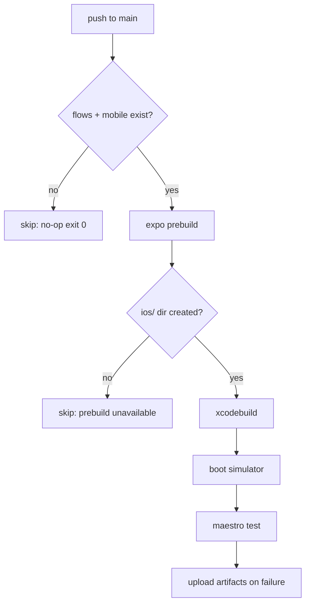

# CI First-Run Pass Rate Fix — Spec (S-35)

## Problem

CI first-run pass rate is 16% (target ≥90%). Every push to `main` triggers
the `E2E Staging Tests` workflow, which fails because `expo prebuild` doesn't
produce the `apps/mobile/ios` directory on the CI runner. The subsequent step
uses `working-directory: apps/mobile/ios`, which GitHub Actions rejects with
"No such file or directory", causing a hard failure.

Root causes:
1. **`expo prebuild` silently fails** — `STAGING_API_URL` secret is absent or
   Expo credentials not configured on the runner, so prebuild doesn't write the
   `ios` dir. The step completes without erroring, so `should_run=true` but the
   artifact is missing.
2. **No guard before `xcodebuild`** — the workflow assumes prebuild succeeded
   and tries to `cd` into a non-existent directory.
3. **No local pre-push gate** — developers (and agents) push without running
   a fast local check, so fixable failures reach CI.

## Solution

### 1. Fix `e2e-staging.yml` — guard prebuild output

Add an explicit check after `expo prebuild` that verifies the `ios` directory
was created. If not, output a clear error and skip downstream steps instead of
erroring in `working-directory`.



### 2. Add `scripts/pre-push.sh` — local gate

A fast local pre-push script that agents and developers run before `git push`.
Catches the most common CI failures in seconds.

Checks:
- `npm run lint` (if script exists)
- `npx tsc --noEmit`
- `bash scripts/structural-tests.sh`

### 3. Install pre-push hook via `.githooks/pre-push`

Place the hook in `.githooks/` (checked in) and document how to activate it:

```bash
git config core.hooksPath .githooks
```

## Acceptance Criteria

- [ ] `e2e-staging.yml` exits cleanly (success) when prebuild doesn't produce `ios/`
- [ ] Next push to `main` — `E2E Staging Tests` is green or skipped, not red
- [ ] `scripts/pre-push.sh` catches tsc errors locally before push
- [ ] `.githooks/pre-push` calls `scripts/pre-push.sh`
- [ ] `CLAUDE.md` updated with `git config core.hooksPath .githooks` setup step

## Files Touched

| File | Change |
|------|--------|
| `.github/workflows/e2e-staging.yml` | Add ios-dir guard step |
| `scripts/pre-push.sh` | New: fast local gate |
| `.githooks/pre-push` | New: hook that calls pre-push.sh |
| `CLAUDE.md` | Document hook activation |
