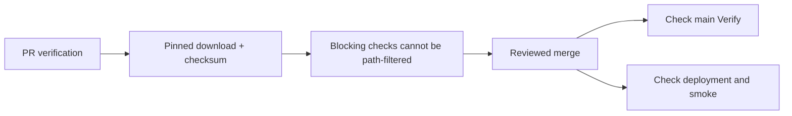

# Main verification after green API PRs (incident 262)

The Verify runs after PRs #257 and #261 failed ShellCheck SC2129 in the deployment workflow. App tests, builds, Deploy and production smoke passed. The error was three consecutive writes to GITHUB_OUTPUT; one grouped redirect preserves the same output and passes lint.

Two checks hid the existing error before merge:

- The registry ran workflow lint only when a workflow file changed. Main pushes used full scope and exposed the failure.
- The preceding green main run (#256) failed to install actionlint and silently skipped it. The installer queried an unpinned latest-release endpoint and tolerated failure.

The fix groups the redirects and pins actionlint 1.7.12 and ShellCheck 0.11.0 with verified release hashes. Missing workflow tools fail CI. The runner now reserves changed-path filtering for advisory checks: blocking lint, types, boundaries, tests and builds cannot disappear when a different file changes. Layer, run-context and explicit standalone routing remain intact; checks such as migration safety can still report that they have no applicable work.

The existing docs-only CI fast path remains. Workflow and verification code cannot enter through it because those paths classify above the docs tier. Local callers missing workflow tools receive an explicit skipped result.

`actionlint.test.ts` runs the actual check script and selector with controlled external-tool executables. It isolates both CI triggers and local skips, tests the real workflow-lint registry entry, injects future nonmatching filters into existing blocking checks, and distinguishes new blocking versus advisory checks. The old selector fails seven of these cases; the fixed selector passes all sixteen. Actual actionlint with ShellCheck also fails on the old deployment YAML and passes the fixed YAML.

The incident eval patch under `scripts/verify/evals/incidents/262/` recreates the shipped bad state by reversing this fix. Before/after evidence is in `.evidence/ci-post-merge/`. No API behavior, database contents, deploy permissions or deployment target changes are included.

A rollout is complete only after both the post-merge Verify and Deploy runs for its exact commit pass. This fixes the validation escape; it does not change Vercel's independent auto-deploy trigger or enable branch protection.
