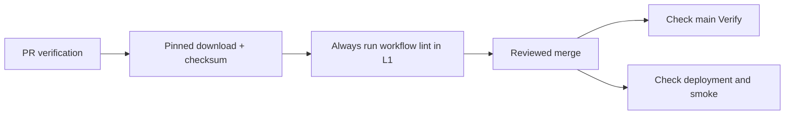

# Main verification after green API PRs (incident 262)

The Verify runs after PRs #257 and #261 failed ShellCheck SC2129 in the deployment workflow. App tests, builds, Deploy and production smoke passed. The error was three consecutive writes to GITHUB_OUTPUT; one grouped redirect preserves the same output and passes lint.

Two checks hid the existing error before merge:

- The registry ran workflow lint only when a workflow file changed. Main pushes used full scope and exposed the failure.
- The preceding green main run (#256) failed to install actionlint and silently skipped it. The installer queried an unpinned latest-release endpoint and tolerated failure.

The fix groups the redirects, installs actionlint 1.7.12 from a fixed URL with its published SHA-256, and requires both actionlint and ShellCheck in CI. L1 workflow lint no longer has a changed-path filter. The existing docs-only fast path remains; local callers without the tools receive an explicit skipped result.

`actionlint.test.ts` runs the actual check script with controlled external-tool executables. Missing tools must fail CI, lint failures must propagate, and the registry cannot filter away workflow lint on an API-only change. The tests fail against the old check and registry; actual actionlint with ShellCheck fails on the old deployment YAML and passes the fixed YAML.

The incident eval patch under `scripts/verify/evals/incidents/262/` recreates the shipped bad state by reversing this fix. Before/after evidence is in `.evidence/ci-post-merge/`. No API behavior, database contents, deploy permissions or deployment target changes are included.

A rollout is complete only after both the post-merge Verify and Deploy runs for its exact commit pass. This fixes the validation escape; it does not change Vercel's independent auto-deploy trigger or enable branch protection.
