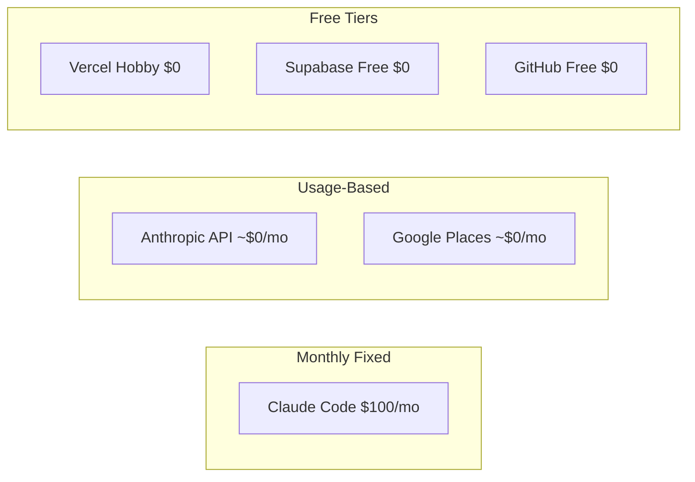

# Cost Tracker

Last updated: 2026-03-24

## Monthly Recurring

| Service | Tier | Cost | What it covers |
|---------|------|------|----------------|
| Claude Code | Max | $100/mo | Primary dev tool, agent sessions, Slack bot |
| Vercel | Hobby (free) | $0/mo | API hosting, preview deploys (100/day limit) |
| Supabase | Free | $0/mo | PostgreSQL + auth (500MB DB, 50K monthly active users) |
| GitHub | Free (public repo) | $0/mo | Code hosting, Actions (unlimited minutes for public) |
| Google Cloud | Free tier | $0/mo | Stitch MCP project |
| Gemini API | Free tier | $0/mo | Nano Banana 2 MCP image generation |
| Firecrawl | Free tier | $0/mo | Menu scraping (500 credits/mo) |

**Current monthly total: ~$100/mo**

## Usage-Based (Pay as You Go)

| Service | Pricing | Est. monthly | Notes |
|---------|---------|-------------|-------|
| Anthropic API | ~$3-15/MTok | ~$0/mo | Only used if CI reviewer workflow is active |
| Google Places API | $17/1K requests | ~$0/mo | Only during preload pipeline runs |

## One-Time / Sunk

| Item | Cost | Date | Notes |
|------|------|------|-------|
| Anthropic API credits | ~$50 | 2026-03 | Initial scrape pipeline + CI reviewer experiments |

## Upcoming

| Service | Tier | Cost | When |
|---------|------|------|------|
| Vercel Pro | Pro | $20/mo | If/when deploy limits block agents |
| Apple Developer | Individual | $99/yr | When ready for TestFlight |
| Domain (fitsy.com etc) | — | ~$12/yr | When ready to launch |
| Expo EAS | Free → Production | $0-99/mo | Mobile builds at scale |

## Upgrade Triggers

- **Vercel**: upgrade to Pro ($20/mo) when agents hit 100 deploys/day limit regularly
- **Supabase**: upgrade to Pro ($25/mo) when DB exceeds 500MB or need more connections
- **Firecrawl**: upgrade when preload pipeline needs >500 pages/mo
- **GitHub**: upgrade if repo goes private and Actions minutes run out (2000 free min/mo)
