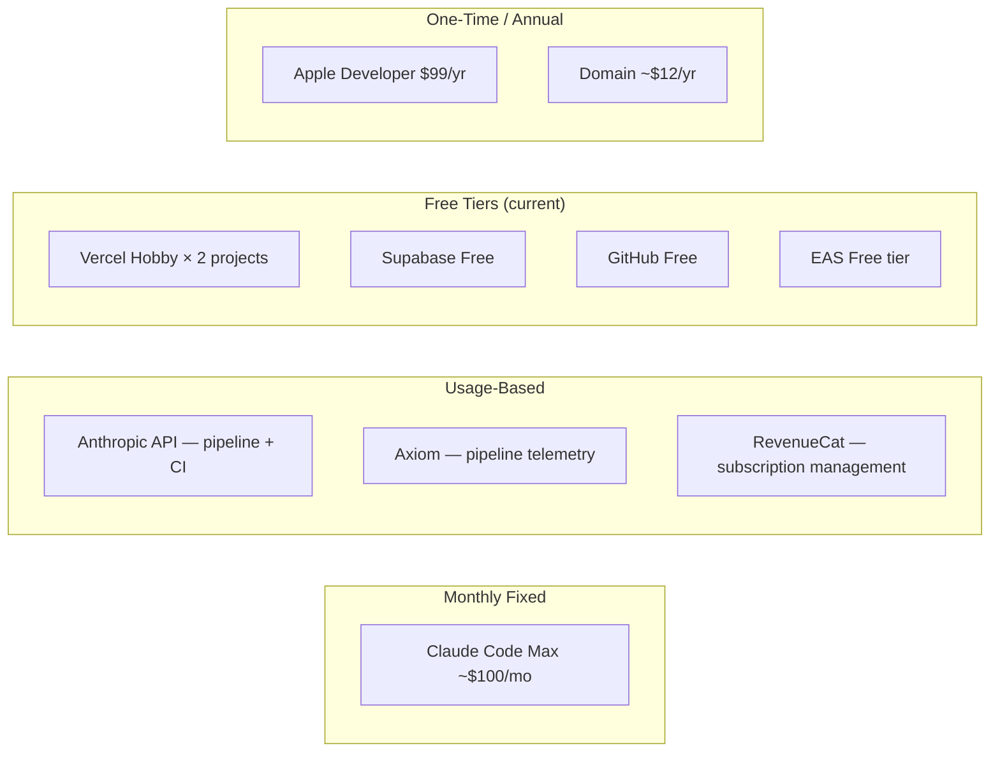

# Cost Tracker

> **Status:** Living · **Last verified:** 2026-06-12
> **Last updated:** 2026-06-12 (refreshed from 2026-03-24 original)

This file tracks the cost structure of the Fitsy stack. Dollar amounts for usage-based services are not precise — confirm current spend in each provider's billing console. The goal here is to document each cost line, its trigger to upgrade, and flag unknowns.

---

```mermaid
graph LR
    subgraph "Monthly Fixed"
        CC[Claude Code Max ~$100/mo]
    end
    subgraph "Usage-Based"
        ANT[Anthropic API — pipeline + CI]
        AXM[Axiom — pipeline telemetry]
        RC[RevenueCat — subscription management]
    end
    subgraph "Free Tiers (current)"
        VCL[Vercel Hobby × 2 projects]
        SUP[Supabase Free]
        GH[GitHub Free]
        EAS[EAS Free tier]
    end
    subgraph "One-Time / Annual"
        AAPL[Apple Developer $99/yr]
        DOM[Domain ~$12/yr]
    end
```

---

## Monthly Recurring

| Service | Tier | Cost | What it covers | Upgrade trigger |
|---------|------|------|----------------|-----------------|
| Claude Code | Max | ~$100/mo | Primary dev tool, agent sessions | — (fixed) |
| Vercel | Hobby (free) × 2 | $0/mo | `fitsy` marketing site + `fitsy-api` API backend; 100 deploys/day limit per project | Upgrade `fitsy-api` to Pro ($20/mo) when agents exceed 100 deploys/day regularly |
| Supabase | Free | $0/mo | PostgreSQL + PostGIS, 500MB DB, 50K monthly active users | Upgrade to Pro ($25/mo) when DB exceeds 500MB or connection pool is insufficient |
| GitHub | Free | $0/mo | Code hosting, Actions (unlimited minutes for public repo) | Upgrade if repo goes private and Actions minutes run out |
| Axiom | Free tier | $0/mo | Pipeline telemetry to `fitsy-pipeline` dataset | Confirm — upgrade when log retention or ingest limits are hit |
| RevenueCat | Free (≤$2.5K MRR) | $0/mo | Subscription entitlement management (`pro`), Apple IAP wiring | Auto-upgrades to paid tiers as MRR grows; confirm current tier |
| EAS (Expo Application Services) | Free | $0/mo | Mobile builds, OTA updates | Upgrade to EAS Production ($99/mo) when build concurrency or monthly builds exceed free tier |
| Slack | Free | $0/mo | Pipeline alerts to channel `C0ASM3865AA` | Upgrade if message history limits become an issue |

**Estimated monthly fixed total: ~$100/mo**

---

## Usage-Based (Pay as You Go)

| Service | Pricing | Notes | Upgrade trigger |
|---------|---------|-------|-----------------|
| Anthropic API (Claude Haiku) | ~$0.25/MTok in · ~$1.25/MTok out | Pipeline enrichment (indie restaurants only; chains use FatSecret/UE direct). CI reviewer also uses API credits. | Monitor via Axiom `fitsy-pipeline` telemetry; confirm current spend in Anthropic console |
| Google Places API | $17/1K requests | **Optional only** — tier-3 photo fallback in `preload-ue-first.ts`. Not used for discovery (UE-first). | Only incurred if `GOOGLE_PLACES_API_KEY` is set and photo fallback is triggered |

---

## One-Time / Sunk

| Item | Cost | Date | Notes |
|------|------|------|-------|
| Anthropic API credits | ~$50 | 2026-03 | Initial pipeline + CI reviewer experiments |
| Apple Developer Program | $99/yr | confirm | Required for App Store submission (S-207 blocker) |
| Domain (fitsy.org) | ~$12/yr | confirm | Current domain; confirm renewal date |

---

## Full Stack — Current Tools

| Tool | Role |
|------|------|
| Anthropic / Claude Haiku | Macro estimation in preload pipeline (indie restaurants) |
| Anthropic / Claude Code | Developer agent sessions |
| Axiom | Pipeline run telemetry (`fitsy-pipeline` dataset) |
| Slack | Pipeline alerts (`C0ASM3865AA` via `SLACK_BOT_TOKEN`) |
| Vercel (`fitsy`) | Marketing/landing site hosting |
| Vercel (`fitsy-api`) | API backend hosting (Next.js) |
| Supabase | Managed PostgreSQL + PostGIS |
| EAS / Expo | Mobile builds and OTA updates |
| Apple Developer | App Store submission |
| RevenueCat | Subscription entitlement management (`pro` entitlement, Apple IAP) |
| PostHog | Mobile analytics (30+ events as of Sprint 12) |

---

## Upgrade Triggers Summary

- **Vercel `fitsy-api` → Pro ($20/mo):** agents or CI hit 100 deploys/day regularly
- **Supabase → Pro ($25/mo):** DB exceeds 500MB, or need >15 direct connections
- **EAS → Production ($99/mo):** build concurrency needed for release cadence
- **Axiom:** confirm free-tier ingest/retention limits vs. pipeline run volume
- **RevenueCat:** automatic tier changes tied to MRR; no action needed until revenue starts
- **Firecrawl:** removed from the current pipeline (UE-first uses UE JSON-LD directly); no active cost line
- **Google Places:** confirm `GOOGLE_PLACES_API_KEY` is present in prod environment; if not needed for photo fallback, removing it eliminates this cost line entirely
