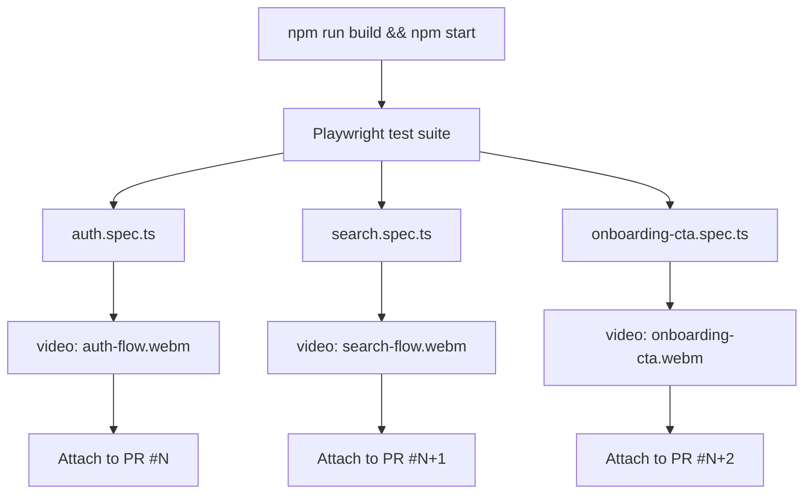

# Sprint 7 E2E Validation Spec

**Sprint**: 7
**Tasks**: S-48, S-49, S-50
**Owner**: CTO
**Goal**: Validate all core Fitsy flows end-to-end via Playwright, with video recordings attached to each PR.

---

## Context

S-44 fixed the Playwright video pipeline (local `npm run build && npm start` instead of Vercel preview). S-47 confirmed the staging DB is populated with 9 restaurants. Sprint 7 extends Playwright coverage from just the landing page to the full API-level flows: auth, restaurant search, and onboarding CTA.

---

## Flows

### S-48 — Auth Flow

Validates the register → login lifecycle against the live API.

**Steps:**
1. POST `/api/auth/register` with fresh test credentials → expect 201 + JWT
2. POST `/api/auth/login` with the same credentials → expect 200 + JWT
3. POST `/api/auth/login` with wrong password → expect 401
4. POST `/api/auth/register` same email again → expect 409 conflict

**Success criteria:** All 4 assertions pass; Playwright video captured.

---

### S-49 — Search → Restaurant Detail Flow

Validates the core restaurant discovery API: search returns results, then detail returns menu items.

**Steps:**
1. GET `/api/restaurants?lat=34.0928&lng=-118.3086&calories=600&protein=40` → expect ≥1 result with `id`, `name`, `macroScore`
2. Extract first restaurant `id`
3. GET `/api/restaurants/:id/menu` → expect ≥1 menu item with `calories`, `protein`, `fat`, `carbs`
4. GET `/api/restaurants?lat=0&lng=0&calories=600&protein=40` → expect 200 + empty array (no crash)

**Success criteria:** All 4 assertions pass; Playwright video captured.

---

### S-50 — Onboarding CTA Flow

Validates the landing page CTAs and how-it-works section.

**Steps:**
1. Navigate to `/` → hero h1 visible, contains "macros"
2. Primary CTA ("Get Early Access") → visible, has href
3. Secondary CTA ("How it works") → visible, links to `#how-it-works`
4. Click secondary CTA → `#how-it-works` section scrolls into view
5. How-it-works CTA ("Try the beta") → visible at bottom of section

**Success criteria:** All 5 assertions pass; Playwright video captured.

---

## Implementation Plan



### File locations

| File | Purpose |
|------|---------|
| `apps/api/tests/e2e/auth.spec.ts` | S-48 auth flow tests |
| `apps/api/tests/e2e/search.spec.ts` | S-49 search + detail tests |
| `apps/api/tests/e2e/onboarding-cta.spec.ts` | S-50 CTA tests |

### Running tests

```bash
# In apps/api/:
npm run build && npm start &   # start prod server on :3000
npx playwright test            # run all e2e specs
# Videos written to: apps/api/test-results/
```

### Video in PR description

Each PR includes:
- Test run output (pass/fail per test)
- Path to generated video artifact (`test-results/<spec>/<test>/video.webm`)
- Instructions for reviewers to play the recording locally

---

## Pre-PR Gate

- [ ] `bash scripts/structural-tests.sh` — pass
- [ ] `npx tsc --noEmit` — pass
- [ ] `npm test` — all Playwright tests pass
- [ ] Video files generated in `apps/api/test-results/`
