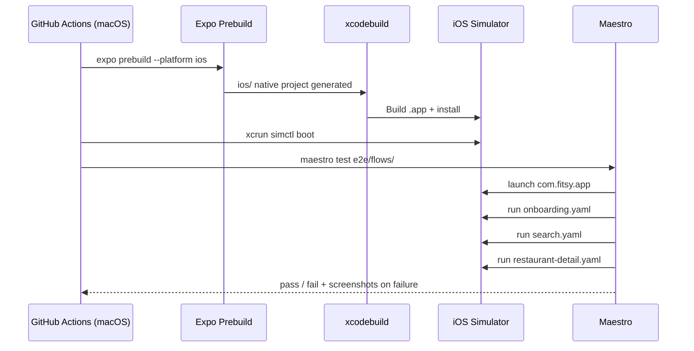

# E2E Staging Verification

> **Status:** Sprint 5 — S-29
> **Author:** Frontend
> **Date:** 2026-03-24

---

## Problem

Maestro E2E flows for onboarding, search, and restaurant detail were written
in S-25 but never run against a live environment. CI was gated behind
`workflow_dispatch` until flows existed. Now that flows exist, we need to
enable the CI trigger and verify the flows pass against staging.

---

## Solution

Enable the `e2e-staging.yml` workflow on push to `main`. Fix the incomplete
workflow (was missing iOS build and simulator setup steps). Set
`STAGING_API_URL` secret to point at the latest Vercel preview deployment.

---

## Diagrams

---

## Approach

### Workflow changes (`.github/workflows/e2e-staging.yml`)

| Before | After |
|--------|-------|
| `workflow_dispatch` only | `push: branches: [main]` + `workflow_dispatch` |
| `expo prebuild` only | prebuild → xcodebuild → simctl boot → simctl install → maestro |

### Required secrets

| Secret | Value | Where to set |
|--------|-------|-------------|
| `STAGING_API_URL` | Latest Vercel preview URL for `main` branch | `gh secret set STAGING_API_URL` |

### Blocker: Vercel deployment protection

Vercel deployments are SSO-protected by default. The mobile app cannot reach
the staging API if SSO is active. **Before this CI job can pass:**

1. Either disable Vercel Deployment Protection for the staging environment, or
2. Configure a Vercel bypass token in the mobile app's `API_URL` header

**Recommended**: Disable protection for preview deployments scoped to the
`main` branch in Vercel project settings → Deployment Protection.

---

## Flows covered

| Flow | File | What it tests |
|------|------|--------------|
| Onboarding | `e2e/flows/onboarding.yaml` | Register new user → arrives at search screen |
| Search | `e2e/flows/search.yaml` | Enter macro targets → see results or graceful empty state |
| Restaurant detail | `e2e/flows/restaurant-detail.yaml` | Tap restaurant → see menu with macro breakdown |

The search and detail flows are designed to pass even if the staging DB is
empty (they assert on "no results" OR "results present").

---

## Constraints

- `restaurant-detail.yaml` silently exits if no results are present — it does
  not fail. Full assertion requires staging DB to have at least one restaurant.
- E2E runs against a Debug build on iPhone 15 simulator — not a Release build.
  Performance will differ from production.
- iOS simulator only; Android flow not yet written.
