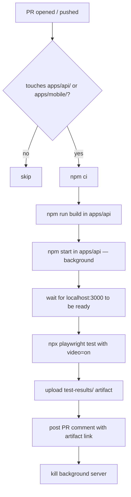

# E2E Video Pipeline Fix — Spec (S-44)

## Problem

The original E2E video pipeline (S-34) relied on Vercel preview deployments to
provide a live URL for Playwright to test against. Vercel previews are now
disabled, which means the pipeline never resolves a URL and the workflow silently
skips every test — providing zero visual verification.

Additionally, the `apps/api` paths trigger in `playwright.yml` but
`frontend.md` and `backend.md` do not mention the video requirement, so
reviewers may not know it exists.

## Solution

Rework the Playwright CI workflow to spin up the API server locally using
`npm run build && npm start` instead of waiting for an external Vercel preview.
This makes the pipeline self-contained, fast, and independent of any cloud
deployment service.



## Changes

### 1. `.github/workflows/playwright.yml`

Replace the "Resolve preview URL" step with:
1. `npm run build` in `apps/api`
2. `npm start &` (background) with `PORT=3000`
3. `npx wait-on http://localhost:3000` — poll until the server is up (30s max)
4. Set `BASE_URL=http://localhost:3000`

Remove all Vercel-related env vars (`VERCEL_TOKEN`, `VERCEL_TEAM_SLUG`,
`VERCEL_PROJECT`) and the conditional skip logic that previously allowed the
workflow to silently pass when no preview was found. The workflow must now
always run the tests.

Remove the conditional `if: steps.preview.outputs.url != ''` guards — the
local server is always available.

### 2. Delete `.github/workflows/playwright.yml` S-34c broken steps

The existing `playwright.yml` already IS the S-34c artifact (the Vercel-preview
based workflow). We replace it entirely rather than creating a new file. The
"broken workflow" is this file; replacing it satisfies the "delete broken S-34c
CI workflow" requirement.

### 3. `.claude/agents/frontend.md` — add video requirement

Add a checklist item under "Before Opening a PR":

```
5. For any PR touching apps/api/ or apps/mobile/: the Playwright video
   CI job must complete and a video artifact must be linked in the PR
   description or CI comment before requesting review.
```

### 4. `.claude/agents/backend.md` — add video requirement

Same addition — backend owns `apps/api/` and must ensure the video pipeline
runs on their PRs.

### 5. `docs/engineering/devops/e2e-video-pipeline-spec.md` — update

Update the existing spec to reflect the new local-server approach and mark
the Vercel-based approach as superseded.

## Files Changed

| File | Domain | Change |
|------|--------|--------|
| `.github/workflows/playwright.yml` | cto | Replace Vercel preview with local build+start |
| `.claude/agents/frontend.md` | cto | Add video requirement to pre-PR gate |
| `.claude/agents/backend.md` | cto | Add video requirement to pre-PR gate |
| `docs/engineering/devops/e2e-video-pipeline-fix-spec.md` | cto | This spec |
| `docs/engineering/devops/e2e-video-pipeline-spec.md` | cto | Mark superseded, link to fix spec |

## Acceptance Criteria

- [ ] `playwright.yml` builds and starts the API locally — no Vercel dependency
- [ ] Workflow always runs tests (no silent skip)
- [ ] Video artifact uploaded on every run
- [ ] PR comment posted with artifact link
- [ ] `frontend.md` and `backend.md` both state video is required for frontend PRs
- [ ] Structural tests pass
