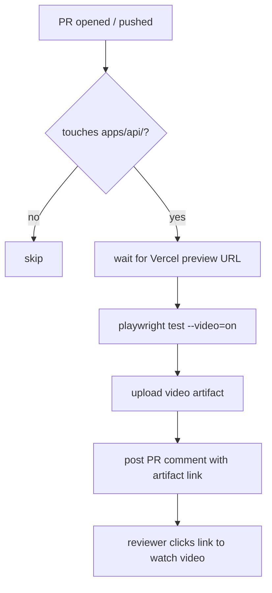

# E2E Video Pipeline — Spec (S-34)

> **Superseded**: The Vercel-preview approach described below was replaced in
> S-44. See [`e2e-video-pipeline-fix-spec.md`](./e2e-video-pipeline-fix-spec.md)
> for the current implementation (local `npm run build && npm start`).

## Problem

Frontend PRs have no automated visual verification. Reviewers must manually
check deployed previews to confirm the UI works. There is no video evidence
that a PR was tested before merge.

## Solution (Original — Vercel-based, now disabled)

Add Playwright with video recording to the frontend (Next.js landing page in
`apps/api`). On every PR that touches `apps/api/**`, CI:

1. Waits for the Vercel preview deployment to go live
2. Runs Playwright tests against the preview URL with video recording
3. Uploads video artifacts to GitHub Actions
4. Posts a PR comment with a link to the video artifact

## Implementation

### 1. `apps/api/playwright.config.ts`

Playwright config targeting the preview URL (injected via `BASE_URL` env var), with:
- `video: 'on'` — record every test
- `screenshot: 'only-on-failure'` — screenshot on failure
- `retries: 1` — tolerate transient preview-URL timing issues
- Timeout: 30s per test

### 2. `apps/api/tests/e2e/landing.spec.ts`

Smoke test for the landing page:
- Visits the root URL
- Asserts hero heading contains "macros"
- Asserts primary CTA link is present
- Asserts `#how-it-works` anchor is visible

### 3. `.github/workflows/playwright.yml`

Triggers on PRs touching `apps/api/**`. Steps:
1. `actions/checkout` + `actions/setup-node` + `npm ci`
2. `npx playwright install --with-deps chromium`
3. Poll Vercel API for a `READY` preview matching the PR head SHA (up to 3 min)
4. `npx playwright test` with `BASE_URL` set to preview URL
5. `actions/upload-artifact` — upload `test-results/` directory (14 days)
6. `actions/github-script` — post PR comment with artifact download link

## Files

| File | Domain | Role |
|------|--------|------|
| `apps/api/playwright.config.ts` | backend | Playwright configuration |
| `apps/api/tests/e2e/landing.spec.ts` | backend | Landing page smoke test |
| `.github/workflows/playwright.yml` | cto | CI workflow |
| `docs/engineering/devops/e2e-video-pipeline-spec.md` | cto | This spec |

## Acceptance Criteria

- [x] `playwright.config.ts` and smoke test merged (PR #55)
- [x] CI workflow triggers on PRs touching `apps/api/**`
- [x] Video artifact is uploaded and linked from a PR comment
- [x] Workflow exits cleanly when `VERCEL_TOKEN` is not set (skip, not fail)
- [x] Reworked to use local build in S-44 (Vercel previews disabled)
