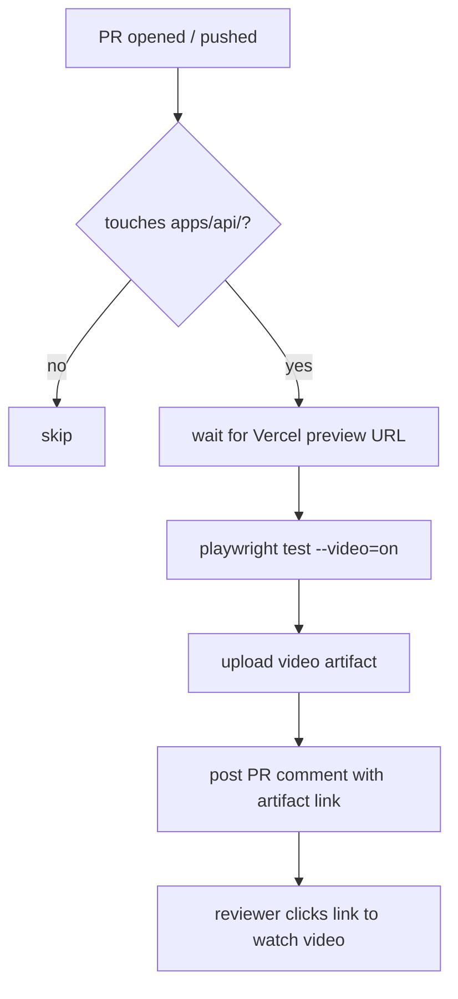

# E2E Video Pipeline — Spec (S-34)

## Problem

Frontend PRs have no automated visual verification. Reviewers must manually
check deployed previews to confirm the UI works. There is no video evidence
that a PR was tested before merge.

## Solution

Add Playwright with video recording to the frontend (Next.js landing page in
`apps/api`). On every PR that touches `apps/api/**`, CI:

1. Waits for the Vercel preview deployment to go live
2. Runs Playwright tests against the preview URL with video recording
3. Uploads video artifacts to GitHub Actions
4. Posts a PR comment with a link to the video artifact

## Implementation

### 1. `apps/api/playwright.config.ts`

Playwright config targeting the preview URL (injected via env var), with:
- `video: 'on'` — record every test
- `screenshot: 'only-on-failure'` — screenshot on failure
- Timeout: 30s per test

### 2. `apps/api/tests/e2e/landing.spec.ts`

Smoke test for the landing page:
- Visits the root URL
- Asserts hero heading is visible
- Asserts CTA link/button is present
- Asserts no console errors

### 3. `.github/workflows/playwright.yml`

Triggers on PRs touching `apps/api/**`. Steps:
1. `actions/checkout`
2. `actions/setup-node` + `npm ci`
3. `npx playwright install --with-deps chromium`
4. Wait for Vercel preview (`actions/github-script` or `gh` to poll deploy)
5. `npx playwright test` with `BASE_URL` set to preview URL
6. `actions/upload-artifact` — upload `test-results/` directory
7. Post comment to PR with artifact download link

## Files

| File | Role |
|------|------|
| `apps/api/playwright.config.ts` | Playwright configuration |
| `apps/api/tests/e2e/landing.spec.ts` | Landing page smoke test |
| `.github/workflows/playwright.yml` | CI workflow |

## Acceptance Criteria

- [ ] `npx playwright test` runs locally and produces a video in `test-results/`
- [ ] CI runs on every PR touching `apps/api/**`
- [ ] Video artifact is uploaded and linked from a PR comment
- [ ] Workflow exits cleanly when `BASE_URL` is not set (skip, not fail)
