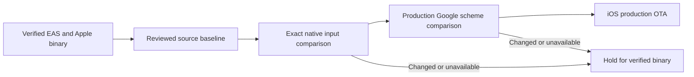

# Verified iOS OTA baseline

The production OTA gate compares native inputs with actual processed iOS build 5, rather than the historical `v1.0.0` Git tag.
Issue #243 reproduced the false positive in main Deploy run [37685925003](https://github.com/dgmolla/fitsy/actions/runs/37685925003), at source `89c23ce6e5272f7fdc9a599131329e4034b23037`.
That tag predates the actual production binary and therefore cannot establish its native compatibility.

## Actual binary evidence

Fresh read-only EAS and App Store Connect requests on October 7, 2026 confirmed the following identities.
The IPA was downloaded from the build's artifact URL and its actual embedded plists were inspected.

| Identity | Verified value |
| --- | --- |
| EAS build | `3391d4bf-905e-4c78-8ae3-4f88f7cbf51b`, FINISHED, IOS, STORE, production profile/channel |
| Build source | `2e515fdc339d27e33110e128379fb16bd3a2d3a5` |
| Apple build | `cc103859-443d-43d9-a165-da04534c952b`, VALID, unexpired, APP_STORE_ELIGIBLE |
| Info.plist | `com.fitsy.mobile`, version `1.0.0`, build `5` |
| Expo.plist | Runtime `1.0.0`, production channel, project `a204190c-0b71-4c31-b126-f3bc62d1c4ee`, updates enabled |
| IPA SHA-256 | `e31663a3f57f715a357ffbd487f4d912fe46ed9b5ac82543d3a87724ed506c56` |

The Google URL scheme compiled into Info.plist is `com.googleusercontent.apps.56878207179-voo8iloc0si51ae7n8illrsu3hapks4d`.
The helper loads the current production environment and rejects a different or missing corresponding client ID before publishing.
The app config's other environment variables affect JavaScript configuration rather than native configuration at this baseline.

## Conservative compatibility contract

`scripts/deploy/ios-binary-baseline.json` records the reviewed binary anchor.
`native-compatibility.mjs` requires exact Git equality for package and lockfile inputs, app/EAS configuration, native directories, patches, plugins, native build hooks and assets.
Dirty or untracked native inputs also fail.
This intentionally blocks some compatible JS-only lockfile edits until their baseline is independently verified.
Missing ancestry or a missing or malformed receipt fails closed.
Ignored native files also block publication, including locally generated iOS directories.

The sole excluded asset is `apps/mobile/assets/app-screenshot.png`, added after build 5 and required by `TrialArtwork.tsx` as a JavaScript bundle image.
It is not referenced by the unchanged app configuration or its native plugins.
Other asset additions, modifications and deletions continue to block publication.
A change in how that image is consumed by native code requires updating and reviewing the native baseline.

The canonical production helper requires a clean commit on main's first-parent history, verifies source and production environment, and exports iOS only.
The helper fetches main under the release lease and rejects older commits whose bundle inputs differ from current main.
An integrated mobile commit remains publishable when a subsequent API-only commit advances main before its queued Deploy publishes.
Unmerged feature-branch parents of a merge are excluded from that main-line history.
Every surviving main Deploy attempts guarded iOS publication, including API-only pushes.
GitHub concurrency can replace a pending run even with cancellation of active runs disabled, so a per-push mobile filter cannot establish delivery.
The surviving push publishes its current main-line source and includes any mobile changes from replaced pending pushes.
Every surviving push runs production API smoke, including docs-only pushes that may incorporate replaced API changes.
Successful migration and successful smoke remain prerequisites, followed by the native/source/environment gates.
Both local and CI publication share an atomic GitHub ref lease at `refs/tags/fitsy-ios-ota-lock` with rollback.
A unique commit identifies each owner; only that owner deletes the lease.
Rollback opens its hold, waits for an active publisher to finish, then republishes and verifies its recovery group is newest while still holding the lease.
A waiting publisher sees the durable hold after acquiring the lease and skips publication.
Interrupted or uncertain EAS mutations retain the lease and fail closed.
For an abandoned lease, first verify the owner process and EAS mutation are finished and reconcile the served production group, then delete that exact lease ref before retrying recovery.
The release job needs contents-write permission only to coordinate this trusted main release lease.
Checkout does not persist its credentials; dependency installation and EAS CLI preparation run without release secrets.
Only the release helper receives the GitHub write token, and its Git fetch uses an ephemeral GitHub credential helper.
EAS subprocesses do not inherit that repository write token.
Before republishing, the rollback helper creates or reuses an open `release: iOS OTA rollback hold` issue.
CI and local publication read all open release issues through the GitHub API and skip publication while a hold exists.
Failure to read or establish the hold fails closed.
Close the hold only after repaired mobile source passes required checks and independent review and receives explicit production approval.
Unrelated main pushes never clear the hold.
The mobile rollback helper also republishes iOS only, including when the previous group contains both platforms.
There is no verified Android production binary, so this proof grants no Android publication authority.
Replacing the baseline requires actual EAS/Apple binary evidence and independent workflow-security review; a tag alone is insufficient.
Retain the prior baseline and release receipts in Git and on the owning issue.

Processing, OTA publication and observed device uptake are distinct outcomes.
This baseline does not submit to App Review, accept Apple agreements, release an App Store version or complete the human trial acceptance in #431.
The release packet and human approval requirements in #444 remain applicable.
