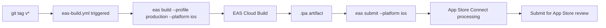

# iOS Build & App Store Release Runbook

**Task**: S-51 · S-207
**Owner**: CTO
**Last updated**: 2026-06-12

> **Status:** living · **Last verified:** 2026-06-12
>
> **No TestFlight beta.** Light user testing was deemed sufficient (decision 2026-06-12), so the release path goes straight from an EAS production build to App Store submission. This runbook covers EAS Build → App Store Connect → App Store review.

## Overview

This runbook covers the full EAS Build + App Store submission setup for Fitsy iOS.



---

## Prerequisites

### Apple Developer Account
- Active Apple Developer Program membership ($99/yr)
- App ID registered: `app.fitsy.mobile`
- App created in App Store Connect: **Fitsy**

### EAS CLI (local setup)
```bash
npm install -g eas-cli
eas login          # authenticate with Expo account
eas whoami         # verify
```

### Required Secrets (GitHub + EAS)

| Secret | Location | Purpose |
|--------|----------|---------|
| `EXPO_TOKEN` | GitHub Actions secret | EAS CLI auth in CI |
| `APPLE_ID` | EAS secret (`eas secret:create`) | App Store Connect login |
| `APPLE_APP_SPECIFIC_PASSWORD` | EAS secret | ASC API (2FA bypass) |
| `ASC_APP_ID` | EAS secret | App Store Connect app numeric ID |

Add EAS secrets:
```bash
eas secret:create --scope project --name APPLE_ID --value "your@apple.id"
eas secret:create --scope project --name APPLE_APP_SPECIFIC_PASSWORD --value "xxxx-xxxx-xxxx-xxxx"
eas secret:create --scope project --name ASC_APP_ID --value "1234567890"
```

Add GitHub secret:
```
Settings → Secrets and variables → Actions → New repository secret
Name: EXPO_TOKEN
Value: <token from expo.dev/accounts/[username]/settings/access-tokens>
```

---

## One-Time Mobile Setup (Frontend Agent)

> **Frontend ticket required** — CTO does not own `apps/mobile/`. The following must be done by the frontend agent before the workflow can succeed.

### 1. Add `apps/mobile/eas.json`
```json
{
  "cli": {
    "version": ">= 10.0.0"
  },
  "build": {
    "development": {
      "developmentClient": true,
      "distribution": "internal"
    },
    "preview": {
      "distribution": "internal",
      "ios": {
        "simulator": false
      }
    },
    "production": {
      "ios": {
        "buildConfiguration": "Release"
      }
    }
  },
  "submit": {
    "production": {}
  }
}
```

### 2. Update `apps/mobile/app.config.ts`
Add explicit bundle identifier and iOS config:
```typescript
// In the config object:
ios: {
  bundleIdentifier: "app.fitsy.mobile",
  buildNumber: "1",
  supportsTablet: false,
},
```

---

## CI/CD: Automated Builds (`.github/workflows/eas-build.yml`)

The workflow triggers on version tags (`v*.*.*`). It:
1. Installs EAS CLI
2. Runs `eas build --platform ios --profile production --non-interactive`
3. Uploads the build to App Store Connect via `eas submit`

See `.github/workflows/eas-build.yml` for the full workflow definition.

---

## Manual Build (when CI is not available)

```bash
cd apps/mobile

# Build for App Store (production distribution)
eas build --platform ios --profile production

# Submit to App Store Connect (after build completes)
eas submit --platform ios --latest
```

Monitor build at: https://expo.dev/accounts/[username]/projects/fitsy/builds

---

## App Store Submission

1. Once `eas submit` uploads the build, it appears in App Store Connect → your app → the build list (Apple processes it, ~5–15 min).
2. Complete the App Store listing (metadata, screenshots, description, keywords) — see `docs/product/app-store-listing.md` (tickets S-214/S-215/S-216).
3. Select the processed build for the version.
4. Answer the export-compliance / encryption prompt (see Troubleshooting for the `ITSAppUsesNonExemptEncryption` shortcut).
5. Provide the demo review account so Apple can bypass the subscription paywall.
6. **Submit for review.** Apple review typically takes ~24–48h.
7. On approval, release (manual or automatic). Track in `proj-mgmt/sprints/sprint-12.md` (S-207 → S-213).

> TestFlight is skipped intentionally — uploading to App Store Connect technically also makes the build available on TestFlight, but no external beta tester group is recruited (light user testing was sufficient).

---

## Troubleshooting

### Build fails with "No bundle identifier"
Frontend ticket not complete — `app.config.ts` missing `ios.bundleIdentifier`.

### `eas submit` fails with authentication error
Verify `APPLE_ID` and `APPLE_APP_SPECIFIC_PASSWORD` EAS secrets are set:
```bash
eas secret:list
```

### Build queued but not starting
EAS free tier has limited concurrent builds. Check queue at expo.dev.

### App Store Connect shows "Missing Compliance"
Add to `apps/mobile/app.config.ts`:
```typescript
ios: {
  infoPlist: {
    ITSAppUsesNonExemptEncryption: false,
  },
}
```
