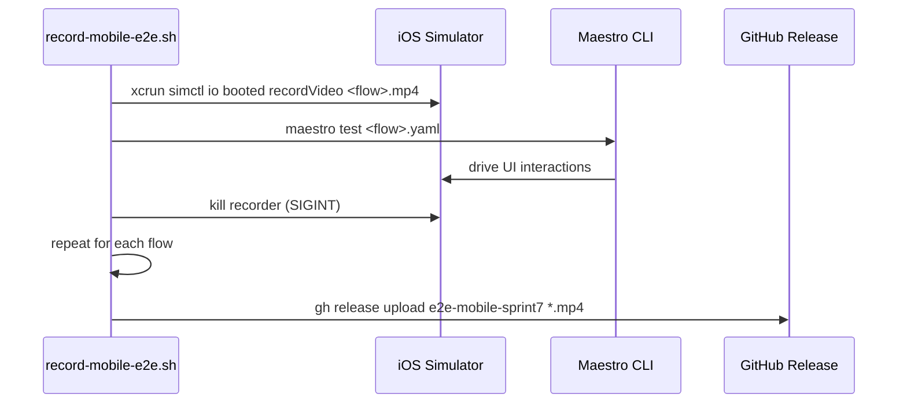

# Mobile E2E Recordings Spec (S-52)

## Problem

The existing Playwright E2E recordings capture the web/API layer in a browser, not
the actual mobile app. Users cannot validate real mobile UX from those recordings.
Maestro flows already exist for the 3 core flows but there is no mechanism to capture
or share recordings from them.

## Goal

Run all 3 Maestro flows against a live iOS Simulator build, capture screen recordings
for each flow, and publish them to a GitHub Release so they can be viewed from any
device (including phone) without needing Xcode.

## Flows covered

| Flow | File | What it shows |
|------|------|--------------|
| Onboarding | `e2e/flows/onboarding.yaml` | Register → land on Search screen |
| Search | `e2e/flows/search.yaml` | Enter macro targets → see results or empty state |
| Restaurant detail | `e2e/flows/restaurant-detail.yaml` | Tap restaurant → see menu with macros |

## Architecture



## Implementation

### 1. Recording script (`scripts/record-mobile-e2e.sh`)

Per-flow recording loop:
1. Start `xcrun simctl io booted recordVideo --codec h264 <flow>.mp4` in background
2. Run `maestro test e2e/flows/<flow>.yaml`
3. Kill recorder with `kill -2` (SIGINT) to flush the mp4 header properly
4. Wait for recorder process to exit (ensures file is finalized)

`SIGINT` (not `SIGKILL`) is critical — the simulator video writer needs a clean shutdown
to write the moov atom that makes the file playable.

### 2. GitHub Release upload

After all flows finish:
- Create or update release `e2e-mobile-sprint7` with `--prerelease`
- Upload each `.mp4` with `gh release upload`
- Print direct download URLs for PR description

### 3. GitHub Actions workflow (`.github/workflows/mobile-e2e.yml`)

Trigger: push to `main` or manual `workflow_dispatch`.

Steps:
1. Checkout
2. Install Maestro CLI
3. Set up Expo / Node
4. Boot simulator (`xcrun simctl boot`)
5. Build app with `expo prebuild --platform ios` + `xcodebuild`
6. Install `.app` into simulator
7. Run `scripts/record-mobile-e2e.sh`
8. Upload `.mp4` files as artifacts + create GitHub Release

> Note: Full Xcode build on CI is slow (~15 min). The workflow is `workflow_dispatch`
> only for now so it runs on demand, not every push.

## Prerequisites

- Maestro CLI installed locally: `curl -Ls "https://get.maestro.mobile.dev" | bash`
- iOS Simulator booted with Fitsy app installed
- `gh` CLI authenticated
- `GITHUB_TOKEN` env var with `write:packages` + `contents:write`

## Runbook: generate recordings locally

```bash
# 1. Boot a simulator
xcrun simctl boot "iPhone 15"
open -a Simulator

# 2. Install the app (use your last dev build)
xcrun simctl install booted path/to/Fitsy.app

# 3. Run flows + capture
bash scripts/record-mobile-e2e.sh

# 4. Videos land in recordings/
ls recordings/

# 5. Upload to GitHub Release (script does this automatically if GH_TOKEN is set)
```

## Output artifacts

```
recordings/
  fitsy-onboarding.mp4
  fitsy-search.mp4
  fitsy-restaurant-detail.mp4
```

Uploaded to: `https://github.com/dgmolla/fitsy/releases/tag/e2e-mobile-sprint7`
