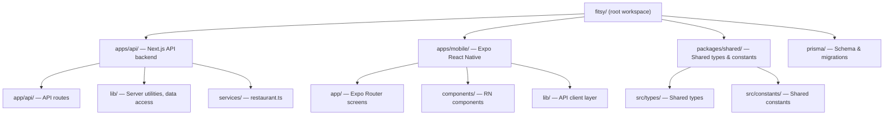
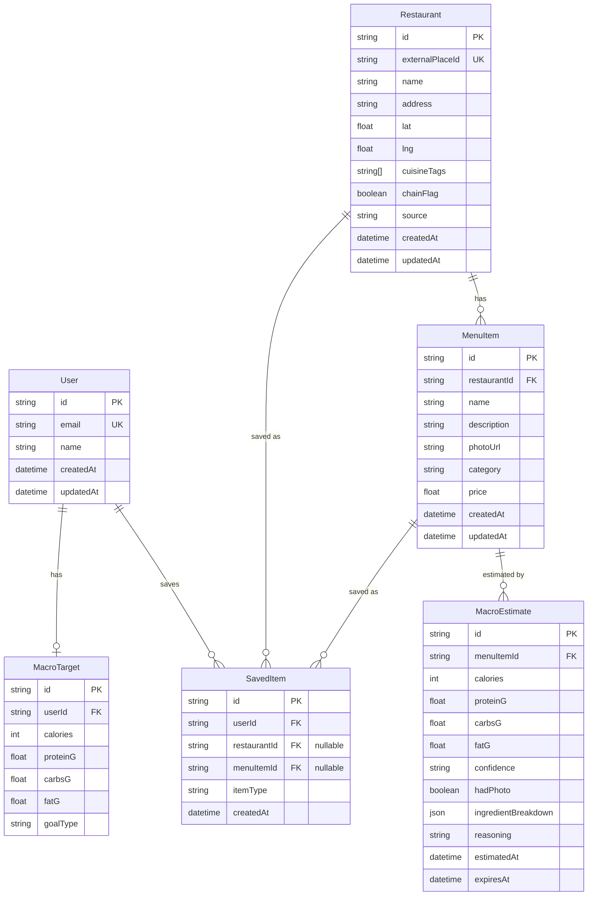

# Monorepo Scaffolding Spec

> **Status**: Approved — implementation sprint
> **Task**: S-10
> **Author**: CTO
> **Date**: 2026-03-24

---

## 1. Goal

Bootstrap the monorepo workspace so that Wave 2 tasks (S-11 through S-14) can proceed
immediately. This spec covers the root workspace, per-app package configs, shared types
package, Prisma schema, and TypeScript configuration.

---

## 2. Workspace Structure



---

## 3. Package Manager & Workspaces

- **Package manager**: npm with native workspaces (`"workspaces": ["apps/*", "packages/*"]`)
- **Node version**: ≥20 (specified in `.nvmrc`)
- **TypeScript**: strict mode, project references for cross-package imports

---

## 4. Per-Package Decisions

### 4.1 Root (`package.json`)

Workspace root only — no direct runtime dependencies. Dev scripts delegate to workspaces.

| Script | Command |
|--------|---------|
| `dev:api` | `npm run dev -w apps/api` |
| `dev:mobile` | `npm run start -w apps/mobile` |
| `build:api` | `npm run build -w apps/api` |
| `build` | `npm run build -w apps/api` |
| `start:api` | `npm run start -w apps/api` |
| `test` | `npm run test --workspaces --if-present` |

### 4.2 API (`apps/api/`)

Next.js 15 in API-only mode. No pages — only `app/api/` routes.

| Dependency | Version | Purpose |
|-----------|---------|---------|
| `next` | 15.x | API framework |
| `react`, `react-dom` | 19.x | Peer deps required by Next.js |
| `@prisma/client` | 6.x | ORM runtime |
| `typescript` | 5.x | Language |
| `prisma` | 6.x | Dev: migration tooling |

### 4.3 Mobile (`apps/mobile/`)

Expo SDK 52 with Expo Router for file-based navigation.

| Dependency | Version | Purpose |
|-----------|---------|---------|
| `expo` | ~52.0.0 | Expo SDK |
| `expo-router` | ~4.0.0 | File-based navigation |
| `react` | 18.3.x | React for RN |
| `react-native` | 0.76.x | Native framework |
| `typescript` | 5.x | Language |

### 4.4 Shared (`packages/shared/`)

Zero runtime dependencies. TypeScript-only package with shared types and constants.

---

## 5. Prisma Schema Design

Full 6-entity schema matching the system design ERD (see `docs/engineering/backend/system-design.md`).



**Key decisions:**
- `Restaurant.lat/lng`: plain floats for MVP; PostGIS extension added via migration for geospatial queries
- `MacroEstimate.confidence`: enum `HIGH | MEDIUM | LOW`
- `MacroEstimate.ingredientBreakdown`: JSON blob, nullable (populated on-demand post-MVP)
- `SavedItem.itemType`: discriminator (`restaurant` | `menu_item`)

---

## 6. TypeScript Configuration

- Root `tsconfig.json`: base config, `strict: true`, `paths` for workspace package aliases
- Each app extends root config with app-specific settings
- `packages/shared/tsconfig.json`: `"composite": true` for project references

---

## 7. First Migration

The initial migration creates all 6 tables, adds:
- Unique index on `Restaurant.externalPlaceId`
- Index on `MenuItem.restaurantId`
- Index on `MacroEstimate.menuItemId`
- Index on `MacroEstimate.expiresAt`
- PostGIS extension (for `ST_DWithin` geo queries in Wave 2)

Migration is committed to the repo and applied by running:
```bash
npx prisma migrate dev
```
Requires `DATABASE_URL` env var pointing to a Postgres instance with PostGIS extension.

---

## 8. CI Update

Once `package.json` exists, `reviewer.yml` must include an `npm ci` step before structural
tests so the CI environment has all dependencies installed.
