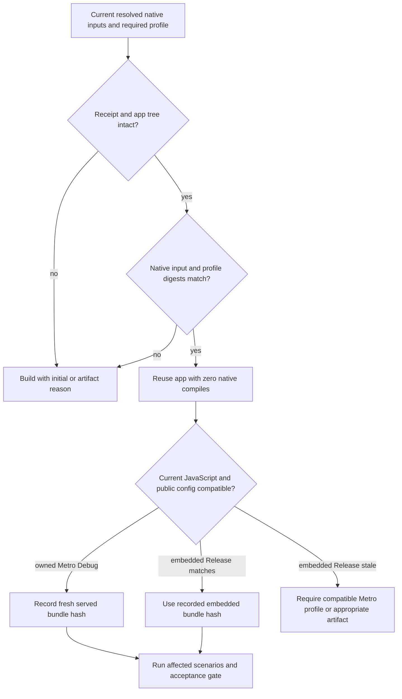

# Native binary reuse cookbook

The simulator CLI uses a verified compatible `.app` by default.
Run `node --env-file=apps/mobile/.env.development.local scripts/sim/product-flow.mjs build <UDID> [--test-store]` before product flows.
`build` prints `action: reuse` and performs no prebuild, Pod install or Xcode compile when the receipt is compatible.
`run` installs that verified artifact and starts a fresh owned Metro process for a Debug Test Store binary.
Every command uses an explicit booted simulator UDID and the existing simulator ownership claim.



## Exact rebuild inputs

The receipt records `nativeIdentity.inputs`, `profileIdentity.inputs`, and `recipeIdentity.inputs` as well as their hashes, and seals its fields with `receiptHash`.
Generated iOS project and app source files are included even though Expo normally ignores them in Git.
The builder checks source and JavaScript before preparation, after Pod resolution, and after Xcode so edits during a build cannot receive a passing receipt.
The decision reports the changed input paths, such as `native input changed: files.apps/mobile/ios/Native.swift` or `binary profile changed: configuration`.
It never uses HEAD age or a general mobile-source hash as a rebuild reason.

| Change | Native action | JavaScript and acceptance action |
| --- | --- | --- |
| Swift/Obj-C source, generated iOS compile source, resolved Expo or React Native autolinking module, Pod graph, native plugin output or native build recipe | Rebuild with each changed file, graph field or recipe step named | Rerun affected scenarios. |
| Resolved entitlements, permissions, plist, URL scheme, bundle ID, native icon/splash/plugin resource or effective native build setting | Rebuild with changed config or resource field named | Rerun affected scenarios. |
| Simulator versus device, OS/architecture compatibility, Debug versus Release, Test Store capability, build flags or Xcode/SDK identity | Select an intact verified artifact for the required profile; rebuild only when none matches, naming each changed field | Use the profile that can serve or embed the required JavaScript. |
| Receipt absent, legacy or changed receipt, app absent or tree hash changed | Build with an initial, unverifiable provenance or artifact-integrity reason | Preserve the prior receipt in `.evidence/resume/` before replacement. |
| JavaScript/UI or JS-only package and lockfile change | Reuse the binary if resolved native graph and profile still match | Start fresh owned Metro and capture its served bundle/config hash; rerun affected scenarios. |
| Android-only native source change while testing iOS | Reuse the iOS binary | Keep the iOS acceptance decision tied to affected flows. |
| Unit test or reviewer-input change | Reuse the binary | Retain still-valid product-flow evidence; run the relevant unit or review gate. |
| E2E flow change | Reuse the binary | Rerun affected flow acceptance and retain old raw evidence. |
| Public environment change that changes only `extra` or inlined JavaScript | Reuse the binary | Refresh served bundle/config proof and affected scenarios. |
| Public environment change that changes a native scheme, plist, entitlement or plugin result | Rebuild with the changed resolved config path | Rerun affected scenarios. |

An embedded Release app is accepted only when its build-time JavaScript and public configuration identities still match the candidate.
If an older retained Release app has the current embedded JavaScript and config, the CLI selects that intact artifact before requesting a new embedded artifact.
When switching Debug to Release and back, the CLI searches retained sealed receipts and reactivates an intact compatible Debug artifact without compiling.
The current generated iOS tree must be attested by an intact receipt before a different profile's generated tree can be ignored for this selection.
Manual changes to an unattested generated tree still require a build with the changed file named.
The run report binds the selected simulator UDID; a compatible artifact built on another UDID can be reused and the run-owned device can later be retired with its raw evidence.
Retirement accepts a reactivated profile only when another sealed, intact artifact attests the current generated iOS tree, including after an interrupted delete.
Submission-only `eas.json` fields are outside the local simulator build, served bundle and acceptance identities.
Retirement rechecks the current public configuration before archiving proof or deleting a task simulator.
Public configuration receipts retain hashes per key, so a changed RevenueCat key selects billing acceptance even when its ignored environment file is the only edit.
If an older receipt cannot identify changed public keys, the gate requires every product category before accepting new proof.
The flow report also carries changed public keys until final acceptance is checked, so a development run cannot erase the required billing or sign-in scenarios.
Refreshing an embedded Release artifact carries any pending changed public keys into the new build receipt, so a missing prior flow report cannot erase affected acceptance.
Reactivating a retained artifact also seals the pending public-key categories from the prior active receipt into the new active receipt.
If Release evidence is required and the embedded bundle is stale, the default `build` command returns an explicit artifact reason without compiling.
Run `build <UDID> --refresh-embedded-js` to request a new embedded Release artifact with that reason recorded; use an owned Metro Debug profile when it meets the acceptance need.
For Debug, the receipt also binds the Metro URL route and port embedded in the app to the owned server used for evidence.
For newer JavaScript, use an owned Metro Debug binary with the required native capability or build a new embedded Release artifact if that profile is required.
A Test Store key is a Debug capability and cannot be relabeled as Apple sandbox billing proof.

## Example receipts

Reuse decision:

```json
{"action":"reuse","appHash":"<sha256>","nativeIdentity":"<sha256>","profileIdentity":"<sha256>","reason":"verified compatible native artifact"}
```

Permission change:

```json
{"action":"rebuild","reasons":["native input changed: nativeConfig.mods.infoPlist.NSLocationWhenInUseUsageDescription"],"nativeIdentity":"<new-sha256>","profileIdentity":"<same-sha256>"}
```

No artifact:

```json
{"action":"rebuild","reasons":["initial build: no verified compatible native artifact receipt"]}
```

Use `--force-rebuild --reason='specific diagnostic purpose'` only for a deliberate diagnostic compile.
The CLI records that operator reason in the build decision and receipt.
The ordinary `build` command is already the reuse-first entrypoint.
`run` and `check` reject a changed installed app, stale embedded bundle, wrong owned Metro identity, changed acceptance inputs or tampered raw evidence.
Simulator retirement rechecks current native, JavaScript and acceptance identities before it can archive the proof and delete a task device.
Failed and superseded flow reports remain under `.evidence/resume/`, while private publication continues to bind the actual candidate source SHA and artifact hashes.
